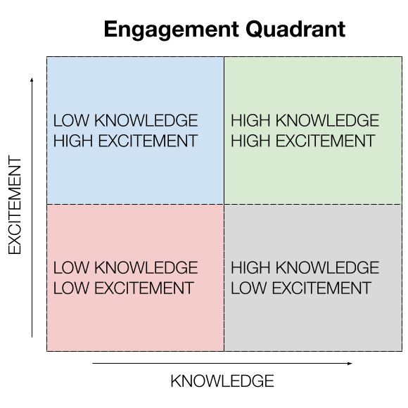

The instructions here are in addition to the on-boarding issue that People Ops will assign on the first day.

Copy the [Quality team onboarding issue template](https://gitlab.com/gitlab-org/quality/team-tasks/blob/master/.gitlab/issue_templates/Onboarding.md)
into a new issue in [QA Team Tasks](https://gitlab.com/gitlab-org/quality/team-tasks/issues/new)
and complete the issue.

## General team resources

* GitLab QA
  * [Testing Guide / E2E Tests](https://docs.gitlab.com/ee/development/testing_guide/end_to_end)
  * [GitLab QA Orchestrator Documentation](https://gitlab.com/gitlab-org/gitlab-qa/blob/master/README.md)
  * [GitLab QA Testing Documentation](https://gitlab.com/gitlab-org/gitlab-qa/blob/master/README.md#documentation)
* Tests
  * [Testing Standards](https://docs.gitlab.com/ee/development/testing_guide/index.html)
* CI infrastructure for CE and EE
  * [GitLab project pipelines](https://docs.gitlab.com/ee/development/pipelines.html) 
  * [Testing from CI](https://docs.gitlab.com/ee/development/testing_guide/ci.html)
  * [Review Apps](https://docs.gitlab.com/ee/development/testing_guide/review_apps.html)
* Tests statistics
  * [Redash Test Suite Statistics](https://redash.gitlab.com/dashboard/test-suite-statistics)
* Insights dashboard
  * [Quality Dashboard](http://quality-dashboard.gitlap.com/)
  * [Quality Dashboard Documentation](https://gitlab.com/gitlab-org/gitlab-insights/blob/master/README.md)
* Triage
    * [Triage Onboarding](/handbook/engineering/quality/triage-operations/onboarding/)
* QA Runners
  * [QA Runner Ownership Issue](https://gitlab.com/gitlab-org/gitlab-qa/issues/261)
* Projects
  * [gitlab-org](https://gitlab.com/gitlab-org)
  * [gitlab-com](https://gitlab.com/gitlab-com)
  * [dev.gitlab.org](https://dev.gitlab.org)
  * [staging.gitlab.com](https://staging.gitlab.com)
  * [triage-ops](https://gitlab.com/gitlab-org/quality/triage-ops)
* Code Review
  * [Quality team's code review checklists](https://gitlab.com/gitlab-org/quality/code-review-checklists)

### Slack channels

These internal Slack channels may be helpful to join.

* Department
  * [#quality](https://gitlab.slack.com/messages/C3JJET4Q6) - general department channel
  * [#quality-weeklystandup](https://gitlab.slack.com/messages/CGZQCTU8J) - Weekly standup update channel for Quality
  * [#g_engineering-productivity](https://gitlab.slack.com/messages/CMA7DQJRX) - Engineering Productivity team channel
  * [#triage](https://gitlab.slack.com/messages/C39HX5TRV) - channel to aid in [triaging unlabelled issues](/handbook/engineering/quality/triage-operations/#newly-created-untriaged-issues)
  * [#qa-nightly](https://gitlab.slack.com/messages/CGLMP1G7M) - channel with semi-nightly end to end test results
  * [#qa-staging](https://gitlab.slack.com/messages/CBS3YKMGD) - channel with daily `staging` end to end test results
  * [#qa-production](https://gitlab.slack.com/messages/CCNNKFP8B) - channel with daily `production` end to end test results
  * [#qa-performance](https://gitlab.slack.com/messages/CH8J9EG49) - channel with performance testing results
  * [#triage-automations](https://gitlab.slack.com/messages/CLCKT26JH) - channel for pipeline notifications from engineering productivity automation
* Company
  * [#product](https://gitlab.slack.com/messages/C0NFPSFA8) - observe and interact with members of the product team
  * [#development](https://gitlab.slack.com/messages/C02PF508L) - provides awareness of broken master, environment issues and other development related status items.
  * [#is-this-known](https://gitlab.slack.com/messages/CETG54GQ0) - find information about canary failures or bugs
  * [#questions](https://gitlab.slack.com/messages/C0AR2KW4B) - ask questions and see other questions (and the answers) from other [GitLab Team Members](/handbook/communication/top-misused-terms/)
  * [#thanks](https://gitlab.slack.com/messages/C038E3Q6L) - give and see thanks for the awesomeness that [GitLab Team Members](/handbook/communication/top-misused-terms/) do
  * [#people-connect](https://gitlab.slack.com/messages/C02360SQQFR) - interact with people ops

## Manager

### Engagement Quadrant

The engagement Quadrant is designed to help you and your direct report evaluate how they currently feel about their work.
This is not intended to be a performance evaluation tool, but rather a self-introspective mechanism to help frame the conversation.

* **Low knowledge & High excitement**: When we are excited on starting something new but unaware of all the things needed to succeed (unknown unknowns).
* **Low knowledge & Low excitement**: As time progresses if we haven't made progress on acquiring knowledge (sustained unknown unknowns), the excitement is also lowered. We need to expedite on attaining additional help to unblock.
* **High knowledge & High excitement**: We have made progress on learning what is needed to be productive/proficient while feeling engaged and excited. This is the optimal state.
* **High knowledge & Low excitement**: When we are already proficient at the current task but it may not be as challenging. We should have a discussion to identify the next area of interest.

When starting something new, the goal is to discover unknowns and learn them quickly so you can move into the `High knowledge & High excitement` state as fast as possible. Then keep iterating/improving so that you are still challenged and stay there.

### Organizational psychology resources

[Organizational psychology](https://en.wikipedia.org/wiki/Industrial_and_organizational_psychology) is the study of human behavior and motivations as it relates to work.

- [WorkLife podcast by Adam Grant](https://podcasts.apple.com/us/podcast/worklife-with-adam-grant/id1346314086?mt=2)
- [Heartbeat podcast by Claire Lew](https://knowyourteam.com/blog/podcast/)
- [HBR IdeaCast podcast](https://hbr.org/2018/01/podcast-ideacast)
- [Dear HBR podcast](https://hbr.org/2018/01/podcast-dear-hbr)
- [Know Your Team blog](https://knowyourteam.com/blog/) - [most popular articles](https://knowyourteam.com/blog/our-most-popular-articles/)

#### People to follow on social media

- [Adam Grant](https://twitter.com/AdamMGrant) - Organizational psychologist professor from Wharton
- [Dan Pink](https://twitter.com/DanielPink) - author of [Drive: The surprising truth about what motivates us](https://www.amazon.com/Drive-Surprising-Truth-About-Motivates/dp/1594484805)
- [Camille Fournier](https://twitter.com/skamille)
- [Claire Lew](https://twitter.com/clairejlew) - CEO of Know Your Team.
- [Dan Ariely](https://twitter.com/danariely) - more behavioral economics than organizational psychology
