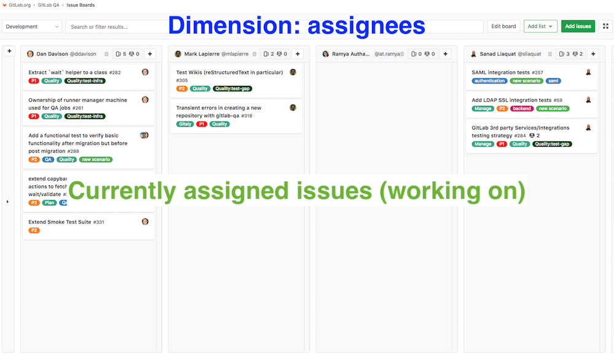
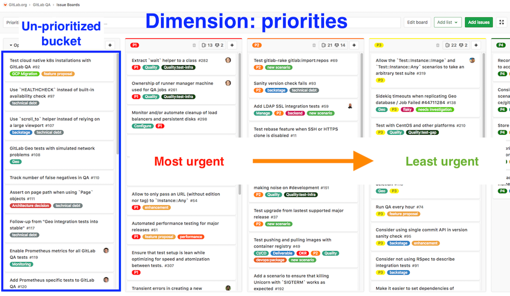
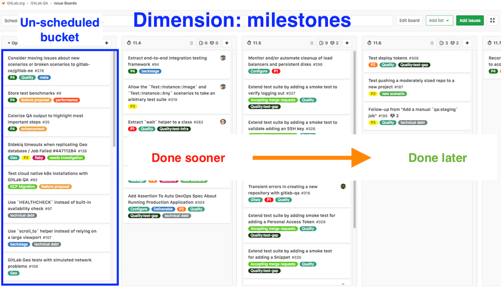
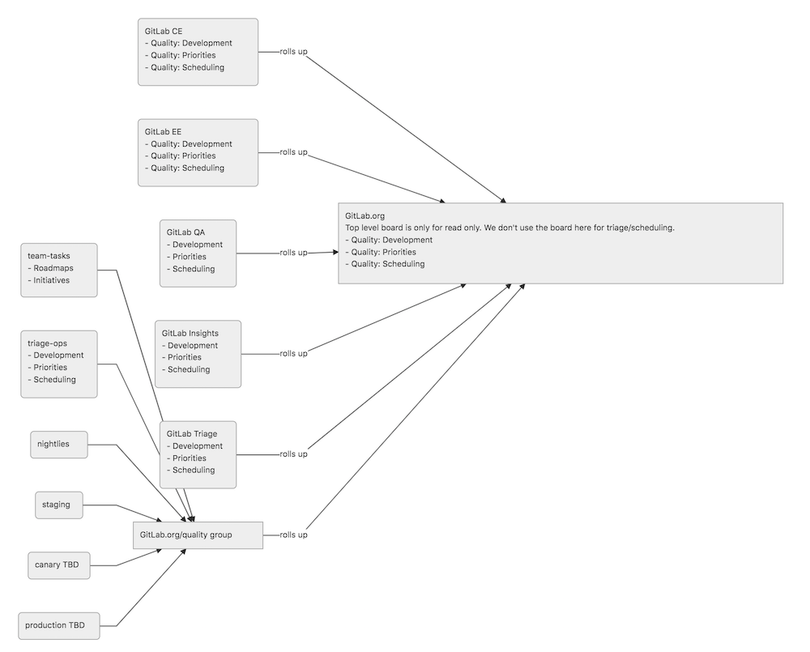

## On this page

{:.no_toc .hidden-md .hidden-lg}

- TOC
{:toc .hidden-md .hidden-lg}

## Projects

The Quality team currently works cross-functionally and our task ownership spans multiple projects.

- **GitLab.org**
  - [GitLab](https://gitlab.com/gitlab-org/gitlab)
  - [GitLab QA](https://gitlab.com/gitlab-org/gitlab-qa)
  - [GitLab Triage](https://gitlab.com/gitlab-org/ruby/gems/gitlab-triage)
  - [GitLab Roulette](https://gitlab.com/gitlab-org/gitlab-roulette)
  - [GitLab CustomersDot](https://gitlab.com/gitlab-org/customers-gitlab-com)
  - **Ruby gems**
    - [GitLab Styles](https://gitlab.com/gitlab-org/ruby/gems/gitlab-styles)
    - [GitLab Dangerfiles](https://gitlab.com/gitlab-org/ruby/gems/gitlab-dangerfiles)
  - **Quality Group**
    - [Quality team tasks](https://gitlab.com/gitlab-org/quality/quality-engineering/team-tasks)
    - [Triage-Ops](https://gitlab.com/gitlab-org/quality/triage-ops)
    - [Quality toolbox](https://gitlab.com/gitlab-org/quality/toolbox)
    - [Nightly tests](https://gitlab.com/gitlab-org/quality/nightly)
    - [Staging tests](https://gitlab.com/gitlab-org/quality/staging)
    - [Canary test pipeline](https://gitlab.com/gitlab-org/quality/canary)
    - [Production test pipeline](https://gitlab.com/gitlab-org/quality/production)
    - [Known QA failures](https://gitlab.com/groups/gitlab-org/quality/-/issues?scope=all&utf8=%E2%9C%93&state=all&label_name[]=type::bug)
    - [GitLab Environment Toolkit (GET)](https://gitlab.com/gitlab-org/gitlab-environment-toolkit)
    - [GitLab Performance Tool (GPT)](https://gitlab.com/gitlab-org/quality/performance)

### Reviewers and maintainers

Upon joining the Quality department, team members are granted either developer, maintainer, or owner access to a variety of core projects. For projects where only developer access is initially granted, there are some criteria that should be met before maintainer access is granted.

- [GitLab (/qa)](https://gitlab.com/gitlab-org/gitlab/-/tree/master/qa)
  - Quality team members are code owners for this directory. If you are tagged by a developer and don't yet feel comfortable approving a merge request, please tag another member of the Quality department to help review.
  - In general, we expect that team members will generally feel comfortable and will be granted maintainer access once they have:
    - Authored and reviewed 3 MRs related to improvements to the framework.
    - Authored and reviewed 5 MRs related to adding new end-to-end tests or making substantial improvements to existing ones.
- [GitLab-QA](https://gitlab.com/gitlab-org/gitlab-qa)
  - Authored and reviewed 5 merged MRs that demonstrate good understanding of the codebase.
  - Reviewed 5 MRs that make substantial improvements.
- [GitLab Triage](https://gitlab.com/gitlab-org/ruby/gems/gitlab-triage)
  - Authored 5 merged MRs.
  - Reviewed 5 MRs.
  - After completing the above requirement the maintainer should be vetted by an existing maintainer in the Engineering Productivity team. An issue should be created in the project outlining the reasons why this person should be a maintainer. List all 10 MRs in the issue to help aid with review.
  - After the issue has been reviewed and approved by manager of the Engineering Productivity team, an access request will be created to grant the engineer maintainer role.
- [GitLab Roulette](https://gitlab.com/gitlab-org/gitlab-roulette)
  - Authored or reviewed 2 MRs in total.
- [GitLab Styles](https://gitlab.com/gitlab-org/ruby/gems/gitlab-styles)
  - Authored or reviewed 2 MRs in total.
- [GitLab Dangerfiles](https://gitlab.com/gitlab-org/ruby/gems/gitlab-dangerfiles)
  - Authored or reviewed 5 MRs in total.
- [Triage Ops](https://gitlab.com/gitlab-org/quality/triage-ops)
  - Authored or reviewed 10 MRs in total.
- [GitLab CustomersDot (/qa)](https://gitlab.com/gitlab-org/customers-gitlab-com/-/tree/staging/qa/)
  - Quality Growth team members are code owners for this directory. If you are tagged by a developer and don't yet feel comfortable approving a merge request, please tag another member of the Quality Growth team to help review.
  - In general, we expect that team members will generally feel comfortable and will be granted maintainer access once they have:
    - Authored and reviewed 5 MRs related to improvements to the framework.
    - Authored and reviewed 10 MRs related to adding new end-to-end tests or making substantial improvements to existing ones.
- [GitLab Environment Toolkit (GET)](https://gitlab.com/gitlab-org/gitlab-environment-toolkit)
  - Select Quality Enablement team members are code owners for this directory. If you are tagged by a developer and don't yet feel comfortable approving a merge request, please reach out to the Quality Enablement team to help review.
  - In general, team members looking to become maintainers of this project are recommended to have a good working knowledge of [Terraform](https://www.terraform.io/), [Ansible](https://www.ansible.com/) and the GitLab application itself first before applying. We expect that team members will generally feel comfortable and will be granted maintainer access once they have:
    - Authored and reviewed 10 MRs related to improvements to the toolkit.
    - Authored and reviewed 5 MRs related to adding making substantial improvements or additions.
  - After completing the above requirement the maintainer should be vetted by an existing maintainer for the Toolkit. An issue should be created in the project outlining the reasons why this person should be a maintainer. List all 15 MRs in the issue to help aid with review.
- [GitLab Performance Tool (GPT)](https://gitlab.com/gitlab-org/quality/performance)
  - Select Quality Enablement team members are code owners for this directory. If you are tagged by a developer and don't yet feel comfortable approving a merge request, please reach out to the Quality Enablement team to help review.
  - In general, team members looking to become maintainers of this project are recommended to have a good working knowledge of performance testing in general, [k6](https://k6.io/) and the GitLab application itself first before applying. We expect that team members will generally feel comfortable and will be granted maintainer access once they have:
    - Authored and reviewed 5 MRs related to new tests in the Tool.
    - Authored and reviewed 3 MRs related to improvements to the Tool.
  - After completing the above requirement the maintainer should be vetted by an existing maintainer for the Tool. An issue should be created in the project outlining the reasons why this person should be a maintainer. List all 10 MRs in the issue to help aid with review.

#### Becoming a maintainer

The following guidelines will help you to become a maintainer. Remember that there is no specific
timeline on this, and that you should work together with your manager and current maintainers.

To start the process of becoming a maintainer, see the [maintainer section](/handbook/engineering/workflow/code-review/#how-to-become-a-project-maintainer)
of the code review guidelines.

In general, you're required to author and review 3 - 10 MRs that demonstrate good overall understanding
of the existing codebase and framework. See the section above for [further details of the requirements](#reviewers-and-maintainers).
You can seek out more opportunities to work on framework improvements by asking on the `#quality` Slack channel.

Your reviews should aim to cover maintainer responsibilities as well as reviewer responsibilities.
Your approval means you think it is ready to merge.

It is your responsibility to set up any necessary meetings to discuss your
progress with current maintainers, as well as your manager. These can be at any
frequency that is right for you.

## Project Management

Our team's [Quality: Development board (top level board)](https://gitlab.com/groups/gitlab-org/-/boards/425899) can span 10k+ issues and it's not easy to work on that level.
As a result, it's only meant to capture the current workload of the team. The board shows who currently owns what in the entire GitLab.org space.

The board is meant to be read-only. We don't manage the project on that level.

We have sub-boards at the project level that are used for project management, triaging and scheduling issues.

Each project has 3 boards each for a given dimension of the project management component: `Development`, `Prioritization`, and `Scheduling`

### Development

This board shows the current ownership of workload / issues with assignees as the dimension.

### Prioritization

This board is for prioritization with priorities as the dimension (`~priority::1` `~priority::2` `~priority::3` `~priority::4`).

Most important is left most and gradually moves to least urgent.

### Scheduling

This board is for scheduling with milestones as the dimension.

Earliest milestone is left most and gradually moves into later milestones.

## How to use the boards

Each project planning, scheduling and triaging process will happen in the projects' boards.

The boards are using a consistent configuration and is the same across all of our projects. This means that anyone on the team can work using the same set of tools everywhere.

Think of all these projects as different class of objects with stable interface methods that is consistent and cross-compatible.

This also ensures that the data rolled up to the top level board is consistent.

### Board Overview

### Board Links

- **[GitLab.org top Level board](https://gitlab.com/groups/gitlab-org/-/boards/425899)**
  - [GitLab-QA](https://gitlab.com/gitlab-org/gitlab-qa/)
    - [`Development`](https://gitlab.com/gitlab-org/gitlab-qa/boards/2922)
    - [`Priorities`](https://gitlab.com/gitlab-org/gitlab-qa/boards/787592)
    - [`Scheduling`](https://gitlab.com/gitlab-org/gitlab-qa/boards/787593)
  - [GitLab-Triage](https://gitlab.com/gitlab-org/gitlab-triage/)
    - [`Development`](https://gitlab.com/gitlab-org/gitlab-triage/boards/316854)
    - [`Priorities`](https://gitlab.com/gitlab-org/gitlab-triage/boards/788523)
    - [`Scheduling`](https://gitlab.com/gitlab-org/gitlab-triage/boards/788524)
  - [GitLab](https://gitlab.com/gitlab-org/gitlab/): GitLab issues with `~Quality`
    - [`Quality: Development`](https://gitlab.com/gitlab-org/gitlab/boards/793784)
    - [`Quality: Priorities`](https://gitlab.com/gitlab-org/gitlab/boards/793788)
    - [`Quality: Scheduling`](https://gitlab.com/gitlab-org/gitlab/boards/793791)
  - **[Quality group](https://gitlab.com/gitlab-org/quality)**
    - [Triage-Ops](https://gitlab.com/gitlab-org/quality/triage-ops/): GitLab-Triage setup
      - [`Development`](https://gitlab.com/gitlab-org/quality/triage-ops/boards/701857)
      - [`Priorities`](https://gitlab.com/gitlab-org/quality/triage-ops/boards/793763)
      - [`Scheduling`](https://gitlab.com/gitlab-org/quality/triage-ops/boards/793764)
    - [Quality Tasks](https://gitlab.com/gitlab-org/quality/team-tasks) Roadmap and initiative planning
      - [`Roadmaps`](https://gitlab.com/gitlab-org/quality/team-tasks/boards/548459)
      - [`Initiatives`](https://gitlab.com/gitlab-org/quality/team-tasks/boards/793708)
    - [Nightlies](https://gitlab.com/gitlab-org/quality/nightly)
      - Use the [default board](https://gitlab.com/gitlab-org/quality/nightly/boards)
    - [Staging](https://gitlab.com/gitlab-org/quality/staging)
      - Use the [default board](https://gitlab.com/gitlab-org/quality/staging/boards)
