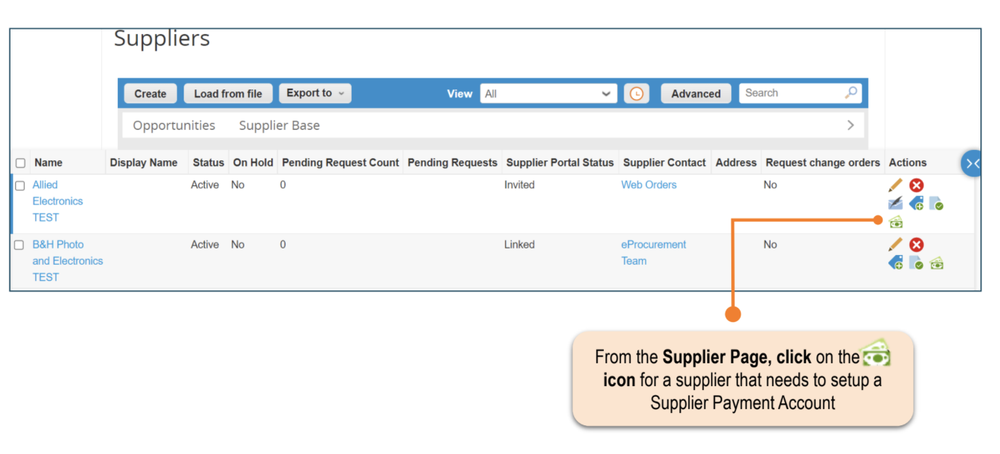

{::options parse_block_html="true" /}

<link rel="stylesheet" type="text/css" href="/stylesheets/biztech.css" />

## On this page
{:.no_toc .hidden-md .hidden-lg}

- TOC
{:toc .hidden-md .hidden-lg}

This page contains guidelines regarding Accounts Payable (AP) related tasks for Coupa Virtual Cards. Please review the [Coupa Virtual Card Guide](https://about.gitlab.com/handbook/business-technology/enterprise-applications/guides/coupa-virtual-cards/) to understand the end user process.

There are several different scenarios for Virtual Cards:

### Scenario A: Supplier paid by Virtual Card for one time purchase or emergency payment (most common request).

### Scenario B: Supplier permanently paid by Virtual Card on PO (card issued on the PO to Requester). 

### Scenario C: Supplier permanently paid by Virtual Card on invoice (card issued to Supplier after invoices have been processed/approved for payment).

 

**Scenario A** - there are no tasks for AP.

 

**Scenario B** - AP will need to create a new Supplier Payment Account (SPA) type for the Supplier. See below steps to create the Virtual Card SPA.
- Step 1. When the requisition arrives in the AP **To Do** queue, create a new Supplier Payment Account.

 

- Step 2. You will be prompted to enter your 2FA.  
- Step 3. You will be directed to create the new Supplier Payment Account. See below regarding how to complete the necessary fields. **NOTE - for Step 6 (last two fields) leave blank for Company set defaults OR enter number of days for Virtual Card to be valid.**

 

- Step 4. Click **Create**. The new SPA request will then be routed to **Internal SPA Approval Group** for approval.  
- Step 5. After the new SPA status = Active, AP will edit the requisition to update the Supplier Name (in the **Cart Items** section) from **Virtual Card** to the **actual Supplier's Name**, which is listed in the Requested Virtual Card Supplier field.

 
- Step 6. Approve the requisition.

 

## Allocadia suppliers to be paid permanently by Virtual Card

AP will be tagged on the requisition requesting the permanent Virtual Card SPA set up for the supplier. 
- Follow Step 1 - 4 for above **Scenario B** to create the SPA. Note that the requisition will already be submitted with the actual supplier, AP just needs to set up the Virtual Card SPA.
- Step 5. After the new SPA is active, update **Comments** section of the requisition stating the permanent Virtual Card SPA has been created.

**NOTE ON TIMING**
{: .panel-heading}

**The Virtual Card SPA must be created BEFORE the requisition has been fully approved in order to generate the Virtual Card to the requester.**

    

**Scenario C**: follow steps 1 - 2 as above **Scenario B**.
- Step 3. You will be directed to create the new Supplier Payment Account. See below regarding how to complete the necessary fields. **NOTE - for Step 7 (last two fields) leave blank for Company set defaults OR enter number of days for Virtual Card to be valid.**

 

**IMPORTANT NOTE**
{: .panel-heading}

**Ensure the supplier's email address is entered correctly. Once the Virtual Card has been issued, it can't be resent to another email address.**

- Step 4. Click **Create**. The new SPA request will then be routed to **Internal SPA Approval Group** for approval.

After the new SPA is active, payments to the supplier will be issued by Virtual Card during the weekly payment run.

 

## How to cancel Virtual Card issued on PO

There are two ways to cancel a Virtual Card issued on PO - canceling or hard closing the PO. Listed below are the instructions for them:

**Canceling PO**
- Step 1. Select approved PO with Virtual Card issued.
- Step 2. Cancel PO and select the correct transmission method.
- Step 3. Confirm the status of both PO and Virtual Card are cancelled.

**Hard closing PO**
- Step 1. Select approved PO with Virtual Card issued.
- Step 2. Soft close PO; then close PO.
- Step 3. Confirm the PO is closed and the Virtual Card status is cancelled.

## How to reissue Virtual Card issued on PO

- Step 1. Select approved PO with Virtual Card issued.
- Step 2. Soft close PO.
- Step 3. Confirm the Virtual Card status is cancelled.
- Step 4. Re-open PO; provide reason for re-opening PO; then a new Virtual Card will be created.

## How to reissue an expired Virtual Card issued on PO

- Step 1. Select approved PO with Virtual Card issued.
- Step 2. Under the **Payment** section, click on **(Re-Issue)** link. The original Virtual Card status will be expired and a new Virtual Card will be created.

 

If you have questions or need help, please reach out in the **coupa_ap** Slack channel.

For additional information, please review Coupa [PO Payments](https://success.coupa.com/Support/Docs/Core_Apps/Coupa_Pay/Virtual_Card_for_POs/!PO_Payments).
   

{::options parse_block_html="false" /}
