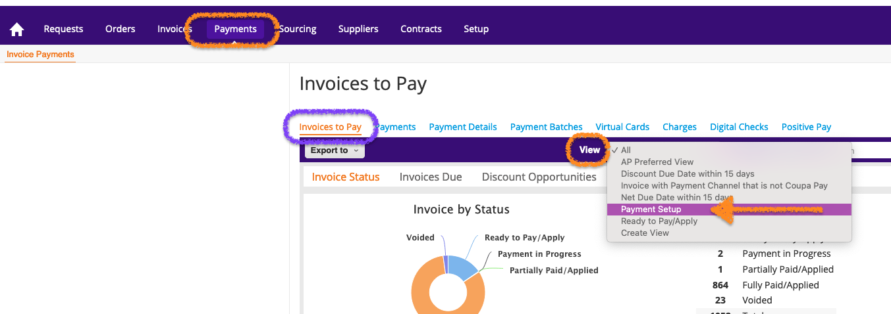

<link rel="stylesheet" type="text/css" href="/stylesheets/biztech.css" />

## On this page
{:.no_toc .hidden-md .hidden-lg}

- TOC
{:toc .hidden-md .hidden-lg}

This page contains GitLab's Accounts Payable department policies, procedures and guidelines. Our goal is to enable payments in a timely manner to both our team members and our external partners. We also provide useful links to other areas of the handbook that are relevant to the Accounts Payable procedures.

## <i id="biz-tech-icons" class="far fa-paper-plane"></i>Introduction

Welcome to Accounts Payable, commonly referred to as AP. You should be able to find answers to most of your questions in the sections below. If you cannot find what you are looking for, then please connect with us:

- **Chat Channel**: `#accountspayable`
- **Email**: `ap@gitlab.com`

## <i id="biz-tech-icons" class="fas fa-stream"></i>QuickLinks

  <a href="/handbook/finance/accounting/#procure-to-pay/" class="btn cta-btn ghost-purple" style="width:250px;margin:5px;display:flex;align-items:center;height:100%;">Invoicing and Payment</a>
  <a href="/handbook/finance/accounts-payable/corp-credit-cards/" class="btn cta-btn ghost-purple" style="width:250px;margin:5px;display:flex;align-items:center;height:100%;">Corporate Credit Card</a>
  <a href="/handbook/finance/procurement/" class="btn cta-btn ghost-purple" style="width:250px;margin:5px;display:flex;align-items:center;height:100%;">Procurement</a>

## <i id="biz-tech-icons" class="fas fa-bullseye"></i>General Guidelines

- Payment Runs are completed on Thursdays. Invoices that are selected for payment on Thursday must be fully approved and vendors successfully on-boarded by end of day Tuesday of that week to be included in Thursday's payment run. The payments go out in the following days and may take 3-5 business days to reach the vendor's bank. This depends on the country, currency and the method of payment chosen.
- Invoices are paid strictly by the invoice due dates. Any "Urgent Payment" requests will be paid in the next available payment run as long as they have been fully approved and the vendor has been successfully on-boarded. AP cannot accommodate same day payment requests.
- Suppliers are to be paid via ACH and Wire only. AP does not issue check payments.
- The cutoff for customer refund payments are the 25th of each month. Any customer refund requests received after the 25th will be paid the following month.
- Contractors and consultants who invoice bi-weekly or monthly will be set to the industry standard of 30 day payment terms.

## <i id="biz-tech-icons" class="far fa-question-circle"></i>Frequently Asked Questions

1. The vendor's invoice has not been paid yet, and they are asking me when it will be paid?
    - Check if your Coupa PO was fully approved.
    - The PO must also be received before we can release payment. Instructions on this process can be found [here](https://about.gitlab.com/handbook/business-technology/enterprise-applications/guides/coupa-guide/#how-to-receive-an-order).
    - Verify if the invoice was sent to the correct place:
        - An invoice attached to a PO **will not** get processed. 
        - Invoices for Coupa should be submitted in the supplier portal against their PO or emailed to <i>[invoices@gitlab.coupahost.com](mailto:invoices@gitlab.coupahost.com)</i> if they do not have a PO. If invoices are emailed, they MUST include the PO# on the invoice for timely payment.
    - Ensure that your vendor has <b>_fully_</b> on-boarded themselves in Coupa:
        - This includes filling in bank details (in their billing currency) and the appropriate tax forms.
    - Confirm that your vendor has invoiced to the correct GitLab entity:
        - AP cannot process an invoice unless it is addressed to the entity and currency selected on the PO.
        - If a new invoice is required, AP will reach out to the PO owner and ask that they obtain a new invoice from the vendor.
    - We cannot process an invoice unless the correct VAT has been included on the invoice - per the entity that the vendor is invoicing to.

    **If you are sure that all of these things have been done correctly, please ask the vendor to contact the AP team directly via email <i>[ap@gitlab.com](mailto:ap@gitlab.com)</i>**

1. How do I submit an expense report? And, when will it get paid?
    - All questions about expenses can be answered on the [Expense page](/handbook/finance/expenses/).
    - Reports are paid out on varying timelines depending on which country you are located in. This is also detailed on the [Expense page](/handbook/finance/expenses/).

## <i class="fas fa-file-invoice"></i>AP Processing Systems

### <i id="biz-tech-icons" class="far fa-flag"></i>Coupa

We’re excited to announce that GitLab has launched Coupa, effective 2021-06-01 for Phase I and effective 2021-12-13 for Phase II.

Coupa is a procure-to-pay system that will help us streamline the purchase request process, initiate workflow with approvals, and enable Purchase Orders. We will be implementing this new system in a phased approach. Phase I consists of US and Netherlands entities (GitLab Inc, Federal LLC, IT BV and BV). All remaining entities will switch over to Coupa during Phase II.

Invoices can be emailed to <i>[invoices@gitlab.coupahost.com](mailto:invoices@gitlab.coupahost.com)</i>. Vendors can also upload their invoices directly and match to their PO through their Coupa supplier portal.

> You can learn more about Coupa in our [FAQ Page](/handbook/finance/procurement/coupa-faq/) and in the [Coupa Guide](https://about.gitlab.com/handbook/business-technology/enterprise-applications/guides/coupa-guide/)

#### Coupa Best Practices

1. How to request info from suppliers in Coupa:	
    - To request that a supplier input data to their supplier card in Coupa, you can search the vendor, click on the box to the left and then click on Request Info. 
1. Assisting vendors to set up their Remit To: 
    - To set up their payment details in Coupa, please follow [this link](https://success.coupa.com/Suppliers/For_Suppliers/Coupa_Supplier_Portal/Administer_the_CSP/06_View_and_Manage_Remit-to_Information) for further details on the process.
1. PO Requirements:	
    - All purchases with a value over $5000 are required to have a purchase order. 
    - If the invoice is received without a PO, we will reach out to the business owner and request that the supplier's PO is created before we process the invoice. 
    - Please visit this [procurement handbook page](https://about.gitlab.com/handbook/finance/procurement/#-purchase-request-quick-guide) for more details on their process and how to get started on this in Coupa. 
1. Un-matching a PO from an invoice. If an invoice is matched to the incorrect PO, how do we fix this and open up the PO again?   
    - If the invoice was submitted by the supplier and is pending approval it needs to be **disputed** to the vendor, not rejected.
    - If the invoice is already approved, the invoice must be voided and you will have to credit or fix the entry in NetSuite as well. 
1. If the PO is created after the invoice was processed: Soft close the PO (it can be re-opened if needed); it can be fully closed after being soft closed. 
    - If PO is hard/fully closed, it cannot be reversed.
1. Payment batch creation:
    - Use the pre-set view "Payment Setup" which has filters applied to select anything for a vendor that is "payable" and due within 6 days and aged prior to the current date.
     {: .shadow}
1. How to remove an invoice from a payment batch:	
    - To remove a payment from a submitted batch, please add a comment to the batch and tag Misty Brown so that she can remove the payment and the request will be recorded in Coupa.
1. Use of daily checklist to clear errors per [this issue](https://gitlab.com/gitlab-com/Finance-Division/ap-team/ap-project/-/issues/76). 
    - Whichever AP team member is assigned for email duty that day, must check through these errors.	
    - If team members have questions on these errors, please post in the Coupa_AP slack channel.
1. Handling export issues on invoices and payments:	
    - Finance System Admins send a repot to the AP team twice weekly. 
    - AP team will adjust the vendor card for new currencies or entities. 
    - Change Exported to YES in Coupa when the error is fixed.

## <i aria-hidden="true" style="color:rgb(252,109,38); font-size:.85em" class="fab fa-gitlab fa-fw"></i>Invoice Payments
{: #tanuki-orange}

- The first step to getting an invoice paid is to review the appropriate [procurement process](/handbook/finance/procurement/).
- If the vendor is being used for the first time, we will need to invite them to onboard with Coupa. This instruction is also outlined in the [procurement page](/handbook/finance/procurement/).
    - **The procurement portion must be completed first.**  Once the procurement process is complete, with all approvals, we can process the invoice.
- Make note that invoices are paid per the due date on the invoice or per the vendors payment terms in their contract, whichever comes first.
- Please note that AP **cannot process same day requests for payments**. We must follow the process outlined above and ensure all approvals are attained before paying.
- Payments are set up each Thursday and the money is released to vendors through the respective payment systems. It may take a few days for transfers to reach vendors depending on their location and the bank they use.
    - In order for an invoice to be included on the Thursday payment run, it must have been received and fully approved by the Tuesday. **For example**, if we are doing a payment batch on Thursday June 3rd, the invoice would have to be approved by end of day on Tuesday, June 1 in order to be included.

> Further details on this process can be found at [the Procure to Pay page](/handbook/finance/accounting/#procure-to-pay)

## <i aria-hidden="true" style="color:rgb(252,109,38); font-size:.85em" class="fas fa-receipt"></i>FedEx 

- When needing to send a package on behalf of GitLab our main courier account is with FedEx
- The first step is to contact AP in the #AccountsPayable channel to request the corporate account number
- When sending a package **the Shipper MUST put their name under GitLab Inc in the sender field, or their full Cost Center for ex. Marketing - Field Marketing.** If you are unsure of your full cost center please go into your Bamboo HR application. On the left hand side under your name you will be able to find your Cost Center details.
- Anyone failing to provide the correct information which will hinder AP's ability to properly code courier charges will not be allowed to use the company account in the future

## <i aria-hidden="true" style="color:rgb(252,109,38); font-size:.85em" class="fas fa-receipt"></i>Expenses

Please review the page on [Spending Company Money](/handbook/spending-company-money/) to ensure that your spend is within GitLab's [Expense policy](/handbook/finance/expenses/).

If you have general questions about your expenses please pose them in the #expense-reporting-inquiries channel in Slack.

GitLab employs a external company called Montgomery Pacific - commonly known as Montpac. They help us to audit expenses according to the Expense Policy. You may see that they have commented on or sent a report back to you for clarifications or updates. If your report has been rejected by Montpac or Accounts Payable, and you wish to discuss this, please reach out to your manager to discuss further. They can escalate to the AP team, if required.
