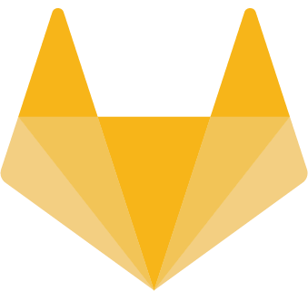
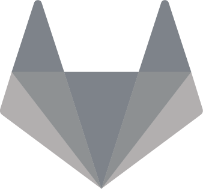
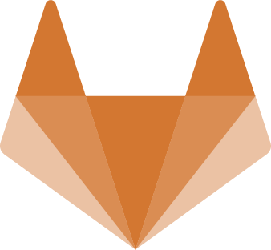
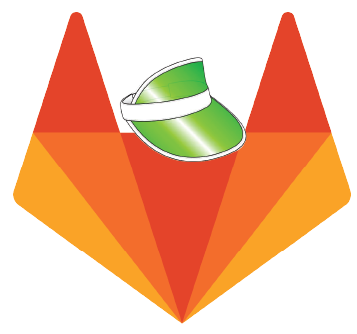

{:.no_toc .hidden-md .hidden-lg}

- TOC
{:toc .toc-list-icons .hidden-md .hidden-lg}

## Finance Movement Challenge

To emphasize the need for self care amongst our team members we are starting a Finance Movement challenge. As we are a diverse company, we have team members of varying ages, fitness levels, and physical abilities, so we have decided to create a movement challenge that allows team members to go at their own pace.

We encourage team members to find activities that they enjoy, or are interested in trying out.

This could be something challenging, such as a marathon, or something less strenuous such as walking, yoga or pilates.

### Awards 

The team members who participate in this competition will be awarded as follows:

| |Winners|Award|
| :---:  | :---:  | :---:  |
||First place| Apple watch (series 7) |
||Second place| Allbirds shoes|
||Third place| Back Massager|
||Participation (Movement of at least 40 mins per week) | TBD |

Consistency and sustained motivation are important in order to achieve the goals you set for yourself. Team members will earn awards on the time they dedicate to move. It can be a 1 hour walk or a 1 hour rock climbing. 

### Logging your time

Please add the times you have exercised to [this document](https://docs.google.com/spreadsheets/d/1IQ_hIUnbCXezd_vgui_PqnjGT-UKcJxXmSK-1YhUdts/edit#gid=0). There is a tab for each month of FY23 Q1. Find your name and add your time. For example, if on Monday 2022-02-07 you exercised 25 minutes, add `25` to the table. 

### Advice

#### Keeping motivation high

Make it fun. Find sports or activities that you enjoy, then vary the routine to keep it interesting. You can challenge yourself to increase the intensity or length of your exercise every week to keep yourself engaged.

It can also help to focus on the things you have already achieved and note the ways you plan to continue that growth. Write down your goals and how far are you from reaching your goal with your current actions. For example, if your goal is to walk 1 hour, 3 times a week but you are only taking 15 mins walks at the moment, write down what you have achieved and find paths to achieve your target. You could walk 5 extra minutes every week until you reach one hour.

In this approach you create room for success based on what you have already achieved and you focus on joy and self-awareness. 

To keep yourself and others motivated, consider joining the [#finance-movement-challenge](https://gitlab.slack.com/archives/C031ZDJR58T) slack channel and share photos/videos of your daily movement achievements

#### Start Small

When we say small, we mean it. You can take 15 mins walk laps around the house during a 1:1, walk around the neighborhood, or practice 15 minutes of yoga to start with. All your movement adds up!

Small movements can have a significant impact on both your physical and mental health. Increase the strenght and length of your exercises when you feel up for the challenge. 
