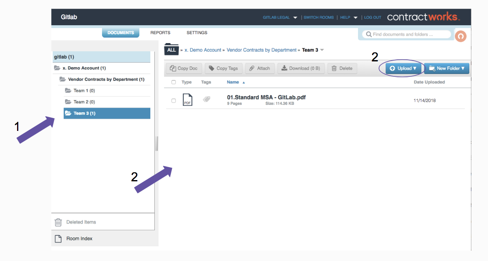
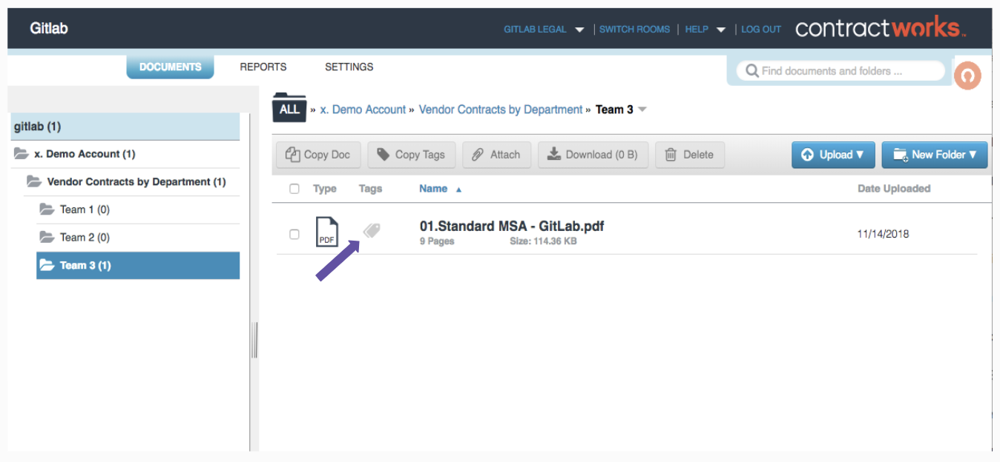
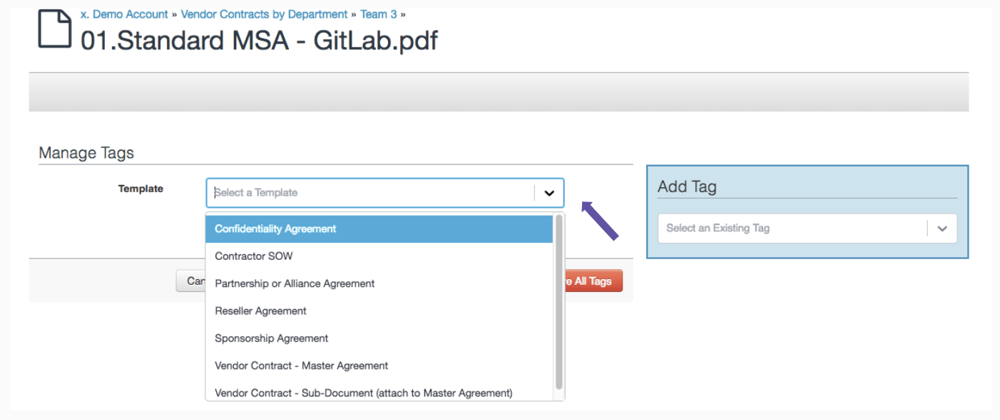

## On this page

{:.no_toc .hidden-md .hidden-lg}

- TOC
  {:toc .hidden-md .hidden-lg}

## Steps to Filing Your New Vendor Contract in ContractWorks

This process is used to file your contract or related vendor documents after they are fully executed (signed by all parties).  For the full contract approval process, see the [Vendor Contracts](/handbook/finance/procurement/) page.

### Requesting a ContractWorks Log In

If you need access to ContractWorks, please process an access request [here](https://gitlab.com/gitlab-com/team-member-epics/access-requests/-/issues/new?issuable_template=New_Access_Request).

The following considerations will be used to determine which priveleges are appropriate for each user:

1. Vendor Contracts User - GitLab team members who need to upload contracts and view vendor contracts. This is most users.
2. Vendor Contracts Plus User - GitLab team members who are designated to keep vendor files organized. These users can upload and view contracts, as well as tag and move folders and files.
3. Full Access - GitLab team members who need access to all files in the system, including sensitive information. These users can run reports on their own activity. This is reserved mainly for Legal team members and Executive Group. Others can be added as needed with sufficient justification.
4. Admin - Users who often need to run reports and audits with insight into other users' activity. Admins are the only users who can add other users.
5. Custom Roles - Custom roles are available for users who need on-going or temporary access beyond Vendor Contracts Plus User, but below Full Access.

### Uploading the Document

This process is used for Vendor contracts and Event-related contracts.

**If your document is confidential, please e-mail directly to a GitLab paralegal for uploading to confidential folders.** Examples of confidential documents: contracts with individuals (such as team members who are contractors), IPO-related documents, documentation of internal investigations. If you have a doubt as to the confidentiality of a document, and to receive the name of a GitLab paralegal, please feel free to reach out to Legal via Slack.

Please watch the [ContractWorks tutorial](https://securedocs.wistia.com/medias/odpfq6gnit) for uploading, filing, and downloading documents.

GitLab team members requesting contracts will complete steps 1 and 2.

#### 1. Open the Correct File for Your Upload

Use the folder navigation panel on the left side of your screen to open 01.Uncategorized and then 01.To be Standardized.

#### 2. Upload Your Fully Executed Contract

Once you have the correct file selected, uploading is very simple. You can either drag and drop into the files panel on the right or use the blue `upload` button to browse your files. Please ensure that the contract version you upload is the signed pdf.

GitLab Legal will complete the remaining steps.

#### 3. Standardize the File Name

Click on the pencil icon at the right-most edge of your file information line to edit the file name and name according to the sample below:

**On-going Relationship Vendors**

Vendor Name-GitLab Contract Type - yyyy.mm.dd.pdf

**Event Vendors**

Vendor Name-GitLab Contract Type (Event Name) - yyyy.mm.dd.pdf

There should not be any underscores in your file name. Spaces between words are fine. Contract Type will normally be the heading you find on the contract itself. Some examples include “Master Service Agreement”, “Partnership Incentive Agreement”, “Addendum to Subscription Terms”. The date should be the Effective Date, which is usually the date when the last signature is added (unless it is specified otherwise in the contract).

**Terminated Contracts**

When a contract is terminated, an Omega sign should be added to the front of the name in order to drop the contract to the bottom of the alphbetical list. If the vendor has a folder and the entire account has been terminated, add the Omega sign to the folder name. On Mac, Ω can be created by using `option + z`.

Ω - Standard File Name

### Tagging the Document

Please watch the [ContractWorks tutorial](https://securedocs.wistia.com/medias/28tju1vqmw) for tagging your document.

#### 1. Choose the Correct Template for the Contract Type.

Click on the greyed out tags in your file line. This will take you to a screen entitled “Manage Tags”. From the drop-down menu, select the template that best fits your contract.

#### 2. Tag the Contract.

Fill in the tags with the information you collected during the contract approval process. See details below for best practices for recurrence, notifications, and attaching documents to a Master Agreement.

When you’ve filled everything in, click Submit.

#### Best Practices for Tagging

##### Auto-renewal Recurrences

Recurrences will program ContractWorks to change the start and/or end dates for your contract as it auto-renews. Simply select the option and set the number of months of your contract term. ContractWorks will then auto-change the dates when the appropriate time comes.

##### Notifications

You can watch the [training video](https://securedocs.wistia.com/medias/28tju1vqmw) from ContractWorks and use the below standards to set notifications for your contracts. (The part of the video relevant to Notifications begins at 00:55)

To set notifications for start and end dates, select the `Enable Notifications` option. This will bring up 3 different fields to fill in. Follow the best practices below for each type of notification.

###### End Date

Order forms have auto-notifications as part of the template. These will send a notice to Procurement 120 before renewal is due. However, there is addtional information that needs to be added with the tags.

1. Add the Business Owner's email address to the notification list.
2. Fill in the vendor's name where noted in the notification template.
3. Copy and paste the document's link in the notification text.

##### Legal Terms

Legal Terms need to be filled in by the owner of the contract upon uploading. The following explanations will help you understand what information to include. If you have specific questions about your contract, please contact someone in legal for input.

**Notice Contact and Address(es)** Some companies will have special addresses for legal notices to be sent. Search the document for "notices" and make note of any specific addresses or people who need to have notices. 
**Method of Notice** Notices can be delivered in person, by mail, by e-mail, by fax, and so forth. If a company specifies which methods they will accept, designate all that apply on this line. 
**GitLab legal entity** This is a drop-down menu of the different options for legal entities. This should be specified in the top paragraph of your contract where the parties are listed. 
**Start Date** If there is an Effective Date in the first paragraph of your contract, input this date as the start date. If there is no Effective Date defined, use the date of the last signature. 
**Term (# of years)** You can search for "Term" until you get to the section that details the length of the contract. Some will not have a term because they are ongoing until someone terminates. 
**Termination Notes** Capture the time frame for notice that is required to terminate. Look for how many days' notice is required before terminating for a breach of contract and how many days' notice is required for terminating for convenience or any reason. 
**Auto Renew?** If your contract has a term, make sure you note whether the contract will auto-renew or not. This information is usually in the same section as the term length. 
**End Date** Most contracts do not specify an end date, even if it has a term defined. Use the information you have for the term to figure out the end date. The end date will be one day before the anniversary date of the start date. For example, a 12-month contract starting on Sept 27, 2018 will end on Sept 26, 2019. 
**Payment Terms** This is the amount of time Accounts Payable has to pay the bill and can usually be found in a section called "Fees and Payment" or something similar. It is typically 15, 30, or 45 days. Choose the correct number from the drop-down. If the payment term is not listed, choose other and then document the number on the "Payment Term Notes" line. 
**Payment Terms Notes** Make note of any late fees here. 
**Indemnities** Search the document for "indem" and copy and paste the section into this field. 
**Contract Type** Choose from the drop-down the category that best fits the purpose for entering this contract. 
**Document Type** Use the heading of your contract to determine the best fit from the drop-down menu. 

### Attaching the Document

If your document is an Order Form, Addendum, or other sub-document that is connected to a Master Agreement, you will need to attach the document to the Master Agreement, as detailed below:

1. Go to the folder where your Order Form and Master Agreement are filed.
2. Select the new contract by clicking the checkbox on the left end of the contract information line. This will bring up a drop-down menu at the top of the folder window.
3. In the drop-down menu, click `Attach`
4. Hover over the Master Agreement and click the paperclip that has appeared next to the file name.

### Linking to the Document

There may be times when you need to send your executed contract to another GitLab team-member, such as when invoices need to be paid.

1. Navigate to your uploaded contract.
2. Click on the contract file name, which will open a watermarked version of the contract in a new tab.
3. Use the new tab's unique URL to link the document.
