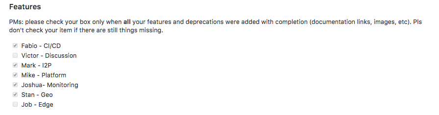

## On this page
{:.no_toc .hidden-md .hidden-lg}

- TOC
{:toc .hidden-md .hidden-lg}

## Introduction
{:.no_toc}

Release posts are [blog posts](/releases/categories/releases/) that announce changes to the GitLab application. This includes our regular cadence of monthly releases which happen on the 22nd of each month, and patch/security releases whenever necessary.

Release posts follow a process outlined here, and the templates that are used to create them also highlight what needs to be done, by whom, and when those items are due.

_Note:_ We're evolving our release post process! You can view and share feedback on the latest direction by viewing [Scaling the release post](https://docs.google.com/presentation/d/1_Osx3FrDxT4aqjl-Kc9QXgp30z0Pl1k4tBCv0DlZYkk/edit).
{:.note}

## Quick Links

- [Frequently used templates](/handbook/marketing/blog/release-posts/#templates)
- [Helpful reference pages](/handbook/marketing/blog/release-posts/#pages)
- [Release post scheduling](/handbook/marketing/blog/release-posts/managers/)

## Schedule

At a high level, the Release post schedule is:

### On the 3rd

- Through **automation**, the [Release Post Process Kickoff Tasks](https://gitlab.com/gitlab-com/www-gitlab-com/-/pipeline_schedules) run in a scheduled pipeline invoking the `bin/rake release_post:start` rake task. ([pipeline configuration](https://gitlab.com/gitlab-com/www-gitlab-com/blob/master/.gitlab-ci.yml#L280-288); [rake task](https://gitlab.com/gitlab-com/www-gitlab-com/blob/master/lib/tasks/release_post.rake#L9))
- This task creates the branches, MRs, and issues necessary to run the Release Post process
- The MRs and issues will be assigned to the release post manager using the content in [release_post_managers.yml](https://gitlab.com/gitlab-com/www-gitlab-com/-/blob/master/data/release_post_managers.yml)

### 3rd to 10th

- **PMs** contribute MRs for their [content blocks](#pm-contributors)
  - [Features and Upgrades](#release-post-item-instructions) are contributed as release post item MRs targeting the release post branch
  - Primary items are added to `features.yml`
  - Recurring content blocks for Omnibus, GitLab Runner, and Mattermost are added by the area owner
  - Non-standard product announcements, uncategorized items, and other announcements can be announced using the [`extras`](#extras) content type
- **EMs and PMs** announce [deprecations and removals](#deprecations-removals-and-breaking-changes)

### By the 15th

- **EMs and PMs** make sure items that are feature flagged are `enabled by default` to ensure inclusion into the self-managed release.
- Deprecation and removal MRs are assigned to TWs for final review and merge.

### By the 16th

- **TW Reviewers** finish review of Features, Deprecations, Removals, Upgrades, and Extras
- **PMMs, Product Design Managers, Product Designers, and PM Leaders** do optional reviews of release post item MRs

### By the 17th

- **EMs**:
  - Merge feature release post item MRs if the underlying code was merged _before_ the 17th
  - Merge feature release post item MRs if manually verified to be in the release

- **TW Reviewers** merge deprecation and removal MRs

Note: MRs added after the 17th should target the `release-x-y` branch, not `master`
{: .note}

### On the 18th

- At <time datetime="16:00">4 pm UTC (11 am ET / 8 am PT)</time>, another **release post automation** task ([scheduled pipeline](https://gitlab.com/gitlab-com/www-gitlab-com/blob/master/.gitlab-ci.yml#L290-299); [rake task](https://gitlab.com/gitlab-com/www-gitlab-com/blob/master/lib/tasks/release_post.rake#L373-399)) performs content assembly
- **Contributor Success** adds the [MVP](#mvp)
- **Release Post Manager** picks features to highlight and creates the introduction content

### 18th - 20th

- **Release Post Manager and Technical Writer** perform final reviews
  - Changes after <time datetime="16:00">4 pm UTC (11 am ET / 8 am PT)</time> on the 18th will be done via the `release-X-Y` branch and are subject to approval by the Release Post Manager.
  - The TW Lead verifies the deprecations and removals links in the release post
  - RPM create a [What's New](/handbook/product/gitlab-the-product/index.html#using-whats-new-to-communicate-updates-to-users) MR
Note: The 18th - 20th can fall on vacations, weekends, or holidays. PMs should designate who to respond to time-sensitive inquiries should they be unreachable. Release Post Managers are empowered to make decisions and [display bias for action](https://about.gitlab.com/handbook/values/#bias-for-action) if they haven't received a response by EOD on the 20th.
{: .note}

### On the 22nd

- **Release team** publishes the latest package
- After the package is [released](/handbook/engineering/releases/), the **Release Post Manager** publishes the release post to the  master branch
- The [GitLab.org Releases page](https://gitlab.com/gitlab-org/gitlab/-/releases) will also populate the changelog via an **automated process** when release posts are published ([pipeline task](https://gitlab.com/gitlab-com/www-gitlab-com/blob/master/.gitlab-ci.yml#L303-318))

**Note:** Details for all of these steps are described in the [Monthly release **post** MR template](https://gitlab.com/gitlab-com/www-gitlab-com/-/blob/master/.gitlab/merge_request_templates/Release-Post.md) and the [Monthly release **post item** MR template](https://gitlab.com/gitlab-com/www-gitlab-com/-/blob/master/.gitlab/merge_request_templates/Release-Post-Item.md).
{: .note}

## Participants

- [**Release Post Manager**](#release-post-manager)
- [**PM contributors**](#pm-contributors)
- [**PMM reviewers**](#pmm-reviewers)
- [**PMM lead**](#pmm-lead)
- [**TW lead**](#tw-lead)
- [**Product Design reviewers**](#product-design-reviewers)
- [**TW reviewers**](#tw-reviewers)
- [**Technical advisors**](#technical-advisors)
- [**Engineering Managers**](#engineering-managers)

## Volunteering for the Release post

Each month, a Product Manager, Technical Writer, and an Engineering Department Technical Advisor volunteer to manage the release post, as listed in the [Release Post Scheduling page](managers/). Product Marketing Managers also sign up, but mostly as shadows for awareness for their related marketing activities. The Product Manager volunteer will lead the release post as the Release Post Manager and is listed as the Author of the release post when the post is published. To update the [release post scheduling list](managers/), all volunteers need to edit the data file below:

- **[Data YAML file](https://gitlab.com/gitlab-com/www-gitlab-com/blob/master/data/release_post_managers.yml)**: gathers the release post managers for every release (9.0 onwards). Be sure to update the "Managers" section below the "Versions" if this is your first release.

It's highly recommended that all volunteers shadow the release post prior to the one they run. Volunteers can update the previously mentioned data YAML file to indicate both when they shadow and when they help run the release post.

Release Post Managers will need [Maintainer](https://docs.gitlab.com/ee/user/permissions.html#project-members-permissions) access privileges for the `https://gitlab.com/gitlab-com/www-gitlab-com/` project. If you need access, model your request after [this confidential issue](https://gitlab.com/gitlab-com/team-member-epics/access-requests/-/issues/10031).

### Release Post Manager

Product Managers of any level (IC or managers) can volunteer for any release that doesn't have someone assigned yet. While we encourage IC product managers to take advantage of this opportunity to demonstrate their leadership skills, we also value that managers will bring their experience to the role.

Before committing to the date of your choice, please be sure you can perform the critical path release post manager tasks between the 15th and the 22nd of the month as defined in the [monthly MR template](https://gitlab.com/gitlab-com/www-gitlab-com/-/blob/master/.gitlab/merge_request_templates/Release-Post.md). If you cannot perform any of the release post manager tasks between the 15th and the 22nd of the month, please sign up for a release post that better aligns with your availability.

To assign yourself as release post manager or release post manager's shadow, simply add your name on the [Release Post Scheduling page](managers/) by submitting an MR to update the `/data/release_post_managers.yml` file. Otherwise, PMs will be assigned using a fair scheduling principle leveraging this [tracking doc](https://docs.google.com/spreadsheets/d/12tFW2nOqZ7Cxm0T-WKZVHmPdZNPtkS6fdIvLwvWVLLc/edit#gid=0):

1. Members that never managed a release post before
1. Members that have the longest interval since they managed their last release post

After joining the company, there is a grace period of a few months where the new Product Manager
will get up to speed with the process, then they will be scheduled to manage a release post.

Adding members to the list is a shared task, and everyone can contribute by following the
principle described above. Scheduled people are pinged in the merge request to make them aware.
They don't need to confirm or approve, since they can always update the list if they are not
available for the given release post.

<i class="fas fa-exclamation-triangle" aria-hidden="true" style="color: red"></i>
**Important**: if you're scheduled for a given month and you can't make it because you're on
vacation, overloaded, or for any other reason, that is okay, **as long as you swap the
release post manager role** with someone else **before** creating the merge request and starting the
whole process. If you take it, you're responsible for the entire process and must be
available to carry it out until the end.
{:.alert .alert-warning}

### Release Post Manager Shadow

Each month, a Product Manager also acts as a shadow to support the Release Post Manager tasks if needed, act as back up on decisions in absence of the Release Post Manager and prepare to run the next release post. By shadowing the month prior to leading the effort, Product Managers are prepared and aware of any shifts in processes or optimizations needed since the last time they participated.

Shadows should remain engaged with the release process by:

- Following the activity in the slack channels
- Attending the weekly standups
- Assisting the Release Post Manager with content reviews and any other tasks they ask for help on

In order to properly onboard the shadow, the Release Post Manager should:

- Set up an initial coffee chat with your shadow the week after the previous release ships to get to know each other and clarify any initial questions from the shadow
- Point the shadow to this page
- Include the shadow in the initial release post MR creation
- Include the shadow on all meetings and as much as possible on activities like reviews or other opportunities where you can work synchronously together

Remember: The goal of the shadow is to get them engaged and aware of the process so they can run one on their own. Include the shadow as much as possible so they can learn and be prepared!

### Technical Advisor considerations

We recommend that technical advisors volunteer for at least 2 or 3 release posts in a row to allow proper time for orientation with the process and the ongoing technical backlog.

Technical advisors are expected to:

- Solve problems with Git branch conflicts and Ruby installations.
- Be able to technically contribute to [`www-gitlab-com`](https://gitlab.com/gitlab-com/www-gitlab-com) source code.
- Resolve some of the [backlog issues](https://gitlab.com/gitlab-com/www-gitlab-com/-/boards/3130926?&label_name%5B%5D=Release%20Post%3A%3ATech%20Advisor).

The responsibilities of a technical advisor can be seen in more detail in [Technical advisors](#technical-advisors).

## Release Post Manager Responsibilities

### Critical path tasks

- Completing all the tasks assigned to the Release Post manager in the Release Post MR template
  - Reminder: If you cannot perform any of the release post manager tasks between the 15th and the 22nd of the month as defined in the [monthly MR template](https://gitlab.com/gitlab-com/www-gitlab-com/-/blob/master/.gitlab/merge_request_templates/Release-Post.md), it is recommended you sign up for another release post. In the case that schedule/circumstances changes after you'd already signed up for the release post, please consult with Product Operations on how to best manage the situation.
- Working with VP of Product to identify the top feature to highlight on the release post page
- Creating the What's New MR and working with the VP of Product to identify what to include in [What's New](/handbook/product/gitlab-the-product/index.html#using-whats-new-to-communicate-updates-to-users)
- Sending out reminders about upcoming due dates
- Merging the release post MR on the 22nd and ensuring the release post page goes live
- Collecting feedback in the release post retrospective issue during the release post not just for your own challenges, but other team members challenges as they pop on Slack and other places
  - Doing a sync retro with the Technical Writer, the Technical Advisor, the Release Post Manager Shadow, and the Product Operations DRI sometime between the 23rd and the 1st of the month, to identify and collaboratively complete actions to improve the process and update the handbook/MRs
  - Making sure all the action of the retrospective issue are completed and the issue closed before the next [release post automation task runs on the 3rd](#release-post-branch-creation-rake-task)

### Other key tasks

- Running a weekly sync or async standup with the release post team (sync standup required for major releases)
- Reviewing and supporting overall content quality and accuracy of all content published in the release post
- Including the Release Post Manager Shadow as much as possible on activities so they learn prior to their rotation
- Adding the [cover image](#cover-image) that is (jpg, png) is [smaller than 300KB](#images)
- Monitoring the Slack Release Post channel to help answer questions and troubleshoot hurdles
- Pinging the PMs and others as needed in Slack or MRs to help resolve feedback
- Making sure the release post is **ready to merge two days before the 22nd**
- [Communicate](#communication) directly with product managers using [#product](https://gitlab.slack.com/archives/C0NFPSFA8) on Slack as needed to field questions that come up from viewers of the release post blog once it is live on the 22nd
- If you need additional support in engaging with the community, the Developer Evangelism team ([#developer-evangelism](https://gitlab.slack.com/archives/CMELFQS4B) on Slack) is available to support on [release days](/handbook/marketing/community-relations/developer-evangelism/hacker-news/#release-days)
- Making sure the auto sorting of secondary features by title (alpha) and stage generally looks good or is revised if need be [Content Reviews](#content-reviews)
- Working with PMs and others as needed to make sure any external blogs they reference in their content blogs go live before the release post blog gets published on the 22nd
- Making sure the TW Lead is aware if release post items are added or removed after the 18th
- Informing the social team that the release post has been published and it's time to schedule social media posts
- Alerting Product Operations of significant issues or hurdles that may compromise the release post
- Supporting on tasks specific to [major releases](#major-releases) if collaborators reach out

### How to get started

Make sure you have [Maintainer](https://docs.gitlab.com/ee/user/permissions.html#project-members-permissions) access to project `https://gitlab.com/gitlab-com/www-gitlab-com/`. If you need access, model your request after [this confidential issue](https://gitlab.com/gitlab-com/team-member-epics/access-requests/-/issues/10031).

[An automated task will](#schedule) create the branches, MRs, and issues necessary to run the Release Post process, including making the appropriate assignments and mentions based on the [Release Post Manager schedule](https://about.gitlab.com/handbook/marketing/blog/release-posts/managers/).

If you have not been assigned to a Release Post X.Y MR by the end of the day on the 3rd:

- Reach out to Product Operations `@brhea` in Slack #release-post
- If `@brhea` is unavailable, work with your Technical Advisor to run [`bundle exec rake release_post:start`](#release-post-branch-creation-rake-task) to kickoff the X-Y Release Post, or
- Follow these steps to [manually create the release post branch and required directories/files](https://about.gitlab.com/handbook/marketing/blog/release-posts/manual-release-post-kickoff/)

### Communication

The release post manager, the Technical Advisor, the Product Operations DRI, the Technical Writer, and PMM Lead will need to communicate about topics that are related to the release post but not relevant to the broader team, these chats should occur in Slack `#X-Y-release-post-prep` channel in Slack, to minimize distractions and unnecessary notifications for the broader team in Slack #release-post.

The release post manager posts in Slack channels most frequently with reminders. As such, if the release post manager is seeking guidance on how to phrase certain posts, it's recommended to scroll to the approximate date that post would have been made by the previous release post manager in the relevant Slack channel. However, here are some best practices and an example:

- Make a clear, descriptive statement of what's being shared and why
- If you need someone to take an action, say so explicitly and tag that person
- If the action requested is time sensitive, give a clear due date
- If there are known issues they need to be aware of, list them out
- Always cc your release post team and Product Operations for big announcements so everyone is in the loop

When communicating in either Slack `#release-post` or `#X-Y-release-post-prep`, organize your announcements and requests via unique discussions threads to make it easier to track conversations. For example, avoid combining various reminders just because they fall on the same date when they address different topics. As a general rule, if there's is a unique task list item for the reminder in the MR template, that reminder should get its own separate post whether it is in Slack or the MR itself. Also, review GitLab's [effective slack communication](https://about.gitlab.com/handbook/communication/#slack) guidance.

Sample post to executive stakeholders for review:

```md
@Sid @david @Justin Farris The 13.6 Release Post has been generated and can be reviewed at `https://release-13-6.about.gitlab-review.app/releases/2020/11/22/gitlab-13-6-released/index.html`.

Please share your feedback by <time datetime="18:00">6 pm UTC (1 pm ET / 10 am PT)</time> on Friday November 20 (tomorrow). Thank you for your review!

Currently there are no known issues/adjustments to the content but I know of one deprecation that needs to be added and will happen with my first wave of edits.

Here’s the 13.6 release post MR: `https://gitlab.com/gitlab-com/www-gitlab-com/-/merge_requests/66652`

Cc @Product Operations DRI @TW Lead @tech-advisor @PMM
```

Other samples for posts include reminders and notices on any items that the Release post manager is taking:

```md
🎺 Hi team! Announcing a "last call" that no further contributions to the bugs, performance improvements, and usability improvements MRs will be taken after the 15th. Please get them in 🏃‍♂️ cc @Farnoosh
```

```md
Hey team, reminder that there are currently XX Open and Ready MRs targeting XX.X milestone (link to open MRs). Please take a moment to ask your EMs to merge or to move out the items that won't make milestone.
```

```md
Hi all, I will be completing the final merge for the release post in the next 45 minutes-1 hour! I will be coordinating any activities with team members to resolve any problems that come up. cc @Farnoosh @Tech Advisor @TW Lead
```

The Developer Evangelism Team will reach out to the release post manager in Slack #release-post following their [Release days process](/handbook/marketing/community-relations/developer-evangelism/hacker-news/#release-days) when they need help responding to inquiries about content in the release post blog. These needs will primarily arise within the first week of going live with the blog. However, as the Author for a specific release post, you may get pinged to help coordinate a response some weeks later as issues arise. You will usually just need to find the best DRI to handle the issue, often the PM of the release post item in question.

Sometimes, external PR and Marketing firms reporting on the release or managing media relations may ping the RPM directly with questions, since the RPM is the "author" of the release post. If this happens, the release post manager should coordinate reach out to Product Operation help and figure out who in Marketing can take over this communication.

### Content reviews

The due dates for various reviews across all participants can be found on the [release post MR template](#templates) and the [release post item MR template](#templates). PM contributors are encouraged to cease attempts to add new content blocks after the content merge deadline on the 17th, and especially after final content assembly happens on the 18th at <time datetime="15:00">3 pm UTC (11 am ET / 8 am PT)</time>. Exceptions can be made for highly impactful features, but it is up to the discretion of the Release Post Manager to work with the PM to add more content blocks up until the 21st.

Keeping an eye on the various content reviews (TW, PMM, and Director) for the individual release post items (content block MRs) is the responsibility of PM contributor. However, it is recommended that the Release Post Manager keep an eye on how many items are not yet marked with the Ready label on the 10th of the month or not yet merged on the 16th of the month, and check in with PMs in Slack Release Post channel to support and clear hurdles if needed. A really easy way to do this is to keep your eyes on the [Preview page](https://about.gitlab.com/releases/gitlab-com/) and copy-edit and link check items as new items appear. It's also important to do this because this page is LIVE to users and should be error free.

The review and any needed adjustment to the ordering of secondary features due to stakeholder feedback is the responsibility of the release post manager. Secondary features, removals, and upgrade notes are all sorted alphabetically by title, grouped by stage. To affect the sort order of the secondary features, a change to the content block's `title` is required. The release post manager should work with the product managers of the content blocks to make these changes, to ensure accuracy and alignment.

After the Review App for the release post has been generated, the Release Post Manager solicits additional feedback from the CEO and [product leaders](https://about.gitlab.com/handbook/product/product-leadership/#product-leadership-team-structure) via Slack in the #release-post channel. Clearly communicate when they can expect to start their review 24 hours in advance; this is especially important when the review must happen over the weekend. A best practice for capturing feedback from Slack is to copy the feedback into the MR comments with checkboxes to ensure each item is addressed. PMs can be tagged there also for easier tracking and follow up. Refer to [this 13.0 MR comment thread](https://gitlab.com/gitlab-com/www-gitlab-com/-/merge_requests/48201#note_345230940) for reference.

It is the Release Post Manager's responsibility to make sure all content is completed by the 20th of the month, ensuring a one day buffer is left for final error fixes and small improvements.

**NOTE:** To the extent possible, we strive to use [GitLab's Community Code Review Guidelines](https://docs.gitlab.com/ee/development/code_review.html#getting-your-merge-request-reviewed-approved-and-merged) when performing Release Post content review.

#### What RPM should look for when reviewing content blocks

It is recommended for the Release Post Manager to review all content for quality, including the marketing intro. But when reviewing content blocks in each release post item MRs, the RPM should look for the following:

1. Are the why (problem) and the what (solution) clearly stated? See [writing about features](https://about.gitlab.com/handbook/product/product-processes/#writing-about-features) as a guideline for what feature descriptions should contain.
2. Do the filenames follow the recommended file-naming convention? See **important note on naming files** under [Instructions](#release-post-item-instructions) for PM contributors.

#### Tips for reviews

1. Utilize the [Available now on GitLab](https://about.gitlab.com/releases/gitlab-com/) page to easily scan release post items that have been merged.
1. Search the [Available now on GitLab](https://about.gitlab.com/releases/gitlab-com/) and preview pages for characters like `[`, `]`, `(`, and `)` to find malformed links.
1. Copy/paste the content of those pages into a tool like Grammarly to find less obvious typos like duplicate words.

### Release post intro content

The introduction content of the release post (found in `YYYY-MM-DD-gitlab-X-Y-released.html.md`)  is templated to be standard across all release posts, and should not be modified without approval from the Product Operations DRI. This file is linked at the top of the release post MR for reference and ease of editing. The release post manager will work with the VP of Product to make sure all primary items are approved and a top feature is designated.

## PM Contributors

Product Managers are responsible for [raising MRs for their content blocks](#content-blocks) and ensuring they are reviewed by necessary contributors by the due date. These are mostly added by the Product Managers, each filling up the sections they are [accountable for](/handbook/product/categories/#devops-stages), but anyone can contribute, including community contributors. Content blocks should also be added for any epics or notable community contributions that were delivered.

### Contribution instructions

In parallel with feature development, a merge request should be prepared by the PM with the required content. **Do not wait** for the feature to be merged before drafting the release post item, it is recommended PMs write Release Post Item MRs as they prepare for the milestone Kickoff.

**Important**: The [Instructions](#release-post-item-instructions) below apply up to the 18th <time datetime="07:59">7:59 am UTC (2:59 am ET / 17th 11:59 pm PT)</time>. After content assembly on the 18th of the month, anyone who wants to include a change in the upcoming release post must coordinate with the Release Post Manager and follow detailed instructions in the [Merging content blocks after the 18th](#adding-editing-or-removing-merged-content-blocks-after-the-18th-and-before-the-22nd) section for special handling of late additions.
{:.alert .alert-info}

### Key dates

- During kickoff preparation, or when planning for the upcoming milestone: consider creating the release posts early to enable the team to [work backwards](https://www.product-frameworks.com/Amazon-Product-Management.html)
- **10th of the month - Drafted**: ready for review by Product Marketing, Tech Writer, and PM Group Manager or PM Director
- **11th to 16th of the month - Reviewed**: reviewed by all required stakeholders, content revised as needed and ready to be merged
- **17th of the month - Merged**: release post item MR merged by the Engineering Manager if feature has been merged
- **18th of the month - Final content assembly**: and release post blog content lock in preparation for final reviews/editing

**Important**: If a feature being announced involves references to external business partners, you'll need to start MR draft approvals earlier. One such example would be [Cloud Seed](https://about.gitlab.com/releases/2022/10/22/gitlab-15-5-released/#deploy-apps-to-google-cloud-with-gitlab-cloud-seed). These types of announcements require extra reviews with Gitlab leadership, business partners and Legal team. In these cases, please reach out to Prod Ops `@fseifoddini` or `@brhea` to start MR reviews at least one milestone ahead of the milestone in which you want to make the release post announcement.
{:.alert .alert-info}

### Release Post Item Instructions

#### Option 1: automated MR creation

The [release post item generator](https://gitlab.com/gitlab-com/www-gitlab-com/blob/master/bin/release-post-item) automates the creation of release post items using issues and epics. Draft your release post content under the **Release notes** section of the [feature issue template](/handbook/product/product-processes/#feature-templates) and then follow the [release post item generator](#release-post-item-generator) instructions.

Note: The generator will not create an MR for a confidential issue. To add a release post item for work relating to a confidential issue, follow the steps below to create an MR manually and remove any confidential information or links.
{:.note}

#### Option 2: manual MR creation

- Create a new branch from `master` for each feature (primary, secondary, removal). [Deprecations are handled differently](#deprecations-and-other-planned-breaking-change-announcements)
- Open a merge request targeted at the `master` branch
- Use the [Release Post Item template](https://gitlab.com/gitlab-com/www-gitlab-com/blob/master/.gitlab/merge_request_templates/Release-Post-Item.md)
- Content should be one YAML file added to `data/release_posts/unreleased/` on the `master` branch
  - See `data/release_posts/unreleased/samples/` for format and sample content
  - Note that the structure needs to be preserved, like `features:` then `primary:`, then the feature content
  - Images should be placed in `/source/images/unreleased/`
- Update the `data/features.yml` (if applicable) to include your feature and commit the changes as part of the same merge request
- Complete the PM checklist included in the [Release Post Item MR template](https://gitlab.com/gitlab-com/www-gitlab-com/blob/master/.gitlab/merge_request_templates/Release-Post-Item.md), which includes but not limited to these tasks:
  - Assign the MR to the relevant Tech Writer for review
  - Assign the MR to the relevant Product Marketing Manager, and/or Director if additional review is needed
  - Once all content is reviewed and complete, add the `Ready` label and assign MR to the appropriate Engineering Manager (EM) to merge when the feature is deployed and enabled.

  **Important note on naming files**: PMs should create file names that are descriptive and have reasonable overlap with the title of the content block itself. This makes it easier to related content blocks to yml file by different participants in the review process. Either underscores `_` or hyphens `-` can be used as long as the correct prefix is used (`stagename`, `removal`, or `upgrade`) as listed below.

  - Feature file names: `stagename-featurename.yml` (for example, `create-group-wikis.yml`). **Do not:**
    - Designate primary vs. secondary as that can change.
    - Use category or group name.
    - Include the reporter's name.

  - Removal file names: `removal-something-else-descriptive.yml`
  - Upgrade file names: `upgrade-another-description.yml`

  **Some troubleshooting hints:**

  - **Use `git merge`, don't use `git rebase`.** Rebase is a powerful tool that makes for a clean commit history, but due to the volume of commits by the number of collaborators on the `www-gitlab-com` repo, it will typically have a lot of conflicts you'll have to manually work through. Since your content MRs should only contain changes relevant to your own content block and a single addition to `features.yml`, merge conflicts should be minimal, and typically nonexistent. If you start a rebase and run in to issues, you can always back out with `git rebase --abort`.
  - **Remember to close your quotes, check your filenames, and indent properly.** Many vague pipeline errors are caused by common coding gotchas. Make sure your quotes are closed, the file you're referencing uses _exactly_ the same filename you listed, and you have the right indentation set on each line.

### Content

Be sure to reference your Direction items and Release features. All items which appear
in our [Upcoming Releases page](https://about.gitlab.com/upcoming-releases/) should be included in the relevant release post.
For more guidance about what to include in the release post please reference the [Product Handbook](/handbook/product/product-processes/#communication#release-posts).

When writing your content blocks, be sure to reference [Writing release blog posts](/handbook/product/product-processes/#writing-release-blog-posts) and [Writing about features](/handbook/product/product-processes/#writing-about-features) to ensure your release post item writeups align with how GitLab communicates. For example, we avoid formal phrases such as "we are pleased to announce" and generally speak directly to our users by saying "you can now do x" rather than "the user can now do x". Checking out the links to these guidelines will help you align our tone/voice as you write, ensuring a smoother and more speedy review process for your release post items.

PM contributors are encouraged to use discretion if wanting to add new content blocks after the final merge deadline of the 17th, and especially after final content assembly happens at 8 AM PST (3 PM UTC). But if highly impactful features are released that can not wait till the next blog post, PMs should reach out and coordinate with the Release Post Manager. It is up to the discretion of the Release Post Manager to work with the PM to add more content blocks up until the 21st.

#### Alpha, Beta, or Limited Availability

If your feature release will not be generally available upon initial release, please review the [alpha, beta, limited, and general availability guidelines](/handbook/product/gitlab-the-product/#alpha-beta-ga).

### Primary vs. secondary

When creating your content for a Release Post item you'll need to determine if it's a `primary` or `secondary` feature. Do this in collaboration with your PMM counterpart and reference this guidance if you're unsure:

A feature should be `primary` if the feature:

- Matures a category (post release you'd update the `category maturity` for the category your feature lives within)
- Is **new**, or a significant improvement - it adds key functionality that did not exist previously or significantly changes existing functionality
- Has high demand from customers or the wider community (measured by discussion or upvotes on an epic/issue)
- Feature ties into a current Marketing narrative or campaign
- All `primary` features should have a corresponding entry in `features.yml` as well as a photo or video in the release post item block.

### Reviews

PM Director/Group Manager, PMM, and Product Design reviews are highly recommended, but the Tech Writer review is the only one required for inclusion in the Release Post. Tech Writer review is required even when late additions are made to the release post after the 18th of the month. The Tech Writing review should be focused on looking for typos, grammar errors, and helping with style. PMs are responsible for coordinating any significant content/tech changes. Communicating priority about which release post items are most important for review will help Product Section leads, PMMs, and Tech Writers review the right items by the 10th of each month, to ensure the proper labels are applied to the MR and assign reviewers to the MR when it is ready for them to review (ex: `Tech Writing`, `Direction`, `Deliverable`, etc).

- **Note: For consistency, use the [Reviewers for Merge Requests](https://docs.gitlab.com/ee/user/project/merge_requests/reviews/)] feature in GitLab when assigning PM Director/Group Manager, PMM, TW, and Product Design team members for content reviews.**

#### Recommendations for optional PM Director/Group Manager and PMM Reviews

As PMM reviews are not required, but recommended - and Product Leader and Product Design reviews are optional - PMs should consider a few things when determining which content blocks to request a review for:

- Does the feature contribute to a Group or Stage's overall Direction?
- Does the feature contribute to increasing a Category's maturity?
- Does the feature increase our ability to compete in the market?
- Does the feature have considerable customer demand?
- Does the feature represent a significant UX improvement?

If the answer to any of these is "yes", it is recommended that you coordinate with your Director, PMM, and Product Design counterpart to review the content block by the 16th. As the PM it is your responsibility to communicate what MRs need a review from the TWs, PMMs, Product Designers, and Directors as well as the MRs relative priority if you have multiple content block MRs that need reviews.

### Merging Content Block MRs

Engineering Managers are the DRIs for merging these MRs when the feature is merged into the codebase itself. This allows all of the relevant parties (Product Managers, PMMs, Product Designers, Section Leads, Technical Writers) to have enough time to review the content without having to scramble or hold up engineering from releasing a feature.

To enable Engineering Managers to merge their feature blocks as soon as an issue has closed, please ensure all scheduled items you want to include in the release post have content blocks MRs created for them and have the `Ready` label applied when content contribution and reviews are completed.

### Reviewing, editing and updating merged content blocks

After content block MRs are merged, they can be viewed on the [Preview page](https://about.gitlab.com/releases/gitlab-com/) and should be updated/edited via MRs to master up until the **final merge deadline of the 17th**. Starting on the 18th, content block MRs should be viewed in the Review app of the release post branch after **final content assembly**, and updated/edited on the release post branch by coordinating with the Release Post Manager. From the 22nd forward you should view the content blocks [on the blog](https://about.gitlab.com/releases/categories/releases/). It's important to check this page after the content block MR is merged because this page is LIVE to users and should be error free.

### Adding, editing, or removing merged content blocks after the 18th and before the 22nd

After the content assembly starts on the 18th of the month and before the 20th, adding any new or removing any merged release post items **must be coordinated with the Release Post Manager**.

This is necessary to allow them to assess the impact on the release post and coordinate any necessary adjustments with the release post team (Tech Writer, PM, etc.). Failure to do so might result in your changes not being picked into the release post.

Before pinging the release post manager, ask yourself if your content absolutely needs to be part of the current release post. At end-of-day on the 20th, no late content blocks will be accepted.

#### Requesting a late addition

- Ping the Release Post Manager (RPM) in `#release-post` to request adding a late addition for the release post, and wait for the RPM to give confirmation to proceed. The release post manager will do their best to accommodate the request, but it is not guaranteed.
- If the RPM approves the late addition, then PM and RPM will proceed by:
  - PM edits the release post item MR and updates the target branch to be on the release post `release-X-Y` branch.
  - PM [rebases](https://docs.gitlab.com/ee/topics/git/git_rebase.html#rebase-from-the-gitlab-ui) the release post item MR on top of `release-X-Y` branch.
  - PM moves the RPI yml file and images from `/data/release_posts/unreleased` to `/data/release_posts/x_y/`.
  - PM moves any images from `/source/images/unreleased` to `/source/images/x_y/`
  - PM Ensure that the `image_url` field in the release post yml file points to the image file under `/source/images/x_y/`.
  - PM requests a review of the release post item MR from the release post manager, release post tech advisor (`@brhea`), and release post DRI (`@fseifoddini`). Quick action: `/assign_reviewer @brhea @fseifoddini RP-manager`
  - PM notifies release post team in the `#X-Y-release-post` Slack channel that the late addition has been requested with a link to the MR.
  - The MR can be approved and merged by the release post manager or Product Operations: `@fseifoddini` or `@brhea`.
- If the feature is primary and you had not previously added it to `features.yml`, you will need to create a second MR, branched from `master` to add the feature to `features.yml`. (`features.yml` should be merged to `master`, not the release post branch).

### Process for removing merged content blocks

- Ping the Release Post Manager in Slack `#release-post` to notify them you need to remove an item already merged onto `the release X-Y` branch.
- Either the release post manager or the PM, with approval from the release post manager, will remove YAML and image files from the `release X-Y` branch.
- The PM will remove the feature from `features.yml` on master.

### Adding, editing, or removing merged content blocks after the 22nd

You can make changes to the release post after it's live to make edits to feature content blocks.

To edit a content block:

1. At the bottom of the release post you wish to edit, select "Edit in Web IDE".
1. Find and edit the relevant `.yml` file in the correct subdirectory. For example, to add or edit the example Widgets feature to the 14.6 release post, create or edit the `data/release_posts/14_6/widgets_example.yml` in an MR against `master`.

   To remove the feature block, remove the file in your MR. Or to announce it in the next release post, move the file to the `data/release_posts/unreleased` folder.

1. For review and approval, assign the Release Post DRI, Product Operations: `@fseifoddini` as a Reviewer. You can also assign the current cycle's [Release Post Manager](/handbook/marketing/blog/release-posts/managers/).

To edit a deprecation, follow [Editing a deprecation announcement entry](#editing-an-announcement-entry).

### Accountability

**You are responsible for the content you add to the blog post**. Therefore,
make sure that:

- All new features in this release are in the release post.
- All the entries are correct, especially with regard to links to the documentation or feature pages (when available).
- Feature tier availability: all contain the [correct entry](#feature-availability).
- All primary features are accompanied by their images.
- All new and/or primary features are added to [`data/features.yml`](https://gitlab.com/gitlab-com/www-gitlab-com/-/blob/master/data/features.yml) _with a screenshot accompanying the feature (if the feature is visible in the UI)_.
  - All images are optimized according to the [image guidelines](#images) **and** smaller than 150KB.
  - Keep in mind the [`features.yml`](/handbook/marketing/digital-experience/website/#adding-features-to-webpages) is the SSOT for displaying features across `about.gitlab.com`.
- All features should have a clear value driver.

As noted in the [Release Post Item template](https://gitlab.com/gitlab-com/www-gitlab-com/blob/master/.gitlab/merge_request_templates/Release-Post-Item.md):

- Make it clear if a feature is **new**, or is an improvement to an existing feature.
- Make sure your content is reasonably aligned with guidance in [Writing about features](/handbook/product/product-processes/#writing-about-features).
- Ensure that titles use sentence case with feature and product names in capital case.

Write the description of every feature as you do to regular blog posts. Please write according to
the [Markdown guide](/handbook/markdown-guide/).

<i class="fas fa-exclamation-triangle" aria-hidden="true" style="color: red"></i>
**Important!** Make sure to merge `master` into the release post branch **before
pushing changes** to any existing file to avoid merge conflicts. Do not rebase,
do `git pull origin master` then `:wq`.
{: .alert .alert-info}

### PMs checklist

Once the PMs have included everything they're accountable for, they should **check their item** in the release post MR description:

{:.shadow}

By checking your item, you will make it clear to the Release Post Manager that you have done your part in time (during the general contributions stage) and you're waiting for review. If you don't check it, it's implicit that you didn't finish your part in time, despite that's the case or not.

Once all content is reviewed and complete, add the `Ready` label and assign this issue to the Engineering Manager (EM). The EM is responsible for merging as soon as the implementing issue is deployed to GitLab.com, after which this content will appear on the GitLab.com Release page and can be included in the next release post. All release post items must be merged on or before the 17th of the month. If a feature is not ready by the 17th deadline, the EM should push the release post item to the next milestone.

### Notes for PMs

#### Vacations

If you are on vacation before/during the release, fill all your items and create placeholders in the release post Yaml file for all the items you cannot add for whatever reason. To complete them, and to follow up with all the content you are responsible for, assign someone to take over for you and notify the Release Post Manager.

#### Replies

Please respond to comments in the MR thread as soon as possible. We have a non-negotiable due date for release posts.

#### Documentation

Please add the `documentation_link` at the same time you add a content block to the release post. When you leave it to add it later, you will probably forget it, the reviewer will ping you later on during the review stage, and you will have little time to write, get your MR reviewed, approved, merged, and available in [the documentation](https://docs.gitlab.com/).

Always link to the "EE" version of GitLab docs `https://docs.gitlab.com/ee/` (not `/ce/`) in the blog post, even if it is a CE feature.

## PMM Reviewers

### Messaging review

_Each PM is responsible for pinging their PMM counterpart when they need a review on the messaging for a Release Post Item MR or changes to `features.yml`._

- Leave comments for the PMs on the items file in the MR. Make sure to comment in the diff on the line that you are referring to so that the PM has the context and comments can be resolved appropriately.
- See [writing about features](/handbook/product/product-processes/#writing-about-features) as a guideline for what feature descriptions show have.
- Review the messaging for these features look for these 5 elements:
  - **problem/solution**: Does this describe the user pain points (problem) as well as how the new feature removes the paint points (solves the problem)?
  - **short/pithy**: Is this communicated clearly with the fewest words possible?
  - **tone clarify**: Is the language and sentence structure clear and grammatically correct? Is the text in the present tense, and is "you" used instead of "user."
  - **technical clarity**: Does the description of the feature make sense for various audiences, including folks who are not deeply familiar with GitLab?
  - **value driver**: Does the feature help our users Increase Operational Effectiveness, Deliver Better Products Faster, or Reduce Security and Compliance Risk?
- To understand the feature better look at the issue and MR for the feature, they are linked in the YAML. Sometimes the issue description will include the value prop. Read the comments in the issue and MR for the feature, often users and customers will chime in with why they want a feature and what pain the lack of the feature is causing.
- The release post and `features.yml` can have the same or very similar content - e.g. same screen shot.
  - The tone of the release post is more about introducing the feature "we're happy to ship XYZ..."
  - The tone of `features.yml` should be [evergreen](https://www.thebalancecareers.com/what-is-evergreen-content-definition-dos-and-don-ts-2316028) to appear on our website in various places.

## PMM Lead

PMM lead is responsible for creating a release post highlight blurb for consumption by field and PR.

The tasks are included in the [release post MR template](https://gitlab.com/gitlab-com/www-gitlab-com/-/blob/master/.gitlab/merge_request_templates/Release-Post.md).

## TW Lead

**Note:** Technical writers review the individual release post items according
to the [stage/group they are assigned to](/handbook/product/ux/technical-writing/#designated-technical-writers).
Each month, one of the technical writers is also responsible for the structural
check of the final release post merge request. This section is about the latter.
{: .alert .alert-info}

The TW Lead is responsible for a final review of:

- [Release post top feature](#top-feature) For any identified issues, inform the [TW reviewer](#tw-reviewers) to resolve as appropriate.
- [Release post primary features](#primary-features) For any identified issues, inform the [TW reviewer](#tw-reviewers) to resolve as appropriate.
- [Frontmatter check](#frontmatter)
- Verifying the deprecations and removals sections in the release post link to GitLab the corresponding pages in GitLab Docs.

While individual TW reviewers and product managers have ultimate responsibility for the style and language of their release post items, including [deprecations, removals, breaking changes](#deprecations-removals-and-breaking-changes), and [Upgrades](#upgrades), TW leads still have an overall responsibility to notify the release post manager, the product managers and TW reviewers if style and language don't seem reasonably consistent (things are obviously out of sync with known guidelines). But it is not the responsibility of the TW leads to _fix_ style and language inconsistencies. However, TW leads _do_ have the responsibility and ownership to make sure that all links in the release post point to relevant content and be fixed, if issues are found.

Consideration: When communicating with your release post team, use the release post prep channel and organize discussions into threads to make it easier to track conversations. Also, review GitLab's [effective slack communication](https://about.gitlab.com/handbook/communication/#slack) guidance.

### Structural check

_A technical writer, once assigned to the release post merge request, will check the syntax and the content structure._

The **Structural check** [checklist in the main release post merge request description](https://gitlab.com/gitlab-com/www-gitlab-com/-/blob/master/.gitlab/merge_request_templates/Release-Post.md#structural-check-technical-writing-lead)
will guide them through the structural check.

Given that the technical writing review occurs in release post items'
merge requests, the purpose of the structural check is:

- Review the overall post for consistency. For example, if there's an entry in a previous release post that deprecates an item called `auth-server` for this date, raise questions if there's also an entry that removes an item referred to as `auth_server`.
- Make sure the post renders well.
- The content as a whole clearly describes the new features and feature improvements.
- Check all the links work and are in place.
- Check all content for syntax errors, typos and grammar mistakes, remove extra whitespace.
- Verify that the images look harmonic when scrolling through the page (for example, suppose that most of the images were screenshots taken of a large portion of the screen and one of them is super zoomed. This one should be ideally replaced with another that looks more like the rest of the images).
- This should happen in the release post item review, but if there's time, double-check documentation links and product tiers.
- Make sure the current release's deprecations and removals also show up in the [deprecations doc](https://docs.gitlab.com/ee/update/deprecations.html) and [removals doc](https://docs.gitlab.com/ee/update/removals.html).

Pay special attention to the release post Markdown file, which adds the introduction.
Review the introduction briefly, but do not change the writing style nor the messaging;
these are owned by PMMs, so leave it to them to avoid unnecessary back-and-forths.
Make sure feature descriptions make sense, anchors work fine, all internal links have
the relative path.

**Note:** The introduction or other parts of the release post written may include links to external
blog posts. These links may be broken until the 21st, but should still be flagged by the TW Lead
during the structural check so the Release Post Manager doesn't miss coordinating
with authors of these external blogs to ensure they're live before the release post blog goes live
on the 22nd.
{: .alert .alert-info}

The Release Post is considered a special blog post instance, so should adhere to the Marketing
editorial team's
[style guide](https://about.gitlab.com/handbook/marketing/brand-and-product-marketing/content/editorial-team/#blog-style-guide).

### Making changes

Until 8:00 am Pacific Time on the 18th, the TW Lead should be able to make changes
directly to the release post. After that time, anyone who wants to include a
change in the upcoming release may need to submit it in a separate MR, with a
target of the `release-X-Y` branch. For more information, see
[Develop on a feature branch](https://docs.gitlab.com/ee/topics/git/feature_branch_development.html#use-case-gitlab-release-posts).

### Frontmatter

In its [frontmatter](#frontmatter):

- Look for each entry as shown on the code block below.
- Remove any remaining HTML comments and unused blocks to clean up the file.
- Check the `title` length. The title should be short and deliver an easy-to-understand message Ensure the title fits nicely with the blog post's title graphic. A general guideline for title length is about 60 to 70 characters.

```yaml
---
release_number: "X.Y"
title: "GitLab X.Y Released with Feature A and Feature B"
author: "Name Surname"
author_gitlab: gitlab.com-username
categories: releases
image_title: '/images/X_Y/X_Y-cover-image.ext'
description: "GitLab X.Y Released with XXX, YYY, ZZZ, KKK, and much more!"
twitter_image: '/images/X_Y/X_Y-cover-image.ext' # required - copy URL from image title section above
layout: release
featured: yes
# header_layout_dark: true #uncomment if the cover image is dark
# release_number_dark: true #uncomment if you want a dark release number
# release_number_image: "/images/X_Y/X_Y-release-number-image.svg" # uncomment if you want a svg image to replace the release number that normally overlays the background image
---
```

**Layout:**

The last two entries of the post's frontmatter give the option for a
different layout. If you want to use a dark cover image, you'll need
to uncomment `header_layout_dark: true`.

If you want only the release number to be dark, uncomment
`release_number_dark: true`.

These two variables work independently; you can assign either of them
or both of them to the same post.

### Versioned documentation release

When a new GitLab version is released on the 22nd, the Technical Writer who completed the release post structural check for the previous milestone sets up the release of the published documentation for that version.

For instructions, see the GitLab docs [monthly release process](https://gitlab.com/gitlab-org/gitlab-docs/-/blob/main/doc/releases.md).

## TW Reviewers

**Note:** TW reviewers should not be confused with the [TW lead](#tw-lead).
{: .alert .alert-info}

Each person in the Technical Writing team is responsible for the review
of each individual release post item and deprecation item that falls under their
[respective stage/group](/handbook/product/ux/technical-writing/#designated-technical-writers).

When the PM creates a release post item merge request, or [creates a deprecation announcement](#deprecations-and-other-planned-breaking-change-announcements), they should assign it to the TW
of their group for review (required). The process for TW reviews is described in the:

- [Release post item template](https://gitlab.com/gitlab-com/www-gitlab-com/-/blob/master/.gitlab/merge_request_templates/Release-Post-Item.md)
- [**Deprecation** MR template](https://gitlab.com/gitlab-org/gitlab/-/tree/master/.gitlab/merge_request_templates/Deprecations.md)

### Update the deprecations and removals docs

The [deprecations](https://docs.gitlab.com/ee/update/deprecations.html) and [removals](https://docs.gitlab.com/ee/update/removals.html) docs are generated with .yml files in [`gitlab/data/deprecations`](https://gitlab.com/gitlab-org/gitlab/-/tree/master/data).

The html pages are not generated automatically. The TW assigned as the reviewer of the deprecation or removal item must run a Rake task to compile the documents. They can also run a separate task to check that the docs are up to date.

While the author of the deprecations or removal MR is responsible for creating the content, they are not responsible for updating the doc.

Updating the docs:

1. From the command line, navigate to your local clone of the [`gitlab-org/gitlab`](https://gitlab.com/gitlab-org/gitlab) project, and check out the MR's branch.
1. [Compile the deprecation or removals documentation](https://docs.gitlab.com/ee/development/deprecation_guidelines/#update-the-deprecations-and-removals-documentation).
1. Commit the updated docs and push the changes.
1. Set the MR to merge when the pipeline succeeds (or merge if the pipeline is already complete).

Deprecation and removal MRs must be merged by the 17th. If merged later, they might miss the code cutoff and won't be included in the self-managed release's docs.

If an entry needs to be edited, [the update process](#editing-an-announcement-entry) is similar.

If you run into problems running the Rake task, check [the troubleshooting steps](#deprecation-rake-task-troubleshooting).

## Product Design Reviewers

**Note:** Product Designers [DRIs](https://about.gitlab.com/handbook/people-group/directly-responsible-individuals/) review the individual release post items according to the [stage/group each designer is assigned to](https://about.gitlab.com/handbook/product/categories/#devops-stages).
{: .alert .alert-info}

_Each PM is responsible for pinging their Product Design counterpart when they need a review on the content or visuals within a release post._

Product Designers should collaborate on release post items and review:

- **JTBD**: Ensure that the messaging encapsulates how the item supports a user’s [Job to be Done](https://about.gitlab.com/handbook/product/ux/jobs-to-be-done/).
- **MVC messaging**: Articulate any design vision or future iterations if applicable. This is especially important when considering items that are [under construction](https://about.gitlab.com/handbook/values/#under-construction), or contribute toward a Category’s maturity.
- **Artifacts**: Validate that UI elements (screenshots, GIFs) included in the post are up to date and reflect all design changes. Ensure that no mocks are used.

## Engineering Managers

The responsibilities of the Engineering Manager are documented in the
[Engineering Handbook](/handbook/engineering/workflow/release-feature-determination-workflow/).

## Technical Advisors

Each month, the release post manager may need help with technical hurdles during the release post process. In order to provide the release post, which is a time-sensitive and highly visible asset for customers and users, with adequate technical advisement and support, we are piloting a partnership with the GitLab development team to leverage the [Dev Escalation process](/handbook/on-call/#development-team-on-call-rotation) via the Slack `#dev-escalation` channel as an extension. This ensures that at all times, if something breaks that the release post team can not resolve themselves, they have access to technical experts for resolution. It is recommended that technical advisors review the documented [technical aspects](/handbook/marketing/blog/release-posts/#technical-aspects) of the release post for reference, and the [escalation process](/handbook/engineering/development/processes/Infra-Dev-Escalation/process.html#escalation-process).

Please note that unlike other monthly volunteers of the release post, the technical advisor is not expected to follow the release post process at all times. The release post manager will reach out to the technical advisor on call via Slack in the `#dev-escalation` channel and then cross-post to the `#release-post` channel for transparency that issues are being worked on. It is then expected that the technical advisor will respond to the release post manager or release post DRI as soon as possible, including evenings/weekends, as the release post asks are often time sensitive, **especially between the 18th and the 22nd of the month**. The technical advisor is responsible for determining if further dev escalation should proceed.

The good news is that the release post technical hurdles are often reasonably easy to troubleshoot for technical experts, which is why we're excited about this partnership!

Below are the types of problems the release post managers may need help with.

- Triaging various [automations](#automation) and [technical aspects](#technical-aspects) of the release post
- Triaging pipeline errors and suggest changes or provide a fix to related merge requests
- Resolving merge conflicts with the release post
- Identifying when to engage with other technical teams to resolve upstream problems

## Getting help during the Release Post Assembly

### Release Post Manager

Should you exhaust your ability to resolve your blocker quickly mention the Technical Advisor in `#dev-escalation` channel and cross-post in `#release-post` channel to ask for help, and make others aware that there may be a delay in assembly.
Describe your blocker in detail, screenshots, videos, etc. can assist in diagnosing the problem. Indicate whether your problem is urgent or not. If you indicate it is urgent, provide a clear date/time by which you need a response or resolution.

### Technical Advisor

What we have seen with previous challenges during the Release Post Assembly stage is some difficulty is encountered by the Release Post Manager because of a problem with their local development environment (Ruby setup, permissions, gems, etc.) or git conflicts. You should be familiar with git, Ruby, and the command line. There are a few resources that you can use to diagnose and resolve the issue at hand:

- Review the output of the assembly script including git status
- Consider running ./bin/doctor and review the output
- Reference the [list of previous problems](/handbook/marketing/blog/release-posts/manual-release-post-kickoff/#possible-script-errors-with-corrective-actions)

Following your best judgement with the resolution of the incident, record the diagnosis and the steps taken to resolve so that we can improve the release post process and our preparedness. Deposit this info in a new issue or as part of the current release post retrospective.

#### Automation

We have introduced [scheduled pipeline jobs](https://gitlab.com/gitlab-com/www-gitlab-com/-/pipeline_schedules) that you should familiarize yourself with:

- A task will run on the 3rd of the month that creates the monthly release post, MRs, and Issues to kickoff the Release Post ([pipeline configuration](https://gitlab.com/gitlab-com/www-gitlab-com/blob/master/.gitlab-ci.yml#L280-288); [rake task](https://gitlab.com/gitlab-com/www-gitlab-com/blob/master/lib/tasks/release_post.rake#L9))
- At <time datetime="16:00">4 pm UTC (11 am ET / 8 am PT)</time>, a task will run that performs content assembly ([scheduled pipeline](https://gitlab.com/gitlab-com/www-gitlab-com/blob/master/.gitlab-ci.yml#L290-299); [rake task](https://gitlab.com/gitlab-com/www-gitlab-com/blob/master/lib/tasks/release_post.rake#L373-399))


## Getting help during the Release Post Deployment

### Release Post Manager

Should you exhaust your ability to resolve your blocker quickly mention the Technical Advisor in `#dev-escalation` channel and cross-post in `#release-post` channel to ask for help, and make others aware that there may be a delay in release post deployment.
Describe your blocker in detail, screenshots, videos, etc. can assist in diagnosing the problem. Indicate whether your problem is urgent or not. If you indicate it is urgent, provide a clear date/time by which you need a response or resolution.

### Technical Advisor

The Release Post Deployment is a critical and time-sensitive operation. Please respond thoughtfully and quickly.

Following your best judgement with the following:

- For minor incidents that can be recovered from your intervention alone or in concert with the Release Post Manager, do so while recording your diagnosis and the steps taken to resolve the incident so that we can improve the process and our preparedness. Deposit this info in a new issue or as part of the current release post retrospective.
- For major incidents that require immediate assistance from an SRE, developer on call, or other team members with increased access rights, create an issue and follow the [dev escalation procedure](https://about.gitlab.com/handbook/engineering/development/processes/Infra-Dev-Escalation/process.html#escalation-process). Record the diagnosis and the steps taken to resolve so that we can improve the process and our preparedness. Deposit this info in a new issue or as part of the current release post retrospective.

## Incident Response

Release post content assembly on the 18th and release post deployment on the 22nd are time sensitive with multiple dependencies across various departments. GitLab team members often voluntarily go out of their way to assist with blockers found during these two time-sensitive procedures, but it can be confusing as to who is doing what to resolve an active blocking incident. Some procedural detail to our response efforts is shown below.

### Response and Resolution SLOs

Due to the time-sensitive nature of both key Release Post actions, assembly and deployment, the initial response time must be very quick, within 15 minutes. Incident resolution should also be as quick, within 60 minutes or less, if possible.

### The Role of the Technical Advisor

The introduction of the technical advisor role is meant to be a coordinating role responding to blockers that occur along the way. They may work alone or in tandem with other volunteers to resolve the blocker as they see fit. They are also responsible for clearing the blocker, assembly of others, delegating response tasks including engaging in dev escalation.

### Ownership, Positive Control, and Intent

There should only be one owner of an incident at any given time. There must be clear understanding of who has control of actions to investigate and remedy the incident. Use positive exchange of control, that is pass control to another person who will now be in charge. The extreme example is from aviation where pilots exchange control in a manner like the following where you might hear "your airplane" to pass control followed by "my airplane" from the second pilot to accept control followed by the acknowledgement and release of control from the initiating pilot with "your airplane." This avoids multiple people working at cross purposes from each other. Pilots operating an airplane is an extreme example, but it shows how to use clear language in your efforts to resolve the incident as to who is doing what. Only one person should be have control at a time. Similarly, the person taking action should declare their intent, "I'm going to merge master into the 13.8 release post branch and resolve any conflicts."

### Timeline

1. Release Post Manager is blocked. Their initial attempts to get unblocked fails.
2. Release Post Manager joins `#dev-escalation`; mentions the Technical Advisor for this release detailing the nature of the blocker and its severity.
3. Technical Advisor acknowledges that they have seen the message and responds.
4. Technical Advisor creates a dedicated public Slack channel for communication around the incident like `release-post-13.8-deploy-failure`. That channel is then shared with `#release-post` for others to follow along.
5. Begin a Zoom call. Post the invitation to the Zoom room in the newly created Slack channel.
6. Technical Advisor assumes control from the Release Post Manager.
7. Investigation begins. Be as visible as possible, share your screen. Consider recording the Zoom session.
8. Action taken.
9. Blocker is resolved.
10. Close Zoom.
11. Collect screenshots, recordings, terminal history, comments in Slack, or other evidence on the issue.
12. Open a new issue to document the incident, deposit history, and add suggestions for corrective action or prevention. Link issue to the current release post retrospective.

See also: [Google SRE Ch. 14](https://sre.google/sre-book/managing-incidents/)

## Managing ongoing technical support tasks

Anyone can contribute to technical issues that support the Release Post Process with the burden being mostly on the current volunteer tech advisor. The following outlines how to manage active and upcoming issues.

### Tracking

Use the  `~Release Post::Tech Advisor` labels for issues that require changes to the tools that facilitate the delivery of a release post. Create issues for lower priority challenges that arise during the milestone or as an artifact of decisions made during a retrospective. Creating an issue for immediate incident response isn't required since the delivery of the release post requires quick resolution and synchronous communication.

[This board](https://gitlab.com/gitlab-com/www-gitlab-com/-/boards/3130926?&label_name[]=Release%20Post%3A%3ATech%20Advisor) organizes these labeled issues into a familiar software development workflow. When working on an issue, assign yourself and strive to keep the issue up-to-date with the proper workflow label and weekly async updates. The backlog of this board will be maintained/prioritized by Product Operations as the DRI of the Release Post but Technical Advisors are also welcome to make recommendations and apply milestones to the issues.

### Handoff

It's unlikely that one technical advisor will serve in back-to-back milestones. Therefore, clearly communicating with the incoming technical advisor about the state of issues as part of release post retrospective and kickoff is a good idea. To do so:

- create a transition issue
- recommend actions, prioritization, and milestones changes for any issues you are actively working
- unassign them from yourself and change the workflow label if you don't plan on working on so it's clear they need to be picked up
- after your final rotation on the release post, reach out to the next tech advisor for a coffee chat to provide them with helpful information about any issues or bugs that are a priority for their upcoming cycle

Should you prefer to continue to contribute to an issue under active development after your volunteer rotation, that's great. In that situation, make it clear through assignments and issue updates that you will be the DRI.

---

## Monthly release blog post sections

- [MVP](#mvp)
- [Features](#features)
  - [Top feature](#top-feature)
  - [Primary features](#primary-features)
  - [Secondary features (improvements)](#improvements)
  - [Illustrations](#illustrations) (screenshots, gifs, or videos)
  accompanying their respective features
- [Usability improvements, performance improvements and bug fixes](#usability-improvements-performance-improvements-and-bug-fixes)
- [Omnibus improvements](#omnibus-improvements) (added as a secondary feature)
- [Important notes on upgrading](#important-notes-on-upgrading) (optional)
- [Deprecations](#deprecations-and-other-planned-breaking-change-announcements)
- [Removals](#removals-and-breaking-changes)

### MVP

The Contributor Success team is taking over the process of soliciting nominations, choosing an MVP, and adding the content to the release post. ([Issue](https://gitlab.com/gitlab-org/quality/contributor-success/team-task/-/issues/163))

The release post manager no longer has any MVP-related tasks.

### Features

The most relevant features of the release are included in the post by [product managers](/handbook/product/categories/#devops-stages). Classify the feature according to its relevance and to where you want to place it in the blog post:

#### Top feature

The top feature of the release is mentioned right after the MVP section, prior to other primary features. An image or video and documentation links are required. The [TW lead](#tw-lead) will pay close attention to the content of this item, as it is the "headline" feature for the release and it's especially important to get it right.

If you would like a feature to be considered for a `top` feature, reach out to the VP of Product and the Release Post Manager on Slack in #release-post by the 15th of the month. Let them know which feature you want considered by linking to the release post item MR.

The release post manager will provide the VPP with a list of all `primary` features in the current release and make a recommendation for the `top` feature. The VPP will make their selection, or if no feedback is provided, the release post manager will choose the `top` feature.

To specify the top feature, change `primary` to `top` in the selected feature's release post item `.yml` file:

```yaml
features:
  top:
```

#### Primary features

Features with higher impact, displayed in rows after the top feature, with an image next to its text. An image accompanying the description is required. A [video](#videos) can also be added to replace the image.
All release post [primary features](#primary-features) should be reviewed by the [TW reviewer](#tw-reviewers).
To identify the primary features, look for `primary` directly beneath `features` in the RP `.yml` file:

```yaml
features:
  primary:
```

#### Secondary features

Other relevant improvements in GitLab that follow after top and primary features. Images or videos aren't required, but are recommended. All release post Secondary features should be reviewed by the [TW reviewer](#tw-reviewers).

If the secondary feature is promoted to a primary feature, the PM or EM will be asked to supply an image on **short notice**.

To identify the secondary features, look for `secondary` directly beneath `features` in the RP `.yml` file:

```yaml
features:
  secondary:
```

### Content blocks

_**Note:** "Feature blocks" are now known as content blocks, as there are many that are not just features. For example, we include upgrade warnings, Omnibus installer improvements, and performance enhancements._

Use content blocks to add features or other content to the YAML data file. The layout will be applied automatically by Middleman's [templating system](/blog/2016/06/10/ssg-overview-gitlab-pages-part-2/#template_engine).

Content blocks in the YAML data file contain the following entries, as exemplified below:

```yaml
features:
  primary:
    - name: "Do great things with this feature"
      available_in: [core, premium, ultimate]
      documentation_link: 'https://docs.gitlab.com/ee/ci/multi_project_pipelines.html#multi-project-pipeline-visualization-premium'
      image_url: '/images/topics/multi-project_pipelines.png'
      reporter: bikebilly
      stage: secure
      categories:
        - "Application Security Testing"
        - "SAST"
      issue_url: 'https://gitlab.com/gitlab-org/gitlab/issues/1234'
      description: |
        Use present tense, and speak about "you" instead of "the user."

        Describe how the new functionality is beneficial. Use phrases that start with, "In previous versions of GitLab, you couldn't... Now you can..."

        [Add another link](#link) if needed.
```

#### Description

Content of the **description** should adhere to the Marketing editorial team’s
[style guide](https://about.gitlab.com/handbook/marketing/brand-and-product-marketing/content/editorial-team/#blog-style-guide).

Do not include UI navigation instructions in the feature's description. These instructions should be
contained in the relevant documentation.

#### Feature priority

The second line of the content block should indicate whether the feature is a top, primary, or secondary feature. For primary features, use the `primary` key as shown in the [sample content block above](/handbook/marketing/blog/release-posts/#content-blocks). For secondary features, replace the `primary` key with the word `secondary` and for the top feature replace `primary` with `top`.

#### Feature name

- `name`: feature name, capitalized

Use a short and strong name for all feature names.

#### Feature Availability

Use the following pattern to apply the correct badge to the feature (Free, Premium, Ultimate).

For the feature availability tier, use `available_in` with:
  - For GitLab Free, `[core, premium, ultimate]`
  - For GitLab Premium, `[premium, ultimate]`
  - For GitLab Ultimate, `[ultimate]`

  **Important note**: The GitLab Free tier is listed as `core` in the data file. This is intentional and the page templates will apply the proper tier name on the frontend.

For features available on both self-managed and SaaS:
- Use `gitlab_com: true`, or do not include `gitlab_com` in the yaml file.

For features available on self-managed only:
- Use `gitlab_com: false`. For example:

  ```yaml
  available_in: [premium, ultimate]
  gitlab_com: false
  ```

  This setting greys out the orange badges on the GitLab SaaS row.

For features available on GitLab.com only, use `available_in:` with:
- For GitLab.com Free, `[free, silver, gold]`
- For GitLab.com Silver, `[silver, gold]`
- For GitLab.com Gold, `[gold]`

You can also mix the GitLab.com badges with the self-managed badges. However, for this to work, the `gitlab_com` variable must be set to `false`:

- `available_in`:
  - For availability in all tiers on GitLab.com and only Premium and Ultimate tiers on self-managed, use `[free, silver, gold, premium, ultimate]` and set `gitlab_com: false`
  - For availability in the Silver and Gold tiers on GitLab.com and all tiers on self-managed, use `[core, premium, ultimate, silver, gold]` and set `gitlab_com: false`
  - For availability in the Gold tier on GitLab.com and only Premium and Ultimate tiers on self-managed, use `[premium, ultimate, gold]` and set `gitlab_com: false`

From time to time a feature may be developed behind a feature flag and made [available slowly](https://docs.gitlab.com/ee/development/feature_flags/development.html#development-type) to larger audiences. If this is the case, do not include the item in the release post unless you are deliberately seeking beta testers. This may result in a feature issue being closed in a milestone earlier than it is announced.

If you are deliberately seeking beta tests, include the release post as well as instructions on how to enable the feature and provide feedback.

#### Documentation

Provide a link to the **updated** documentation for the feature. It is a required field.
It can be, in this priority order:

- A **feature documentation** link, when available
- A **feature-related documentation** link, when a dedicated doc is not available

**Important**: always link to the EE documentation, even if the feature is available in CE.
{:.alert .alert-info}

Note: `documentation_text` was deprecated by [!13283](https://gitlab.com/gitlab-com/www-gitlab-com/merge_requests/13283) for GitLab 11.2.

**Important:** Every feature mentioned on the release post must link to an
up-to-date document shipped in time, before the feature freeze.
_"Docs or it didn't happen!"_
{:.alert .alert-warning}

#### Illustration (images, videos)

- `image_url`: link to the image which illustrates that feature.
Required for top and primary features, optional for secondary features.
- `image_noshadow: true`: if an image (`image_url`) already has shadow
the entry `image_noshadow` will remove the shadow applied with CSS by default. Optional.
- `video`: when present, overrides the image and displays the linked video instead. See the [Videos](#videos)
section for more information.

Check the section **Adding Content** > [Illustrations](#illustrations) for more information.

#### Feature reporter

- `reporter`: GitLab handle of the user adding the content block to
the release post (not the feature author).
This should be the PM responsible for the feature, so in the review
phase anyone knows who they have to ping in order to get clarifications.
It is a required field.

#### Stage

- `stage`: the [stage](/stages-devops-lifecycle/) the feature belongs to (lowercase):

  - [`manage`](/stages-devops-lifecycle/)
  - [`plan`](/stages-devops-lifecycle/plan/)
  - [`create`](/stages-devops-lifecycle/create/)
  - [`verify`](/stages-devops-lifecycle/verify/)
  - [`package`](/stages-devops-lifecycle/package/)
  - [`release`](/stages-devops-lifecycle/release/)
  - [`configure`](/stages-devops-lifecycle/configure/)
  - [`monitor`](/stages-devops-lifecycle/monitor/)
  - [`secure`](/stages-devops-lifecycle/secure/)
  - [`govern`](/stages-devops-lifecycle/govern/)
  - [`enablement`](/handbook/product/categories/#enablement-stage)

The stages display as an icon next to the product tiers' badges linking
to the stage webpage using a regex:
`https://about.gitlab.com/stages-devops-lifecycle/<stage>/`. We can
also override it with a [custom stage URL](#custom-stage-url).

Although `stage` is a required field, if a feature doesn't
belong to any of the stages at all, you can delete the `stage`
line and it won't output anything.

Besides displaying the icon, with `stage` set, PMs can easily
find anything that is related to their area, even if reported by
other users.

**Note:** `team` was [deprecated](https://gitlab.com/gitlab-com/www-gitlab-com/merge_requests/17198)
in December 2018 for GitLab 11.6 in favor of `stage`, with a follow-up iteration
introducing their [respective icons](https://gitlab.com/gitlab-com/www-gitlab-com/merge_requests/17210).
{: .alert .alert-info}

##### Custom stage URL

For stages outside of the DevOps lifecycle, such as Enablement
and Growth, which don't have the same path as the other stages
(`/stages-devops-lifecycle/<stage>`), it is necessary to add
the `stage_url` to the content block to override the default path:

```yml
# Enablement
stage: enablement
stage_url: '/handbook/engineering/development/enablement/'

# Growth
stage: growth
stage_url: '/handbook/product/growth/'
```

#### Categories

- `category` (array): Any category(ies) the feature belongs to. These are usually attached
to the feature's issue as labels. A list of categories can be found in
[`/data/categories.yml`](https://gitlab.com/gitlab-com/www-gitlab-com/blob/master/data/categories.yml).
Make sure to add the category `name` exactly as typed on the data file.

#### Related issue, epic, merge request, or webpage

- `issue_url`: link to the issue(s) on GitLab.com where the feature is discussed
and developed. Using this link the reviewer can check the status of the specific
feature for consistency and additional references. Avoid linking to a confidential
issue so the wider community can get context about the change.
It is a required field, but can be replaced with `mr_url`, `issueboard_url`, or `epic_url`.
Always wrap links in single quotes (`'https://example.com'`). Multiple links are allowed.
- `issueboard_url`: link to the issue board related to the feature. Not required, but available.
- `mr_url`: link to the MR that introduced the feature. Not required, but available.
- `epic_url`: link to the epic related to the feature. Not required, but available.
- `webpage_url`: link to the marketing webpage for a given feature. Not required, but available.

#### Feature description

- `description: |`: add the feature's description in this entry.
Make sure your cursor is in the line below the pipeline symbol `|` intended once.
All `description` fields fully support [Markdown](/handbook/markdown-guide/), the only thing you need to be worried about is respecting the indentation.

### Cover image license

According to our [Blog handbook](/handbook/marketing/blog/#cover-image), it's necessary to provide the source of the cover image. Fill in the entry below to display this info at the very end of the `...release.html.md` blog post:

```yaml
cover_img:
  image_url: '#link_to_original_image'
  licence: CC0 # which licence the image is available with
  licence_url: '#link_to_licence'
```

### Important notes on upgrading

_To be added by the Distribution Product Manager._

The "upgrade barometer" section was [deprecated](https://gitlab.com/gitlab-com/gl-infra/delivery/issues/124) on GitLab 11.8 and replaced with a section
called "Important notes on upgrading to GitLab X.Y".
{:.alert .alert-info}

Upgrade warnings should be added to the release post **only to describe important upgrade notes**, such as:

- Migrations, post migrations, background migrations
- Downtime
- Special cases

If there's no relevant info to a given release, do not add this section
to the post.

### Usability improvements, performance improvements, and bug fixes

The release post will link directly to closed issues for the relevant milestone filtered by the following labels:

- Bug fixes: `type::bug` `workflow::complete` `workflow::verification` `workflow::production`
- Performance improvements: `bug::performance` `workflow::complete` `workflow::verification` `workflow::production`
- Usability improvement: `SUS::impacting` `workflow::complete` `workflow::verification` `workflow::production`

`workflow::verification` and `workflow::production` are being included while we adopt the [addition of the `workflow::complete` label](/handbook/product-development-flow/#required-labels-2). `workflow::complete` is the desired label to indicate an issue is considered by users to be delivered.

### Omnibus improvements

_To be added by the Distribution Product Manager._

This section should contain any relevant updates for packaged software, new features, and new commands relating to the administration of self-managed GitLab instances deployed using the Omnibus package e.g. (`gitlab-backup`).

### Extras

_To be added by Product Managers and merged by Engineering Managers._

If you have an announcement that doesn't quite fit the other content types, you can use the `extras` content block. If you think your announcement does fit this type, ping the release post manager and ProdOps DRI (`@fseifoddini` or `@brhea`) in `#release-post` for guidance.

An example is provided in the [`/data/release_posts/unreleased/samples/extras.yml`](https://gitlab.com/gitlab-com/www-gitlab-com/-/blob/master/data/release_posts/unreleased/samples/extras.yml) file.

```yaml
---
extras:
  - title: "Example title"
    description: | # supports markdown
      Description
```

Multiple blocks:

```yaml
extras:
  - title: "Example title one"
    description: | # supports markdown
      Description one
  - title: "Example title two"
    description: | # supports markdown
      Description two
```

### Deprecations, removals, and breaking changes

Deprecation, removal, and breaking change announcements appear in [GitLab Docs](https://docs.gitlab.com) and in the release post of the announcement's corresponding milestone.

Before making an announcement, review the [breaking changes, deprecations and removals guidance](/handbook/product/gitlab-the-product/#breaking-changes-deprecations-and-removing-features) to ensure you:

- Are minimizing disruption for our customers.
- Are providing the required advance notice for workflow changes.
- Have [determined if the change is a breaking change](https://about.gitlab.com/handbook/product/gitlab-the-product/#breaking-changes).

#### Milestone due dates

- 10th of the month: Announcement MR has been created
- 15th of the month: MR has been assigned to a technical writer
- 17th of the month: MR has been merged

#### Walkthrough video

This video will walk you through the process of making an announcement:

<figure class="video_container">
    <iframe src="https://www.youtube.com/embed/9gy7tg94j7s" title="Overview of deprecation and removal of features in GitLab releases" frameborder="0" allowfullscreen="true"> </iframe>
</figure>

#### Deprecations and other planned breaking change announcements

- To be added by Product Managers or Engineering Managers and merged by Technical Writers at least 3 milestones ahead of the planned removal date.

  _For example, if the intended removal milestone is `16.0`, given the following release schedule: `15.9, 15.10, 15.11, 16.0`, then `15.9` is the third milestone preceding intended removal._
- Create a separate MR for each announcement.
- Do not edit the `features.yml` file until the feature has been removed from the product, or the breaking change has been implemented.
- If you want to bundle multiple announcements in one MR, for example if it's a group of dependent deprecations that will happen on the same date as "all or none," reach out and first discuss this with the Release Post Manager.

##### Creating the announcement

1. Create a new branch in the [`gitlab-org/gitlab`](https://gitlab.com/gitlab-org/gitlab) project.
1. Copy the [template file](https://gitlab.com/gitlab-org/gitlab/-/blob/master/data/deprecations/templates/example.yml) and save it in the [`data/deprecations`](https://gitlab.com/gitlab-org/gitlab/-/tree/master/data/deprecations) folder.
1. Name the file `XX-YY-feature-name.yml`, where `XX-YY` is the milestone of the initial announcement. For example, `14-7-pseudonymizer-deprecation.yml`.
1. Create a merge request using the [**Deprecations**](https://gitlab.com/gitlab-org/gitlab/-/tree/master/.gitlab/merge_request_templates/Deprecations.md) MR template for the change description.
   1. The title must clearly explain the deprecation or planned change. For example:
      - "The `confidential` field for a `Note` is deprecated."
      - "The maximum number of characters in a job name will be limited to 250."
      - "Access tokens with no expiration date will be changed to have an expiration of one year."
      - "The `omniauth_crowd` gem is deprecated."
   1. The description must:
      - Be clear and concise.
      - Give a brief explanation of the details or reasons for the change.
   1. The description must also explain what the user must do as a result of the change. In other words, the entry **must** be _actionable_ by users or admins. For example:
      - "Use the `internal` keyword instead of `confidential`."
      - "Reduce the number of characters in all job names to be 250 characters or less."
      - "Give an expiration date to any access tokens that have no expiration date."
      - "Stop using the `omniauth_crowd` gem. It will be removed and will not be replaced."
   1. Avoid announcements like "Feature A is deprecated and will be removed. Wait until the replacement feature is released, and switch to it at that time."
      If the entry is not actionable, delay the deprecation or change announcement until there is an action available for users to address the change.
1. Assign reviewers as recommended in the template.
1. Set the `breaking_change` value to `true` and add the `~"breaking change"` label to the MR. If the deprecation or planned change will not cause a breaking change (rare, but possible), use `false` and do not add the label.
1. Assign the MR to the technical writer [assigned to the stage](/handbook/product/ux/technical-writing/#designated-technical-writers).

##### Reviewing and merging the announcement

1. The TW Reviewer reviews the content, adds a commit that [updates the deprecations doc](#update-the-deprecations-and-removals-docs), and merges the MR by the 17th. After merging, the announcement will be visible on the [deprecations documentation page](https://docs.gitlab.com/ee/update/deprecations) within an hour.
1. If the MR is at risk of missing the cut off date, apply the `pick into X.Y` label to the MR.

#### Announcing an End of Support period

The [deprecation template](https://gitlab.com/gitlab-org/gitlab/-/blob/master/data/deprecations/templates/example.yml) provides an option to end support for a feature prior to its removal. This option should only be used in special circumstances and is not recommended for general use. Most features should be deprecated and then removed.

An End of Support milestone must be at least 3 milestones *after* the deprecation announcement. For example, if the deprecation announcement is made in `15.1`, the End of Support milestone must be in `15.4` at the earliest. There is no requirement for the gap between the End of Support milestone and the Removal milestone.

If an End of Support milestone is announced, it will be displayed under the title of the deprecation announcement on the [Deprecations page](https://docs.gitlab.com/ee/update/deprecations). End of Support milestones are not currently displayed in the release post.

**When to define an End of Support period**

- If there is a long period of time between the deprecation and the planned removal.
- If supporting the feature during an extended deprecation period would affect engineering velocity (bloat, dependency management, etc.).

**Communicating End of Support**

If you decide to declare an End of Support period:

- Check for any [Support Stable Counterpart](/handbook/support/support-stable-counterparts.html) (also listed on the [product categories page](/handbook/product/categories/)) for your development group and tag them in the MR that adds a value to the `end_of_support_milestone`. 
- If your group does not have a Support Stable Counterpart, look for a stage or section Support Counterpart. If none, please post in the `#spt_managers` Slack channel with a link to the readiness issue (next line).
- Please also open a Support Readiness issue [following the Support communications guidance](/handbook/support/internal-support/#contacting-users-about-gitlab-incidents-or-changes). 

#### Removals and breaking changes

- To be added by Product Managers or Engineering Managers and merged by Technical Writers during the milestone in which the removal will happen. To reduce confusion for customers, removal announcements should not be merged into Docs until the code removal has happened in the product.
- Create a separate MR for each removal announcement.
- Per GitLab's [Versioning Policy](https://docs.gitlab.com/ee/policy/maintenance.html#versioning), non-backward-compatible and breaking changes are recommended for a major release (unless it is a security fix), whereas backward-compatible changes can be introduced in a minor release.
  - **If you need to introduce a breaking change outside a major release XX.0, make sure you've already followed the guidance in [Breaking changes, deprecations, and removing features](/handbook/product/gitlab-the-product/#breaking-changes-deprecations-and-removing-features).**

##### Creating the announcement

1. Create a new branch in the [`gitlab-org/gitlab`](https://gitlab.com/gitlab-org/gitlab) project.
1. Copy the [removals template file](https://gitlab.com/gitlab-org/gitlab/-/blob/master/data/removals/templates/example.yml) and save it in the [`data/removals/XX_YY`](https://gitlab.com/gitlab-org/gitlab/-/tree/master/data/removals) directory where `XX_YY` is the milestone in which the removal will take place. Create the directory if it does not yet exist.
1. Name the file `XX-YY-feature-name.yml`, where `XX-YY` is the milestone of the removal. For example, `15-0-unicorn.yml`.
1. Create a merge request for the change, and use the [**Removals**](https://gitlab.com/gitlab-org/gitlab/-/tree/master/.gitlab/merge_request_templates/Removals.md) MR template for the description.
   1. The title must clearly explain the removal or breaking change. For example:
      - "The `confidential` field for a `Note` is removed."
      - "The maximum number of characters in a job name is limited to 250."
      - "Access tokens with no expiration date are changed to have an expiration of one year."
      - "The `omniauth_crowd` gem is removed."
   1. The description must:
      - Be clear and concise.
      - Give a brief explanation of the details or reasons for the change. Can optionally
        link back to the deprecation or planned change announcement.
   1. Similar to a deprecation or planned change announcement, the description must also explain what the user must do as a result of the change. In other words, the entry **must** be _actionable_ by users or admins. For example:
      - "Use the `internal` keyword instead of `confidential`."
      - "Reduce the number of characters in all job names to be 250 characters or less."
      - "Give an expiration date to any access tokens that have no expiration date."
      - "Stop using the `omniauth_crowd` gem. It will be removed and will not be replaced."
1. Assign reviewers as recommended in the template.
1. Set the `breaking_change` value to `true` and add the `~"breaking change"` label to the MR. If the removal or change is not a breaking change (rare, but possible), use `false` and do not add the label.
1. Assign the MR to the technical writer [assigned to the stage](/handbook/product/ux/technical-writing/#designated-technical-writers).

##### Reviewing and merging a removal announcement

1. Assign the MR to the technical writer [assigned to the stage](/handbook/product/ux/technical-writing/#designated-technical-writers).
1. The TW Reviewer reviews the content, adds a commit that [updates the removals doc](#update-the-deprecations-and-removals-docs), and merges the MR by the 17th. After merging, the announcement will be visible on the [removals documentation page](https://docs.gitlab.com/ee/update/removals) within an hour.
1. If the MR is at risk of missing the cut off date, apply the `pick into X.Y` label to the MR.
1. When approved, add the "Ready" label to the MR before merging.

##### Update features.yml

The `/data/features.yml` file should be updated soon after the feature is removed.

#### Editing an announcement entry

This process is very similar to creating an announcement entry, with the difference being that the YAML file already exists.

To edit an existing entry:

1. Create a new branch in the [`gitlab-org/gitlab`](https://gitlab.com/gitlab-org/gitlab) project.
1. Find and edit the `.yml` file in the [`data/deprecations` or `data/removals`](https://gitlab.com/gitlab-org/gitlab/-/tree/master/data/) directory.
1. Create a merge request for the change, and use the appropriate [Deprecations](https://gitlab.com/gitlab-org/gitlab/-/tree/master/.gitlab/merge_request_templates/Deprecations.md) or [Removals](https://gitlab.com/gitlab-org/gitlab/-/tree/master/.gitlab/merge_request_templates/Deprecations.md) MR template for your change.
1. Assign reviewers as recommended in the template.
1. Assign the MR to the technical writer [assigned to the stage](/handbook/product/ux/technical-writing/#designated-technical-writers). (By the 15th if revising an entry for the upcoming release)
1. The TW Reviewer reviews the content, adds a commit that [updates the docs](#update-the-deprecations-and-removals-docs), and merges the MR. (By the 17th)

---

#### Upgrades

_To be added by Product Managers or Engineering Managers and merged by Engineering Managers._

Describe any considerations administrators should have when upgrading to this version. These could be warnings about potential data loss, recommendations for maintenance beforehand, and other similar concerns.

Considerations for future upgrades should be noted in the [deprecations](#deprecations-and-other-planned-breaking-change-announcements) sections.

_One notable example was in %12.10, [we required administrators to migrate from Postgres 10 to Postgres 11](https://about.gitlab.com/releases/2020/04/22/gitlab-12-10-released/#upgrade)._

Upgrade items go in the same directory as regular release post items. See the [upgrade template](https://gitlab.com/gitlab-com/www-gitlab-com/-/blob/master/data/release_posts/unreleased/samples/upgrade_sample.yml) to create an upgrade notice. Create one .yml file in the `/data/release_posts/unreleased/` folder, using the following content block for each notice:

```yaml
upgrades:
  - reporter: bikebilly # item author username
    description: |  # example (supports markdown)
      Lorem ipsum dolor sit amet, consectetur adipisicing elit.
      Veritatis, quisquam.
```

Once complete, assign the MR to the [technical writer](/handbook/product/ux/technical-writing/#designated-technical-writers) assigned to the stage.

When approved, include the Ready label in the MR before merging.

## Major releases

Major releases happen once a year and start a new versioning cycle: 14.0 - 14.10 --> 15.0 and so on.  Contribution to and management of content for major releases follows the same schedule as [monthly releases](#schedule). But for major releases, the release post manager can expect some extra coordination and communication from the Social, PR, and Marketing teams, due to extra activities and needs for a major release. Additionally, during a major release, the release post manager may need to support Product Operations or PM volunteers managing communication of removals that are breaking changes.

### Communicating breaking changes

Product Operations will lead the communication of breaking changes for major releases as part of the release post. It is important the breaking changes be flagged for SaaS users prior to the rollout of the updates in the major version, so they are prepared and their workflow is not unexpectedly disrupted. Beginning as early as 3 milestones ahead of the major release, Product operations will start communictions/coordination for announcements and a [breaking changes blog](https://about.gitlab.com/blog/2021/06/04/gitlab-moving-to-14-breaking-changes/). Starting as early as 2 milestones ahead of the major release, Product Operations we will use the [broadcast message feature](https://docs.gitlab.com/ee/user/admin_area/broadcast_messages.html) to communicate upcoming breaking changes with SaaS users.

Product Operations initiates breaking changes communications when they're assigned an [automated GitLab issue](https://gitlab.com/gitlab-com/Product/-/tree/main/.gitlab/issue_templates/ProdOps-Breaking-Changes-Comms.md), with a task list and timeline. These communications rampup three minor releases before the major release. For example: if the major 15.0 release is planned for May 22, the communications rampup with the automated issue being generated  during release 14.8.

## Adding content

For entries that support Markdown, use regular [Markdown Kramdown](/handbook/markdown-guide/), as we use for all blog posts and webpages on about.GitLab.com.

### Illustrations

#### Images

- {:#images-compressed} Each image should be compressed with [ImageOptim](https://imageoptim.com),
  [TinyPNG](https://tinypng.com/), or similar tool. You can also try [automation tools like Hazel or Automator](https://about.gitlab.com/blog/2020/01/30/simple-trick-for-smaller-screenshots/)
- {:#image-size-limit} Each image should not surpass 150KB (300KB for cover
  image), gifs included
- [pngbot](https://gitlab.com/jramsay/pngbot) will compress PNG images added in
  merge request by converting each PNG to PNG 8 (8 bit, 256 colors) using
  [pngquant](https://pngquant.org) before losslessly compressing with
  [zopflipng](https://github.com/google/zopfli).
- {:#application-screenshots} **Application screenshots**:
  - Make sure that the application screenshot captures the feature to make it
    immediately recognizable.
  - Include _only_ the necessary UI context to allow the reader to identify where this
    feature is available. Minimize empty space in a screenshot. You may need to make
    your browser window smaller before taking the screenshot, to bring UI elements
    closer together.
  - Crop screenshots so that they are wide, not square, so that when they fill
    the column width and do not take up large amounts of vertical space.
  - Avoid resizing images. Ideally include the screenshot at native High DPI
    (Retina Display) resolution so that it is sharp when viewed on these displays
  - Reduce the number of colors in your screenshot using a quantizer like
    [ImageAlpha](https://pngmini.com/), [pngquant](https://pngquant.org/), or
    [TinyPNG](https://tinypng.com/). Try reducing the number of colors to
    fewer than 256 colors (default) to increase savings. Small savings add up
    over many images.
  - Finally compress your image using a lossless compression tool like
    [ImageOptim](https://imageoptim.com), or
    [zopflipng](https://github.com/google/zopfli) to reduce the file size even
    further, saving an additional 5-20%.
  - In most instances it should be possible to reduce a PNG screenshot well
    below 100KB. Small savings on each image accumulate quickly and reduce the
    page load time significantly.
  - Screenshots throughout the post should be harmonic and consistent in terms
    of their size and quality.
- {:#gifs} **Animated gifs**:
  - If a gif isn't necessary, replace it with a static image (.png, .jpg)
  - If an animation is necessary but the gif > 300KB, use a video instead
- {:#cover-image} **Cover image**:
  use a unique cover image for every post, usually from [Unsplash](https://unsplash.com/), and add
  [the required copyright info](#cover-image-license) into the Yaml file.
  This image should be eye-catching, inspiring and avoid images of people. The image should be landscape orientation, roughly 1920 x 1080, and no larger than 300KB. To test the image and see how it fits (without waiting for a build or running the handbook locally):
  - Navigate to a previous release post
  - Using a web inspector find the element `<div class="cover" style="background-image: url();">`
  - Inside of `url()` replace the string with the URL of the upsplash image (the actual URL of the image, you may need to right-click the image and select "copy image address")
  - Hit the enter key and you should see the image render inside of your web browser
- {:#image-shadow} **Image shadow**:
  when you add images though the text,
  make sure all images have the class shadow applied:
  - `{:.shadow}`
  - If the original image already has shadow applied, don't use `{:.shadow}`.
  - If you're inserting the image in the YAML file via `image_url` entry, add the `image_noshadow: true` [entry](#feature-blocks) right after `image_url`.

#### Videos

You can add videos to release post content blocks in two ways:

1. By using the `video:` entry in the content block
1. By including the video in the `description:` of the content block

In either case, the video must first be uploaded to [GitLab's Unfiltered YouTube channel](https://studio.youtube.com/channel/UCMtZ0sc1HHNtGGWZFDRTh5A/videos/upload).

##### Uploading videos to GitLab Unfiltered YouTube channel

When adding videos to content blocks, it is important to ensure that the correct video URL is used and that the video's visibility settings are set to "Public". Follow the steps below to properly prepare a video for inclusion in a content block.

1. Upload the video to [GitLab's Unfiltered YouTube channel](https://studio.youtube.com/channel/UCMtZ0sc1HHNtGGWZFDRTh5A/videos/upload)
1. Make sure that the visibility settings are set to "Public".
1. Copy the video URL and add /embed/ to it.
1. Replace `youtube.com` with `youtube-nocookie.com`. This is the URL you will use in the content block.

   For example: `https://www.youtube.com/watch?v=dQw4w9WgXcQ` becomes `https://www.youtube-nocookie.com/embed/dQw4w9WgXcQ`


1. Review the auto-generated captions for your video, and clean them up for accuracy. Machine-generated captions often mangle technical terms.

##### Adding videos to content blocks


1. In the content block, use the entry `video:` followed by the video's URL

   ```
   video: https://www.youtube-nocookie.com/embed/dQw4w9WgXcQ
   ```

1. If both a video and an image are present, the video will override the image and only the video will be displayed

##### Adding videos to descriptions

When adding videos to a content block description, it is important to use the correct markup to ensure that the video is displayed correctly.

To add a video to a description, wrap the video in a <figure> element and add the class `video_container`. This assures that the video is displayed responsively. For example:

```yaml
- name: "Awesome Feature"
  ...
  description: |
    Lorem ipsum dolor sit amet, consectetur adipisicing elit. Quae, provident.

    <!-- Leave a blank line above and below the code below. Do not change the code block in any ways, except for the video URL. Leave the indentation as-is and do not remove the space prior to </iframe>. -->

    <figure class="video_container">
      <iframe src="https://www.youtube-nocookie.com/embed/dQw4w9WgXcQ" frameborder="0" allowfullscreen="true"> </iframe>
    </figure>

    Lorem ipsum dolor sit amet, consectetur adipisicing elit. Quae, provident.
```

## Technical aspects

The release post is created from many small data files, that are rendered into the final form using templates and helpers.

The content files need to be created every release with the content unique to that release, as described by the section [getting started](#getting-started).

### Getting started

The template and helper files are used to render the blog post from the many content files, and do not need to be changed in most releases.

- **Templates:**
  - [Layout (Haml) file](https://gitlab.com/gitlab-com/www-gitlab-com/blob/master/source/layouts/release.haml):
    creates a layout for the final HTML file, and requires the include file below.
  - [Include (Haml) file](https://gitlab.com/gitlab-com/www-gitlab-com/blob/master/sites/uncategorized/source/includes/release.html.haml):
    builds the content of the post applying custom styles. Its markup includes semantic SEO improvements.
- **Helpers:**
  - [Helper (Ruby) file](https://gitlab.com/gitlab-com/www-gitlab-com/-/blob/master/helpers/release_post_helpers.rb): when the release post is being rendered, the helper combines all the release post items into a variable that is used by the include (Haml) file. The output of the helper is consistent with single data file process used until GitLab 12.8.
- **Content:**
  - **Data (YAML) files**: each contain the content for one feature, improvement, or deprecation. Data files are added to the [unreleased](https://gitlab.com/gitlab-com/www-gitlab-com/-/tree/master/data/release_posts/unreleased) or [data/deprecations](https://gitlab.com/gitlab-org/gitlab/-/tree/master/data/deprecations) directories, and then moved to a [release](https://gitlab.com/gitlab-com/www-gitlab-com/-/tree/master/data/release_posts/12_8) directory. The purpose of the helper (Ruby) is to combine these files when rendering the release post.
  - **Blog post (Markdown) file**: the blog post file holds the introduction of the blog post and frontmatter ([template](https://gitlab.com/gitlab-com/www-gitlab-com/blob/master/doc/templates/blog/monthly_release_blog_template.html.md), [example](https://gitlab.com/gitlab-com/www-gitlab-com/blob/master/sites/uncategorized/source/releases/posts/2017-05-22-gitlab-9-2-released.html.md)).

To learn more how the template system works, read through an overview on [Modern Static Site Generators](/blog/2016/06/10/ssg-overview-gitlab-pages-part-2/).

To run the project locally:

1. In the terminal, go to the `www-gitlab-com` project. Depending where you cloned it:

   ```sh
   cd /path/to/www-gitlab-com
   ```

1. Install dependencies:

   ```sh
   bundle install
   yarn
   ```

1. [Run Middleman](https://gitlab.com/gitlab-com/www-gitlab-com/-/blob/master/doc/development.md#run-middleman).
1. See the release post locally, using `http://127.0.0.1:4567/` instead of `https://about.gitlab.com/`. For example, `http://127.0.0.1:4567/releases/2021/09/22/gitlab-14-3-released/`.

### Feature order

Important note: Feature order should not be changed without approval from the Release Post Manager.

Primary feature content blocks are sorted alphabetically by file name so if necessary, the ordering can be affected by adding a 2-digit numerical prefix to the file name of each individual content block. For example, `01_filename.yml`, `02_another_file.yml`, etc.

Secondary features are first grouped by stage and within each stage sorted alphabetically by title. Features with no specified stage are grouped last. In release 13.10 and prior, bug fixes, performance improvements, and usability sections were also part of this automated sort order. Starting with release 13.11, bugs, performance improvement, and usability sections were changed from secondary features to tertiary features, so they now will automatically come after the secondary features and prior to the Deprecations Removals and Upgrades sections.

Sometimes, the height of the secondary features content will be much longer in the left or right column, resulting in white space. In that case, you can force a block of content from the left to the right or vice versa by adding a `force_left: true` or `force_right: true` to an entry's yml file. ([See this MR as an example.](https://gitlab.com/gitlab-com/www-gitlab-com/-/merge_requests/100024/diffs))

### Release post branch creation Rake task

The release post branch and most of the related directories, files, issues, and MRs are automatically created when [`release:start` Rake task](https://gitlab.com/gitlab-com/www-gitlab-com/-/blob/master/lib/tasks/release_post.rake) automatically runs on the 3rd of the month.
If the script fails to run or there are pipeline issues, you can run `bundle exec rake release:start` yourself to make the following things happen:

1. You are asked for the GitLab version (for example, 13.10), and the release
   post date in ISO format (for example 2021-03-22). The script then reads those
   two values and uses them in the templates that are mentioned in the next steps.
   If one of them is missing, the script stops and exits.
1. The branch name is set to `release-X-Y`, which is based on the version you
   provided above.
1. The script checks if the release branch already exists. If it does, it
   stops and exits. You'll need to delete your local branch (`git branch -D release-X-Y`)
   if you want to re-run the script.
1. Git stashes your current changes, if any, checks out `master`, and pulls from
   `origin` (this should be the default remote pointing to the `gitlab-com/www-gitlab-com` repo,
   you can check with `git remote -v`).
1. The script then creates the new release branch.
1. The [intro](https://gitlab.com/gitlab-com/www-gitlab-com/-/tree/master/sites/uncategorized/source/releases/posts)
   is created by using the template under
   `doc/templates/blog/monthly_release_blog_template.html.md`. It replaces the
   stub X.Y values with the version you provided in the first step and adds the author name and handle.
1. The data directory for the release is created under `data/release_posts/X_Y/`.
   If it exists, the script stops and exits. You'll need to delete this directory
   if you want to re-run the script.
1. The [MVP template](https://gitlab.com/gitlab-com/www-gitlab-com/-/blob/master/data/release_posts/unreleased/samples/mvp.yml)
   is used to create the MVP file (`data/release_posts/X_Y/mvp.yml`).
1. The retro issue is generated and assigned using the [Release-Post-Retrospective template](https://gitlab.com/gitlab-com/www-gitlab-com/-/blob/master/.gitlab/issue_templates/Release-Post-Retrospective.md)
1. The script performs a find and replace to update the following values in all of the MRs and Issues above using content from `data/release_post_managers.yml`:

- `@release_post_manager`: `manager`
- `@tw_lead`: `structural_check`
- `@tech_advisor`: `technical_advisor`
- `@pmm_lead`: `messaging`

1. The script performs a find and replace to update occurrences of `X-Y`, `X_Y`, `YYYY`, `MM`, `DD`, `_MILESTONE_` with the appropriate values based on the current date and milestone.

### Release post item generator

The [release post item generator](https://gitlab.com/gitlab-com/www-gitlab-com/blob/master/bin/release-post-item) automates the creation of release post items using issues and epics. Issues and epics are the source of truth for what problems are being solved and how, and should have a clear description, and be well labeled. The script uses this information to pre-fill release post item MRs:

| Issue/Epic element                                      | Release Post Item Attribute (yml) or MR element |
|---------------------------------------------------------|-------------------------------------------------|
| Issue Title                                             | `title:`                                        |
| Label `devops::`                                        | `stage:`                                        |
| Label `group::`                                         | assigns group product manager as reporter, and tags [relevant team members in the MR](https://gitlab.com/gitlab-com/www-gitlab-com/-/blob/master/.gitlab/merge_request_templates/Release-Post-Item.md) |
| label `category:`                                       | `categories:`                                   |
| Label `release post item::` (`primary`/`secondary`)     | content block type `primary:` or `secondary:`   |
| Label tier (e.g. `GitLab Core` `GitLab Premium` `GitLab Ultimate`) | `available_in:`                                 |
| Issue web url (i.e. `/gitlab-org/gitlab/-/issues/####`) | `issue_url:`                                    |
| Issue description under `### Release notes`             | `description:` will contain all text except for the `documentation_link` and `image_url` <br><br>`documentation_link:` is the first URL in the `### Release notes` section containing `https://docs.gitlab.com*` <br><br>`image_url:` is the first image added to the `### Release notes` section. (e.g. `Image: `) |

**Important note:** GitLab Free tier is referenced as `core` in the data file. This is intentional and the page templates will apply the proper tier name on the frontend.

To ensure the generator script runs correctly follow the process below:

1. Make sure the issue is open.
1. Make sure the issue is not confidential. If you need to link to a confidential issue you will need to manually create the Release Post Item Merge Request as the [release post item generator](https://about.gitlab.com/handbook/marketing/blog/release-posts/#release-post-item-generator) does not currently create MRs from confidential issues.
1. Update your issue or epic with content in `### Release notes` (including a docs link and image, although those can always be added/updated in the MR later) specifically having it contain both a `Description:` then a `Documentation:`.
1. Make sure there is only plain text in the content beneath `### Release notes`. If there is any additional formatting, the script will fail.
1. Make sure `devops::`, `group::`, `category:` and tier (e.g. `GitLab Core`) labels are applied
1. Apply one of the `release post item::` scoped labels. This will make the generator script pick up your issue next time it runs (once per hour)

Once the script runs a draft MR in the `/gitlab-com/www-gitlab-com` project will be opened and assigned to the group PM. You can continue editing and reviewing that MR from there.

If you'd like to check to see when the last pipeline ran (and if it picked up your issue), you can inspect the scheduled pipeline [here](https://gitlab.com/gitlab-com/www-gitlab-com/-/pipeline_schedules).

You can also watch [this overview video](https://www.youtube.com/watch?v=rfn9ebgTwKg) demonstrating how to use the `release post item generator`.

*Note: If you find problems with the `release post item generator`, questions should be posted in Slack #release-post or add feedback to the release post retrospective issue, tagging the release post [technical advisor](#technical-advisors).

The generator script can also be run on your computer.

1. Clone the `www-gitlab-com` project, and install dependencies using `bundle install`
1. Run the script, providing your GitLab private access token, and the issue URL:

   ```shell
   PRIVATE_TOKEN=<token> bin/release-post-item --no-local <issue_url>
   ```

Refer to `bin/release-post-item --help` for complete documentation.

### Release post item linting

The [release post item linter](https://gitlab.com/gitlab-com/www-gitlab-com/blob/master/bin/validate-release-post-item)
validates all items being merged to the `data/release_posts/unreleased` directory meet minimal
standards. Specifically, it checks:

- YAML can be parsed
- Conformity to [schema]( https://gitlab.com/gitlab-com/www-gitlab-com/blob/master/data/schemas/releasepost.schema.json)
  - Each file contains exactly one item (e.g. feature or deprecation)
  - Content blocks have valid fields
  - Deprecations have valid fields
- The `stage` filed maps to a valid stage key in `data/stages.yml`
- The `categories` list only contains valid category names from `data/categories.yml`

It does not check if:

- `top` and `primary` items have an image or video
- `issue_url` is supplied, since there are other alternatives

The schema is implemented using [Rx](http://rx.codesimply.com/index.html).

### Deprecation rake task troubleshooting

If you have trouble running the rake task, you can check the following troubleshooting steps:

- Verify that your Ruby version matches the [`gitlab-org/gitlab` project's Ruby version](https://gitlab.com/gitlab-org/gitlab/-/blob/master/.ruby-version). You can check with `ruby -v`. See more about [setting up a Ruby environment](https://about.gitlab.com/handbook/git-page-update/#3-the-single-script-setup-method-macos-only) (MacOS only). You can also validate your setup by running `./bin/doctor` from the terminal.
- Update your gems by running `bundle install`.
- Your bundler version could be out of date, so you can try running `gem install bundler:2.1.4`.

### Resolve merge conflicts in deprecations.md and removals.md

If you rebase the branch of a deprecations or removals MR, there might be multiple merge conflicts in the `deprecations.md` or `removals.md`. Do not resolve individual
merge conflicts from your IDE. Instead, use the removals rake task to update the file and resolve the merge conflicts.

To resolve merge conflicts:

1. In the branch you checked out in the `gitlab-org/gitlab` project, run the deprecations or removals Rake task:

   ```sh
   # For deprecations
   bin/rake gitlab:docs:compile_deprecations

   # For removals
   bin/rake gitlab:docs:compile_removals
   ```

1. Stage your changes:

   ```sh
   git add .
   ```

1. Continue the rebase:

   ```sh
   git rebase --continue
   ```

If you get merge conflicts after you continue the rebase, it's possible that `deprecations.md` or `removals.md` is still out of date with
the latest changes in the `yml`. If this occurs, complete the steps again until you clear the merge conflict.

### Release post merge request template

The [release post MR template](https://gitlab.com/gitlab-com/www-gitlab-com/blob/master/.gitlab/merge_request_templates/Release-Post.md) is our checklist for every release. Let's keep it up-to-date! :)

### Adding deprecations and removals index to `www-gitlab-com`

In order to display a list of deprecations and removals in the Release Post, an index must be generated from the `gitlab` project and added to `data/release_posts/xx_y` in the `www-gitlab-com` project.

1. Open a terminal in the `gitlab` project
1. Run `bin/rake gitlab:docs:write_deprecations`
1. Enter the relevant milestone when prompted
1. Run `bin/rake gitlab:docs:write_removals`
1. Enter the relevant milestone when prompted
1. Manually copy and paste the generated files into the corresponding `/data/release_posts/xx_y` in the `www-gitlab-com` project
1. Add `deprecations:` to the first line of the deprecations index
1. Add `removals:` to the first line of the removals index
1. Change all instances of `name:` to `feature_name:` in both files

---

## Patch and Security release posts

The Delivery team is responsible for creating release posts for [patch](https://gitlab.com/gitlab-org/release/docs/-/blob/master/general/patch/blog-post.md) and [security releases](https://gitlab.com/gitlab-org/release/docs/blob/master/general/security/process.md#critical-security-releases).

Release posts should live in `sites/uncategorized/source/releases/posts`. For patch and security releases,
please make sure to specify them in the title, add the correct [category](../#categories):

- Patch releases:
  - `title: "GitLab Patch Release: x.y.z and x.y.z"`
  - `categories: releases`
- Security releases:
  - `title: "GitLab Security Release: x.y.z and x.y.z"`
  - `categories: releases`

## Creating an MR for What's New entries

[Video walkthrough of the process](https://youtu.be/GxKooIAknM8)

**"What's new" can be seen by clicking on the `?` icon in the navigation menu of GitLab and choosing "What's new."**

The What's New MR will be initiated by the Release Post Manager on the 20th, finalized on the 21st, and typically get merged by a `maintainer`  2 to 4 hours AFTER the release post is live on the 22nd. The exact timing of the merge depends on the availability of a `maintainer` to merge it**

1. On the 20th, the Release Post Manager creates the What's new MR.
1. The RPM will pull all of the final/approved primary items in the release post to feature in  "What's new"
    - The selected items can but do not have to align with the primary features of the release post. If the RPM feels comfortable making a unique selection, they may do so.
    - It is recommended to strive for a balance of features available to both free and paid users. If we only include Ultimate features, non-Ultimate users may stop engaging.
1. The release post manager will create a new MR in the `gitlab.com/gitlab-org/gitlab` project
   1. Use this [template](https://gitlab.com/gitlab-org/gitlab/-/blob/master/data/whats_new/templates/YYYYMMDD0001_XX_YY.yml) to create a new file in the `gitlab/data/whats_new` directory.
   1. Title the file as `YYYYMMDD0001_XX_YY.yml` - for example, the 13.4 entry is titled `202009300001_13_04.yml`.
   1. Using the content that is in the release post items, duplicate the content for What's New.
      1. Sometimes it is necessary to trim down the description. Keep in mind that these should be short, and generally a single paragraph.
      1. SaaS-only features need to use `[free, premium, ultimate]` in the What's New MR instead of `[free, silver, gold]` or `core` as is used in the release post items. We will streamline this discrepancy in the future, but for now, the RPM should update the values as necessary when creating the What's New MR.
      1. Stage names are case-sensitive, so be sure the the stages are capitalized in order for the pipeline to pass.
1. Images are not required, but encouraged when possible.
   1. For videos, you will need to provide an image. For YouTube videos, you can use the image URL, which can be found by inserting the youtube unique ID into this format: `https://img.youtube.com/vi/[insert-youtube-video-id-here]/hqdefault.jpg`. For cases where a video thumbnail doesn't look great, consider using a generic image from [the `source/images/growth` directory](https://gitlab.com/gitlab-com/www-gitlab-com/-/tree/master/source/images/growth).
   1. Images will end up at a URL like `https://about.gitlab.com/images/X_Y/XXXXXXX.XXX` Make sure you provide a full URL for the YAML entry. Ex: `https://about.gitlab.com/images/13_7/reviewers_sidebar.png`.
   1. If an image is not available, you can use a generic image (ex: `https://about.gitlab.com/images/ci/gitlab-ci-cd-logo_2x.png`) or omit the image_url.
   1. Before committing the MR, [check the YAML with a validator](https://jsonformatter.org/yaml-validator).
1. Add labels  ~"documentation" and ~"Pick into XX.Y" where XX.Y is the release that the What's New MR is for.
1. Apply the affiliated release `milestone` (it's ok if it says "expired") and labels `whats new` and `release post`.
1. On the 20th, when the MR is ready for review, assign to Product Operations DRIs `@fseifoddni` `@brhea` and VP Product `@david` as Reviewers and `@mention` them in the MR to complete their review by the 21st.
1. After the release post is live and you have verified the images load locally in GDK by pulling down the What's New branch, have the MR reviewed following our standard [code review process](https://docs.gitlab.com/ee/development/code_review.html) and have it merged by a `maintainer`. It is recommended to communicate directly to the maintainer that the MR is time sensitive to avoid unnecessary delays.

**IMPORTANT: The MR should not be merged until after the release post is live on the 22nd or the images will not display.** After the release post is live, but before merging, the branch should be checked out and the content checked in GDK to make sure that all images are displaying, links are accurate, and that the What's New items are part of the final release post. Only once those are confirmed should the MR be merged. Typically this means the What's New content will be live on the 23rd or 24th, depending on maintainer reviews.

## Related

### Pages

- [GitLab the product](https://about.gitlab.com/handbook/product/gitlab-the-product/#gitlab-the-product)
- [General guidance on deprecations, remvoals and breaking changes](https://about.gitlab.com/handbook/product/gitlab-the-product/#breaking-changes-deprecations-and-removing-features)
- [Release Post volunteer schedule](managers/)
- [Security and monthly releases](/releases/categories/releases/)
- [Features per release](/releases/)
- [GitLab CE and GitLab EE changelog](https://gitlab.com/gitlab-org/gitlab/-/blob/master/CHANGELOG.md)
- [Release managers](/community/release-managers/)

### Templates

- [Monthly release post MR template](https://gitlab.com/gitlab-com/www-gitlab-com/-/blob/master/.gitlab/merge_request_templates/Release-Post.md)
- [Release post item MR template](https://gitlab.com/gitlab-com/www-gitlab-com/-/blob/master/.gitlab/merge_request_templates/Release-Post-Item.md)
- [Deprecation issue template](https://gitlab.com/gitlab-org/gitlab/-/blob/master/.gitlab/issue_templates/Deprecations.md)
- [Deprecation MR template](https://gitlab.com/gitlab-org/gitlab/-/tree/master/.gitlab/merge_request_templates/Deprecations.md)
- [Removal MR template](https://gitlab.com/gitlab-org/gitlab/-/tree/master/.gitlab/merge_request_templates/Removals.md)
- [MVP issue template](https://gitlab.com/gitlab-com/www-gitlab-com/-/blob/master/.gitlab/issue_templates/release-post-mvp-nominations.md)
- [Release Post retrospective issue template](https://gitlab.com/gitlab-com/www-gitlab-com/-/blob/master/.gitlab/issue_templates/Release-Post-Retrospective.md)
- [YML content block samples](https://gitlab.com/gitlab-com/www-gitlab-com/-/tree/master/data/release_posts/unreleased/samples)
- [Patch release template](https://gitlab.com/gitlab-org/release-tools/-/blob/master/templates/patch_release_blog_template.html.md.erb)
- [Security release template](https://gitlab.com/gitlab-com/www-gitlab-com/blob/master/doc/templates/blog/security_release_blog_template.html.md)
