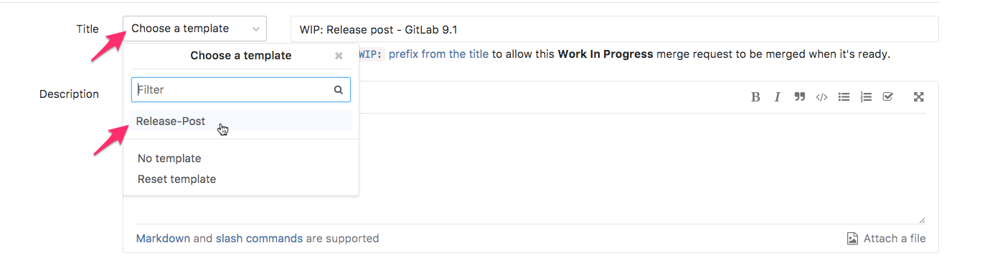

## Manually create your release post branch and required directories/files

If the automated pipeline fails, the manual steps below can be done either locally or using the GitLab Web IDE:

1. On `gitlab.com/gitlab-com/www-gitlab-com` create a new branch `release-X-Y` from `master`.
1. On `release-X-Y` branch, create the blog post file, containing the introduction and the blog post frontmatter information:
   1. In `sites/uncategorized/source/releases/posts/` directory, add a new file called `YYYY-MM-22-gitlab-X-Y-released.html.md` by copying the
      [monthly release blog template](https://gitlab.com/gitlab-com/www-gitlab-com/blob/master/doc/templates/blog/monthly_release_blog_template.html.md).
   1. Add the release number to `sites/uncategorized/source/releases/posts/YYYY-MM-22-gitlab-X-Y-release.html.md` on line 36 and make sure to remove the backticks.
   1. Add your name as the author to `sites/uncategorized/source/releases/posts/YYYY-MM-22-gitlab-X-Y-release.html.md` on lines 3 and 4
   1. Update the "which includes our `YY` release kickoff video" line replacing the `YY` (including removing the backticks) to reference the **next** release in `sites/uncategorized/source/releases/posts/YYYY-MM-22-gitlab-X-Y-release.html.md` on line 41
1. On `release-X-Y` branch, create the release post data directory, to which features and other data will be added:
   1. Create a new directory `X_Y` in the `data/release_posts` directory.
   1. Copy [`data/release_posts/unreleased/samples/mvp.yml`](https://gitlab.com/gitlab-com/www-gitlab-com/blob/master/data/release_posts/unreleased/samples/mvp.yml) into `data/release_posts/X_Y/mvp.yml`.

{:.alert .alert-info .text-center}

### Create the release post MR

Create a merge request with the introductory changes _after the previous post has been merged and before the feature freeze date_ to make the post available to receive contributions from the team:

1. The source branch must be `release-X-Y` and the target branch `master`.
1. Set the title to `Draft: Release post - GitLab X.Y`.  Prefix the title with `Draft:`.
1. Confirm that "Delete source branch when merge request is accepted" is selected.
1. Use the release post template for your MR.

   {:.shadow}

Now that you have created the release post MR, refer to the checklist in the MR for each action that you need to take and the due dates of each action. Keep in mind the MRs for usability improvements, bugs, and performance improvements have their own checklists to be completed, including a task for the Release Post Manager to merge these MR by the 17th prior to final content assembly.

## Create Retrospective Issue

1. Create a release post retrospective issue by using the [Release post retrospective template](https://gitlab.com/gitlab-com/www-gitlab-com/-/tree/master/.gitlab/issue_templates/Release-Post-Retrospective.md), and use `Release Post X.Y Retrospective` as a title.
1. Add the appropriate milestone to the issue.
1. Assign yourself to the issue.

**Note:** After you have created the release post MR and all the related files, refer to the checklist in the MR for each action that you need to take and the due dates of each action. Keep in mind the MRs for usability improvements, bugs, and performance improvements have their own checklists to be completed, including a task for the Release Post Manager to merge these MR by the 17th prior to final content assembly.

### Content assembly: merging release post items (content blocks) to your branch

**Important**: This procedure applies until the 18th, at <time datetime="07:59">7:59 am UTC (18th 2:59 am ET / 17th 11:59 pm PT)</time>. After this time, anyone who wants to include a change in the upcoming release post can either coordinate updates directly on the release post branch with the Release Post Manager or submit it in a separate MR, targeting the `release-X-Y` branch, and assign it to the Release Post Manager to merge. For more information, see our documentation on how to [Develop on a feature branch](https://docs.gitlab.com/ee/gitlab-basics/feature_branch_workflow.html).
{:.alert .alert-info}

When it is time to assemble the release post, this will be done by moving the
content block files from `data/release_posts/unreleased` to
`data/release_posts/X_Y`, and images from `source/images/unreleased` to
`source/images/X_Y`.

Those block items comprise of the release post items that
each PM creates for each feature.

The `bin/release-post-assemble` script makes this easy to do:

```bash
  git checkout master
  git pull
  git checkout release-X-Y
  git pull
  git merge master
  bin/release-post-assemble
  git status
  # confirm that content blocks and images have moved from `unreleased` to `X_Y`
  git add .
  git commit -m "Content assembly"
  git push origin release-x-y
```

#### If the content assembly bot fails

If for some reason the content assembly bot fails, the simplest way to move forward is to move the files manually. There is also a video walking through the changes [here](https://www.youtube.com/watch?v=SAtiSiSh_eA).

1. Manually move all the `.yml` files from `/data/releases_posts/unreleased/` to `/data/release_posts/x_y/` (`x_y` being the release post directory e.g. `13_2`). | _Note: Leave the `/samples` directory in the same location, don't move it._
1. Manually move all the images in `/source/images/unreleased/` to `/source/images/x_y/`.
1. Using a text editor like VS Code **find and replace** all the image paths under `image_url:` in each release post `.yml` file from `/unreleased/` to `/x_y/`. The video above demonstrates that.
1. `git commit` and `git push` and you should be good to go.

### Release post assembly

The [release post assembly](https://gitlab.com/gitlab-com/www-gitlab-com/blob/master/bin/validate-release-post-item) script moves release post content blocks and their images to the current release directory.

It uses a simple regexp to locate content files and images. It performs no validation. In the future, it would be simple to combine the functionality with the linter to reduce the number of scripts to maintain.

In preparation for content assembly on the 18th of the month, the Release Post Manager should ensure their local dev environment is up to date (e.g., running latest version of Ruby). Follow the steps in the "Content assembly and initial review" section of the [release post MR checklist](https://gitlab.com/gitlab-com/www-gitlab-com/blob/master/.gitlab/merge_request_templates/Release-Post.md) to prepare a local dev environment in advance.

#### Possible Script Errors with Corrective Actions

The [development.md](https://gitlab.com/gitlab-com/www-gitlab-com/-/blob/master/doc/development.md) contains steps to setup your local development environment.

Here are some of the common errors that a user might encounter where it may not be clear as what to do.

**You are missing a required Ruby Gem**

You might receive obscure error such as this:

```bash
Traceback (most recent call last):
  6: from ./bin/release-post-item:5:in `<main>'
  5: from ./bin/release-post-item:5:in `require_relative'
  4: from /Users/chase/work/www-gitlab-com/lib/release_posts.rb:13:in `<top (required)>'
  3: from /Users/chase/work/www-gitlab-com/lib/release_posts.rb:13:in `require_relative'
  2: from /Users/chase/work/www-gitlab-com/lib/release_posts/post_entry.rb:6:in `<top (required)>'
  1: from /Users/chase/.asdf/installs/ruby/2.6.6/lib/ruby/2.6.0/rubygems/core_ext/kernel_require.rb:117:in `require'
/Users/chase/.asdf/installs/ruby/2.6.6/lib/ruby/2.6.0/rubygems/core_ext/kernel_require.rb:117:in `require': cannot load such file -- styled_yaml (LoadError)
```

In this case, Ruby is trying to load a file named `styled_yaml`. It's not clear that this is a gem (a self-contained Ruby library), but the `require` statement in the output is a clue that there is some unresolved dependency here. **The action you should take in this case is to run `bundle install`**. You can also run `./bin/doctor` and it _should_ provide guidance on what to do. If you're uncomfortable or encounter have difficulty here, you can reach out to the [release post DRI](https://gitlab.com/fseifoddini) for advisement.

**Ruby mismatch**

If you have a Ruby version manager installed, you may receive an error in your terminal along the lines of `ruby  3.0.0  Not installed. Run "asdf install ruby 3.0.0"`

It's possible that your Ruby version is out of date with what is required to run handbook scripts. You should be able to run `./bin/doctor` to compare your current Ruby version with that in the `.tool-versions` file.

**The action you can take is to install the required Ruby version**

To install Ruby in the most popular Ruby version managers, try:

- For asdf, run the following: `asdf install ruby 3.0.0`
- For rbenv, run the following: `brew upgrade rbenv ruby-build && rbenv install 3.0.0`
- For rvm, run the following: `rvm install 3.0.0`

If you're uncomfortable or encounter have difficulty here, you can reach out to the [release post DRI](https://gitlab.com/fseifoddini) for advisement.

Note that the handbook currently [suggests](https://about.gitlab.com/handbook/git-page-update/#4-install-ruby-version-manager-rvm) `rvm`, while engineering has adopted `asdf`. You may find other references to `rbenv` in this documentation too. Any of these are fine, but they all work a bit differently and you _**only need one Ruby version manager installed**_.

It is also possible that your ruby version manager is misconfigured or your settings have been altered because of an upgrade to macOS especially from earlier versions to Catalina or higher. It's difficult to suggest an action for this scenario, you may want to reach out to the [release post DRI](https://gitlab.com/fseifoddini) for advisement.

**Gems install correctly, but you still have a missing gem error**

The ruby gem package manager is called bundler. Depending on the version of bundler you have installed, it is possible to configure bundler to install gems in a location different from the usual (and required) location by passing the `--path that_other_directory` are remembered between invocations and will be stored in `./.bundle/config` or in `./bundle/config`.

If you look in the `./bundle/config` file you might see:

```yaml
BUNDLE_PATH: "that_other_directory"
```

**The action you can take here is to edit that file `./bundle/config` and possibly `./bundle/config` to remove the BUNDLE_PATH setting and re-run `bundle install`.** You may also want to remove the `that_other_directory` which is often `vendor`. If you're uncomfortable or encounter have difficulty here, you can reach out to the [release post DRI](https://gitlab.com/fseifoddini) for advisement.

**Locking support**

You might encounter a message like this about locking support when you push a local commit to origin.

```bash
Locking support detected on remote "origin". Consider enabling it with:
  $ git config lfs.https://work-gitlab/gitlab-com/www-gitlab-com.git/info/lfs.locksverify true
```

You can probably safely ignore this suggestion. More documentation on [Git LFS file locking](https://github.com/git-lfs/git-lfs/wiki/File-Locking).

**JAMF and git-lfs conflict**

In the process of trying to push your commits to gitlab.com git is trying to verify the SSL cert. If you have JAMF installed (and you should for compliance reasons), git might find a different certificate for gitlab.com and throw an error about `Post "https://gitlab.com/gitlab-com/www-gitlab-com.git/info/lfs/locks/verify": x509: certificate signed by unknown authority
error: failed to push some refs to 'gitlab.com:gitlab-com/www-gitlab-com.git'`.

**The action you can take here is to contact IT**

More information can be found [in this issue](https://gitlab.com/gitlab-com/business-ops/team-member-enablement/issue-tracker/-/issues/1263#note_491341250).
