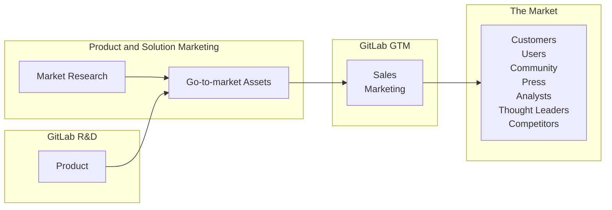

<link rel="stylesheet" type="text/css" href="/stylesheets/biztech.css" />

## On this page
{:.no_toc .hidden-md .hidden-lg}

- TOC
{:toc .hidden-md .hidden-lg}

# <i class="fas fa-bullhorn fa-fw color-orange font-awesome"></i> Welcome to the GitLab Product and Solution Marketing Handbook 

We create positioning and messaging to fuel demand and adoption of GitLab’s solutions and products. We develop market and competitive intelligence in order to develop actionable insights on market trends, customer needs, and competitive insights that guide go-to-market and product strategy. We identify, recruit, and activate customer advocates to demonstrate momentum and trust in the market.

{: .no_toc}

# Product and Solution Marketing functions/teams 

**Product and Solution Marketing** is the name of the overall group that includes specialists in the following disciplines:

1. [Core product marketing - positioning, messaging, narrative & content](/handbook/marketing/brand-and-product-marketing/product-and-solution-marketing/core-product-marketing/)
1. [Competitive marketing and intelligence](/handbook/marketing/brand-and-product-marketing/product-and-solution-marketing/competitive-intelligence/)
1. [Technical marketing - narrative and content, user messaging, external evangelism](/handbook/marketing/brand-and-product-marketing/product-and-solution-marketing/technical-marketing/)
1. [Market Research and Insights (MRI) - target market & audience definition](/handbook/marketing/brand-and-product-marketing/product-and-solution-marketing/market-insights/) 
1. [Analyst relations](/handbook/marketing/brand-and-product-marketing/product-and-solution-marketing/analyst-relations/)
1. [Customer advocacy](/handbook/marketing/brand-and-product-marketing/product-and-solution-marketing/customer-advocacy/)

Note that previously this group was called Strategic Marketing and then Portfolio Marketing. Artifacts of these names still remain in URLs. Please excuse these discrepencies as we work to rename everything.
    
# What does Product and Solution Marketing do?

Our mission is to accelerate GitLab’s path to market by developing insights, positioning, and messaging that communicate the value of our platform and solutions.

* We are core to GitLab’s go-to-market process, operating at the intersection of product management, sales, customer success, and marketing. 
* We help deliver a connected customer experience with every touchpoint reinforcing the brand, values, solutions, and vision of GitLab.
* We create programs and messaging to demonstrate momentum and trust in the market.

There are [10 key capabililities](https://docs.google.com/spreadsheets/d/1SqvXqr7T4A9JS25QLA3y7lbgktG5d-rSVnrV-hgLRdI/edit?usp=sharing) of team members. Sub-teams and individuals typically 'major' in certain areas and 'minor' in others. It's rare that one person would be expert in all 10.

# <i class="fas fa-star fa-fw color-orange font-awesome"></i>Market Research and Insights

Product and Solution Marketing synthesizes customer knowledge, analyst views, market landscapes, and competitor intelligence, to provide marketing insights to GitLab marketing, sales, and product teams. We use these insights to inform the product team of key market requirements and evolving landscapes for their consideration in product strategy. Our research may also include primary research on customers, markets, and competitors.

Each team within Product and Solution Marketing contributes uniquely and equally toward gathering market insights:  
* Core Product Marketing - win/loss analysis, customer churn, customer interviews and deep dives, message testing with customers 
* Technical Marketing - User education/research via technical deep dives that includes workshops, interactive webinars, external evangelism, internal/external product enablement and analyst debriefings
* Marketing Research & Insights - primary and secondary research, market insight research, focus groups
* Customer Advocacy - customer reference interviews,  peer review curation, Customer Advisory Board (CAB)
* Analyst Relations - analyst inquiries/reports, message testing with analysts
* Competitive marketing - competitive messaging, competitive technical analysis

# <i class="fas fa-star fa-fw color-orange font-awesome"></i>Go-to-market (GTM) Strategies

We develop and champion **go-to-market strategies** that take into account our sales goals, product strengths/limitations, and marketing vehicles. These strategies include recommendations on product and solution areas upon which to focus our marketing and sales efforts and provide supporting messaging, positioning, personas, key assets/content, demos, sales enablement, and more. We deliver our stories/messages to customers, analysts, press through collateral, events, customer meetings, etc., where we get first-hand feedback from the audience to iterate and improve our strategies. We champion the customer perspective for continuity of experience across the various customer touchpoints. 

Each team within Product and Solution Marketing contributes uniquely and equally toward a comprehensive GTM strategy that includes:  

   - characteristics of accounts and personas to pursue with marketing and sales, 
   - routes to market (e.g. direct, channels), 
   - key messages, 
   - currated assets/content needed for the buyer's journey, (this team creates many key assets but assets may also come from SAs, evangelists, blogs, partners. This team currates compelling ones that pull the prospect along their journey.)
   - key questions for sales to ask, competitive positioning, overcoming objections, other sales resources
   - influencing the influencers (press and analysts), responding to analyst RFIs for magic quadrants (MQs) and waves.

[Solutions GTM Page](/handbook/marketing/brand-and-product-marketing/product-and-solution-marketing/usecase-gtm/) has links to all of this and more.

# <i class="fas fa-star fa-fw color-orange font-awesome"></i>Subject matter expertise 

Product Marketers are often asked to speak at conferences, workshops and webinars.

To encourage reuse and collaboration, we have a [shared folder of past abstracts](https://drive.google.com/drive/folders/1ODXxqd4xpy8WodtKcYEhiuvzuQSOR_Gg) for different speaking events. PMMs also have an [inventory of presentations](https://docs.google.com/spreadsheets/d/1sQdR4mMNKWep0v02HQacOCEfb0BP19jFygTxnvUcau8/edit#gid=0) that can be quickly and easily reused. 

### Requesting Product and Solution Marketing help

All Product and Solution Marketing work is aligned to the overall Marketing OKRs.The specific team OKR/KRs are tracked and managed as issues in the Product and Solution Marketing Project. If you need additional support from the team, the simple process below will enable us to support you.

1. [Open an SM Support Request Issue](https://gitlab.com/gitlab-com/marketing/strategic-marketing/product-marketing/-/issues/new?issuable_template=A-SM-Support-Request) this link will the _A-SM-Support-Request_ template. PLEASE fill in what you know.
1. Be sure to @mention a specific team member who you are requesting help from. If you don't @mention a team member, your request may not be processed. Ping '@doneal' `@lclymer` and `@davistye` if you don't know whom to tag.
1. If you need more immediate attention please send a message with a link to the issue you created in the `#product-marketing` slack channel. Add an `@reply` to the PMM responsible or you can ping the team with `@pmm-team`.

# <i class="fas fa-star fa-fw color-orange font-awesome"></i>Marketing and Sales Enablement

Through research and iteration, Product and Solution Marketing becomes the subject matter experts around key product capabilities and/or solutions. We provide the voice of the customer to help to connect the dots across the marketing functions (web, campaigns, digital ads, ABM, events) and sales stages (SDR nurture, SALs/SAs pursuit/close, CSM expansion) by providing an outside-in perspective of our buyer's journey experience, along with that of their key influencers, from pain to purchase and from interest to sales. We strive to optimize the journey to efficiently achieve return on marketing and sales investment.

Product and Solution Marketing team members serve as subject matter experts and conduct in-house and partner sales trainings scheduled by the [Sales Training team](/handbook/sales/training/) and Partner Marketing. For info go to the [Sales Enablement page](/handbook/sales/training/sales-enablement-sessions/).

# Metrics

The Product and Solution Marketing organization is often considered the nexus that brings together research, customer and market insights, with technical expertise to benefit the all of GitLab marketing teams. The Product and Solution Marketing organization collaborates and partners with other teams in marketing for certain execution elements, such as Digital Experience, Brand, and Integrated marketing.  Additional key collaborators are sales for using the revenue plays for effective iteration, and Product Management to help with customer engagement via our CAB as well as providing input into analyst outreach.

The organization is an influencer on the indicators below. We cannot drive the results on our own, only through collaboration, but we use these indicators to assess the impact of our actions.

**Leading indicators**
* Position and progression in key MQs and Waves (identified by GTM Strategies)
* SEO of most critical terms (identified by GTM Strategies)
* [Content creation and use](/handbook/marketing/brand-and-product-marketing/product-and-solution-marketing/metrics/)
* Percent of targeted ABM accounts that have engaged in a web page, event, asset, trial, or contacted sales.
* In [Brand surveys](https://docs.google.com/document/d/1YsQo9-Kbp6IdEXUu3usyr2Cl8spVVIgsqXIAp2m1Awo/edit#), C-level and funnel prospects recognize GitLab for end-to-end DevOps capabilities.

**Lagging indicators**
* ARR for Enterprise and SMB
* First order new logos (is the message capturing new prospects?)
* Uptiering (are we arming sales with compelling offers?)
* Customer retention (are expectations set by marketing messages aligned with product experience?)
* Consistent outcomes from sales value plays (is the recipe a good one?)

<!---
Here's how we process the requests - [Product and Solution Marketing Project Management Overview](/handbook/marketing/brand-and-product-marketing/product-and-solution-marketing/getting-started/sm-project-management/)
-->

## Planning and Reporting Resources

- [Product and Solution Marketing group conversation slides](https://docs.google.com/presentation/d/1Q_W98NGO7ytifsQto-PP_FMHLokrZCm2HmuFjX1eCNk/edit#slide=id.gfc91b93a8c_0_0)
- [Product and Solution Marketing Requests Triage Board](https://gitlab.com/gitlab-com/marketing/product-marketing/-/boards/1237365?label_name%5B%5D=sm_request)

- [Customer Reference Board](https://gitlab.com/groups/gitlab-com/marketing/-/boards/927283?&label_name%5B%5D=Customer%20Reference%20Program)
- [Case Studies Board](https://gitlab.com/groups/gitlab-com/marketing/-/boards/918204?&label_name%5B%5D=Case%20study)
- [Solution and capabilities GTM resource pages](/handbook/marketing/brand-and-product-marketing/product-and-solution-marketing/usecase-gtm/)

<!---
#### Past sales enablement presentations

- [Getting Started - GitLab 101 - No Tissues for Issues](/handbook/marketing/brand-and-product-marketing/product-and-solution-marketing/getting-started/101/)
- [Getting Started - GitLab 102 - Working Remotely](/handbook/git-page-update/)
- [Getting Started - GitLab 103 - Maintaining common slides across decks](/handbook/marketing/brand-and-product-marketing/product-and-solution-marketing/getting-started/103/)
- [Getting Started - GitLab 104 - Building Project Issue Templates](/handbook/marketing/brand-and-product-marketing/product-and-solution-marketing/getting-started/104/)
- [Getting Started - GitLab 105 - Label Triage Bot - Automatic Hygiene](/handbook/marketing/brand-and-product-marketing/product-and-solution-marketing/getting-started/105/)
- [Markdown style guide for about.gitlab.com](/handbook/markdown-guide/#markdown-style-guide-for-aboutgitlabcom)
- [Searching the GitLab Website Like a Pro](/handbook/tools-and-tips/searching/)
- [Frequently used sales resources](https://gitlab.highspot.com/spots/615dd7e3911d70c4887812a7)
-->

## Collateral

### Customer-facing presentations

Marketing decks linked on this page are the latest approved decks from Product Marketing that should be always be in a state that is ready to present. As such there should never be comments or WIP slides in a marketing deck. If you copy the deck to customize it please give it a relevant title, for example include the name of the customer and an ISO date.

- [Enterprise Golden Pitch deck](https://docs.google.com/presentation/d/1vtFnh8DU6ZZzASTHg83UrhM6LJWqo5lq9mJDAY2ILpw)
This deck contains the GitLab narrative. You can use it when talking to an audience who is unfamiliar with GitLab and what we do.
- [SMB Golden pitch deck]()
- [Customer value pitch deck](https://docs.google.com/presentation/d/1SHSmrEs0vE08iqse9ZhEfOQF1UWiAfpWodIE6_fFFLg/edit?usp=sharing)
The customer value pitch deck contains the GitLab value driver narrative. You can use it in conversations where the audience is already familiar with GitLab and you're ready to share the value GitLab can bring to their Digital Transformation. It explains how GitLab is a complete DevOps platform delivered as a single application as well as our key differentiators.
- [GitLab security capabilities deck](https://docs.google.com/presentation/d/1WHTyUDOMuSVK9uK7hhSIQ_JbeUbo7k5AW3D6WwBReOg/edit?usp=sharing)
This deck introduces GitLab's position and capabilities around security and compliance. It covers why better security is needed now and how GitLab provides that better security in a more effective manner than traditional tools. This deck should be used when talking to prospects who are asking about how GitLab can help them better secure their software via GitLab Ultimate. It is intended for a security audience.

To request updates to these decks see [requesting help from the roduct and solution marketing department](#requesting-product-and-solution-marketing-help)

### Customer logo slide

The SSOT for this slide is found in the [Golden pitch deck]() above. It is updated quarterly. Please do not use old customer logo slides as they may no longer relevant or we no longer have permission to use them.

Existing collateral can be found in HighSpot (sales facing) and in Path Factory (marketing content management system).

### Key demo Videos

- [DevOps Platorm](https://player.vimeo.com/video/646577717?h=8e30af6265) (~6 minutes)
- [GitLab CI Overview](https://www.youtube.com/embed/ljth1Q5oJoo) (~6 mins)
- [GitLab CD Overview](https://youtu.be/L0OFbZXs99U) (~19 mins)
- [GitLab Security Overview](https://youtu.be/XnYstHObqlA) (~8 mins)
- [GitLab Agile Overview](https://www.youtube.com/embed/VR2r1TJCDew) (~4 mins)
- [GitLab in 3 minutes](https://youtu.be/Jve98tlZ394) (~3 mins)

### Acronyms

- **PMM**: Used to refer to **Product Marketing Management** (as a practice or the entire Core Product Marketing team) or specifically to a **Product Marketing Manager**. Examples:
    - Product Marketing Management: "Let's collaborate with PMM since they are customer and market SMEs"
    - Product Marketing Manager: "Parker is the PMM on my cross-functional team."
- **TMM**: Used to refer to **Technical Marketing Management** (as a practice or the entire Technical Marketing tream) or specifically to a **Technical Marketing Manager**. Use TMM. Don't use TM (which usually stand for "Trademark".)
- **PM**: [Product Mangement](/handbook/product/) or [Product Manager](/handbook/product/product-manager-role/). Don't use PM to refer to  Product Marketing, use PM exclusively for the Product team.

<!---
#### Collateral

Latest collateral can be found on the [Portfolio Marketing Group Convo slides](https://drive.google.com/drive/folders/
1fCEAj1HCegJOJE_haBqxcy2NYm0DS1FO)

Our top-performing collateral includes: 

- [GitLab DataSheet on Digital Transformation](/images/press/gitlab-data-sheet.pdf)
- [GitLab Federal Capabilities One-pager](https://cdn.pathfactory.com/assets/10519/contents/430162/ba2b7fd5-ba10-4065-8eb2-d4f90ce9a1d2.pdf)
- [Reduce cycle time whitepaper](/resources/downloads/201906-whitepaper-reduce-cycle-time.pdf)
- [Shift security left white paper](https://about.gitlab.com/resources/whitepaper-seismic-shift-application-security/)
- [Ten steps every CISO should take to secure cloud native applications](https://about.gitlab.com/resources/ebook-ciso-secure-software/)
- [Guide to securing your software supply chain](https://learn.gitlab.com/devsecops-aware/software-supply-chain-security-ebook)
-->
