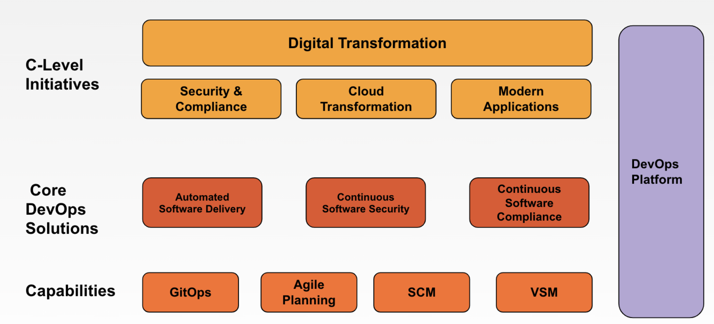
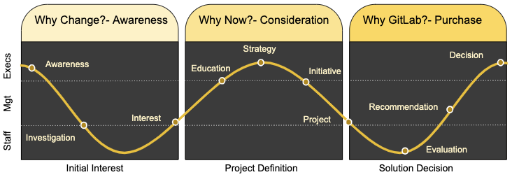
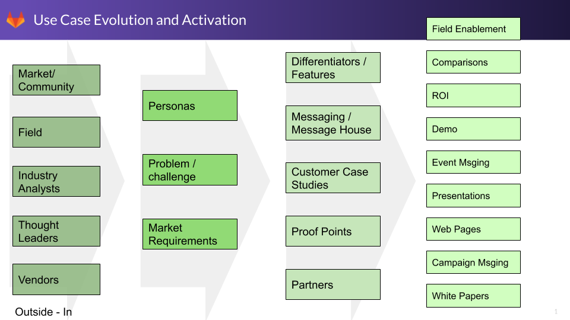
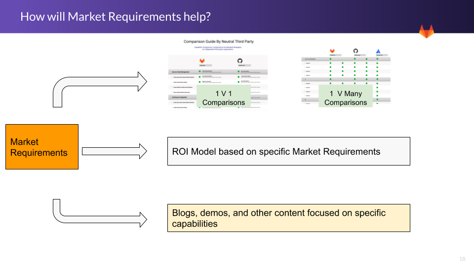

## On this page
{:.no_toc .hidden-md .hidden-lg}

- TOC
{:toc .hidden-md .hidden-lg}

# What are solutions?

Solutions are a product or suite or products and services that business purchase to solve business problems. They are typically categorized into 3 buckets that address

1. Market segment requirements (e.g. DevOps platform solution). Ours are outlined below with more details [here](/handbook/use-cases/) 
1. Industries/verticals requirements (e.g. Pub Sec, High Tech, Retail)
1. Business segment requirements (e.g. enterprise vs SMB)

Relevant solutions will differ by audience. 
* **C-level executives** care about broad business solutions, often characterized by well-funded strategic business initiatives - things that help them improve productivity, reduce cost, or deliver value faster - things that align with Command of the Message [Customer Value Drivers](/handbook/sales/command-of-the-message/#customer-value-drivers). The C-level audience are important influencers who set an organizations agendas, strategic objectives, and fund major IT initiatives.
* **DevOps buyers** are tasked with determining HOW to meet the transformational business objectives backed by their C suite. They likely have a budget to buy or replace specific DevOps capabilities (like CI) and the more Directors and VPs often look at the bigger picture of how to simplify a complex DevOps environment.
* **DevOps users** are tasked with using the tools to make the transformation happen. They care about how a given tool makes their job easier, their time more productive, and their code more secure.

A picture may help convey the **Solution Framework**.

One of the most common of these sweeping initiatives is **Digital Transformation**. The Enterprise Project provides a useful [definition of Digital Transformation](https://enterprisersproject.com/what-is-digital-transformation): "Digital transformation is the integration of digital technology into all areas of a business, fundamentally changing how you operate and deliver value to customers.". 

A **Digital Transformation** initiative is typically executed through a set of strategic business solutions. [Research in November 2021](https://gitlab.com/gitlab-com/marketing/strategic-marketing/product-marketing/-/issues/5787#note_740205135), showed that C-level executives are concerned most with these **Digital Transformation Solutions**: 

| Strategic Solution | primary objective | exec sponsor | characteristics |
| ----- | ----- | ------ | ---- |
| 1. **Security and compliance** | understand and manage risk | CISO or CTO | requires technology and process transformations |
| 1. **Cloud transformation** | gain business agility | line-of-business VP (LOB) or CTO | often technology-focused with adoption of cloud, containers, Kubernetes, IaC |
| 1. **Application modernization** | improve software time-to-market | CTO | often process-focused with DevOps, Agile, velocity, VSM |

### Connecting solutions to value plays

These transformative solutions must get connected to DevOps initiatives where GitLab is established. It's important to guide prospects from broad ideas down to specific actions, budgets, and sales opportunities. We do this via **core DevOps GTM solutions** where we articulate a message of how we help customers achieve positive business outcomes, and where we align sales efforts (Value plays and revenue programs) and marketing campaigns (such as digital ads, email campaigns, nurture, events), to focus on opportunities where we have the greatest likelihood of success. By providing a solutions framework and capturing steps in value plays, we expect to achieve repeatable, predictable sales outcomes with metrics that help us optimize marketing spend for greatest impact.

GitLab customers can purchase these solutions by working directly with our sales teams or by working with our Channel Partners and Technology Alliance Partners. Partners support GitLab customers by offering services that deliver DevOps solutions. The **core DevOps solutions** and the **value plays** each supports include:

* **[DevSecOps](/handbook/marketing/brand-and-product-marketing/product-and-solution-marketing/usecase-gtm/devsecops/)**
* **[Software Compliance](/handbook/marketing/brand-and-product-marketing/product-and-solution-marketing/usecase-gtm/compliance/)**
* **[Automated Software Delivery](/handbook/marketing/brand-and-product-marketing/product-and-solution-marketing/usecase-gtm/delivery-automation/)**
* and cumulatively, The DevOps **[Platform](https://about.gitlab.com/handbook/marketing/brand-and-product-marketing/product-and-solution-marketing/usecase-gtm/devops-platform/)**.

#### Capabilities / use cases as Wedge conversations

Within the core DevOps solutions, are capabilities. They may also be referred to as Use Cases. These topics may be hot in the market (like GitOps), or associated with GitLab (like SCM). They may attract interest for a conversation with a prospect. Conversations about these capabilities may open the door (as a wedge) to broader conversations that align to value plays - typically leading to either the platform solution or Automated Software Delivery solution. Capabilities may have associated marketing campaigns. 

Examples include:
* **[Source Code Management](/handbook/marketing/brand-and-product-marketing/product-and-solution-marketing/usecase-gtm/version-control-collaboration/) (SCM), also referred to as Version Control and Collaboration (VCC)** does not have a value play. It is driven by web-selling alone. It does require messaging, web pages, and supporting assets, but is not typically sold by the sales team.
* **[Continuous integration](https://about.gitlab.com/stages-devops-lifecycle/continuous-integration/)**    
* **[DevSecOps](https://about.gitlab.com/solutions/dev-sec-ops)**  
* **[GitOps](/handbook/marketing/brand-and-product-marketing/product-and-solution-marketing/usecase-gtm/gitops/)** (infrastructure automation) has been a solution/use case, with an accompanying sales play. GitOps has been folded into the Automated software delivery solution.
 
The Customer Success Managers (CSMs) are goaled on expanding an existing customer's use of GitLab capabilities. It is measured in stage utilization. Mapping capabilities to stages helps the CSMs know which capability/use case material to apply.

### Which solution to use for which persona

The core DevOps solutions are communicated to sales via **Solutions Selling** in [HighSpot](https://gitlab.highspot.com/spots/615dd7e3911d70c4887812a7).

Understanding which solution to apply where requires consideration of the persona/audience. The matrix below suggests which conversation is best for which persona as a recommended starting point.

| Persona / Primary initiative | Security & Compliance | Cloud Transformation | App Modernization |
| ---- | ---- | ---- | --- |
| **CIO, CTO, CISO** | [Software Compliance](/handbook/marketing/brand-and-product-marketing/product-and-solution-marketing/usecase-gtm/compliance/) | [Platform](https://about.gitlab.com/handbook/marketing/brand-and-product-marketing/product-and-solution-marketing/usecase-gtm/devops-platform/) | [Platform](https://about.gitlab.com/handbook/marketing/brand-and-product-marketing/product-and-solution-marketing/usecase-gtm/devops-platform/) |
| **Dev/LOB** | [DevSecOps](/handbook/marketing/brand-and-product-marketing/product-and-solution-marketing/usecase-gtm/devsecops/) | [Automated Software Delivery](/handbook/marketing/brand-and-product-marketing/product-and-solution-marketing/usecase-gtm/delivery-automation/) | [Automated Software Delivery](/handbook/marketing/brand-and-product-marketing/product-and-solution-marketing/usecase-gtm/delivery-automation/), [DevSecOps](/handbook/marketing/brand-and-product-marketing/product-and-solution-marketing/usecase-gtm/devsecops/) |
| **Security** | [DevSecOps](/handbook/marketing/brand-and-product-marketing/product-and-solution-marketing/usecase-gtm/devsecops/) | [Software compliance](/handbook/marketing/brand-and-product-marketing/product-and-solution-marketing/usecase-gtm/compliance/) |[DevSecOps](/handbook/marketing/brand-and-product-marketing/product-and-solution-marketing/usecase-gtm/devsecops/), [Software compliance](/handbook/marketing/brand-and-product-marketing/product-and-solution-marketing/usecase-gtm/compliance/) |
| **Ops** | [Software compliance](/handbook/marketing/brand-and-product-marketing/product-and-solution-marketing/usecase-gtm/compliance/) | [Platform](https://about.gitlab.com/handbook/marketing/brand-and-product-marketing/product-and-solution-marketing/usecase-gtm/devops-platform/) | [Automated Software Delivery](/handbook/marketing/brand-and-product-marketing/product-and-solution-marketing/usecase-gtm/delivery-automation/) |
| **Risk/legal/CFO** | [Software compliance](/handbook/marketing/brand-and-product-marketing/product-and-solution-marketing/usecase-gtm/compliance/) | [Software compliance](/handbook/marketing/brand-and-product-marketing/product-and-solution-marketing/usecase-gtm/compliance/) | [Software compliance](/handbook/marketing/brand-and-product-marketing/product-and-solution-marketing/usecase-gtm/compliance/) |

## DevOps Solution DRIs and key links

Core DevOps Solutions have DRIs and a wealth of internally-focused and externally-focused resources.  The chart below shows everything in 1 place. 

### DevOps Solutions

|  | **Automated Software Delivery** | **Security/DevSecOps** | **Compliance** | Platform |
| --- | ----------- | ------------------ | ----------- | -------------- |
| **PMM** | Saumya Upadhyaya | Cindy Blake | Cindy Blake |  Cormac Foster | 
| **TMM** | Itzik | Fern | Fern |  William Arias |
| **PM** | Jackie Porter | Hillary Benson | Orit Golowinski | Kenny Johnston |
| **Resource page** | [Automated Software Delivery](/handbook/marketing/brand-and-product-marketing/product-and-solution-marketing/usecase-gtm/delivery-automation/) | [DevSecOps page](/handbook/marketing/brand-and-product-marketing/product-and-solution-marketing/usecase-gtm/devsecops/) | [Compliance](/handbook/marketing/brand-and-product-marketing/product-and-solution-marketing/usecase-gtm/compliance/) | [Platform](https://about.gitlab.com/handbook/marketing/brand-and-product-marketing/product-and-solution-marketing/usecase-gtm/devops-platform/) |
| **Solution page** | [Automated Software Delivery solution](https://about.gitlab.com/solutions/delivery-automation/) | [DevSecOps solution](https://about.gitlab.com/solutions/dev-sec-ops/) | [Compliance solution](https://about.gitlab.com/solutions/compliance)  | [GitLab home page](https://about.gitlab.com/) |
| **Topic page** | [CI-CD](https://about.gitlab.com/topics/ci-cd/) | [Application Security/DevSecOps](https://about.gitlab.com/topics/devsecops/) | URL tbd | [DevOps Platform](https://about.gitlab.com/topics/devops-platform/)|
| **Campaign page** | ASD coming soon | DevSecOps landing page | na | tbd |
| **Value play** | [Automated Software Delivery](https://docs.google.com/presentation/d/1E3vMfzaE49NauWnIW5PJzL1e1XUljhbVXK6z0Eb9ZMk/edit#slide=id.gec8126bebe_0_3) | [DevSecOps2.0](https://about.gitlab.com/handbook/marketing/sales-plays-cicd/playbook-premium-to-ultimate/) | [Software compliance](https://docs.google.com/presentation/d/1JGqApMeEyZzfejysjtrg2dS7jWbXVI9elNELTj2wSK4/edit#slide=id.gfaa86ae08c_0_36) | | [Platform](https://docs.google.com/presentation/d/15_xU3u_0qeEupaRNrR29HY3B_Tlc1R99xWRUUjGwrz8/edit#slide=id.gec8126bebe_0_3) |
| **Slack channel** | #gtm-autosd | #gtm-ci-cd (it was security focused) | na | #gtm-platform |

### Capabilities / use cases
|  | **CI/CD** | **SCM** | **GitOps** | Agile planning |
| --- | ----------- | ------------------ | ----------- | ------------- |
| **PMM** | Saumya Upadhyaya  | Brian Glanz | Saumya Upadhyaya | Cormac |
| **TMM** | Itzik | William Arias | Cesar Saavedra | William Arias |
| **PM** | Jackie Porter  | Daniel Gruesso | Viktor Nagy | n/a |
| **Resource page** | [CI resource](https://about.gitlab.com/handbook/marketing/brand-and-product-marketing/product-and-solution-marketing/usecase-gtm/ci/)| [SCM resource](/handbook/marketing/brand-and-product-marketing/product-and-solution-marketing/usecase-gtm/version-control-collaboration/) | [GitOps resource](/handbook/marketing/brand-and-product-marketing/product-and-solution-marketing/usecase-gtm/gitops/) | [Agile planning](https://about.gitlab.com/handbook/marketing/brand-and-product-marketing/product-and-solution-marketing/usecase-gtm/agile/) |
| **Capabilities page** | [CI](https://about.gitlab.com/features/continuous-integration/) | [SCM capabilities](https://about.gitlab.com/stages-devops-lifecycle/source-code-management/) | URL tbd | URL tbd |
| **Topic page** | [CI-CD](https://about.gitlab.com/topics/ci-cd/) | [SCM](https://about.gitlab.com/version-control/) | [What is GitOps?](/topics/gitops/) | 
| **Campaign page** | [CI landing page](https://about.gitlab.com/why/use-continuous-integration-to-build-and-test-faster/) | [SCM landing page](https://about.gitlab.com/why/simplify-collaboration-with-version-control/) | [GitOps landing page](/why/gitops-infrastructure-automation/) | tbd |
| **Sales resources** | tbd| **web-selling only** |[Infrastructure Automation](https://about.gitlab.com/handbook/marketing/sales-plays/gitops/) | t bd) |
| **Slack channel** | #gtm-ci-cd | | n/a | #gtm-gitops | na |

For solutions that have a GTM (campaign) Motion built around them, DRIs for the motion are based on the [GTM Motion Core team](https://about.gitlab.com/handbook/marketing/plan-fy22/#core-teams).

Use cases coming next
| VSM | Observability | supply chain security |
| --- | --- | --- | 

|  | **Automated Software Delivery** | **DevSecOps** | **Compliance** | **SCM** (capability) | **GitOps** (capability) | Platform |
| --- | ----------- | ------------------ | ----------- | ------------- | --------------- | -------------- |
| **PMM** | Saumya Upadhyaya | Cindy Blake | Cindy Blake | Brian Glanz | Saumya Upadhyaya| Cormac Foster | 
| **TMM** | Itzik | Fern | Fern | William Arias | Cesar Saavedra | William Arias |
| **PM** | Jackie Porter | Hillary Benson | Orit Golowinski | Daniel Gruesso | Viktor Nagy | n/a |
| **Resource page** | [Automated Software Delivery](/handbook/marketing/brand-and-product-marketing/product-and-solution-marketing/usecase-gtm/delivery-automation/) | [DevSecOps page](/handbook/marketing/brand-and-product-marketing/product-and-solution-marketing/usecase-gtm/devsecops/) | [Compliance](/handbook/marketing/brand-and-product-marketing/product-and-solution-marketing/usecase-gtm/compliance/) | [VC&C page](/handbook/marketing/brand-and-product-marketing/product-and-solution-marketing/usecase-gtm/version-control-collaboration/) | [GitOps page](/handbook/marketing/brand-and-product-marketing/product-and-solution-marketing/usecase-gtm/gitops/) | [Platform](https://about.gitlab.com/handbook/marketing/brand-and-product-marketing/product-and-solution-marketing/usecase-gtm/devops-platform/) |
| **Solution page** | [Automated Software Delivery solution](https://about.gitlab.com/solutions/delivery-automation/) | [DevSecOps solution](https://about.gitlab.com/solutions/dev-sec-ops/) | [Compliance solution](https://about.gitlab.com/solutions/compliance) | [vcc Solution](https://about.gitlab.com/stages-devops-lifecycle/source-code-management/) | URL tbd | URL tbd |
| **Topic page** | [CI-CD](https://about.gitlab.com/topics/ci-cd/) | [Application Security/DevSecOps](https://about.gitlab.com/topics/devsecops/) | URL tbd | [Version Control](https://about.gitlab.com/topics/version-control/) | [What is GitOps?](/topics/gitops/) | [DevOps Platform](https://about.gitlab.com/topics/devops-platform/)|
| **Campaign page** | Not available [CI landing page](https://about.gitlab.com/why/use-continuous-integration-to-build-and-test-faster/) | DevSecOps landing page | Compliance tbd | [VC&C landing page](https://about.gitlab.com/why/simplify-collaboration-with-version-control/) | [GitOps landing page](/why/gitops-infrastructure-automation/) | tbd |
| **Value play** | [Automated Software Delivery](https://docs.google.com/presentation/d/1E3vMfzaE49NauWnIW5PJzL1e1XUljhbVXK6z0Eb9ZMk/edit#slide=id.gec8126bebe_0_3) | [DevSecOps2.0](https://about.gitlab.com/handbook/marketing/sales-plays-cicd/playbook-premium-to-ultimate/) | [Software compliance](https://docs.google.com/presentation/d/1JGqApMeEyZzfejysjtrg2dS7jWbXVI9elNELTj2wSK4/edit#slide=id.gfaa86ae08c_0_36) | **web-selling only** |[Infrastructure Automation](https://about.gitlab.com/handbook/marketing/sales-plays/gitops/) | [Platform](https://docs.google.com/presentation/d/15_xU3u_0qeEupaRNrR29HY3B_Tlc1R99xWRUUjGwrz8/edit#slide=id.gec8126bebe_0_3) |
| **Slack channel** | #gtm-ci-cd | #gtm-ci-cd | tbd | n/a | #gtm-gitops | #gtm-platform |

<!--
| **Webcast pages** | tbd | [DevSecOps webinar](https://www.youtube.com/watch?v=cURONFXW_NQ&t=3s) | [Compliance webinar](https://www.youtube.com/watch?v=fTFsbGyl6o0) |[VC&C webinar](https://about.gitlab.com/webcast/collaboration-without-boundaries/) | [GitOps webinar](/why/gitops-infrastructure-automation/) | tbd |
| [**epic**](https://gitlab.com/groups/gitlab-com/marketing/strategic-marketing/-/epics/71) | [CI epic](https://gitlab.com/groups/gitlab-com/marketing/strategic-marketing/-/epics/70) | [DevSecOps epic](https://gitlab.com/groups/gitlab-com/marketing/strategic-marketing/-/epics/56) | Compliance tbd | [VC&C epic](https://gitlab.com/groups/gitlab-com/marketing/strategic-marketing/-/epics/42) | [GitOps epic](https://gitlab.com/groups/gitlab-com/marketing/strategic-marketing/-/epics/28) |  |
-->

## Last mile alignment

For optimal impact, sales and marketing efforts must align across the entire sales and marketing life cycle.

Internally, solutions GTM should drive:
* Value plays which align with revenue programs
* campaigns which support value plays
* Highspot and Path Factory topics/spaces
* metrics fields in SFDC Command Plan for proper reporting and assessment

Externally, solutions GTM should drive:
* Solutions pages (from Home page drop-down)

## Buyer's journey and typical collateral

As a prospect is determining that they have a specific problem to solve, they typically go through several stages of a [buyer's journey](/handbook/marketing/brand-and-product-marketing/content/#content-stage--buyers-journey-definitions) which we hope ultimately leads them to selecting GitLab as their solution of choice.

| **Awareness** | **Consideration** | **Decision/Purchase** |
| --------- | ------------- | ----------------- |
| Collateral and content designed to reach prospects in this stage of their journey should be focused on **educating them about the problems they are facing**, the business impact of their problems, and the reality that others are successfully solving the same problem | Collateral and content designed to reach prospects in this stage of their journey should be focused on **positioning GitLab as a viable and compelling solution to their specific problem.** Use cases can address unique concerns and may help overcome perceived barriers. | Collateral and content designed to reach prospects in this stage of their journey should be focused on key information that a buyer needs to **justify GitLab as their chosen solution**. |
| Typical **Awareness** Collateral | Typical **Consideration** Collateral | Typical **Decision/Purchase** Collateral |
| **-** White papers describing the problem space **-** Infographics illustrating the impact of the problem/challenge **-** Analyst reports describing the problem/domain **-** Webinars focusing on the problem and how can be solved **-** Troubleshooting guides to help overcome the problem **-** Analysis of public cases where the problem impacted an organization (i.e. outage, data loss, etc) | **-** White papers describing the innovative solutions to the problem **-** Infographics illustrating the success and impact of solving the problem **-** Analyst reports comparing different solutions in the market (MQ, Waves, etc) **-** Webinars focusing on the success stories and how gitlab helped solve the problem **-** Customer Case Studies, Videos, Logos, etc **-** Solution Check Lists / Plans for how to solve the problem **-** Comparisons between GitLab and other solutions | **-** ROI calculators **-** Use case specific implementation guides **-** Use Case migration guides (from xyz to GitLab) **-** Getting Started info **-** References and case studies |

## Buyer's Journey - Audience

In addition the **buyer's journey**, there are also different audiences in an organization with different needs at different times. The general model for the buyer's journey outlines kinds of collateral that is needed at different stages of the buying cycle. It is incredibly important to understand the needs of the audience when creating collateral. Executives, managers, and individual contributors will need different information to support their specific work.

- **Executives** will need information about business value, risk, cost, and impact to support strategic objectives
- **Managers** will need more detailed information to drive planning, justification, and migration details.
- **Contributors** need technical details about how it works, how it's better, and how it's going to help them in the future.

The Buyer's journey can also start when developers and the team start to look for solutions to their day to day challenges. The staff initiates the effort, as they have identified a challenge and are the champion of a change. They then convince their managers and executives of the need to consider an alternative to their current state.

### Solution GTM Bill of Materials

To this model, we need to add ideal customer profiles to better inform marketing on types of companies to target for campaigns and to help sales qualify opportunities.

### Market Requirements

Solution "Market Requirements" are the broad capabilities that a solution (product or multiple products) would need to support. Each GitLab DevOps solution should have roughly 8-12 market requirements defined.

In product terminology, Market Requirements are similar to concept of [Jobs to be Done (JTBD)](/handbook/product/ux/ux-resources/#jobs-to-be-done-jtbd). Both represent something the end user or customer wants to accomplish. Like JTBD, Market Requirements are <i>**not**</i> features but instead a set of higher level capabilities that indicate what's "required" for a given solution to include in order to be successful in the market. For example, specific products do contain features that help to meet Market Requirements but the features themselves don't qualify as Market Requirements. JTBD tend to be very granular and specific. The [list of JTBD for a particular stage](/handbook/engineering/development/ops/package/jtbd/#jobs-to-be-done) can be long and is theoretically endless. Market Requirements are intentionally broad in an effort to keep the list of total requirements small and consumable. We expect that a given **Market Requirement** would consist of many **jobs to be done**

In [Command of the Message terminology](https://internal-handbook.gitlab.io/handbook/sales/command-of-the-message/) (internal-only) used by Sales, these are **NOT** the same thing as "Required Capabilities". COTM "Required Capabilities" are very narrow and focused on a specific value driver aligned with GitLab. **"Market Requirements"** are intended to be comprehensive for a given use case and defined by the market (analysts, vendors, etc), not GitLab specific features), as well as seen through an 'outside-in' paradigm of the market.

When industry analysts do research, they use a market requirements model to evaluate competing solutions. A typical analyst report may have a set of 40-60 capabilities in their market requirements model used to measure and compare vendors with each other. For the sake of our go-to-market efforts, we bucket capabilities into 8-12 key market requirements per use case.

The downstream impacts of market requirements are

- Technical Demos are based on showcasing specific market requirements
- Comparisons across the market (multiple vendors, multiple products) can be driven from market requirements
- ROI models can be built highlighting the value of specific market requirements.

<!--
### Solution GTM Bill of Material Priorities & Tracking (needs updating so commented out for now)

<iframe width="1200" height="1100" src="https://docs.google.com/spreadsheets/d/e/2PACX-1vTptvo1N7m8tjLSgJFOoy8l2fhnJmlyS83JhsT2DU6Ki3x1tcJ0Jd4Y4nvDnz0EbLEddAzpWHQYMWVs/pubhtml?gid=1180560927&amp;gridlines=false&amp;single=true&amp;widget=true&amp;headers=false&amp;rm=minimal&amp;range=A1:L42"></iframe>

- [GTM Tracking Spreadsheet](https://docs.google.com/spreadsheets/d/1K78pI_sqS91o8fpMReCF5n7gf7tZjCFxU4PjX2uddxk/edit#gid=2033522968) (requires updating)
-->
