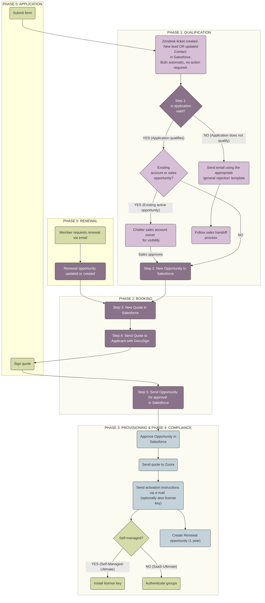

## On this page
{:.no_toc .hidden-md .hidden-lg}

- TOC
{:toc .hidden-md .hidden-lg}

During 2022, we are transitioning to a fully automated process for our Community Programs Application Workflow. This page is being deprecated as we migrate over. 
{: .alert .alert-gitlab-orange}

## Overview

The goals of this page are to:
 * Instruct people processing community program applications on how to do so by providing an overview of how our programs run
 * Allow transparency into our workflows to help others integrate with it

### Common Tasks and Zendesk Macros

People processing applications will also need to refer to the following pages:
 * [Common Tasks](/handbook/marketing/community-relations/community-programs/community-program-applications/common-tasks) - These are common tasks, requests, and errors that you'll come across when processing community program applications.
 * [Email and Zendesk Macros](/handbook/marketing/community-relations/community-programs/community-program-applications/email-and-zendesk-macros) - These are templates you'll use to respond to applicants throughout the process.


### Tools

We use several different tools to manage these programs:

1. Marketo
1. Community Operations Zendesk
1. Salesforce
1. Customer Portal
1. License Portal
1. [Email aliases](/handbook/marketing/community-relations/community-programs/community-program-applications/email-and-zendesk-macros/#using-gmail-as-an-alternative-to-zendesk) - For education@gitlab.com, opensource@gitlab.com and startups@gitlab.com

<i class="fas fa-info-circle" aria-hidden="true" style="color: rgb(49, 112, 143)
;"></i> You'll find more information on the specific usage of these tools on the [Community Relations Workflows tools section](/handbook/marketing/community-relations/workflows-tools/).
{: .alert .alert-info}

### Responsibilities
Education and Open Source Program Managers monitor the following:
1. **Zendesk views:** *Education*, *Open Source*, *Startups*, *E-mail*, *No Group Assigned*, *Suspended tickets* (for `File {FileExternalID2} has been signed at GitLab` notifications)
1. **Slack channels:** `#community-programs`
1. **Email aliases:** education@gitlab.com, opensource@gitlab.com, and startups@gitlab.com.
    * **In order to setup these email aliases in your inbox:**
         * [Read more about when to use email vs Zendesk](/handbook/marketing/community-relations/community-programs/community-program-applications/email-and-zendesk-macros/#using-gmail-as-an-alternative-to-zendesk). On that page, you'll find instructions on how to set up the aliases. If you do not have access please submit an [access request](/handbook/business-technology/team-member-enablement/onboarding-access-requests/access-requests/).
         * Follow these [steps to set up a filter in your inbox](/handbook/tools-and-tips/#apply-label-to-all-gitlab-generated-emails) to forward all emails sent from dse_NA3@docusign.net to community@gitlab.com. This filter is required because all notifications from DocuSign regarding action on a quote are sent to the *senders* personal email inbox. These notifications need to appear in Zendesk so proper action can be taken.To avoid confusion within your email inbox forward Docusign documents titled "Voided" "Viewed" and "Declined" using a inbox filter.

**The priorities for the daily workflow are as follows, in order of priority:**
1. **Open tickets** in the *Zendesk Education/OSS/Startups views* with ongoing communication between Community Team and the member/applicant.
   - **Renewals** have the highest priority in the queue because their license may be close to expiring.
1. **Tickets in the *Zendesk Email View*** for notifications that a quote is ready to be sent for approval.
1. **Unresolved conversations in Salesforce.** Check your personal chatter notifications from your Home tab in Salesforce and resolve any outstanding tasks from the Sales Operations (Deal Desk) or Billing Ops teams. Note: Examples would be requesting a zipcode to be updated or questions regarding an approval.
1. **New applications should be left until all tickets and casese in the process have been moved forward.**

## Application workflow

Once someone applies to a community program, there are 5 phases to the workflow:

| Phase | Description |
| ------ | ------ |
| 0. [Application](/handbook/marketing/community-relations/community-programs/community-program-applications/#phase-0-application) | Application form is filed and appears in Zendesk |
| 1. [Qualification](/handbook/marketing/community-relations/community-programs/community-program-applications/#phase-1--qualification) | Determine whether or not to grant license |
| 2. [Booking](/handbook/marketing/community-relations/community-programs/community-program-applications/#phase-2-booking) | Gather all information needed to create a quote and collect signature |
| 3. [Provisioning](/handbook/marketing/community-relations/community-programs/community-program-applications/#phase-3-provisioning-and-phase-4-compliance) | Handled by Sales-Support and Billing Ops |
| 4. [Compliance](/handbook/marketing/community-relations/community-programs/community-program-applications/#phase-3-provisioning-and-phase-4-compliance) | Handled by Sales-Support and Billing Ops. Results in granting the license and notifying customer of how to access |
| 5. [Renewal](/handbook/marketing/community-relations/community-programs/community-program-applications/#phase-5-renewal) | Contains phases 0 - 4, just processed as a renewal |

See diagram below for how these phases all flow together.



## PHASE 0: APPLICATION
A community member submits the application for the respective program: [GitLab for Education](https://about.gitlab.com/solutions/education/join/#application), [GitLab for Open Source](https://about.gitlab.com/solutions/open-source/join/), or [GitLab for Startups](https://about.gitlab.com/solutions/startups/).  

## PHASE 1:  QUALIFICATION
### Step 1: Determine if the application is valid
Each program has a different qualification process. After reading the federal exception, proceed to the relevant program below.

#### Federal Sector exception
Federal entities in the United States have additional [rules of engagement](/handbook/sales/public-sector) and most do not qualify for our free licenses.

If you receive an application with the words "U.S.", "Military", "Naval", "Airforce", "National Laboratory" in the institution title, and/or the applicant email has a .mil or .gov domain, please do the following:
- Reach out to the account owner directly by following the [sales handoff process](/handbook/marketing/community-relations/community-programs/community-program-applications/#handoff-process-to-sales) **before** sending a rejection email to let them know of the application.
- Ask the Sales rep if we should proceed with the rejection email or if they would like to contact the applicant directly. The Sales rep may have an existing relationship with the applicant and we want to be sensitive to any ongoing communication.

Note: If you are a non-US Citizen you may not be able to view existing accounts for U.S. Federal entities in Salesforce due to restrictions. If you do not see an account and you are not sure who to contact in Salesforce, inquire in the [#public-sector slack channel](https://gitlab.slack.com/archives/C57F94Y8H).

**EDU federal use case policy**

The U.S. Federal Government has various entities that may have the words  "School" or "College" in them but they are actually part of a military entity or branch of the government. Examples include: "Army Cyberschool", "National Geospatial Intelligence Agency College", or "National Laboratory". These entities are not qualified for the Education Program license under the EULA.

**OSS federal use case policy**
Federal use cases are considered on a case-by-case basis for the OSS program. Please reach out to the OSS program manager if you come across a federal use case application for the OSS program and proceed to contact the relevant Sales representative.

#### Education program
After someone applies to the GitLab for Education program, here's what to expect:

1. The Applicant will submit the application form.
   - If an applicant selects `Role` = `Student` an automated email from *Marketo* is sent informing them of available options to students & how to encourage the University to apply. Zendesk ticket won't be created and no action is required.
   - If a student contacts us directly and does not use the application form, send the [EDU::EDU Rejecting Students](/handbook/marketing/community-relations/community-programs/community-program-applications/email-and-zendesk-macros/) from Zendesk if there a ticket or from the education@gitlab.com email alias.
   - If an applicant selects any other `Role`, the data from the form will be forwarded to Salesforce as LEAD (if they are not in our database) or CONTACT object (if they are already in our database).  The source of the *lead/contact* is set to *Education*.  A Zendesk Ticket is automatically created with a link to the lead/contact object. CONTACT objects contain the same data LEAD objects do, the record is just stored differently.
1. View the applicant's form in Zendesk.
1. **Check Email Address:** Check the applicant's email address to verify that it is from the same domain as the institution noted in the application.
   - We cannot issue licenses to email domains outside of the applying institution. If the applicant uses a gmail or other non-related domain, please send the [EDU::EDU Requesting Email Domain macro](/handbook/marketing/community-relations/community-programs/community-program-applications/email-and-zendesk-macros/).
   - If the applicant has a .gov or .mil email domain, please follow the [Federal Sector Exemption steps](/handbook/marketing/community-relations/community-programs/community-program-applications/#federal-sector-exception).
   - Make sure to hand them over to the [US Public Sector team](/handbook/business-technology/#public-sector) for a review
   - This is **extremely important** because they probably aren't qualified for this program even if it looks like they are.
1. **Check Institution:** Verify that the educational institution is an actual accredited, academic, **non-profit** institution. See the [Education Program Requirements and examples of qualifying institutions](/handbook/marketing/community-relations/community-programs/education-program/#gitlab-for-education-program-requirements).
   - If the region is within the U.S., go to the [National Center for Education Statistics database](https://nces.ed.gov/globallocator/) and search by the name of the educational institution. The results will list the type of institution (public, private, for-profit).  Any institutions that are categorized as 'for-profit' do not qualify.
   - If the region is not within the U.S., search for the institution on the web and view the institution's about page. Generally, the description will indicate if it is a non-profit institution. If you are unable to determine whether or not the institution is non-profit, email the applicant from the education@ email alias using the [EDU::EDU Requesting Non-Profit Verification macro](/handbook/marketing/community-relations/community-programs/community-program-applications/email-and-zendesk-macros/).
   - *IMPORTANT*: If the institution is K-12 and may enroll children under the age of 13, GitLab cannot issue a GitLab.com license for any purpose which may include the use by any students in the K-12 institution. However, the institution can apply for a self-managed GitLab license.
   -  If the institution does not qualify, use the [EDU::EDU General Rejection macro](/handbook/marketing/community-relations/community-programs/community-program-applications/email-and-zendesk-macros/) to notify the applicant and follow the [handoff to Sales process](/handbook/marketing/community-relations/community-programs/community-program-applications/).
   - Note: Non-profit entities regularly apply to the Education Program that are not primarily an educational institution and/or wish to use the license for uses cases outside of the EULA. At this time, we do not have a [formal non-profit program](/handbook/marketing/community-relations/community-programs/education-program/). These requests are handled on a case-by-case basis by the DRI (the appropriate sales team member for that region and their manager). In these cases, follow the [handoff to Sales process](/handbook/marketing/community-relations/community-programs/community-program-applications/#handoff-process-to-sales) or the send the [NP::Rejecting Non-profits macro](/handbook/marketing/community-relations/community-programs/community-program-applications/email-and-zendesk-macros/)  depending on the response. We cannot guarantee that non-profit requests will be granted as the decision is at the discretion of the DRI.
1. **Check Use Case**: View the applicant's form in Zendesk to view the `Use Case` and `Use Case Notes` response from the form submission.
   - If the response = `Instructional Use` or `Non-Commercial Academic Research` the use case is acceptable and you can proceed to the next step.
   - Note: If the applicant mentions anything in the `Use Case Notes` field indicating IT professional use, administrative use, or anything else questionable, you will need to follow up directly. Start by sending the [EDU::EDU Collection EDU Qualification Information macro](/handbook/marketing/community-relations/community-programs/community-program-applications/email-and-zendesk-macros/#educollecting-edu-qualification-info) via the education@ email alias to get more information about their GitLab usage and to make sure they are aligned with our Education program terms.
      - Verifying the use case may take several back and forth emails with the applicant. If the first email does not contain sufficient information needed to verify the use case, send the [EDU::EDU Second email asking for participants usage data macro](/handbook/marketing/community-relations/community-programs/community-program-applications/email-and-zendesk-macros/). If you are unsure if the use case meets the terms, please reach out to the Education Program Manager via the [#community-programs slack channel](https://gitlab.slack.com/messages/community-programs). It is better to qualify the lead now than issue a license in error.
      - Once you have verified that the use case is acceptable continue to the next step.   
    - If the response = `IT Professional Services` the use case is not acceptable under our terms. Change the lead status to unqualified and send the [EDU::EDU General Rejection macro](/handbook/marketing/community-relations/community-programs/community-program-applications/email-and-zendesk-macros/) via Zendesk. Then follow the [handoff to Sales process](/handbook/marketing/community-relations/community-programs/community-program-applications/#handoff-process-to-sales).
1. **Check Existing Account Status:** Search Salesforce to see if there is an existing account and/or opportunity for this educational institution.
     - Note: If you notice that there is a duplicate account for the same educational institution, please follow the steps for [merging duplicated accounts](/handbook/marketing/community-relations/community-programs/community-program-applications/common-tasks/#merging-duplicated-accounts). It is acceptable for separate entities within a single educational institution to have separate accounts. For example, it is acceptable for  *University of Missouri Hospital and Clinics* and *University of Missouri Astrophysics Center* to have separate accounts But it is not acceptable to have separate accounts for *University of Wisconsin Madison* and *UW Madison*.
     - If there is an existing account with an active sales opportunity (stage = anything less than Closed-Won), chatter the account owner in Salesforce directly from the account to let them know of the application and make sure there are no conflicts with the issuing the license. Make a note in the Zendesk ticket that you are waiting for the AO to respond. Wait 2 days to hear back. If there is no conflict, proceed with issuing the Education license.
     - If there is an existing account owned by someone from the Sales Team (SAL/SDR) but there are no active opportunities, chatter the account owner and the ASM/ISR/SDR in Salesforce directly from the account and make sure there are no preliminary conversations occurring with the account and no conflicts with issuing the license. Make a note in the Zendesk ticket that you are waiting for the AO to respond. Wait 2 days to hear back. If there is no conflict, proceed with issuing the Education license.  Note: SALS/SDRs will open Salesforce accounts for any existing conversations with prospects, or for those accounts in a quarterly plan.
 1. Once you have verified the **email address**, **educational institution**, **use case**, and **existing account status** proceed to [Phase 2:Booking](/handbook/marketing/community-relations/community-programs/community-program-applications/#phase-2-booking) below.

#### Open Source program
After someone applies to the GitLab for Open Source program, you'll need to make sure they qualify.

**There are three requirements for the GitLab for Open Source program:**

1. OSI-approved open source license -- All of the code you host in this GitLab group must be published under OSI-approved open source licenses
1. Not seeking profit -- Your organization must not seek to make a profit through services or by charging for higher tiers. Accepting donations to sustain your efforts is ok
1. Publicly visible -- Your GitLab.com group or self-managed instance and your source code must be publicly visible and publicly available

These requirements are published on the [GitLab for Open Source application form](https://about.gitlab.com/solutions/open-source/join/) found on our website.

**How to find OSS qualification information when someone applies**

When someone submits an application form, the information is captured in Salesforce. To find their responses and see if they qualify for a free OSS license, do the following:

 1. **Go to Zendesk.** When an OSS application is submitted, you'll see a New email in Zendesk in the _OSS view_ named: `OSS Request from [Project Name]`. Open it.
 1. **Look at the Salesforce form.** Click on the Salesforce link and scroll down to the `Education & OSS` section of the form. This section contains the answers from the applicant that will help you qualify them.

 You then need to ensure that they meet all three of our qualification criteria.

**Req 1: OSI-approved open source license**

 1. Look at the `Open Source License` field on the Salesforce form and check the link that they send against the list of [OSI approved licenses](https://opensource.org/licenses).
 1. Make sure that they have copied the license text into each of their GitLab projects. To check their instance, click on the `Overview` of projects in their group.

If they do not meet this requirement, use the [`OSS:: OSI-approved license` Zendesk macro](/handbook/marketing/community-relations/community-programs/community-program-applications/email-and-zendesk-macros/#oss-osi-approved-license) to ask them to add an OSI-approved license to their projects.

Note: Sometimes, people will apply to the GitLab for Open Source program to see if they qualify before moving their project over. We ask them to at least create a skeleton GitLab instance following our guidelines before approving their license, and we let them know that they'll need to continue to meet our requirements at time of renewal.

**Req 2: Not seeking profit**

Applicants must check a box at time of application to certify that their organization does not seek to make a profit. However, sometimes, there's confusion around what it means to seek a profit. Do a quick check to see if they do qualify for this requirement.

 1. Look at the `OSS supporting evidence` field in the Salesforce form and see if they provide additional information about meeting the requirement.
 1. Do a quick google search of their project, or see if they include a website. If they provide paid support or are affiliated with a company, they may not qualify.

If you believe they may not qualify, send them the [`OSS:: Clarifying "not-seeking-profit" req and Qualification Examples` macro](/handbook/marketing/community-relations/community-programs/community-program-applications/email-and-zendesk-macros/#oss-clarifying-not-seeking-profit-req-and-qualification-examples) to ask if they can clarify their use case.

Further not-seeking-profit qualification guidance:

*Examples of OSS projects that usually qualify:*
 * *Receives Donations* -- The software is being developed by a community that gathers donations for covering costs.
 * *Has an open governance model* -- Projects with open governance models are likely to be accepted. For more information about open governance models, see this open source governance model article. The only model in there that would NOT qualify is the corporate governance model.

*Examples that usually do not qualify:*
 * *Open Core* -- The software is being primarily developed by a company that uses the software for its core or base product. The company charges for use of the software at higher tiers.
 * *Charging for Services* -- The software itself is not being sold but the open source project is being primarily developed by a company that charges for services around that open source project.


**Req 3: Publicly visible requirement**

 1. Click on the link they provide in the `OSS project link` field and make sure that you can see the projects in their group. Click into them to see if you can see things like the overview and activity fields.

 If their projects are not visible, or if you see a page asking you to login or request access, let them know that you'll need them to turn their projects' visibility to public before continuing to process their application.

**If an application does NOT meet the requirements**
If you have worked with them to better understand their use case and have decided they do not qualify, proceed with these steps:

 1. Send them the [`OSS:: OSS Rejection` macro](/handbook/marketing/community-relations/community-programs/community-program-applications/email-and-zendesk-macros). Edit it to make sure that they understand why their application cannot be approved and offer to do a [Handoff to Sales](/handbook/marketing/community-relations/community-programs/community-program-applications/#handoff-process-to-sales).
 1. Close the lead in Salesforce as unqualified.

**If an application DOES meet the requirements**

 Proceed to the [Create an Opportunity](/handbook/marketing/community-relations/community-programs/community-program-applications/) section using OSS naming convention.

#### Startups program
Currently, only YCombinator Startups (YC Startups) qualify for our Startups program. We get a lot of startups that do not meet our current requirements.

Here's how to qualify them:

 1. Make sure they are part of the current or two most recent [YCombinator batches](https://www.ycombinator.com/companies/).
 1. If they are not on that list, follow up with the [`Startups:: Qualification for program` macro](/handbook/marketing/community-relations/community-programs/community-program-applications/email-and-zendesk-macros/#startups-qualification-for-program) to ask them to provide verification that they are a YC startup.

If they do qualify, continue to [create an opportunity](/handbook/marketing/community-relations/community-programs/community-program-applications/).

If they do not qualify, send them the [Startups:: Rejection macro](/handbook/marketing/community-relations/community-programs/community-program-applications/email-and-zendesk-macros) and offer to connect them to sales via the [Sales handoff process](/handbook/marketing/community-relations/community-programs/community-program-applications/#handoff-process-to-sales).


#### Handoff Process to Sales
If an applicant does not meet the program terms, the lead or contact should be transferred over to the appropriate sales development representative (SDR) by following these steps:
1. For leads, identify the [appropriate sales territory and vertical of the entity from territory table](/handbook/sales/territories/).
    - If the entity is a public institution in the US, the vertical is [Public Sector](/handbook/sales/territories/).
    - If the entity is a private institution, the vertical is generally [MidMarket](/handbook/sales/territories/).
    - Some territories may not have a Public Sector Vertical, in this case, use MidMarket.
     - If you are unable to easily determine who the appropriate sales owner is, please post the Salesforce link in the appropriate slack channel (for example the US Public Sector SLED channel is [#public-sector-sled](https://gitlab.slack.com/archives/CRM6JS5L0)) and ask for guidance on who the account should be transferred to.
1. For contacts (the applicant is already in our Salesforce database), navigate to the account and identify the SDR.  
1. Reassign the lead/contact to the appropriate SDR for the Region/Vertical in Salesforce. If you are unable to do so, chatter @Sales-support for assistance.
1. Chatter the SDR in Salesforce directly from the account to let them know the lead/contact has been reassigned and there is no current action item.
    - If the lead responds to the offer in the rejection macro for an introduction to the SDR using the [Common Requests:: Handing off to sales team template](/handbook/marketing/community-relations/community-programs/community-program-applications/email-and-zendesk-macros/#common-requests-handing-off-to-sales-team---send-via-gmail). Make sure to send it via gmail so that you can connect them directly with the SDR (Sales cannot access the Community Zendesk instance). Then, chatter the SDR so that they can follow up.
1. Any relevant emails regarding the use case or the scope of the opportunity should be tracked within Salesforce in the account's activity history. Follow [these steps](/handbook/customer-success/using-salesforce-within-customer-success/#tracking-emails-within-salesforce) to forward any relevant email correspondance to Salesforce.
    -  Note: If the person you are contacting is not yet a contact associated with an opportunity or account in Salesforce, you will need to search for the email by pasting the applicant email address in the Salesforce search bar, finding the email in the list, and then manually associate the email to the appropriate account in Salesforce.

## PHASE 2: BOOKING
### Step 2: Create an opportunity
For an overview of the process, watch this [Create an Opportunity video](https://youtu.be/YYRA34__-N0).

There are two ways you may need to create a New Opportunity.

**If you are processing a New Application**

When you click on the Salesforce link in a new application request in Zendesk, you'll be taken to a Lead page in Salesforce. You'll need to convert this Lead to a Contact before you can proceed.

 1. Change the `Record Owner` from your name to Alex Karsten for EDU, OSS, or Startups. Note: All records will be owned by Alex Karsten for consistency, but the Community Team will be able to perform any required actions on the records.```suggestion:-0+0
 1. Change the `Record Owner` from your name to Alex Karsten for EDU, OSS, or Startups. Note: All records will be owned by Alex Karsten for consistency, but the Community Team will be able to perform any required actions on the records.
 1. Make sure that the `Account Name` looks correct and Edit if needed. Do a quick search and see if there are any similar Account names that may be duplicates. For OSS cases, you may need to shorten the new application Account name if it is too long (sometimes people add descriptions of their project there).
 1. Click on the `Convert` button at the top.
      - If there is already an Account in Salesforce for this organization choose the option to `Attach to Existing: {Account Name}`. If there is not an existing Account choose `Create New Account:{Account Name}`.
      - Then `Name` the opportunity accordingly: *OrganizationName- NumberOfSeats Product Program [w/ Support]* (e.g. "ABC University- 100 Self-Managed-Ultimate EDU" or "ABC Organization- 100 SaaS-Ultimate OSS w/ Support").
      - Make sure the `Initial Source` is set to to "Education" or "OSS" (Startups will be GitLab.com)
      - Turn off the `Reminder` at the very bottom of the page
      - Then click `Convert`
      - The *Opportunity* will then be created and appear under the Account.
 1. Navigate to the new Opportunity and procceed to [Step 3: Create a new quote](/handbook/marketing/community-relations/community-programs/community-program-applications/#step-3-create-a-new-quote)


**If you are not processing a New Application**

 1. Locate the Contact associated with the account in Salesforce and click on `New Opportunity`.
 1. Make sure the `Initial Source` is set to to "Education" or "OSS"
 1. `Type`:
   - New Business = if it is a brand new request
   - Add-On Business = if they are adding seats, changing the amount of seats, changing license type, or adding support
   - Renewal = if they are renewing
 1. `Close date` - Today
 1. `Stage` - `0-Pending-Acceptance`
 1. Set the `Amount` to $0.00 if they didn't purchase support or the annual amount of the support price if they did.
1. Click `Save` and proceed to the next step.

NOTE: Sometimes, a contact that is already associated with an account will apply for a new account under one of our programs. If you run into this, follow the steps to [process New Opportunities for Contacts with multiple accounts](/handbook/marketing/community-relations/community-programs/community-program-applications/common-tasks/).

### Step 3: Create a new Quote
For an overview of the process, see [Create a New Quote and Send to Applicant](https://www.youtube.com/watch?v=gKrjz8WL1XA).

1. From the Opportunity, click on *New Quote*.
1. For all new applications, **on the `Select Billing Account` page,** select *new billing account*. Under `Choose Quote Type` select **new subscription for this account** Then click `Next`.
1. Choose the appropriate *Quote Template* - `09.20 NEW ORDER FORM EDU ` / `09.20 NEW ORDER FORM OSS` / `09.20 NEW ORDER FORM YC`
1. *Sold to* and *Bill to Contacts* are the primary contacts.
   - The `Sold to` person will sign the quote and receive the license (Self-Managed-Ultimate) or instructions for authentication (SaaS-Ultimate). This generally should be the person that will set up the license and should be the person who has an account in the Customer Portal.  
   - The `Bill to` person can be the same as the *Sold to* person, or it may be the person who applied for the license. They do not need to be the same.
   - `Signature` section:` An organization may request that someone other than the *Sold to* or *Bill to* person signs the quote. Generally, we accept any signature by someone who is authorized to bind the organization to legal terms (for EDU: an authorized institutional representative). You will not need to recreate the quote if someone other than the primary contacts signs the quote.
   - For more information on the differences on how to add `Bill To` `Sold To` or `Signature` fields, see the [Deal Desk Handbook page's section on creating quotes](https://about.gitlab.com/handbook/sales/field-operations/sales-operations/deal-desk/#zuora-quote-configuration-guide---standard-quotes)
1. Click the *Primary* checkbox
1. *Start Date* - Today.
1. The *Initial* and *Renewal* Terms should be 12 months.
1. Be sure *Click-through EULA* is **No**.
1. If Tax Exempt and they want to purchase Support, make sure to ask for a Certificate ID so that there is not tax added to the Support cost. Not all organizations that opt for the free Self-Managed-Ultimate or SaaS-Ultimate will be tax exempt. If they are just signing up for the free plan, there will be no tax so you can skip this step.
1. Click *Next*
1. Click on the *New Quote Flow: Select* pull down menu.
1. Click on `Step 1: Add base products`, and Click `Select Plan` on the relevant product. Scroll to the relevant product with or without support:
- `[EDU Program or OSS Program, or, Startups Program] Self-Managed - Ultimate - 1 Year`
or
- `[EDU Program, OSS Program, or Startups Program] SaaS - Ultimate (formerly Gold) - 1 Year`

Click *Select Plan*. Click *Save*.

Note: In order to see the license type and number of seats, view the opportunity record. The opportunity name will list the license type and the number of seats will be listed in the qualifications section.

13. *Quantity* - enter the number of seats and click *Submit*
   - If they are purchasing support, the product will list $59.40 as the cost. This the cost per year for each seat. The quote will calculate the total cost for the number of seats and populate the value automatically. The resulting value should match the value you entered on the Opportunity.

### Step 4: Send the quote to the applicant
1. Navigate to the created Quote and click *Generate Quote PDF*. A confirmation that the PDF has been created will appear in a separate tab and under the `Google Docs, Notes & Attachments` section on the opportunity. Close the tab and return to the Quote view.
1. From the Opportunity, select the *Send with DocuSign* button.
    - For step-by-step directions see the [DocuSign section] (/handbook/sales/field-operations/order-processing/#how-to-send-an-order-form-to-the-customer-for-signature-via-docusign) of the Order Processing Handbook page.
    - Note that the email subject will be `Please DocuSign: [filename]`.
    - In the *Email Invite Message* window paste the [Common Requests: e-signature request via DocuSign - Salesforce macro](/handbook/marketing/community-relations/community-programs/community-program-applications/email-and-zendesk-macros/).
    - Continue to follow the DocuSign directions.
    - Double-check the quote to make sure the following is correct: Sold To Details, Subscription Details (product, quantity, total), and terms.
    - Click *Send*.
1. Notify the applicant that their application was approved and the quote was sent by replying in Zendesk with the [EDU:: EDU new application approval Zendesk notification](/handbook/marketing/community-relations/community-programs/community-program-applications/email-and-zendesk-macros/#edu-edu-new-application-approval-zendesk-notification) or the [OSS:: OSS new application approval Zendesk notification](/handbook/marketing/community-relations/community-programs/community-program-applications/email-and-zendesk-macros/#oss-oss-new-application-approval---zendesk-notification). Submit the ticket as closed in Zendesk. Note: We send this additional email because the quote will come directly from DocuSign and we want to make sure they are aware it is coming from a different sender and it could get blocked by spam filters.
    - Note: Notifications regarding any action (delivery, signature, or comment) on the quote will be sent from dse_NA3@docusign.net to the individual who sent the quote. Each individual team member **must** have [the filter set up](/handbook/tools-and-tips/#apply-label-to-all-gitlab-generated-emails) in their personal inbox to forward all DocuSign emails to community@gitlab.com which will create a Zendesk ticket to take action on the quote.
1. After the applicant receives the quote, we will receive the `Delivery Receipt For File` email notification (sent to the individual and then forwarded with the filter to community@gitlab.com). Use the [`Common Requests:: License Update` macro](/handbook/marketing/community-relations/community-programs/community-program-applications/email-and-zendesk-macros/#common-requests-license-update) and make sure the related ticket's status is set to *Solved*. The [signed quote can be viewed](/handbook/marketing/community-relations/community-programs/community-program-applications/email-and-zendesk-macros/).
1. The quote may need to be signed manually or without DocuSign for a number of reasons. For example, it is fairly common that the DocuSign email was blocked by spam filters or the applicant was unable to sign electronically. To send the quote for signature via email:
    - Navigate to the *Opportunity* in Salesforce.
    - In the *Google Docs, Notes & Attachments* section, the preview.pdf quote generated earlier will be available. Click the preview link and then click on the link for *View file*. The PDF of the quote will open and you can download it from your browser.
    - Download the PDF to your local machine and attach it to an email. Use the [Common Requests:: Send Quote via Email macro](/handbook/marketing/community-relations/community-programs/community-program-applications/email-and-zendesk-macros/#common-requests-send-quote-via-email).


### Step 5: Submitting the Opportunity for the approval

**Ensure quote has been uploaded to Salesforce**

If the quote was sent via DocuSign for signature, follow these steps:

 1. Find notification in Zendesk. You'll receive a notification in Zendesk in the *E-mail* view that indicates the quote has been signed. Copy the `file name` text so that you can use it to search for that quote in Salesforce. Note: This notification email will have a PDF attached of the signed quote but you do not need to do anything with that PDF.
 1. Search for the Opportunity in Salesforce. Click on the `DocuSign Envelope Status` option to go directly to the signed quote.
 1. Once the document has been signed, the status will be updated to `Completed`.
 1. Continue onto the "Submit the Opportunity for approval" step.

If the quote was sent via email, follow these steps:

 1. Download the signed quote to your computer.
 1. Make sure the name of the quote has the proper Opportunity naming convention, and replace "*preview*" with "*signed*" at the end.
 1. Find the related Opportunity in Salesforce and upload the quote via the `Google Docs, Notes & Attachments` section.
 1. Continue onto the "Submit the Opportunity for approval" step.

**Submit the Opportunity for approval:**
To submit the signed quote for approval, you'll need to do the following:

 1. Update the Opportunity's `Close date` to today.
 1. In the `Other Closing Info` section update the `Closed Won Reason` to *Other* and the `Closed Won Details` to indicate the respective program: *EDU/OSS/Startups*. Click `Save`.
 1. Click on `Submit for Approval`. A separate window will open indicating the opportunity has been submitted for approval. Close the window. Note - do not change the stage, only Deal Desk and Billing have permission to do that.
 1. If needed, you can also verify that the Opportunity was submitted for approval, by viewing the *Approval History* at the top of the opportunity.
 1. Copy the contact's email from Salesforce. You'll need it to search in Zendesk in the next step.

**Email applicant with notification:**
Once you've submitted the quote for approval via Salesforce, you'll need to go back to Zendesk to notify the applicant.

 1. Apply the [`Common Requests:: License Update`](/handbook/marketing/community-relations/community-programs/community-program-applications/email-and-zendesk-macros/#common-requests-license-update) macro to the `File {FileExternalID2} has been signed at GitLab` notification and close as *Solved*.
 1. Search Zendesk by the contact's email to find your previous correspondence with them. Send them the appropriate macro to notify them that their new application or renewal has been sent for final review (send as *Solved*):

 * For EDU: [EDU::EDU Welcome macro](/handbook/marketing/community-relations/community-programs/community-program-applications/email-and-zendesk-macros/) or [EDU::EDU Renewal Thank You macro](/handbook/marketing/community-relations/community-programs/community-program-applications/email-and-zendesk-macros/)

 * For OSS: [OSS:: OSS Welcome (new applicants)](/handbook/marketing/community-relations/community-programs/community-program-applications/email-and-zendesk-macros/#oss-oss-welcome-new-applicants) or [`OSS:: OSS Welcome (Renewals)` macro](/handbook/marketing/community-relations/community-programs/community-program-applications/email-and-zendesk-macros/#oss-oss-welcome-renewals)

 * For Startups: [Startups:: Startups Welcome](/handbook/marketing/community-relations/community-programs/community-program-applications/email-and-zendesk-macros/#startups-startups-welcome). Note: Startups are not eligible for renewal.

**What to expect next:** Once approved, sales-support will handle the rest of the provisioning process and will send the applicant their license. A renewal opportunity will be created at that time.

On the backend: The way this happens is that sales-support reviews the signed quote. If it is complete, they will send the quote to Zuora. From Zuora, the license key (for Self-Managed-Ultimate) or the subscription (for SaaS-Ultimate) will be posted to the CustomersDot and instructions for authenticating a group will be emailed.

## PHASE 3: PROVISIONING and PHASE 4: COMPLIANCE
These phases are handled by the [Deal Desk Team](/handbook/sales/field-operations/sales-operations/deal-desk/) and [Billing Operations Teams](https://about.gitlab.com/handbook/finance/accounting/finance-ops/billing-ops/).

For assistance with the opportunity approval chatter #sales_support. For assistance with the license or billing account after the opportunity has been approved chatter #billing_ops.


## PHASE 5: RENEWAL

### Renewal process
Note: All Education and Open Source renewals are processed manually because **we verify the use case before granting the renewal**. Use cases may have changed in one year and it is important to verify that the program member still meets program requirements. Please ping us on the [#community-programs](https://gitlab.slack.com/messages/community-programs) Slack channel if you have any questions. If the Opportunity is assigned to someone other than a the Program Manager and it is time to start the renewal process, please reassign the renewal opportunity to Program Manager, but leave the related Account assigned to Sales Account Leader.

#### Types of renewal requests and how to find them
Here are the different ways that you may come across a new renewal request:

| Request Type | Where to find it | What to do | Notes |
| ------ | ------ | ------ | ------ |
| **Email to a program alias** | Zendesk (in the view for [Education](https://gitlab-community.zendesk.com/agent/filters/360044571213) or [Open Source](https://gitlab-community.zendesk.com/agent/filters/360049919533)) | Send the appropriate requesting renewal information macro for [EDU::EDU Requesting Renewal Information](/handbook/marketing/community-relations/community-programs/community-program-applications) or [OSS::OSS Renewal Reminder and Request for info](/handbook/marketing/community-relations/community-programs/community-program-applications) to the member if they have not sent the needed renewal information and submit the Zendesk ticket as `Pending`. When they respond with the needed information, submit the ticket as `Solved` and proceed to Step 1 of the renewal process. | Make sure there are no active sales opportunities |
| **Sales reassigns a renewal opportunity** | Salesforce personal chatter or personal email inbox  | If the date on the renewal is less than three months away, send the [Requesting renewal information macro](/handbook/marketing/community-relations/community-programs/community-program-applications/email-and-zendesk-macros) to the member and close the case. If the renewal date is more than three months away, change the ownership to Alex Karsten for EDU and OSS and close the case. | Program members will receive 3 and 6 month automatic reminder emails regarding the subscription renewal. The renewal opportunity may be assigned well ahead of the actual renewal date. |
| **Email to Support Team** | Support Zendesk Instance | If someone contacts Support about renewals, Support sends them a macro to redirect them to us | [Support Zendesk Macro](https://about.gitlab.com/handbook/support/workflows/special-programs.html): `General::EDU Renewal Response` `General::OSS Response`|


#### How to process renewal requests

> :warning: **If you are renewing a product that has been deprecated**: You'll need to remove the old product and add the new one! [Read more about how tier-rename renewals should be processed here](/handbook/sales/field-operations/sales-operations/deal-desk/#quoting-guide-starterbronze-end-of-availability--tier-re-naming).

##### Step 1: Create or update the renewal Opportunity

1. **Find the relevant *Renewal Opportunity*.** Rename the renewal opportunity using this format: `Company Name - Number of Users, Product Program [w/ Support], Renewal, Renewal Date` (Example: `Company Name-100 SaaS-Ultimate EDU Renewal 01/19`). The `Renewal Date` should be the month and year that the existing subscription expires or when the subscription is set to renew. If you can't find the relevant renewal opportunity, or if the renewal opportunity has expired, you'll need to create a new one ([See the 'Common Tasks in SFDC' section for process details.](/handbook/marketing/community-relations/community-programs/community-program-applications/common-tasks/#common-tasks-in-sfdc)). Chatter *@sales-support* if you need help.
1. **Make sure that the *Opportunity Type* is set to Renewal**. Set the *Close date* to today and *Stage* to '6-Awaiting Signature'. Also, double-check that the *Amount* is correct and click Save.

##### Step 2: Create the new renewal Quote
This step is for renewing subscriptions before they expire. If the subscription has already expired, please follow the steps for [Expired Renewals](/handbook/marketing/community-relations/community-programs/community-program-applications/#quotes-for-expired-renewal-requests).

1. Click on `New quote`
1. **On the `Select Billing Account` page,** select appropriate *existing billing account*. Under `Choose Quote Type` select **Renew existing subscription for this billing account** and find the Opportunity that you want to renew under *Subscription name*. Then click `Next`.
1. **Make sure to select the appropriate *Quote Template*** on *Provide Quote, Account and Subscription Term Details* page.
1. **Check the *Sold to* and *Bill to Contact*.** The contact should be the same person as the person who sent the renewal email. If is not the same, see the _note_ below. Otherwise, everything else should stay the same. Click `Next`.
1. Update the number of seats and/or attached product, if needed, and click `Submit`

_Note:_ The license key will be issued to the existing primary contact's GitLab [CustomersDot](https://customers.gitlab.com/) account. This is generally the *Sold to* contact. If the primary account owner has changed, the new primary account owner needs to create an account on the *CustomersDot* and the license needs to be [associated with the new account](/handbook/marketing/community-relations/community-programs/community-program-applications/common-tasks/#associating-customersdot-subscriptions-with-new-accounts). If the previous primary contact is no longer with the institution/entity, the subscription will need to be removed from that account in the CustomersDot as well.

##### Step 3: Sending the Quote and final steps

- [Send the quote to the member](/handbook/marketing/community-relations/community-programs/community-program-applications) and [submit the opportunity for approval](/handbook/marketing/community-relations/community-programs/community-program-applications) as described in [Phase 2: Booking](/handbook/marketing/community-relations/community-programs/community-program-applications/#phase-2-booking).
- The renewed license will become active only after the original expires (even if the renewal quote is approved before that).

#### Quotes for Expired Renewal Requests
A program member may out to renew a license that is already expired. In this case, the renewal needs to be processed differently than a non-expired renewal.

##### Creating an Opportunity

1. Find the related account and review expired renewals. For example: if the member reaches out in August of 2020 for a renewal, but their account shows a renewal of August of 2019 that was never closed, it's an expired renewal.
1. Check the past opportunities to confirm the product, seat totals, and primary contact.
1. Navigate to the primary contact account and click *New opportunity*.
1. Name the opportunity using the standard renewal convention. Add the month and year of the date you're processing the expired renewal request since this resets when they'll need to renew next year.
   - If the request to renew is **within 180 days** of the expiration date, **include `Renewal`** in the Opportunity's Name (e.g."ABC University- 100 Self-Managed-Ultimate EDU renewal 12/20"). Set the `Type` to **Renewal**. See [Sales Ops handbook here for more details](https://about.gitlab.com/handbook/sales/field-operations/gtm-resources/#opportunity-requirements-for-return-customers)
   - If the request is **more than 180 days** of the expiration date, **do not include `Renewal`** in the Opportunity's Name. Set the `Type` to **New Business**.
1. Set the *Initial Source* to Education or OSS.
1. Update the *Close Date* to today.
1. Set the *Stage* to '6-Awaiting Signature'.
1. Click Save.

##### Creating the Quote    
Follow [Step 3: Create a new Quote](/handbook/marketing/community-relations/community-programs/community-program-applications/#step-3-create-a-new-quote) with the **exception**:
1. For any expired renewals, the *Quote Type* must be set to **new** subscription for this account. The new subscription option will set the start day to the present day rather than back date to when the license expired.
1. **Generate a new subscription quote** for the correct product and seat count
1. Proceed with the regular renewal process

Note: Remember to [close out expired renewals](https://about.gitlab.com/handbook/marketing/community-relations/community-programs/community-program-applications/common-tasks/#closing-expired-renewals-in-salesforce).

If this process is not followed for an expired renewal, the Program Manager processing the renewal will likely get a ping from sales support indicating that the quote cannot be processed due to the expired renewal. Please follow this process to avoid confusion with the program member and with sales support.

For an overview of the process, watch this [Process Renewal Opportunity Inbound Request video](https://youtu.be/sgQY76GBLxM).
