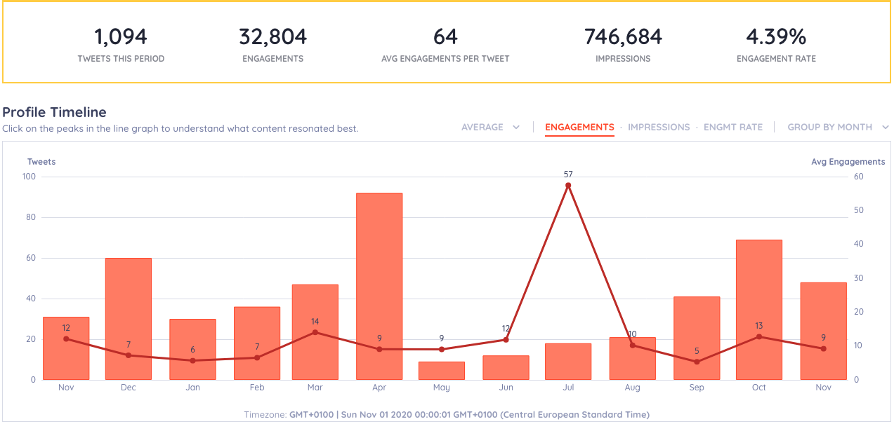
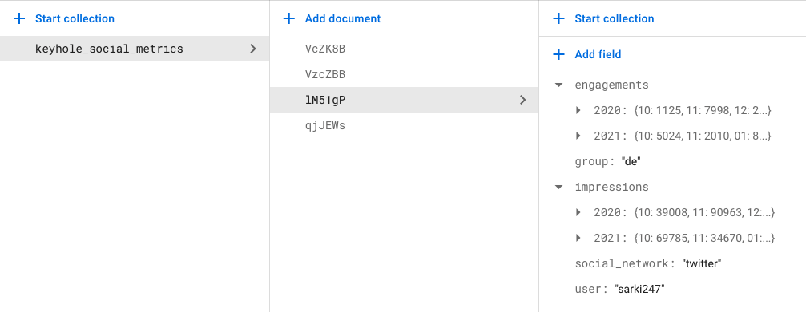
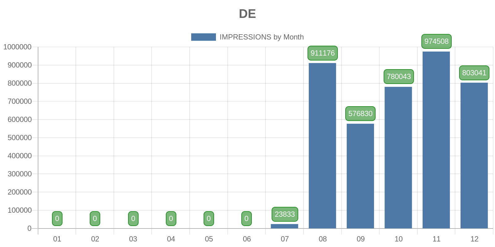

## On this page
{:.no_toc .hidden-md .hidden-lg}

- TOC
{:toc .hidden-md .hidden-lg}


## KeyHole

[KeyHole](https://keyhole.co/) is a social media data reporting platform that measures realtime and historical data in an easy to use format using graphs, tables and various forms of aggregation. Features of KeyHole include:

- Influencer Tracking
- Social Media Account Monitoring
- Hashtag Analytics
- Publishing & Scheduling
- Social Media Reporting
- Hashtag Tracking
- Keyword Tracking
- Twitter Historical Data
- Social Media Analytics API

The key use-cases of KeyHole are:
- Social Listening & Analytics
- Influencer Marketing
- Campaign Tracking

Learn more in this video:

<iframe width="640" height="360" src="https://www.youtube.com/embed/kcl8oB0416M" title="YouTube video player" frameborder="0" allow="accelerometer; autoplay; clipboard-write; encrypted-media; gyroscope; picture-in-picture" allowfullscreen></iframe>


## Who can use KeyHole

The owner of the KeyHole account is the [MarketingOps team](/handbook/marketing/marketing-operations/), the team manages subscription while adding administrators from the different teams that use the account. 

There are 2 types of user representation on KeyHole, a user and a profile:

- **User**: An account with login credentials who can access the KeyHole platform at different levels of permissions. We can create unlimited users. A user might be someone who wants to add/invite  profiles to track or just wants to access the data for reporting. The available levels of permissions aside Owner are Admin, Editor and Viewer.
  - Admin: You have access to everything and you can manage other users.
  - Editor: You can manage profiles and campaigns or use the social publishing features.
  - Viewer: You can view reports of trackers.
- **Profile/Influencer**: A profile is a social media account that is tracked without authentication, allowing KeyHole to access publicly available information, while an influencer is an authenticated profile, where the account owner has opted-in to be tracked and KeyHole will have access to the account's impressions.  **We only have access to 23 profiles and 50 influencers** in the current plan we are subscribed to. **Team members who consent to use KeyHole understand that these metrics are used only to measure team results and that they can opt out at any time.**

The KeyHole platform is currently used by the Developer Evangelism, Education and All-Remote teams. 

### Access Request

Access is provisioned by Marketing Ops. If you need access, please open an access request and assign to the tool owner. See more details on how to do so [here](https://about.gitlab.com/handbook/business-technology/team-member-enablement/onboarding-access-requests/access-requests/).

## Data collected with KeyHole



KeyHole gathers impressions & engagements data from your account. It also analyses your posts to give the following reports among others:

- Follower list, growth & insights
- Most frquent post and media types
- Optimization suggestions
- Mentions

Once a tracker is created for a profile or a campaign, Keyhole can backfill data for up to a year. Also, KeyHole only keeps 1 year worth of data at a time.

## How to add a new user to KeyHole

Account owner and administrators on a KeyHole account can add new users as follows:

- Click on your email at the top right corner of the browser window
- Click on "Add user" and click on the "Add New User" button on the Manager Users page
- Type in the email of the user and select a role for the user
- The new user will need to accept the invite and setup their account

## How to add a Social Media Account Tracker on KeyHole

There are 2 ways to add a tracker, as a profile under profile analytics or an influencer on Influencer management.

### Profile: 

A Profile can be a social media account of a user or an external account like a competitor. However, only publicly available data are available for external accounts. Here is a video showing how to add a profile:

<iframe width="640" height="360" src="https://www.youtube.com/embed/CMNi6iCl9PI" title="YouTube video player" frameborder="0" allow="accelerometer; autoplay; clipboard-write; encrypted-media; gyroscope; picture-in-picture" allowfullscreen></iframe>

### Influencer 

An influencer in this case is an authenticated profile i.e. a social media account that was added but also authenticated by the owner so data that are not publicly available like impressions can be accessed by KeyHole. **This is the preferred way to add GitLab team members.** You can add influencers as shown in the video below from KeyHole.


<iframe width="640" height="360" src="https://www.youtube.com/embed/DDeFGn3m5RM" title="YouTube video player" frameborder="0" allow="accelerometer; autoplay; clipboard-write; encrypted-media; gyroscope; picture-in-picture" allowfullscreen></iframe>

## KeyHole Reporting instrumentation

To make it easier for Sisense and other reporting tools to access the data collected by KeyHole, the Developer Evangelism team has created some instrumentation to pull, aggregate, store and make easily available the data from KeyHole. KeyHole only keeps 1 year worth of historical data, to avoid loss of data in the long term, monthly data is aggregated and stored in a Firebase collection located in the `group-community` project on Google Cloud.

The [DE-Bot](https://gitlab.com/gitlab-com/marketing/corporate_marketing/developer-evangelism/code/de-bot) collects data from Keyhole everyday, aggregates it into monthly impressions and engagements for each profile tracker created on KeyHole. This data is stored in Google Cloud Data Store using Firebase. A [cloud function](https://gitlab.com/gitlab-com/marketing/corporate_marketing/developer-evangelism/code/keyhole-api-function) has also been created using Firebase to make this data available as a JSON resource or a Chart Image for display directly on the handbook.

### Updating fields for new profiles in Cloud Data Store



As shown above, the DE-Bot stores data in the `keyhole_social_metrics` collection with the KeyHole tracker ID used as the document ID for each profile. The data for each profile is organized by the DE-Bot automatically in the format: `engagements/impressions > year > monthly data`. The fields `user, group and social_network` will need to be filled by the DE-Bot DRI, who at the moment is [Abubakar Ango](https://gitlab.com/abaungo), or any other member of the Developer Evangelism team. The `user` and `group` fields are necessary to access the data using the cloud functions API.


## Integrating KeyHole data to Sisense or other platforms

The [CloudFunction API](https://gitlab.com/gitlab-com/marketing/corporate_marketing/developer-evangelism/code/keyhole-api-function) for integrating the data with Sisense of displaying charts anywhere is accessible at `https://europe-west1-group-community-a29572.cloudfunctions.net/getKeyHoleData` with the following fields as URL parameters:


| Parameter | Supported Values    | Description         |
|-----------|---------------------|---------------------|
| grouping  | `user` or `group`   | This tells the API whose data you need to access, when a group is selected is adds up the data of each user in teh group |
| grouping_data | E.g. `de` or `sarki247` | This is the value in the group or user fields as specified in the Data store collections |
| datatype | `impressions` or `engagements` | This specifies if you want to the impressions or engagaement data |
| year | `2021` | This is the year you want data for |
| month | `all` or `01..12` | This is the month your want data for. All single digital months should start with a `0`. Specify `all` if you want data for all avialable months in the year |
| network | `twitter` | Only Twitter is supported at the moment, but if we ever collect data from other platforms, then we specify as defined in the database. |
| response_type | `json` or `chart` | You can specify if you want a JSON response or a Chart image |
| chart_type | `bar, pie, etc.` | You can specify what type of chart you want, this is only used is `chart` is specified as the response_type.

An example full URL is `https://europe-west1-group-community-a29572.cloudfunctions.net/getKeyHoleData?grouping=group&grouping_data=de&datatype=impressions&year=2020&month=all&network=twitter&response_type=chart&chart_type=bar` which displays the image below:



And when `json` is requested, the following data is returned:

```
{"01":0,"02":0,"03":0,"04":0,"05":0,"06":0,"07":23833,"08":911176,"09":576830, "10":780043,"11":974508,"12":803041}
```

### Privacy Information

No personal data is returned in the response of the API, user Twitter handle is displayed at the top of charts when a specific user data is requested. Also, as mentioned earlier Team members who consent to use KeyHole understand, after they have been duly informed that these metrics are used only to measure team results and they can opt out at any time.
