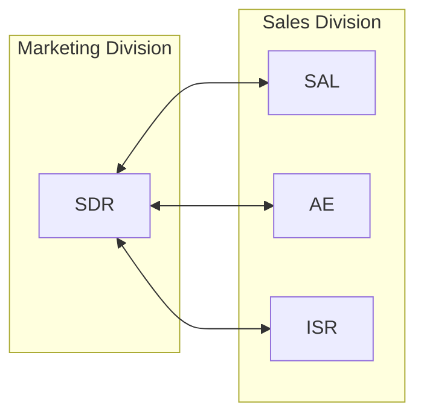

## On this page
{:.no_toc .hidden-md .hidden-lg}

- TOC
{:toc .hidden-md .hidden-lg}

## Purpose / Objective

The purpose of the **Global Sales-SDR Alignment Framework** is to provide an outbound guideline that helps identify goals, provide better alignment, and highlight expectations for the following roles:

1. Marketing: [Sales Development Representative](https://about.gitlab.com/job-families/marketing/sales-development-representative/) (SDR)
1. Sales: [Strategic Account Leader](https://about.gitlab.com/job-families/sales/strategic-account-leader/) (SAL)
1. Sales: [Account Executive](https://about.gitlab.com/job-families/sales/account-executive/) (AE)
1. Sales: [Inside Sales Representative](https://about.gitlab.com/job-families/sales/public-sector-inside-account-representative/) (ISR)

The alignment framework is designed to facilitate a successful relationship between SDRs and Sales ensuring both are properly positioned to achieve their goals.

Please see the [Sales Development](/handbook/marketing/sales-development/) Handbook Page and [Sales](/handbook/sales/) Handbook Page for additional details.

## Goals / Targets

### Criteria for Sales Accepted Opportunity

Note: see [GTM Resources](/handbook/sales/field-operations/gtm-resources/) for key Marketing and Sales terms, the Customer Lifcycle, and related Marketing & Sales activities.## SDR & Sales Alignment

The [Territories Mapping File](https://docs.google.com/spreadsheets/d/1gElhORjqraKDMQnWzApPelyP_vVa24tAOA85vb5f3Uc/edit?usp=drive_web&ouid=117649236165967789679) is the Single Source of Truth for ownership by segments, territories, and teams. All teams should use this SSOT to ensure alignment on who is responsible for what.

### Expectations and Strategic Processes

#### Weekly Outbound BDR-Sales Sync Meeting

This weekly meeting is critical to drive and ensure alignment between teams.
- Historically, our SDR/Sales pairings who have incorporated this meeting into their week have been the most successful at driving new pipeline.
- Agenda:
     1. Review accounts added to Actively Working status past week.
          - The field `Actively Working Start Date` can be used to sort reports.
     2. Ensure that there's alignment on messaging/prospecting customisation for new OB accounts.
          - The fields `Account Research` and `Account Strategy` fields are to be used.
     3. Review progress on accounts currently in pipeline.
          - The field `BDR Next Step Date` can be used to sort for action items.

##### 1:1 collateral

The resources below are meant to be cloned and customized, and to be used to structure OB collaboration in 1:1s. Accounts in the BDR organisation are prioritized based [on the guidelines here](https://docs.google.com/presentation/d/1O5unjpSTYQFENlfheUi6_ZNV2fbrIqQjxNBqtwhEaYw/edit#slide=id.g11de9359282_0_12) while [the handbook page here](https://about.gitlab.com/handbook/marketing/sales-development/#bdr-outbound-process) shares more detail in the BDR org's process.

1. [Queued Accounts Template](https://gitlab.my.salesforce.com/00O8X000008QoME) - This report will indicate the accounts that the AE/SAL has nominated for outbound efforts by switching the account's `BDR Prospecting Status = Queued`
2. [Actively Working Accounts Template](https://gitlab.my.salesforce.com/00O8X000008QoM4) - This report will indicate the accounts currently being worked on a BDR, and will include next step dates and relevant strategy fields. The logic behind using these fields in outlined [here](https://gitlab.com/gitlab-com/marketing/sdr/uploads/2fdadc1e76ddd57ceaac706362242b2d/Screenshot_2022-03-15_at_16.29.09.png), with a [practical example here](https://gitlab.com/gitlab-com/marketing/sdr/uploads/7759ffcea589453e562811f3d3c0fd8d/Screenshot_2022-03-15_at_1.35.05_PM.png)
3. [Closed:Lost Template](https://gitlab.my.salesforce.com/00O8X000008QoQk) - This report will indicate past Closed: Lost accounts in your territory, it can be expanded further by adjusting the Close Date field.
4. [CI Usage Template](https://gitlab.my.salesforce.com/00O8X000008QoMO) - This is the list of CE users with a high purchase rate of CI minutes.
5. [CE Users Template](https://gitlab.my.salesforce.com/00O8X000008QoQV) - This is a list of CE users per territory
6. In addition to the above, the BDR team has got access to DemandBase, the template list for which [may be found here](https://about.gitlab.com/handbook/marketing/sales-development/sdr-manager-resources/#actively-working-status-related-demandbase-reports)

### EMEA Mid-Market BDR to AE Outbound IQM Handoffs

The purpose of the BDR-AE outbound handoff process is three fold.

1. Ensure Outbound prospects get the best experience possible.
2. Ensure the BDR team enjoys operational efficiencies and have clearly structured ways to collaborate with the AE team on outbound accounts.
3. Ensure the AE team is set up for success is receiving outbound leads in a structured manner and have the appropriate information to utilize in converting them.

To make sure that the hand-offs maximize internal efficiencies, it is required that:
- The BDR team makes sure to book calls, with a minimum notice time of 48 business hours.
- The BDR team makes sure to properly fulfil Outbound SAO criteria, or work with AE to create a mutual command plan.
- The AE team makes sure to:
     - Accept SAOs within 8 working hours after an IQM call.
     - To leave a chatter note on the opportunity record, tagging BDR and AE manager with feedback on the level of qualification and handoff in case of discrepancies.
     - To be responsible for managing the prospect relationship after all handoff types have taken place. This includes re-scheduling conflicts.

### 1. BDR Qualified Meeting
- Are leads that have been qualified by the BDR over a Discovery call.
- CoM principles have been applied to the call and some of the Before/After Scenarios, Positive Business Outcomes, Requirements and Metrics have been identified and agreed upon between the prospect and the BDR.
- There is a clear need or intent identified from the side of the company, and the prospect has clearly articulated a path to the ultimate decision-maker, as per the guidelines for outbound [SAO criteria](https://docs.google.com/document/d/1m5YBOCc--M1Iq5-SEEd2OUWDjYyc6VJ3xTsDEEqisUQ/edit)

#### BDR steps after discovery call

- Summarize CoM principles uncovered during the call
- Schedule next step [through Outreach](https://app1a.outreach.io/meetings) while being on the call with the prospect
    - Meeting Type should be 45’ Evaluation Orchestration Call and body of invitation should be adjusted to meet the prospect’s needs.
- Send [AE Intro Email](https://app1a.outreach.io/templates/50415)
    - For demanding hand-offs, [customer-facing](https://docs.google.com/document/d/1EpltUVDhIbgWLcGXD_ug8PkoPOSBxKkNiwpwy7irbsw/edit) agenda may also be copied and attached to intro email.
- Log Required SFDC fields and populate Notes field [as per the guidelines here](https://docs.google.com/document/d/1m5YBOCc--M1Iq5-SEEd2OUWDjYyc6VJ3xTsDEEqisUQ/edit)
- **Unless there's a scheduling conflict for the BDR**, attend Evaluation Orchestration Call and kick-off the call:
     - Summarize the BDR qualifying conversation by mentioning and verifying the before and after scenario of the prospect, as transcribed on the SAO notes.
     - After prospect acknowledges that their internal situation have not changes inbetween BDR and AE call, recap the expectations and metrics as transcribed on the SAO notes and handoff to AE to move forward.

### 2. Joint IQM
- Are meetings booked with leads that are from pre-agreed upon Actively Working Acounts.
- Calls scheduled for these prospects will be taken as a joint IQM with both BDR and AE attending, and leading the qualification.
- CoM principles will be applied during the call, with the goal of uncovering a clear need and path to the ultimate decision-maker, as per the guidelines for outbound [SAO criteria](https://docs.google.com/document/d/1m5YBOCc--M1Iq5-SEEd2OUWDjYyc6VJ3xTsDEEqisUQ/edit)

#### BDR steps before discovery call

- Schedule next step [through Outreach](https://app1a.outreach.io/meetings) while being on the call with the prospect, and schedule straight to the AEs calendar.
    - Meeting Type should be 15’ Discovery Call.
- Create SFDC opportunity, and log any pre-determined or relevant information from your past reseearch.
- Communicate with AE, and create a mutual [command plan](https://docs.google.com/document/d/1uTHRRUQx4IP_dXUnsrfG2x9Ti-XpMneX3IDu2v0TZtY/edit) for the call.
     - When kicking off the call, summarize the BDR research and reason for reaching out, such compelling events, Persons with LIM, etc
     - After prospect acknowledges their compelling event and internal situation, discovery call continues with pre agreed upon structure with AE.

### Quarterly Business Reviews

It is highly encouraged for Sales to involve their SDR in QBR prep, planning as well as invite them to attend and speak during their presentation. SDR’s should carve out time to assist and contribute with Sales presentation slides.
