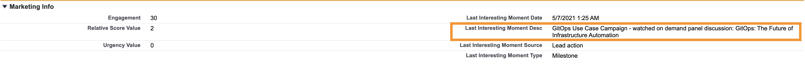
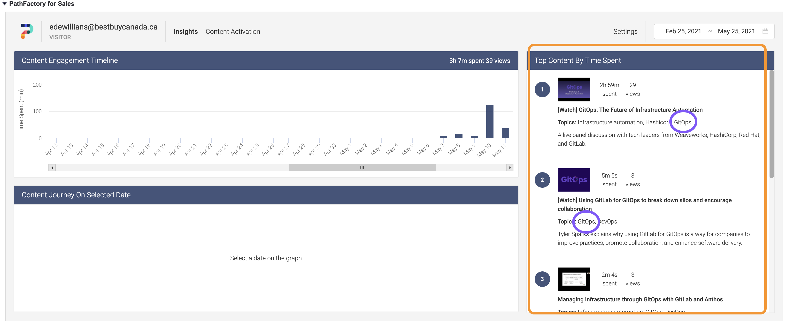

## Overview

### Why should you care about GitOps?

- The [GitOps Marketing campaign](https://gitlab.com/gitlab-com/marketing/demand-generation/campaigns/-/issues/1183) has produced the highest amount of linear SAOs across all segments since launch in April 2020
- Over 45% of our [survey respondents at Kubecon EU](https://gitlab.com/gitlab-com/marketing/corporate_marketing/corporate-marketing/-/issues/4792) highlighted that GitOps is a priority for their organization in the short term.
- The interest in GitOps topics was so HIGH that CD Conference (by CNCF) had to spin up a separate [GitOps Conference](https://hopin.com/events/gitops-con) 
- GitOps helps you target a completely new persona and usecase - opening up [new land and expand opportunities](https://gitlab.com/gitlab-com/marketing/demand-generation/campaigns/-/issues/1183#sample-deals-from-fy21) for you

### What is GitOps?

If the above has gotten you excited, learn more [here](https://docs.google.com/presentation/d/1o728pUdk1rrNqWAZpzZVdfZ3gzADvTXSssVzqL-6WB4/edit#slide=id.g8d846209b0_25_172) about GitOps, why it's important for your customers and how we are different.

Simply said - GitOps takes DevOps best practices used for application development such as version control, collaboration, compliance, and CI/CD, and applies them to infrastructure automation.

### Sales play objectives  

* Landing new deals with a new persona and usecases
* Expanding existing customers to new teams and usecases

## Navigating through this salesplay

**Hint**: Click on the box to go directly to the relevant section

graph TB
  Z1[Getting Started] -.- A1[Who to meet]
  A1 -.- B1[Keywords to listen for]
  B1 -.- C1[How to identify interest]
  click Z1 "./#getting-started"
  click A1 "./#who-to-meet"
  click B1 "./#keywords"
  click C1 "./#identify-interest"

  Z2[Value Discovery] -.- A2[Common pain]
  A2 -.- B2[Common benefits]
  B2 -.- C2[Required capabilities]
  C2 -.- D2[Positioning value]
  click Z2 "./value-discovery"
  click A2 "./#common-pains"
  click B2 "./#common-benefits"
  click C2 "./#required-capabilities"
  click D2 "./#positioning-value"

  Z3[Sales Tactics] -.- A3[SALs / AEs] 
  A3 -.- B3[SAs / CSMs]
  B3 -.- C3[SDRs]
  click Z3 "./#sales-tactics"
  click A3 "./#sals-aes" 
  click B3 "./#sas-tams" 
  click C3 "./#sdrs" 

  Z4[Resources] -.- A4[Email Templates]
  A4 -.- B4[Customer Stories]
  B4 -.- C4[Identifying lead interest]
  C4 -.- D4[All collaterals]
  D4 -.- E4[Services]
  click Z4 "./#resources"
  click A4 "./#email-templates" 
  click B4 "./#customer-stories" 
  click C4 "./#lim-anchor" 
  click D4 "./#resources-list" 
  click E4 "./#services" 

  classDef orange fill:#fca121,stroke:#333,stroke-width:1px;
  class Z1 orange
  class Z2 orange
  class Z3 orange
  class Z4 orange
  

## Getting Started {#getting-started}

### Who to meet  {#who-to-meet}
{: .alert .alert-gitlab-orange}

The persona interested in GitOps is in general different from your development or engineering organizations. They are most often from the operations, systems, infrastructure, platform and cloud side of the organization. 

| | Typical Roles | Typical Titles |
| - | ----------- | -------------- |
| **Economic Buyer** | Director/VP/CIO of IT, Head of IT Infrastructure / Platform Engineering / Operations | SVP of Technology Operations, Sr. Manager Systems Engineering, Cloud Architect, Information Systems Architect |
| **User** | SRE, Infra Engineer, Sys Admin, Platform Engineer - have to execute frequent repetitive tasks to support dynamically changing elastic environments | DevOps engineer, Architect, Team Lead, DevOps Ninja |

More details [here](https://about.gitlab.com/handbook/marketing/brand-and-product-marketing/product-and-solution-marketing/usecase-gtm/gitops/#personas)

### Keywords to listen for  {#keywords}
{: .alert .alert-gitlab-orange}

| Infrastructure as code | GitOps | Infrastructure automation |
| Configuration as code | Policy as code | Approvals for infrastructure changes |
| Terraform | Ansible | AWS Cloud formation |
| Weaveworks Flux | Argo CD | Terraform Cloud |

#### How to identify interest based on activity {#identify-interest}

Customers engage with our content from our website, collaterals, videos and campaigns. We can identify a customer's interest levels based on their latest activity - which you can see on SFDC.

1. [Identify the Last Interesting moment](#lim-anchor)
1. [Identify the topics in the Top consumed content and time spent on it](#lim-anchor)

If both of these include GitOps keywords or GitOps topics - ensure to have the GitOps conversation. 

#### Targeted leads are waiting for attention

Marketing is running a related demand gen campaign.  

* A Demand Generation campaign is running across different channels (LinkedIn, Facebook, Google Search...) surfacing new leads from the Focus Account Lists, ICP Total Addressable Market, and Volume accounts. See the flow of the Marketing campaign [here](https://app.mural.co/t/gitlab2474/m/gitlab2474/1620648875422/b0575eec3f6839f6fd9672f34dfb5ca022b422f3?sender=epan1035) 
* A series of virtual events are scheduled throughout FY22, targeting new and existing Inquiries. Schedule of upcoming Infrastructure Automation/GitOps GTM related virtual events can be found in the [FY22 All-Marketing Calendar SSoT](https://docs.google.com/spreadsheets/d/1c2V3Aj1l_UT5hEb54nczzinGUxtxswZBhZV8r9eErqM/edit#gid=571560493&fvid=1570851636)

### Value discovery {#value-discovery}
{: .alert .alert-gitlab-orange}

### Common Pains  {#common-pains}

| Challenges "before scenarios" | So What? "negative consequences" |
| ----------------------------- | -------------------------------- |
| - How does your infrastructure team manage configurations, policies, variables etc consistently across your infrastructure? | No consistency, no knowledge sharing, no version control, click ops |
| - Are you able to ensure that changes are reviewed and approved by the right individuals - to ensure minimal disruption to your staging / production environments? | Higher risk as unauthorized changes can be shipped to production - causing performance issues / downtime, high skilled / highly paid resources may be doing menial tasks |
| - Is your infrastructure team able to consistently repeat the steps to setup an environment every single time? | No standardization, manual process - more error prone |

More questions [here](https://about.gitlab.com/handbook/marketing/brand-and-product-marketing/product-and-solution-marketing/usecase-gtm/gitops/#discovery-questions)

### Common benefits  {#common-benefits}

| Desired Future State (“After Scenarios”) | So What? (“Positive Business Outcomes”) |
| ----------------------------- | -------------------------------- |
| More automation | Less risk as manual repetitive tasks are error prone |
| Faster mean time to repair | Can be rolled back rapidly to a working definition of the infrastructure rather than troubleshooting before roll-back - resulting in faster time to repair |
| Faster time to value | Move from manual Click ops to GitOps to deploy more often |
| Compliant | Compliance is automated as every change is tracked |
| Reduced security exposure | All changes can be reviewed and approved, security for infrastructure code can be embedded within the pipeline |

### Required capabilities  {#required-capabilities}

'GitOps = Infrastructure as Code + Merge Request + CI/CD'

| Required capability	 | Customer Metrics |
| ----------------------------- | -------------------------------- |
| Version control for infrastructure code | Improved time to value - less manual, less error prone, more automated |
| Change control and collaboration for infrastructure | Lower change failure rate - more controls, more reviews and approvals |
| Compliance & Auditing | Lesser time spent in auditing, fewer compliance issues |
| CI/CD - test automation, pipeline configuration management | Higher deployment frequency - more automation |
| Rollback |  Lower mean time to repair - can roll back to working definition of infra before troubleshooting |

## Positioning value  {#positioning-value}
{: .alert .alert-gitlab-orange}

### Elevator pitch

Have you faced infrastructure downtime and have not been able to trace it back to who made the changes, what changes were made and who approved it? Infrastructure automation with GitLab helps you bring Application DevOps best practices of collaboration, version control, CI/CD & Compliance to Infrastructure.

### Value Proposition (How GitLab does it?)

Unlike other vendors, GitOps with GitLab helps you manage physical, virtual and cloud native infrastructures. We use a tight integration with industry-leading infrastructure automation tools like Terraform, AWS Cloud Formation, and the like to meet you where you are - all with a single application.

Detailed section on How GitLab meets the market requirements [here](https://about.gitlab.com/handbook/marketing/brand-and-product-marketing/product-and-solution-marketing/usecase-gtm/gitops/#market-requirements)

### Differentiators (How GitLab does it better?)

- Most competitive solutions require 5-6 integrations to achieve the GitOps workflow. GitLab offers version control, CI/CD and container registry & out of the box integration for config management, orchestration & infra provisioning.
- Better traceability across the workflow - GitLab can tie an infrastructure deployment all the way back to the change that was made - which is difficult in a workflow that is tied together with multiple solutions.
- Most competitors support predominantly cloud native - GitLab meets customers where they are supporting On-premise & cloud, physical, virtual, cloud native infrastructures
- Agent-based and Agentless approach - giving customers a choice to pick the right approach for their environments

More details [here](https://about.gitlab.com/handbook/marketing/brand-and-product-marketing/product-and-solution-marketing/usecase-gtm/gitops/#top-3-differentiators)

### Competitors
Primary competitors: Flux (Weaveworks), Argo CD, Terraform Cloud
Secondary competitors: Codefresh, Transposit, Red Hat/IBM

Detailed competitive against primary competitors [here](https://about.gitlab.com/handbook/marketing/brand-and-product-marketing/product-and-solution-marketing/usecase-gtm/gitops/#competitive-comparison)

### Handling Objections

Typical questions:
- I don't use Kubernetes, so GitOps is not relevant for me
- Our environment is too complex for GitOps
- GitOps gives more access to developers to fiddle with deployments, and infra teams are not comfortable with that
- (Infra / DevOps Engineer) I'm going to lose control over my work and environment

Detailed list of Q&A [here](https://about.gitlab.com/handbook/marketing/brand-and-product-marketing/product-and-solution-marketing/usecase-gtm/gitops/#objection-handling)

## Sales Play Tactics {#sales-tactics}
{: .alert .alert-gitlab-orange}

### SALs and AEs  {#sals-aes}

How to identify if you need to lead with a GitOps conversation?

#### Before discovery
1. Familiarize yourself with the GitOps sales play above - at a minimum watch the enablement video.
1. Ensure you are talking to the right persona - typically this is not a developer, could be a team lead, system architect, cloud architect -> from the infrastructure / operations side of the house.
1. Identify if the last interesting moment on 'Pathfactory for Sales' on SFDC is related to GitOps (use the keywords to determine this)
1. Identify the top content viewed by customer on 'Pathfactory for Sales' on SFDC is related to a GitOps topic

#### During discovery
1. Use the keywords listed above to identify if a lead is interested in a GitOps conversation
1. Familiarize yourself with the top discovery questions, objection handling and differentiators for GitOps. **Note it is very different form other conversations - as the persona we talk to is different**
1. Ensure you are able to identify business objectives and priorities during discovery. These could be one or more of the following:
  - Infrastructure automation
  - Managing cloud native environments
  - Multi cloud / kubernetes adoption
  - Compliance related to infrastructure  
1. After your call, consider emailing your customer using one or more of these [email templates](https://docs.google.com/document/d/1uvZPw39OAExz7sIivIlPi3jNlUXKodVNy0mmIb-X0Cs/edit#) custom made for GitOps conversations. Feel free to update the call to action to any of the artifacts from the [Pathfactory track for GitOps](https://learn.gitlab.com/l/gitops-gtm-content)

#### During evaluation
1. Share GitOps related [customer references](#customer-stories)
1. Share technical demos, webinars that are path of the [pathfactory track for GitOps](https://learn.gitlab.com/l/gitops-gtm-content)
1. Share [Gartner Peer Insights](https://about.gitlab.com/handbook/marketing/brand-and-product-marketing/product-and-solution-marketing/usecase-gtm/gitops/#gartner-peer-insights)
1. Work with your SA to showcase a technical demo of GitOps
1. After your call, consider emailing your customer the [GitOps Demo email template](https://docs.google.com/document/d/1uvZPw39OAExz7sIivIlPi3jNlUXKodVNy0mmIb-X0Cs/edit#) custom made for GitOps conversations.

#### During negotiation / decision making
1. [Show how we are different](#differentiators-how-gitlab-does-it-better)
1. Share the Forrester TEI report from the [pathfactory track for GitOps](https://learn.gitlab.com/l/gitops-gtm-content)
1. Use the [ROI calculator](https://about.gitlab.com/calculator/) to showcase the value of using GitLab as a single application over other solutions

### SA  {#sas-tams}

How to identify if you need to have to lead with a GitOps conversation?

#### Before discovery
1. Familiarize yourself with the GitOps sales play above - at a minimum watch the enablement video.
1. Ensure you are going to meet with one of the right [user personas](#who-to-meet).
1. Familiarize yourself with the top discovery questions, objection handling and differentiators for GitOps.

#### During discovery
1. Ask the [discovery questions](#value-discovery). Listen to the customer and understand their pains and challenges.
1. As you hear their pains, challenges, business objectives and priorities, start using their own terms when explaining to them how GitOps with GitLab can help them.
1. Understand their technical requirements. For example, look to get answers to the following technical discovery questions:
  - Do their applications require a hybrid cloud infrastructure or multi-cloud?
  - Do they have any hard-dependencies on any infrastructure-as-code tool? e.g. Terraform, Ansible, etc.
  - Do they need GitOps for K8s, non-K8s or both?
  - In the case of K8s, are their clusters available outside their firewall?
1. Be prepared to do some competitive [objection handling](#handling-objections)

#### During evaluation
1. Prepare your own GitOps environment for demo purposes by following the steps from the [GitOps lab](https://gitlab.com/tech-marketing/workshops/cicd/cd-labs-instructions/-/blob/master/11.%20GitOps%20with%20GitLab.md) of the SA CD Workshop. This lab covers AWS as a cloud provider. If you'd like to add Google and/or Azure, you can extend your environment by leveraring our public-facing [GitOps demo](https://gitlab.com/gitops-demo).
1. Share technical demos, webinars that are path of the [pathfactory track for GitOps](https://learn.gitlab.com/l/gitops-gtm-content)
1. If the customer requires you participate in a PoV, gather the PoV requirements and prepare to execute the PoV. Some helpful resources to help you prepare are:
  - #gitops slack channel
  - #s_configure slack channel
  - GitOps Engineering
  - GitOps TMM
  - GitOps PM

### SDR  {#sdrs}

How to identify if you need to have a GitOps conversation with a lead?

#### Before your outreach / conversation
1. Identify where the lead is from -> See if the lead is from a GitOps campaign which has been generating  targeted leads for GitOps
1. Identify if the last interesting moment on 'Pathfactory for Sales' on SFDC is related to GitOps (use the keywords to determine this)
1. Identify the top content viewed by customer on 'Pathfactory for Sales' on SFDC is related to a GitOps topic
1. Use the keywords listed above to identify if a lead is interested in a GitOps conversation
1. Ensure you are talking to the [right persona](#who-to-meet) - typically this is not a developer, could be a team lead, system architect, cloud architect -> from the infrastructure / operations side of the house.
1. Ensure you are familiar with the top discovery questions, objection handling and differentiators for GitOps. **Note it is very different form other conversations - as the persona we talk to is different**

#### Customer outreach / conversation
1. There are a number of high performing outreach sequences available - use one that is already available and customize as required
1. Use the SDR Call Script for [Land](https://docs.google.com/document/d/1MDeaKj4XHEQe73jqDWClNJBKXr61gsZu7qNzHiD4138/edit) / [Expand](https://docs.google.com/document/d/1am53Ijr3EFuoZWwQPxsXAXGIhSOBJ7hQeFQv4-5QVyo/edit) 
1. Use the content from the [GitOps Pathfactory track](https://learn.gitlab.com/l/gitops-gtm-content) to share with your lead. You can get the content links (including tracking) directly from Pathfactory for Sales through SFDC. They are categorized by the stage in the customer's journey. 

## Resources {#resources}

### Recommended Email templates {#email-templates}
{: .alert .alert-gitlab-orange}

Here are a few recommended email templates you can use based on the stage of the customers journey.

- Awareness: [Here’s how infra teams can move at the pace of development](https://docs.google.com/document/d/1uvZPw39OAExz7sIivIlPi3jNlUXKodVNy0mmIb-X0Cs/edit#heading=h.tvxw4uololys)
- Consideration: [Achieve multi-cloud multi-k8s deployments with GitOps](https://docs.google.com/document/d/1uvZPw39OAExz7sIivIlPi3jNlUXKodVNy0mmIb-X0Cs/edit#heading=h.qb2mme6e6mph)
- Decision/Purchase: [Learn how Kiwi.com deploys infrastructure and application within 3 minutes!](https://docs.google.com/document/d/1uvZPw39OAExz7sIivIlPi3jNlUXKodVNy0mmIb-X0Cs/edit#heading=h.6fvbsmo2n7go)
- Technical Demo: [Here’s how your team can automate infrastructure deployments](https://docs.google.com/document/d/1uvZPw39OAExz7sIivIlPi3jNlUXKodVNy0mmIb-X0Cs/edit#heading=h.zedoh58debpr)

### Services {#services}

GitLab Professional Services help customers become efficient in GitLab quickly. GitLab (or a GitLab partner) offers a number of service offerings to support customers. 

For the GitOps sales play, consider asking your customer about their workforce's proficiency with git, GitLab, and GitLab CI as they are foundational elements to GitOps. If they are not strong in all of these topics, consider positioning [GitLab with git Basics training](https://about.gitlab.com/services/education/gitlab-basics/) and/or [GitLab CI/CD training](https://about.gitlab.com/services/education/gitlab-ci/). 

Advisory/Consulting services to help with GitOps rollout are planned to be rolled out later this year. Please register your interest for a GitOps Advisory offering [here](https://gitlab.com/gitlab-com/customer-success/professional-services-group/ps-leadership-team/ps-practice-management/-/issues/74) to help PS effectively prioritize!

As you position services, you can use our [Services Pitch Deck](https://docs.google.com/presentation/d/1CFR8_ZyE9r4Dk_mjoWGe4ZkhtBimSdN0pylIPu-NAeU/edit#slide=id.g2823c3f9ca_0_9) to help establsh the value of engaging with PS. Other services can be found in our [Complete list of professional service offerings](https://about.gitlab.com/services/)

Talk with @em in the [professional services slack channel](/handbook/customer-success/professional-services-engineering/working-with/#slack) to learn more. 

### Webinars, e-books, whitepapers, videos  {#resources-list}
- [Pathfactory track for GitOps](https://learn.gitlab.com/l/gitops-gtm-content) to share with customers
- Complete list of presentations, web pages, whitepapers, blogs and videos available [here](https://about.gitlab.com/handbook/marketing/brand-and-product-marketing/product-and-solution-marketing/usecase-gtm/gitops/#resources).
- GitOps [Enablement presentation](https://docs.google.com/presentation/d/1o728pUdk1rrNqWAZpzZVdfZ3gzADvTXSssVzqL-6WB4/edit#slide=id.g8d846209b0_25_172)

### Customer Stories  {#customer-stories}

- [BI Worldwide](https://learn.gitlab.com/gitops-gtm-all/bi-worldwide-gitlab?lx=AZeFEd)
- [Wag](https://learn.gitlab.com/gitops-gtm-all/wag-labs-blog-post?lx=AZeFEd)
- [Nebulaworks](https://learn.gitlab.com/gitops-gtm-all/nebulaworks?lx=AZeFEd)
- [SURF](https://learn.gitlab.com/gitops-gtm-all/surf?lx=AZeFEd)
- [kiwi.com](https://learn.gitlab.com/gitops-gtm-all/flying-base-native-clouds?lx=AZeFEd)
- [VMware](https://learn.gitlab.com/gitops-gtm-all/infrastructure-code-iac-terraform-cloud?lx=AZeFEd)
- [ValidaTek](https://learn.gitlab.com/gitops-gtm-all/valida-tek-iac?lx=AZeFEd)
And many more [here](https://learn.gitlab.com/l/gitops-gtm-content) 

- [Gartner Peer Insights](https://about.gitlab.com/handbook/marketing/brand-and-product-marketing/product-and-solution-marketing/usecase-gtm/gitops/#gartner-peer-insights)

### Finding Last interesting moment and most viewed content on SFDC {#lim-anchor}

- Last interesting moment is in the Marketing info section of SFDC

- Top content consumed by time - is in the Pathfactory for sales section of SFDC

