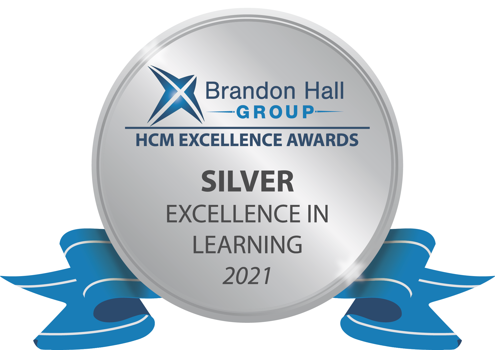

## On this page
{:.no_toc .hidden-md .hidden-lg}

- TOC
{:toc .hidden-md .hidden-lg}

## Overview

<iframe frameborder="0" width="500" height="350" style="position: absolute; top: 0; left: 0; width: 100%; height: 100%;" src="https://view.genial.ly/62fe8a909b925c0018b5de80" type="text/html" allowscriptaccess="always" allowfullscreen="true" scrolling="yes" allownetworking="all"></iframe> 
 

### Purpose

_Why we exist:_ L&D is here to guide team members on their career journey. We strive to foster a culture of learning and development so that GitLab remains a great place to work. When our team members can do their jobs, our customers are happy as a result. This makes everyone at Gitlab happy! 

### Vision 

_Where are we going:_ GitLab seeks to be recognized as a top organization for remote learning & development. We aim for a future where **everyone contributes** to a culture of curiosity. 

### Mission

_What we do:_ We empower individual contributors and equip leaders through self-service learning. We accomplish a culture of development by: 

- Focusing on skill-based learning 
- Providing resources to improve career mobility 
- Developing learning journeys for teams throughout the organization

### Objectives

_Performance indicators_ 

1. Reduce voluntary attrition by 5% each year by measuring [exit survey data](/handbook/people-group/offboarding/#exit-survey) related to career development
2. Secure a 5% increase in the Growth & Development category of the [annual engagement survey](/handbook/people-group/engagement/)
3. Increased access to career mobility: internal transfers, [promotions](/handbook/people-group/promotions-transfers/), job shadows, intern for learning, and professional development
4. Clear evidence of best in class remote learning & development (i.e. [Brandon Hall Awards](https://www.brandonhall.com/excellenceawards/index.html), Industry Speaking Events, Thought Leadership articles, etc.)

### Principles

1. **Meaningful and relevant content.** We deliver learning solutions that help you reach your professional goals.
1. **Values aligned.** Our learning solutions reinforce GitLab’s [values](/handbook/values/) and foster continuous learning and curiosity.
1. **Diverse approaches to learning.** We apply a blended learning model to find solutions to various individual needs.
1. **Community.** L&D offerings available to the public so that everyone can contribute.

## Team Member Resources

The Learning & Development team has a number of resources to help team members learn new skills. Click the buttons below to learn more about each one:

  

    <a href="/handbook/people-group/learning-and-development/manager-development/" class="btn btn-purple" style="width:200px;margin:5px;">Transitioning to a Manager Role</a>
    <a href="/handbook/total-rewards/benefits/general-and-entity-benefits/growth-and-development/" class="btn btn-purple" style="width:200px;margin:5px;">Growth & Development Benefit</a>
    <a href="/handbook/people-group/learning-and-development/career-development/" class="btn btn-purple" style="width:200px;margin:5px;">Career Development & Mobility</a>
  

  

    <a href="/handbook/people-group/learning-and-development/manager-challenge/leadership-chats/" class="btn btn-purple" style="width:200px;margin:5px;">Leadership Chats</a>
    <a href="/handbook/people-group/learning-and-development/learning-initiatives/" class="btn btn-purple" style="width:200px;margin:5px;">Learning Initiatives</a>
    <a href="/handbook/people-group/learning-and-development/self-paced-learning/" class="btn btn-purple" style="width:200px;margin:5px;">Self Paced Learning</a>
  

  

    <a href="/handbook/people-group/learning-and-development/level-up/" class="btn btn-purple" style="width:200px;margin:5px;">Level Up</a>
    <a href="/handbook/people-group/learning-and-development/linkedin-learning/" class="btn btn-purple" style="width:200px;margin:5px;">LinkedIn Learning</a>
    <a href="/handbook/people-group/learning-and-development/compliance-courses" class="btn btn-purple" style="width:200px;margin:5px;">Compliance Courses</a>
  

  

    <a href="/handbook/people-group/learning-and-development/mentor/" class="btn btn-purple" style="width:200px;margin:5px;">Mentorship</a>
    <a href="/handbook/leadership/coaching/" class="btn btn-purple" style="width:200px;margin:5px;">Coaching</a>
    <a href="/handbook/people-group/learning-and-development/learning-initiatives/slack-training/" class="btn btn-purple" style="width:200px;margin:5px;">Slack Training</a>
  

  

    <a href="/handbook/sales/field-manager-development/" class="btn btn-purple" style="width:200px;margin:5px;">Field Manager Development</a>
    <a href="/handbook/people-group/learning-and-development/learning-initiatives/speakers/" class="btn btn-purple" style="width:200px;margin:5px;">Learning Speaker Series</a>
    <a href="/handbook/people-group/learning-and-development/elevate/" class="btn btn-purple" style="width:200px;margin:5px;">Elevate Manager Training</a>
    
    
  

### What are we not responsible for?

1. Customer & Product Training
2. Designing, developing, and delivering comprehensive training to all team members

## GitLab Learning Strategy & Roadmap

<figure class="video_container">
<iframe src="https://docs.google.com/presentation/d/e/2PACX-1vS60qIAFhoF3saPi4642GBzYl8lP_DvOCNJc998r0oskitOkhadAHLHlRQxNg976H_LOrdg30HJ5eEG/embed?start=false&loop=false&delayms=3000" frameborder="0" width="960" height="569" allowfullscreen="true" mozallowfullscreen="true" webkitallowfullscreen="true"></iframe>
</figure>

**Learn more about our [FY23 Roadmap](https://docs.google.com/presentation/d/1ExMwnZA1zUphJdrdTKMLEFE7hmXh54Wt7JgQqhsemlk/edit#slide=id.g123a13deda8_0_405)**.

## Learning & Development Team

We are a small team, but we've got a big role to play at GitLab! 

* [Learning and Development Director](/job-families/people-group/learning-development/#learning--development-manager): [Satu Salminen](/company/team/#ssalminen)
* [Learning and Development Program Manager](https://about.gitlab.com/job-families/people-group/learning-development/#intermediate-learning--development-program-manager): [Jacie Bandur](/company/team/#jbandur)
* [Learning and Development Program Manager](https://about.gitlab.com/job-families/people-group/learning-development/#intermediate-learning--development-program-manager): [Samantha Lee](/company/team/#slee24)
* [Learning and Development Program Manager](https://about.gitlab.com/job-families/people-group/learning-development/#intermediate-learning--development-program-manager): [Jamie Allen](https://about.gitlab.com/company/team/#jallen16)
* [Learning and Development Program Manager](https://about.gitlab.com/job-families/people-group/learning-development/#intermediate-learning--development-program-manager): [Kalyani Yerraguntla](https://about.gitlab.com/company/team/#kyerraguntla) 

## Contact Us

1. Slack: `#learninganddevelopment`
1. Email Us: `learning@gitlab.com`
1. [Request support/Collaborate on new learning content](/handbook/people-group/learning-and-development/work-with-us)

### Work With Us

The [work with us](/handbook/people-group/learning-and-development/work-with-us) page outlines issue templates and processes that are managed on our [Learning and Development issue board](https://gitlab.com/gitlab-com/people-group/learning-and-development/-/issues). We review and classify requests based on the scalability and possible organizational impact. Learning solutions that can be applied and used company-wide take priority. Our process includes:

*  Evaluate the strategic impact of the learning session
*  Determine the level of work associated with the learning requirement
*  Assess the impacted audience groups of the session 
*  Identify measures of success 
*  Assess dates of delivery with the course schedule and forecast a future date

## How we work

### Handbook First Training Content

All material in the handbook is considered training and we build [handbook first learning content](/handbook/people-group/learning-and-development/interactive-learning). One of L&D's primary responsibilities is to ensure that content lives in the appropriate section in the handbook. In the below video, Sid, explains how the content of courses is not separated from the handbook to the L&D team. 

<figure class="video_container">
  <iframe width="560" height="315" src="https://www.youtube.com/embed/G57Wtt7M_no" frameborder="0" allow="accelerometer; autoplay; clipboard-write; encrypted-media; gyroscope; picture-in-picture" allowfullscreen></iframe>
</figure>

### Learning & Development Team Meetings

| Meeting Type | Cadence/Time | Description |
| ------ | ------ | ------ |
| 1:1 | Weekly meeting/40-45 minutes |   - 1:1 meeting between direct report and manager of L&D team.   - Topics covered include: task management, career development, performance management, blockers, project updates, brainstorming, coaching, etc.   - During the meeting, if their is an item that requires broader team collaboration it will be added to the bi-weekly team meeting. |
| L&D Team Meeting | Weekly meeting/40 minutes |   - Strategic items that have been brought up during 1:1 meetings that impact the team as a whole.   - The meetings will cover items that are strategic in nature that require discussion, brainstorming, collaboration, and synthesis with the team |
| L&D Quarterly Strategic Meeting | Quarterly/90 minutes to 2 hours |   - Review what was acheived in the quarter, what wasn't, and lessons learned   - Team members will present plans on what they are focused on for the next quarter   - Review team morale, team dynamics, learner satisfaction, long term impact, and alignment with Peope Group goals. |
 
### L&D team sprints

The L&D team uses GitLab issue boards to track priorities, organize collaboration, and set due dates based on three-week sprints.

* The L&D team uses [this sprint issue board](https://gitlab.com/groups/gitlab-com/people-group/learning-development/-/boards/1958538) to track priority issues each quarter.
* The `open` list is a queue for issues that need to be addressed, but have not yet been assigned to a sprint, backlog, or priority.
* When a new issue is opened, it should be moved to either the `ld-backlog` or `ld-fyxx-q1-priority` list. This will determine if the issue is a priority for the current quarter, or a backlog issue to be addresses as time allows.
* The team maintains three milestones, one for each upcoming sprint. The sprints are organized with a milestone using the naming mechanism `L&D Sprint # (Date Range)`
* Issues can be moved from the `ld-backlog` or `ld-fyxx-q1-priority` list to the correct sprint when they are ready to be assigned/addressed.
* When an issue is closed, it should remain in the given milestone.
* At the end of the sprint, the milestone can be removed from the board, or the milestone list can be hidden on the issue board.
* The `L&D Requests` list should be used to organize requests for L&D support or courses coming from other teams.
* The `advanced-software-engineering-course` list houses issues related to external software engineer courses can can be hidden on the sprint board.

Additional planning and notes around the sprint board can be found in [this issue.](https://gitlab.com/gitlab-com/people-group/learning-development/general/-/issues/111)

#### Best practices for using sprint boards and issues:

- Apply a burn-down chart with milestones to track time spent.
- Create the issue in the sprint where the work starts.
- When creating L&D content, apply one issue to one course when developing content. Maintain all course development material in the issue for organization. 
- Epics do not show up in the boards.
- Apply a Storyboard template for course development.
- Apply labels to manage different work and priorities (leadership requests, prioritized, p1-p3, triage, WIP, Backlog).
- Consider having GitLab team members vote on priority issues to determine need and interest in learning & development content.
- Stack rank issues in the board based on priority if possible.
- Use the Time Tracking feature on issues to track time spend. When opening a new issue, use the `/estimate` command to set an estimate for the project to be complete. After each working session, use the`/spend` command to track actual time spent.
- Consider using the `new-initiative` issue template when planning a new learning initiative, engagement program, or program idea.
- Consider using the `content-scoping` issue template when proposing a new pathway, creating a new course, or building any new learning experience.

### L&D handbook merge requests

If you want the wider L&D team to be aware of your MR, please apply the `ld-handbook-update` label to the MR. This will trigger a Zapier automation that posts the MR title and link to the #learning-team Slack channel.

### Tools

The L&D team freqently uses the following tools for creating and communicating learning opportunities at GitLab.

| Tool | Purpose |
| ----- | -------- |
| [Powtoon](https://www.powtoon.com/) | Video Creation |
| [LucidChart](https://www.lucidchart.com/) | Interactive Diagrams |
| [Loom](https://www.loom.com/home) | Screen recordings |
| [Canva](https://www.canva.com/) | Image and infographic creation |
| [Articulate/Rise 360](https://articulate.com/) | Course Authoring |
| [Genial.ly](https://app.genial.ly/dashboard) | Create Interactive Images |

## Developing Learning Content

### Top Five Training Content Development Principles

1. **Know Your Audience** - Analyze and assess the course audience. Ensure that all audience needs are accounted for at every level in the organization you are delivering the training too. 

2. **Define Learning Objectives** - Highlight the learner outcome. Consider developing two to three broad overall statements of what the audience will achieve. 

3. **Break Down Complex Information** - Consider breaking down complex information into easy to digest visuals or text. Reference the handbook but do not be afraid to create a visual representation or use storytelling for the audience.

4. **Engage the Learner** - Adults learn through practice and involvement. Consider using tools to engage learners in a virtual setting like [Mentimeter](https://www.mentimeter.com/) or [Kahoot](https://kahoot.com/business-u/) to stimulate interactivity.

5. **Implement Blended Learning Course Content** - Give the learners pre-course work to read and review before the learning session. Use off-the-shelf resources and ensure the content is applicable to what will be covered in the session. Follow up to gauge how they've applied what they've learned on the job through surveys and questionnaires. 

### Application of Adult Learning Theory

Adults learn differently in the workplace than in traditional learning environments or how they learned growing up. If you are developing training, consider applying principles related to Adult Learning Theories, those include: 

1. **Transformative learning:** Learning should change the individual through transformative learning approaches. Start with learning experiences that appeal to your specific audience, and then move to activities that challenge assumptions and points of view.   

2. **Self-directed learning:** Emphasize informal learning experiences. Infuse applications of pre-reads and post-course follow up. Have the participants bring up examples of self-directed learning that they have taken that is related to the training course. 

3. **Experiential learning:** Adults learn through experiences and by doing. When designing a learning experience, apply activities to stimulate learning by doing through role-playing, simulations, virtual labs, case studies, etc. 

4. **Andragogy:** Design learning experiences with the assumption that your participants will come to the table with their own set of life experiences and motivations. Adults tend to direct their own learning, learn better by doing, and want to quickly apply their learning to concrete situations. 

### Developing Learning Objectives

Add learning objectives to the beginning of the content to state a clear training outcome. A clear learning objective describes what the learner will do upon completion of a learning/training activity. Good learning objectives are what you want team members to learn or achieve. 

**Steps to creating learning objectives:** 
1. Identify the level of knowledge necessary to achieve the aim of the training. Use [Bloom's Taxonomy](https://tips.uark.edu/using-blooms-taxonomy/) to assist with writing practical learning objectives. 
2. Select an [action verb](https://www.bumc.bu.edu/cme/files/2012/07/13-Tips-for-writing-objectives.doc). 
3. Create your very own objective
4. Check your objective. Make sure it includes these four pieces: audience, behavior, condition, and degree of mastery
5. Repeat these steps for each objective

**Sample learning objectives:** 
- By the end of the session, team members will be able to describe the steps taken to address underperformance
- Team members will be able to apply the GROW coaching model framework to coaching sessions with members of their team 
- After learning about the high-performance team-building model, team members will be able to determine the steps needed to reach high performance.

### Instructional Design 101

The Learning & Development, [Field Enablement](/handbook/sales/field-operations/field-enablement/), and [Professional Services](/handbook/customer-success/professional-services-engineering/) teams hosted an Instructional Design 101 session on 2020-10-28 to better understand concepts of adult learning theory and instructional design. Check out the video to learn how to apply instructional design to learning content. 

<figure class="video_container">
<iframe width="560" height="315" src="https://www.youtube.com/embed/Be8oRHp0E84" frameborder="0" allow="accelerometer; autoplay; clipboard-write; encrypted-media; gyroscope; picture-in-picture" allowfullscreen></iframe>
</figure>

### Learning Components - Definitions

| Term | Definition | Duration |
| ------ | ------ | ------ |
| Training | The action of teaching a team member a particular skill or behavior | Varies |
| Bite-sized learning | A short course to learn a skill. Bite-sized can be a compentent of training or a separate learning element (i.e. a video, a PDF cheat-sheet, an infographic) | Max 15 minutes, 5 to 10 minute average |
| Self-paced course | Learner has the control over the amount of material they want to consume and the duration of time needed to learn the new information. | Pre-defined by the designer (i.e. hours, days, etc.) |
| Curriculum | A series of learning paths that comprise a course of study on a skill-based topic | Varies |
| Certification | A certification indicates that an individual community member has acquired the knowledge, skills, and abilities required to perform a specific skill or job. Certifications include an examination process. | Varies |
| Learning Path | A chosen route taken by a learner through a range of learning activities to build knowledge progressivley | Varies |

### Learning Delivery Methods - Definitions

| Term | Definition | Duration |
| ------ | ------ | ------ |
| Instructor-Led Training (ILT) | Practice of training and learning material between an instructor and learners. Face-to-face training (classroom training) | Varies |
| Virtual Instructor-Led Training (VILT) | Training that is delivered in a virtual enviornment (i.e. training in Zoom)| 1 to 3 hours |
| E-Learning | Learning based on traditional learning theories which takes place electronically, often via the Internet. | Varies |
| Blended Learning | Training that uses multiple methods to teach the new information to learners. It can includ ILTs, self-paced materials, VILT sessions, etc. | Varies |
| Webinar | A seminar conducted virtually to a large audience | 3+ hours | 
| Workshop | Hands-on or virtual demos, problem solving, tutorials where team members engage in discussion and activity on a particular subject | Varies |

Please let us know how you would prefer to learn by [filling out this form](https://forms.gle/Hafkqygy6LfJxWFw6)!

## Awards

### Brandon Hall Award

The launch of the GitLab Learn LXP was awarded a Silver Excellence in Learning by the [Brandon Hall Group](http://www.brandonhall.com/excellenceawards/) for the Best Launch of a Corporate Learning University. 

{: .shadow.medium.center}

