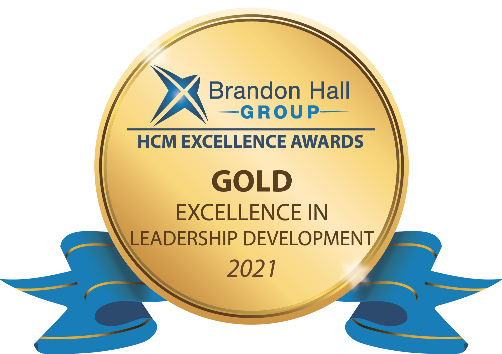

## On this page
{:.no_toc .hidden-md .hidden-lg}

- TOC
{:toc .hidden-md .hidden-lg}

## Manager Challenge Currently Paused

**Please note that the next Manager Challenge has been paused until further notice.**

Team member can reach out in the [#learninganddevelopment Slack channel](https://app.slack.com/client/T02592416/CMRAWQ97W) with any questions about upcoming manager training or utilize their [Growth and Development benefit](/handbook/total-rewards/benefits/general-and-entity-benefits/growth-and-development/) for external training opportunities.

You can learn more about our current manager development program on our [Elevate handbook page](/handbook/people-group/learning-and-development/elevate/). 

## Introduction

Developing mangerial skills is no small task. While taking on a new or expanded role as a manager brings great rewards, it also introudces new challenges. To be successful as a manager it requires management training that develops your ability to lead a functioning team while implementing management skills and abilities such as adaptive leadership, building trust, psychological safety, and conflict resolution. 

The Manager Challenge addresses your specific needs to understand the qualities of a good leader and to master practical leadership styles that empower you to become a confident people leader. Effective leadership is grounded in your understanding of powerful interpersonal skills that inspire performance, communication, team member retention, and motivation to achieve results. 

### Leadership Development Award   

The program was awarded a Gold Excellence in Leadership Development by the [Brandon Hall Group for the Best Unique and Innovative Leadership Development Program](http://www.brandonhall.com/excellenceawards/excellence-leadership.php?year=2021#BestUniqueorInnovativeLeadershipProgram). Brandon Hall operates the largest and longest running awards in Human Capital Management. The GitLab program was evaluated by a panel of learning and development veterans, senior industry experts, analysts, and executives. L&D is thrilled to have been recognized for this achievement! 

{: .shadow.medium.center}

### Team Member Time Investment Level

If you plan to participate in the Manager Challenge, please discuss with your manager. Let them know you are interested and will be dedicating the three weeks to actively participating. This is not like the [CEO Shadow program](/handbook/ceo/shadow/), but the Manager Challenge will **require a heavy time investment**. If you plan to participate, try to do everything you can to block one to two hours each day during the program. This is an intensive program with the goal of covering a lot of material in a short amount of time to increase knowledge retention. **There will be more synchronous activities, less async, this challenge due to feedback from past participants.**

Make the program part of your [career development](/handbook/people-group/learning-and-development/career-development/), and include in your [Individual Growth Plan](/handbook/people-group/learning-and-development/career-development/#internal-resources-1).

L&D is making some significant changes to the program in the meantime, but expect to dedicate at least **five to seven hours per week**. Some participants, request additional time to complete the async activities so please plan accordingly. You must attend and/or complete at least 80% of the activities to be awarded a certification. 

All details relating to the next iteration of the Manager Challenge program can be found on this page. 

### Manager Challenge Learning Objectives

You may be asking yourself what you will achieve by taking part in the Manager Challenge program! Our goal is that participants walk away with the following skills after completing the three-week challenge: 

- Improve your team performance by strengthening management skills
- Develop a management style that incorporates a whole-person approach to leading others
- Apply and learn GitLab Leadership best practices into your management role
- Evaluate difficult management situations with greater certainty in your decisions
- Build an inclusive environment for your people that is built on trust

In addtion, the program ties into GitLab's strategic priorties through the following: 
1. Mitigating concerns associated with: 
     1. [Lack of Performance Management](/handbook/leadership/mitigating-concerns/#underperformance)
     2. [Ineffective Management](/handbook/leadership/mitigating-concerns/#ineffective-management)
2. Achieving GitLab Strategy of: 
     1. [Inclusive Growth & Development for Team Members](/company/strategy/#4-inclusive-growth--development-for-team-members)

Below is a video L&D recorded with Sid on manager enablement: 
<!-- blank line -->
<figure class="video_container">
  <iframe width="560" height="315" src="https://www.youtube.com/embed/jsWDGiSUsA0" frameborder="0" allow="accelerometer; autoplay; clipboard-write; encrypted-media; gyroscope; picture-in-picture" allowfullscreen></iframe>
</figure>
<!-- blank line -->

## Measuring success

L&D measures the success of the Manager Challenge by the following: 
1. Number of promotions and/or lateral transfers of participants in the Manager Challenge
2. Manager satisfaction scores in the Engagement survey
3. Growth & Development scores in the Engagement survey
4. Learner satisfaction from program evaluation
5. Percentage of participant goals achieved 

## Sample Program Schedule

### Pre-Work

Participants will complete the following: 
- Leadership Style Questionnaire
- Manager Challenge participant profiles 
- Required pre-reads and async work

### Week 1 - Developing Your Leadership Style

Week 1 will be focused on developing your leadership style as a manager, differences between an Individual Contributor and Manager, leading all-remote teams, and much more! 

**Sessions/Async Activities:**

| Date | Length  | Description |
| ------ | ------ | ------ |
| Week 1 | 1 hr 20 minutes | Session 1 - Program Kickoff: Developing Your Leadership Style. Adaptive DNA as a people leader. Introduction to the Manager Challenge |
| Week 1 | Async | Session 2 pre-work |
| Week 1 | 1 hr 20 minutes | Session 2: Building High Performing Teams or Team Effectiveness Tools |

### Week 2 - Management Fundamentals

Week 2 will be focused on management fundamentals, coaching team relationships, building trust, and aligning values to inspire motivation

**Sessions/Async Activities:**

| Date | Length  | Description |
| ------ | ------ | ------ |
| Week 2 | 1 hr 20 minutes | Session 3: Fundamental Behaviors of Managers |
| Week 2 | Async | Pre-work for session 4 |
| Week 2 | 1 hour | Session 4: Coaching team relationships |
| Week 2 | 50 minutes | Optional group coaching session on inspiring motivation and aligning values |

### Week 3 - Leading Teams to Achieve Results

Week 3 will be focused on performance management, constructive conversations, tools for engaging a distributed team, and a panel discussion with senior leaders

**Sessions/Async Activities:**

| Date | Length  | Description |
| ------ | ------ | ------ |
| Week 3 | 50 minutes | Session 5: Performance Management 101 and Constructive Conversations |
| Week 3  | Async | Async - Reading and/or async collaboration |
| Week 3  | 1 hour | Session 6: Panel Discussion with Senior Leaders. Action Planning and Next Steps |
| Week 3  | 50 minutes | Optional group coaching session and peer-to-peer learning |

Participants will also be asked to complete a program evaluation. 

### Post Manager Challenge 

Following the Manager Challenge, participants are encouraged to do the following: 
- Join the `#manager-challenge-alumni` [slack channel](https://app.slack.com/client/T02592416/C02PZ3E39C2)
- Complete an [Individual Growth Plan](/handbook/people-group/learning-and-development/career-development/#individual-growth-plan)
- Share learnings from the Manager Challenge on the [Manager Challenge alumni page](https://about.gitlab.com/handbook/people-group/learning-and-development/manager-challenge/manager-challenge-alumni-page/)
- Create quarterly sync sessions to come together with cohort participants
- Attend the post-program office hours on 

**Sessions/Async Activites:**

| Date | Length  | Description |
| ------ | ------ | ------ |
| Week 4 | 50 minutes | Post Program Office Hours: Discuss Lessons Learned, Growth Plans, and Actions for Next Phase of manger enablement |

## Important Points To Remember: 

1. You will be receiving a lot of calendar invites if you sign-up. Please plan to attend either the AM or PM sessions. 
2. All participants will be invited to a Slack Group for the Manager Challenge
3. Friday coaching and peer-to-peer learning sessions are optional since they take place on Focus Friday's.
4. Several of the sessions will include a guest speaker from inside or outside of the organization
4. Some sessions are one-hour in length due to guest speaker avaliablity

### Overview

**What** 

The Manager Challenge Program is a blended learning approach that incorporates self-paced learning and live learning sessions to build management skills to lead all-remote teams. The program incorporates leadership assessments, interactive live learning sessions, and digital learning. 

**Why** 

The program is intended to build a set of baseline skills that complement our values to enable Managers to lead teams at GitLab. 

**How will it help**

Learn the basic principles of what it means to be a manager using a whole-person approach to leadership. The curriculum was built using principles from the book High Output Management, interviews with senior leaders, and GitLab management practices. 

**What do I need to do**

Set aside time each day to participate in the challenge (1 hour) and live learning sessions (1 hour 20 minutes). Complete the weekly learning evaluations, comment on the challenge issues, and fill your individual growth plan. If you are unable to prioritize the training for the 2 weeks, please consider signing up for a session at a later date or discuss additional options with the L&D team. In addition, there will also be async learning options for participants that are unable to attend the live learning sessions. 

### Challenge Issue explainer video 

See the video below for a quick overview of how we use GitLab to facilitate manager enablement 

<!-- blank line -->
<figure class="video_container">
     <iframe width="560" height="315" src="https://www.youtube.com/embed/VTMQiCgvEDg" frameborder="0" allow="accelerometer; autoplay; clipboard-write; encrypted-media; gyroscope; picture-in-picture" allowfullscreen></iframe>
</figure>
<!-- blank line -->

### Individual Growth Plan

Throughout the program, we ask that managers to create or refine their [Individual Growth Plan](https://about.gitlab.com/handbook/people-group/learning-and-development/career-development/#internal-resources-1). We encourage Managers to self-reflect on their professional development as a people leader and identify areas where they can advance their skills. 
The document is intended to be a starting point for managers to document where they can improve as a people leader.

### Frequently Asked Questions for the Manager Challenge program

1. **What is the Manager Challenge Program?**
     - The program is intended to build a set of baseline management skills through micro habits and daily practices over 2 weeks. It is a blended learning approach that combines self-paced and live learning sessions. It is intended to build leadership and management skills based on the book High Output Management and GitLab remote management & leadership best practices. 
1. **Do I have to participate?**
     - We strongly recommend that all managers that sign up for the program complete the daily challenges and actively participate. All new managers are strongly encouraged to participate in their first year of leading teams. 
1. **Have we done this program in the past?**
    - We launched the pilot in September 2020, and have completed programs in January and May of 2021
1. **What is required of me?**
     - Async activities can be done self-paced or with a buddy. Live Learning sessions are not required to attend but highly encouraged in order to build relationship with managers across the organization
1. **Is there an async option for the live learnings?**
     - Yes, the program will include async learning options for those that are unable to make the live learning sessions. 
1. **I have a lot of management experience, will this help?**
     - No matter your level or tenure as a manager, we can all take time out of our busy days to grow our management and leadership skills. The more practice the better and we hope that you will find the program applicable to your job.
1. **What skills will I be building?**
     - You will be building a range of skills that include: coaching, managing performance, crucial conversations, feedback, building an inclusive culture, developing high performing teams, getting to know your team, and much more!  
1. **How does this complement our values?**
     - All of the challenges will reinforce our values by applying management techniques to lead teams in a remote environment. In the weekly charts above, each day or topic will have a [values competency](/handbook/competencies/#list) that you can expect to improve upon. 
1. **Is the content in the slides in the Handbook?**
     - Yes! All of the content will be in the Handbook. We are creating Google Slides to visualize the content for the challenges but all of it will live in the handbook. 
1. **What if I can’t attend a Live Learning session or complete a challenge?**
     - If you miss a challenge or live learning session you can go back and complete the challenge anytime. Each SSOT page for material covered will be linked on this page. The live learning recordings will be on the respective SSOT page (ex. the recording for the Week 3 Coaching live learning will be on the [Coaching page](/handbook/leadership/coaching/)). 
1. **What if I am out of the office for part of the program?**
     - As long as you complete the challenge and let the Learning and Development know when you have completed them, it is okay to be out of the office during the program. 
1. **I'm not a Manager, can I still participate?**
     - No, right now, we are prioritizing current people leaders. 
1. **How will participation be tracked?**
     - Each challenge will be in the form of an Issue. The details of the challenge will be laid out in the issue. We ask that participants complete the challenge asynchronously and comment on the issue according to the challenge prompt. 
1. **Will I receive a certification?**
     - Yes! Once you complete all challenges, attend the live learning sessions, and complete the self-reflection activities, you will receive the "GitLab Managers Challenge" certificate.

### Manager Challenge Certification

Following the completion of the GitLab Manager Challenge program, participants will be [awarded a certification](/learn/certifications/public/)! The certification will be sent to a team member who has completed at least 80% of the daily challenges. Once a team member receives a certification, they can post it on their LinkedIn Profile. 

## Testimonials

What people leaders at GitLab learned during the program: 

1. "It's okay to make mistakes. I'm not ashamed to say this but there are managers that participated in this challenge that I almost idolized and thought wow, they are the perfect manager. But then I hear concerns and fears they have and it makes me realize no one is perfect. We are all just trying to be the best we can be and that's all we can do."
2. "Managing is all about the team, its members, and the results generated by trust and collaboration fostered from its own members. A manager's job is to create an environment where trust and collaboration can thrive, set the vision, and serve the members in removing any obstacles allowing them to grow into the best possible version of themselves."
3. "The handbook has so much content, its easy to forget how much tactical information can be found right at your fingertips."
4. "Team performance is cyclical. Perceived regressions aren't bad, but rather a reflection of change in team dynamics. Look for the types of questions people are asking to know how to respond."
5. "The handbook is a great resource with tons of information on being a manager, having hard conversations, and helping teams grow."
6. "For me, these are good reminders of what are the best practices to adopt as a Manager.  I am always exploring, what are ways we can do tasks better and faster.  With that said, as a manager, we need to be sure my people and others are part of the process."
7. "I learned that there are so many amazing managers here at GitLab. Each of the days' comments were treasure troves into how to approach something differently or new techniques that others have found success with."
8. "If you are struggling with something, chances are that other managers have faced the same challenges, so it's good to connect with others and learn from each other!"
9. "A person's culture has tangible impacts on what they hear. Therefore, tailoring a message needs to account for the knowledge and skills of the person as well as account for their cultural background. In other words, there's no such thing as one-size-fits-all communication."
10. "It's possible to be a great remote manager"

## Learning and Development Team 

### Organizing Epics and Issues 

The Manager Challenge Pilot is set up within the GitLab Tool. We are using Epics, Sub Epics, and Issues. There is one main Epic for the whole program, a Sub Epic for each week, and then an Issue for each day. 

**Example of Manager Challenge Pilot Set Up:**

[Manager Challenge Pilot - Epic](https://gitlab.com/groups/gitlab-com/people-group/learning-development/-/epics/1)

[Week 1 - Manager Challenge Pilot - Sub Epic](https://gitlab.com/groups/gitlab-com/people-group/learning-development/-/epics/2)

[Manager Challenge Project](https://gitlab.com/gitlab-com/people-group/learning-development/manager-challenge)

[Manager Challenge Program Pilot: Day 1 - Issue](https://gitlab.com/gitlab-com/people-group/learning-development/manager-challenge/-/issues/1)

**Learning & Development Team Tasks** 

- A week before the program starts: 
   - Create the Epic: Manager Challenge - [Month] [Year] 
   - Create the Sub Epics for each week: Manager Challenge - Week 1 
- Daily
   - Create the Day's Issue in the [Manager Challenge Project](https://gitlab.com/gitlab-com/people-group/learning-development/manager-challenge) using the [manager-challenge-daily-template](https://gitlab.com/gitlab-com/people-group/learning-development/manager-challenge/-/blob/master/.gitlab/issue_templates/manager-challenge-daily-template.md) 
   - Monitor the issue comments to respond to questions as well as keep track of participation 

### Communication 

The modes of communication during the challenge include Slack and GitLab. Ensure that there is a specific channel in Slack set up for challenge members, as well as a group tag in GitLab. 

Each day, once the issue is opened, add the group tag to the issue so participants receive an email notification that the daily issue is ready. For the pilot, the tag was `@gl-manager-challenge-pilot`. 

The Slack channel for the pilot program was `#manager-challenge-pilot`. Each day, once the issue was opened, a message was posted in the Slack channel with a link to the day's issue. 

### Scheduling 

**Live Learning Sessions** 

Each week of the challenge has one day of live learning sessions. Depending on the locations of the participants, it can be determined how many sessions are held on the Thursday of each week.  

Approximate times for the live sessions to ensure timezone coverage include: 7:30 am PT, 1:00 pm PT, and 6:30 pm PT. 

### Retrospective Sessions

After the challenge has been completed, it is suggested to have a live retrospective where participants can come and share any feedback about the program. The time(s) this is scheduled for can be the same as the live learning sessions were during the challenge. 

For the pilot Manager Challenge program, the Learning & Development team held a [retrospective session](https://docs.google.com/document/d/1ecuYFRA2oMqpXbGeaK-VIB8AeX98dJJ2-W-wcYUzaXg/edit?userstoinvite=nadia%40gitlab.com&ts=5f7eb88b) to discuss with participants how we can iterate and improve the program moving forward. [Anonymous feedback and ratings](https://docs.google.com/spreadsheets/d/1iUqcs-kSmXf1ol_lio7TJYcn7VHEGHrNcacW3KQwyKg/edit#gid=314035882) were captured throughout the pilot challenge. Each week participants filled out a learning evaluation form for the weekly challenges and overall program.  

<figure class="video_container">
<iframe width="560" height="315" src="https://www.youtube.com/embed/v_ohUbaRFFw" frameborder="0" allow="accelerometer; autoplay; clipboard-write; encrypted-media; gyroscope; picture-in-picture" allowfullscreen></iframe> 
</figure>

## Pilot Program 

In September 2020, the L&D team piloted the Manager Challenge to a group of People Leaders in People Success, Engineering, and Product. Learn more about the pilot content by [reviewing the pilot epic](https://gitlab.com/groups/gitlab-com/people-group/learning-development/-/epics/1). 

Pilot Program: 
- 12 Daily Challenges (20 minutes)
- 4 Live Learning Sessions (1 hour)
- 4 Weekly Self Evaluations and Reflections (10 minutes)
- Certification Upon Completion

Pilot Kickoff Video: 

<!-- blank line -->
<figure class="video_container">
  <iframe src="https://www.youtube.com/embed/gSMrv9CiqOk" frameborder="0" allowfullscreen="true"> </iframe>
</figure>
<!-- blank line -->

## Previous Manager Challenges

- [2021 October Manager Challenge](https://gitlab.com/groups/gitlab-com/people-group/learning-development/-/epics/58)
- [2021 May Manager Challenge](https://gitlab.com/groups/gitlab-com/people-group/learning-development/-/epics/38)
- [2021 January Manager Challenge](https://gitlab.com/groups/gitlab-com/people-group/learning-development/-/epics/26)
- [2020 September Manager Challenge Pilot](https://gitlab.com/groups/gitlab-com/people-group/learning-development/-/epics/1)

