## On this page

{:.no_toc}

- TOC
{:toc}

## Overview
On this page you can find an overview of all the integrations that go into and out of our HR systems. We opted for a mermaid chart so others can easily edit this graph.

```mermaid
flowchart TD
    A[Greenhouse]
    B[BambooHR]
    C[GitLab]
    D[Modern Health]
    E[PTO by Deel]
    F[LawLogix]
    G[Okta]
    H[Culture Amp]
    I[Assessment Tool]
    J[Nominator Bot]
    K[Guide by Resource.io]
    L[EdCast - GitLab Learn]
    N[ADP]
    O[Lumity]
    P[Compensation Calculator]
    Q[Interview Schedule]
    R[LinkedIn]
    S[Navex Global]
    T[Compaas]
    U[Slack]
    V[Snowflake]
    W[DocuSign]
    X[Glassdoor]
    Y[Zoom]
    Z[Navan Expense]
    AA[Netsuite]

    A --> P 
    linkStyle 0 stroke-width:2px,fill:none,stroke:green;
    A <--> K
    linkStyle 1 stroke-width:2px,fill:none,stroke:blue;
    A <--> W
    linkStyle 1 stroke-width:2px,fill:none,stroke:blue;
    A --> U
    linkStyle 0 stroke-width:2px,fill:none,stroke:green;
    A --> X
    linkStyle 0 stroke-width:2px,fill:none,stroke:green;
    A --> V
    linkStyle 0 stroke-width:2px,fill:none,stroke:green;
    Y --> A
    linkStyle 0 stroke-width:2px,fill:none,stroke:green;


    B --> N
    linkStyle 2 stroke-width:2px,fill:none,stroke:black;
    B --> O
    linkStyle 3 stroke-width:2px,fill:none,stroke:black;
    A --> B
    linkStyle 4 stroke-width:2px,fill:none,stroke:blue;
    B --> C
    linkStyle 5 stroke-width:2px,fill:none,stroke:blue;
    B --> D
    linkStyle 6 stroke-width:2px,fill:none,stroke:red;
    B --> F
    linkStyle 7 stroke-width:2px,fill:none,stroke:red;
    B --> G
    linkStyle 8 stroke-width:2px,fill:none,stroke:black;
    B --> H
    linkStyle 9 stroke-width:2px,fill:none,stroke:black;
    B <--> I
    linkStyle 10 stroke-width:2px,fill:none,stroke:blue;
    B <--> J
    linkStyle 11 stroke-width:2px,fill:none,stroke:blue;
    B <--> Z
    linkStyle 11 stroke-width:2px,fill:none,stroke:blue;
    B <--> AA
    linkStyle 11 stroke-width:2px,fill:none,stroke:blue;

    E --> B
    linkStyle 12 stroke-width:2px,fill:none,stroke:blue;
    
    A <--> Q
    linkStyle 13 stroke-width:2px,fill:none,stroke:blue;
    B --> L
    linkStyle 14 stroke-width:2px,fill:none,stroke:black;
    A <--> R
    linkStyle 15 stroke-width:2px,fill:none,stroke:black;
    B --> S
    linkStyle 16 stroke-width:2px,fill:none,stroke:red;
    B --> T 
    linkStyle 17 stroke-width:2px,fill:none,stroke:black;
```

## Integrations
### BambooHR

| Service | Type of integration | Direction | Handbook link |
| ------ | ------ | -----|----------------------|
| ADP | TBD | TBD |TBD |
| Lumity | TBD | TBD | TBD |
| GitLab | API | one-way (reads from BambooHR) | [link](https://about.gitlab.com/handbook/people-group/engineering/employment-issues/) |
| Modern Health | SFTP Upload | one-way (reads from BambooHR) | [link](https://about.gitlab.com/handbook/people-group/engineering/miscellaneous/#team-members-to-modern-health) |
| LawLogix | SFTP Upload | one-way (reads from BambooHR) |[link](https://about.gitlab.com/handbook/people-group/engineering/miscellaneous/#team-members-to-lawlogix-i9) |
| Okta | TBD | TBD |TBD |
| Culture Amp | TBD | TBD |TBD |
| Assessment Tool | API |  two-way (reads and writes from/to BambooHR) | |
| Nominator bot | API | two-way (reads and writes from/to BambooHR) |[link](https://about.gitlab.com/handbook/people-group/engineering/slack-integrations/#nominator) |
| EdCast - GitLab Learn | TBD | TBD |TBD |
| Navex Global| SFTP Upload | one-way (reads from BambooHR) |TBD |
| Compaas | TBD | one-way (reads from BambooHR) |TBD |
| Navan Expense | Workato (API) | one-way (reads from BambooHR) | TBD |
| Netsuite | Workato (API) | one-way (reads from BambooHR) | TBD |

### Greenhouse

| Service | Type | Direction | Handbook link |
| ------ | ------ | ---------|------------------|
| BambooHR | API | two-way (writes and reads on both services) | [link](/handbook/people-group/engineering/gh-bhr-sync/#overview) |
| Compensation Calculator | Webhooks | one-way (Greenhouse sends webhooks)| [link](https://gitlab.com/gitlab-com/people-group/peopleops-eng/compensation-calculator/#access-to-compensation-calculator) |
| DocuSign | API | TBD | TBD |
| Glassdoor | API | TBD | TBD |
| Guide by Resource.io | API | two-way | TBD |
| Interview Schedule | API | two-way | TBD |
| LinkedIn | API | TBD | TBD |
| Okta | TBD | TBD | TBD |
| Snowflake | TBD | TBD | TBD |
| Zoom | TBD | TBD | TBD |
