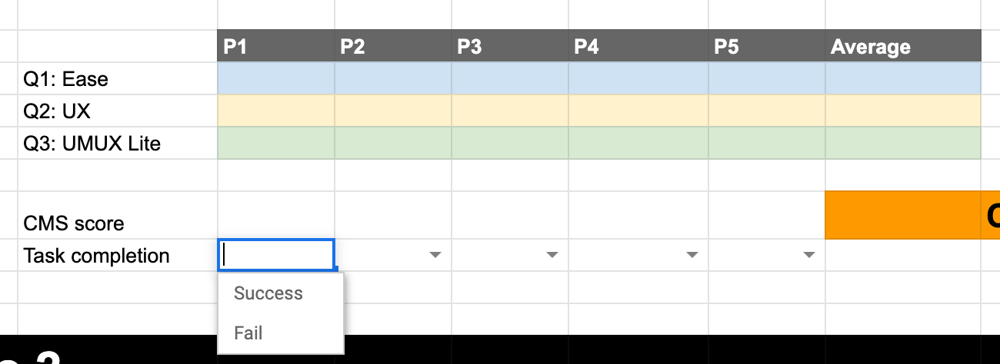
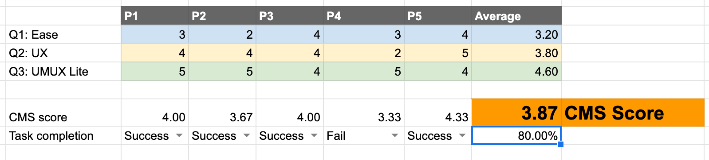
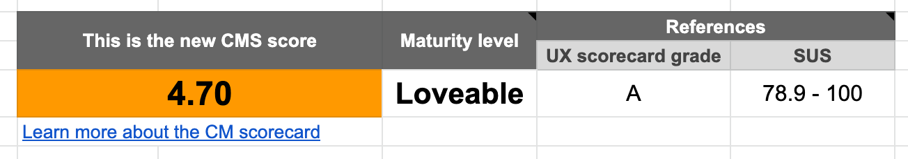

## On this page
{:.no_toc .hidden-md .hidden-lg}

- TOC
{:toc .hidden-md .hidden-lg}

## Intro and Goal

The Category Maturity (CM) Scorecard is a [Summative Evaluation](https://www.nngroup.com/articles/formative-vs-summative-evaluations/) that takes into account the entire experience as defined by a Job to be Done (JTBD), instead of individual improvement(s), which are often measured through [Usability Testing](/handbook/product/ux/ux-research/usability-testing/) (i.e. Solution Validation). This specialized process provides data to help us grade the [maturity of our product](/direction/maturity/).

The goal of this process is to produce data as objectively as possible given time and resource constraints. For this reason, the process is more rigorous than other UX research methods, and it focuses more on measures and less on thoughts and verbal feedback.

To produce data in which we have confidence, the data should be as free of subjective judgement as possible, relying on observed metrics and self-reported user sentiment. Our goal is to compare data over time to see how additions and improvements have impacted product maturity in a quantifiable way. To facilitate this, we've made this process prescriptive, so that it can be consistently applied by all Product Designers in all categories of our product.

### Some things to keep in mind
Sometimes the JTBD you need to evaluate occurs over a period of time, such as a multi-step process when responding to an alert. For these cases, it's appropriate to include the phrase '(a period of time) has passed' when moving to the next phase of the JTBD in the CM Scorecard scenario.

Occasionally, teams run into situations where they learn something surprising from a CM Scorecard -- for example, even though the score for this single research initiative is high enough to move maturity up, they believe based on the findings that it's not ready, yet. In this case, the Product Manager and Product Designer should use their good judgement about addressing fundamental problems before changing maturity and communicate that decision to stakeholders.

If you have questions, suggestions for improvement, or find this process doesn’t meet the needs of your users or product category, reach out to the [UX Researcher for your group](/handbook/product/categories/).

Any Category Maturity Scorecard effort should have a corresponding issue created in the GitLab UX Research project. Ensure the label `CM Scorecard` is applied to the issue to aid in tracking UX research efforts.

Refer to the [Category Maturity](/direction/maturity/) page to understand scoring. It is important to note that:

- **Minimal:** Category Maturity Scorecard is _not_ required.
- **Viable:** Category Maturity Scorecard is conducted with internal users who are dogfooding.
- **Complete and Lovable:** Category Maturity Scorecard is conducted with external users on the JTBDs.

Previously completed Category Maturity Scorecards can be found in this [epic](https://gitlab.com/groups/gitlab-org/-/epics/6930).

### How UX Scorecards relate to Category Maturity Scorecards

See how Scorecards relate to Category Maturity Scorecards in the [UX Scorecards](/handbook/product/ux/ux-scorecards/#how-ux-scorecards-relate-to-category-maturity-scorecards) handbook page.

All of the UX Scorecards can be found in this [epic](https://gitlab.com/groups/gitlab-org/-/epics/1714).

## Setup

### Step 0: Jobs to be Done (JTBD)

Category Maturity Scorecards are about judging the quality of experiences against a **defined and confident** JTBD. JTBD are the umbrella component of our product design process, and we use them to guide our product strategy and features. For that reason, before you begin the CM Scorecard process, you should have one or more JTBD that you feel confident about.

Refer to the [JTBD page](/handbook/product/ux/jobs-to-be-done/) to learn [how to write JTBD](/handbook/product/ux/jobs-to-be-done/#how-to-write-a-jtbd).

Before moving to Step 1, you first need to select the high-priority JTBD statements that you want to assess and translate them into script scenarios. The number of scenarios you will create per job statement often depends on the complexity of the features you're testing. Due to time limitations in a user research study (generally 30 to 60 minutes per participant), we recommend assessing no more than 2 job statements per study to help avoid participant fatigue. However, if you want to test more than 2 job statements, you can. Just be mindful of the total time it will take to run the study. 

Tip: Since job statements are persona and solution agnostic, you might find them to be too broad to serve as guidance for writing script scenarios. If that is the case, consider breaking the job statements down into user stories as an intermediary step, in order to bridge the gap between high-level job statements and actionable scenarios. Learn more about the difference between job statements and user stories in [How to Write JTBD](/handbook/product/ux/jobs-to-be-done/#how-to-write-a-jtbd).

To summarise, this is the workflow that should be followed in this step:

1. The Product Manager chooses up to 2 relevant high-priority job statements to focus on.
1. The Product Designer creates scenarios to be used for the Category Maturity Scorecard study. If needed, PM + Product Designer can go through an intermediary step of breaking down broad job statements into feature-specific user stories and use those as guidance when creating the study scenarios.

Once the JTBDs have been decided upon, create a [Category Maturity Scorecard issue](https://gitlab.com/gitlab-org/gitlab-design/-/issues/new?issuable_template=Category%20Maturity%20Scorecard).

### Step 1: Define and recruit users

During the JTBD creation and validation phases, the Product Designer and Product Manager will have devised a set of user criteria to describe the user(s) you're referencing in your job(s). The same criteria should be used when recruiting for the Category Maturity Scorecard, ensuring you are gathering feedback from the right type of user(s).

To balance expediency with getting a variety of perspectives, we conduct the Category Maturity Scorecard research with five participants from one set of user criteria. If you have multiple user types for your JTBD, it is ideal to recruit 5 from each user type. To keep the study manageable, focus on no more than 2 user types per study. If more than 2 user types are required to accurately measure your JTBD, conduct a separate follow-up study for the remaining user types.

**Example:** A JTBD can be completed by a DevOps Engineer and a Release Manager. In this case, you’d recruit a total of 10 participants: 5 DevOps Engineers and 5 Release Managers

The recruiting criteria can be based on an existing persona, but needs to be specific enough that it can be turned into a screener survey. A screener survey should then be created in Qualtrics that your prospective participants will fill out to help you determine if they're eligible to participate.

The template survey includes a question asking people if they consent to having their session recorded. Due to the analysis required for Category Maturity Scorecards, participants must answer **yes** to this question in order to participate. Once your screener survey is complete, open a [Recruiting request issue](https://gitlab.com/gitlab-org/ux-research/-/blob/master/.gitlab/issue_templates/Recruiting%20request.md) in the [UX Research project](https://gitlab.com/gitlab-org/ux-research/), and assign it to the relevant [Research Coordinator](/company/team/?department=ux-research-team). The Coordinator will review your screener, reach out to you if they have any issues, and begin the recruiting process users based on the timeline you give them.

**Note:** Recruiting users takes time, so be sure to open the recruiting issue at least 2-3 weeks before you want to conduct your research.

### Step 2: Prepare your testing environment

Testing in a production environment is the best choice because your goal is to evaluate the actual product, not a prototype that may have a slightly different experience.

Once you know what scenario(s) you’ll put your participants through, it’s important to determine the interface you’ll use. Some questions to ask yourself:

- **Can your participant use their own GitLab account?** If not, can you set them up with a GitLab.com account and have them use that?
- **Do you require a self-managed instance?** If yes, do you need to provide one?
- **Do your scenarios require any external actions?** For example, do you need to display a specific alert, or can a participant complete everything on their own?
- **Does your scenario require interacting with anything besides a GitLab web-based interface?** Should they receive an email or do they need to use a command-line interface?

It’s important to thoroughly plan how a participant will complete your scenario(s), especially if you answered "yes" to any of the questions above. Involve technical counterparts early in the process if you have any uncertainty about how to enable users to go through your desired flow(s).

If you want help creating a pristine test environment be sure to reach out to the [Demo Systems](/handbook/customer-success/demo-systems/) group on the #demo-systems Slack channel. They can create a demo environment for users and help build any particular parameters needed for your testing environment. Be aware that setting up a test environment for a research study can be time consuming and difficult. Alternately, you can utilitze the [UX Cloud Sandbox](/handbook/product/ux/ux-research/ux-cloud-sandbox/).

If your JTBD interacts with other stage groups’ areas, reach out to them to ensure their part of our product will support your scenario(s).

Because this is a summative evaluation of the current experience, all of the available options the participant should need access to must be available in the GitLab instance. When you recruit participants, keep in mind the tools and features they must access to complete the JTBD scenarios.

### Step 3: Document success/failure flows of your JTBD scenario(s)

Run through the scenarios yourself after they have been completed. Document what qualifies as successful completion of each scenario for future reference.

Make sure to test these scenarios with coworkers before evaluating with research participants. Ideally, the coworker(s) won’t be familiar with the scenario or have an expert-level understanding. It’s acceptable to coach them a little, using the pilot as a discussion to uncover any problems with your scenarios.

👍 **Defining ‘Success’**

- Successful scenario completion.
- A single scenario may have several paths to the end goal that result in completion, and thereby a ‘Success’. The team must identify the end goal prior to the study starting so everyone is aligned.
    - _Why is this important?_ Identifying and being aligned on the end goal allows the moderator to accurately know what is success/failure, which is critical to know since follow-up questions are dependent on completing the scenario.
- How the participant ended up at the end goal may not be important for the team to document. If the participant took the long path and felt it was or wasn’t easy, that should be reflected in their score. What matters most is if they ended up at the end goal.

👎 **Defining ‘Failure’**

- Unable to complete the scenario.
- A partial completion of the scenario.

**What to do if ‘Failure’ happens during a study**

- If there is a failure, the team should try their best to understand why it occurred (ex: Was it the way the scenario was phrased? Was the experience confusing? etc.).
    - _How can this be done?_ One way to do this is to go back at the end of the study to have the participant go through that scenario again. This time, you can ask targeted questions to understand why they took the route they took in the experience. (ex: _‘It looks like you clicked on ‘Issues’. Tell me more about why you selected that menu item.’, ‘You felt you completed the scenario at this point. What gave you the confidence that you accomplished the goal of XYZ?’_)
- When a participant is unable to complete a scenario, their ratings on that scenario are discarded and not accounted for when calculating the CM Scorecard score.
- If at any point you notice that less than 80% of participants are able to pass a scenario, the study should stop at that most recent participant to conserve resources.

**Making note of Errors**

The CM Scorecard issue template and CM Scorecard Dovetail template both contain areas to make note of errors encountered during the CM Scorecard. Errors can be considered anything significant that was off the 'happy path'. Examples may include navigating to a different area and spending time in that area trying to find what they're looking for, misinterpreting something, etc. If it's not significant and they recover quickly, then it may not be worth counting, and could simply be a mistake they made, or as a result of a testing scenario. Errors are not required for the calculation, but can be useful when justifying a failure or rating.

### Step 4: Complete the test script and conduct the research

Before you can begin running your participants through your scenarios you'll need to write your test script. Because Category Maturity Scorecards are a standardized process, moderators should complete and follow this [testing script](https://docs.google.com/document/d/1QqRhAuGThuDnnBnDHHug5zBBKGvDMGsj9aQUtSgs49M/copy) as closely as possible. The moderator will typically be a Product Designer, but this is not strictly required. You are encouraged to have any relevant stakeholders attend the sessions to help take notes, but it is very important they remain silent.

Before participants go through the scenarios, make sure to emphasize that they should not think aloud. This is because the goal of CM Scorecard research is to produce data as objectively as possible. The process of thinking aloud interferes with getting objective data because it takes the user out of the experience and adds time to the study. If you wish to dig deeper on something your participant experienced, feel free to discuss that with them at the conclusion of the study. It is strongly encouraged that you conduct a usability test before a CM Scorecard study when you want to obtain mostly verbal feedback around a set of scenarios. 

#### The 3 questions we ask

When a participant is successful at completing a scenario, they are then asked 3 questions to help us measure their experience, which we then tie back to category maturity. Note that if a participant failed at completing a scenario, there’s no need to ask them these 3 questions.

At the root of how we rate/grade experiences, it arguably comes down to three main elements:

1. How easy it was to do something - this is defined as ease-of-use which has components of usability baked within it.
1. How the user rated that experience - given our user segments, they know what a user experience is - so we can ask about it. Understanding how users felt about that experience gives them the opportunity to rate it directly, rather than having us infer their rating based on calculations.
1. Can the experience do what the user needs - this rates how well our experience matches our users' expectations based on their desired workflows and usage of similar tools.

**Question 1: Single Ease Question (SEQ)**

The [Single Ease Question (SEQ)](https://measuringu.com/single-question/) is a newly introduced industry-wide question based on other UX-related questions and measures. This question essentially helps us understand if the scenario was easy or difficult to complete and provides a simple and reliable way of measuring scenario-performance satisfaction. Bonus: this question is also used for UX Scorecard testing.

_Q1: “Overall, this scenario was...”_

- Extremely easy
- Easy
- Neither easy nor difficult
- Difficult
- Extremely difficult

**Question 2: User Experience rating**

Admittedly, the term ‘user experience’ is broad; as it encompasses many components we care about (ex: efficiency, speed, usability, etc) that are completely applicable to how one rates an overall user experience. Because of that, we’re intentionally not defining ‘user experience’ and feel that given our audience, the definition will be collectively understood with a high level of accuracy. What sets this question apart: it closely aligns with the grading and scoring criteria with the UX Scorecard and CM Scorecard testing. Bonus: this question is also used for UX Scorecard testing.

_Q2: “How would you rate the quality of the user experience?”_

- Extremely good
- Good
- Neither good nor bad
- Bad
- Extremely bad

**Question 3: UMUX Lite, adjusted**

The [UMUX Lite](https://measuringu.com/umux-lite/) score is based on the UMUX (Usability Metric for User Experience), created by [Finstad](http://citeseerx.ist.psu.edu/viewdoc/download?doi=10.1.1.872.6330&rep=rep1&type=pdf), and it is highly correlated with the [SUS](/handbook/product/ux/performance-indicators/system-usability-scale/) and the Net Promoter Score. It's intended to be similar to the SUS, but it's shorter and targeted toward the [ISO 9241 definition of usability](https://www.w3.org/2002/Talks/0104-usabilityprocess/slide3-0.html) (effectiveness, efficiency, and satisfaction).

_Q3: "You just experienced our implementation of_ `<Scenario>`. _How would you agree or disagree with the following statement:_

`<Scenario>` _has the features I need for what I need to do in my own work."_

- Strongly agree
- Agree
- Neither agree nor disagree
- Disagree
- Strongly disagree

You will need to decide on how to compose your scenario name. Take into consideration the name we use for the category on the [Category Maturity page](/direction/maturity/). There may be instances where using the scenario name as we use it is not optimal for presenting to a user for getting feedback because it may not be clear enough to them.

#### Zoom and Respondent.io tips

When setting up a project in Respondent, make sure to use your personal Zoom room link, as you can't change the link per participant (this means each participant will have the same Zoom room link). Additionally, be sure to turn off the password requirement for these sessions.

#### Unmoderating testing

It's possible to conduct CM Scorecard testing unmoderated.  The key is to make sure you're getting rich qualitative insights that help in understanding why participants rated the experience they way they did.  Additionally, you should have the justification you need to make any iterations.

### Step 5: Analyze and document your findings

#### Calculating the CM Scorecard score

As participants attempt to complete a scenario, for our purposes, the end result will either be: Success or Failure. To move to the next category maturity level, a minimum % pass rate is required, along with the minimum score.The chart below illustrates the relationships between: Minimum % pass rate, the UX Scorecard grades, SUS, CM Scorecard level, and the CM Scorecard score.

| Minimum % pass rate | UX Scorecard grade | Scale option | CM Scorecard score range | CM Scorecard level | SUS (for reference) |
| :-----------------: | :----------------: | ------------ | :----------------------: | :----------------: | :-----------------: |
| 100% | A | Extremely good/easy, Strongly agree | 3.95 - 5.00 | Loveable | 78.9 - 100 |
| > 80% | B | Good/Easy, agree | 3.63 - 3.94 | Complete | 72.6 - 78.8 |
| > 80% | C | Neither | 3.14 - 3.62 | Viable | 62.7 - 72.5 |
| n/a | D | Difficult/Bad, disagree | 2.59 - 3.13 | -- | 51.7 - 62.6 |
| n/a | F | Extremely bad/difficult, Strongly disagree | 1.00 - 2.58 | -- | 0 - 51.6 |

**CM Scorecard score:** The CM Scorecard score can easily be calculated for each scenario:

Tip: Use this [Google Sheet](https://docs.google.com/spreadsheets/d/1w3GZNc11PSZ9sN_2II5SI3fwK4tH9LLSb2bci_o2mWg/copy), which contains the calculations already built into it.

**Step one:** For each scenario, enter the test participants' responses across each relevant question and document the task success/failure by using the dropdown.

**Step two:** The overall score of each question and the task success rate will be averaged to provide a scenario score.

**Step three:** Once all of the scenario scores are calculated you will be provided an overall score and the maturity level. Check the note on the **Maturity level** cell (J40) for further details.

For example:
 - 4.70 average = ‘A’ CM Scorecard grade = ‘78.9-100’ SUS = Loveable
 - 3.93 average = ‘B’ CM Scorecard grade = ‘72.6 - 78.8’ SUS = Complete

**Minimum % pass rate:** Minimum % pass rates help indicate what percentage of participants must succeed in a scenario to meet a minimum requirement. This also helps indicate what level of scenario failure is acceptable. Scenario failures are important to note and we can’t discount them, so they must be incorporated as part of the criteria to move category maturity levels. If the Minimum % pass rate for any scenario is less than 80% during a study, the study should stop at that most recent participant to conserve resources. In the event this should occur, the category maturity cannot be moved up a level. The team should take those learnings, iterate, and retest when they’re ready again. It’s also recommended that a retrospective take place to learn:

- What happened?
- Why weren’t participants able to successfully complete the scenarios?
- What will we do to address this?

**Score interpretation examples:**

- A product category currently at Minimal has completed a CM Scorecard study with internal participants. The resulting score is 4.0 and the success rate is 80%. The product category can move up to Viable as it meets the minimum % pass rate. Even though the resulting 4.0 score is at Loveable level, testing the scenario with external users would be required to move the category further in maturity level. The resulting recommendation is to move the category to Viable. 
- A product category currently at Viable has commpleted a CM Scorecard study with external participants. The resulting score is 3.85, but the success rate is 60%, which is below the minimum % pass rate. In this case the product category won't move up in maturity, and it's recommended to investigate what led to the low success rate.

#### Post-session debriefing

It’s important that the moderator and any stakeholders don’t leave the call when the session concludes. Instead, remove the participant and remain on the call. Use this time for the group to debrief on what they just experienced. The notetaker(s) should take notes on this discussion.

- Have each person talk about what they feel were the major findings of the session.
- Mention any issues with the session or things that should be done differently in future studies. However, do not make changes to how planned sessions are conducted, otherwise the data can’t be compared. For this reason, we suggest running a pilot session to work out any kinks.
- Allow anyone to ask any questions about the content covered or otherwise say things they feel need to be said before the session concludes.

#### Resulting data

By following the Category Maturity Scorecard [testing script](https://docs.google.com/document/d/1QqRhAuGThuDnnBnDHHug5zBBKGvDMGsj9aQUtSgs49M/copy), you will have the following measures to report, per feature, not per scenario. However, scenarios may include more than one feature.

- **Single Ease Question**
- **User Experience rating**
- **UMUX Lite (Adjusted) rating**
- **Success/failure**
The goal for analyzing Category Maturity Scorecard data is to establish a baseline measure for the current experience as it relates to the JTBD(s). Over time, our product will change as new features/functions are added/changed. We can review the data collected here to understand how these changes impacted the user experience and use it to make improvements.

**To analyze:** Use the [Google Sheet](https://docs.google.com/spreadsheets/d/1w3GZNc11PSZ9sN_2II5SI3fwK4tH9LLSb2bci_o2mWg/copy) to aid in calculating the CM Scorecard score, per scenario. Additionally, look for themes behind the reason why participants scored the way they did.

**To document:** Document and highlight areas for improvement via issues, utilizing the [‘Actionable Insight’ scoped labels](/handbook/product/ux/ux-research/research-insights/#how-to-document-actionable-insights), to make further improvements to the experience.

Read the UX Research team’s guide for [documenting insights in Dovetail](/handbook/product/ux/dovetail/#the-ux-research-teams-guide-to-documenting-insights-in-dovetail).

### Update JTBD data file

Several groups currently use [jobs_to_be_done.yml](https://gitlab.com/gitlab-com/www-gitlab-com/-/blob/master/data/jobs_to_be_done.yml) to showcase the current maturity of each of the jobs that represent a given categories' overarching problems they are working on solving. Each entry in the YML file consists of the following keys:

| Key | Example Value | Description | Required |
| --- | ------------- | ----------- | -------- |
| `slug` | group_jtbd_1a | Unique ID of the JTBD | Yes |
| `parent` | group_jtbd_1 | Unique ID of the parent's JTBD | No |
| `short_jtbd` | Measuring Outcomes | A short reference of the JTBD | No (if `jtbd` is defined) |
| `jtbd` | When....I want to...So that | The complete JTBD | No (if `short_jtbd` is defined) |
| `grade` | "A" | The corresponding letter of the score of A, B, C, D, F | No |
| `confidence` | Researched | Confidence level of the grade | No |
| `source` | https://gitlab.com/gitlab-org/ux-research/-/issues/900 | URL pointing to the finished research issue | No |
| `group` | Plan | The group or stage that the corresponding JTBD belongs to | No |

In order to map the CM Scorecard score for a given JTBD to a grade letter, use the following criteria:

- A: 3.95 or higher
- B: Between 3.65 and 3.94
- C: Between 3.14 - 3.63
- D: Between 2 and 3.13
- F: Less than 2
