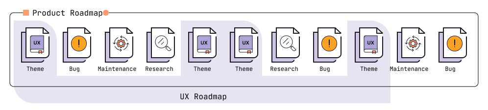

## On this page
{:.no_toc .hidden-md .hidden-lg}

- TOC
{:toc .hidden-md .hidden-lg}

## Overview

_**[Neilsen Norman Group UX Roadmap guide](https://www.nngroup.com/articles/ux-roadmaps/) is a prerequisite** for understanding the overall purpose of this UX Roadmapping process. The documentation that follows discusses the differences in process and structure between the Nielsen Norman Group's documentation for UX Roadmaps and GitLab. Please refer to the [Neilsen Norman Group UX Roadmap guide](https://www.nngroup.com/articles/ux-roadmaps/) for more details on UX Roadmaps, including definition, structure, usage, and vocabulary._

User Experience (UX) roadmaps are strategic, living artifacts that align, prioritize, and communicate a Product Design team's future work and problems to solve. UX Roadmaps should act as a single source of truth for a team's North Star vision serving as the blueprint for their strategy. UX Roadmaps will work in concert with product strategy and direction. They're a wrapper that looks at all of the individual issues a Group may have, bundeling them up into relational themes allowing solutions to be holistic and non-fragmented.

### Benefits of UX Roadmaps

#### Alignment

UX Roadmaps align across groups and stages achieving a better understanding of the work done through their problems to solve and expected outcomes. They can help identify areas of collaboration when teams are working on overlapping user needs or when needs cross workflows. Helping to unite stable counterparts, engineering, design, product, and research with a comprehensive approach to executing the category vision. 

#### Focus

UX Roadmaps focus on a more significant, holistic problem area -rather than discrete features in a milestone- subsequently reducing the need for fire drills and mitigating context switching. This focus will allow designers to dive deep into a set of related needs-based problems that lead to a comprehensive experience inclusive of all related touch-points in the product. Additionally helping to allocate more time toward addressing validated user needs with solutions rather than assumptions will reduce design and research churn in the product development process.

#### Strategy

UX Roadmaps influence strategy through collaboration with Product Managers to define the roadmap goals, identify and prioritize unmet user needs, and transparently maintain and update the roadmap over time. Additionally, roadmaps allow us to understand our value as a team by measuring our success against the business outcomes our counterparts define for each theme. 

### Product Roadmaps and UX Roadmaps
<!-- Roadmap graphic to illustrate how a UXrm fits into the overall Product roadmap -->

UX Roadmaps complement the product roadmap; they do not replace or supersede them. It's helpful to think of these roadmaps as a view of the product roadmap through the lens of Product Design and UX Research. 

#### Product Roadmaps

Often seen as an epic {stage:group:category}{maturity level to next maturity level}. These are composed of all the things needed to deliver a product; engineering, design, research, tech writing, and any other planned activities necessary for the area.

<!-- #### Field UX Roadmap (Stage)

At GitLab, this translates to a stage-level UX Roadmap and is the byproduct of each Stage:group creating their stage:group UX Roadmap. This level is owned by the Product Design Manager or Staff Product Designer and the UX researcher of the Stage, whose job is to ensure alignment of activities across their area. This roadmap is a composite of all the Stage:group-level UX Roadmaps in the area, including UX research, and should serve as a high-level view of the UX activities across the stage.--> 

#### UX Roadmap (Stage:group)

At GitLab, a specialty roadmap translates to a stage:group-level UX Roadmap owned by the Product Designers and UX researchers, whose job is to ensure it is up to date and accurately depicts the activities they are working on or will be working on in the near future. Since roadmaps exist in a hierarchical relationship, the stage:group UX Roadmap is where most maintenance and updating will occur. UX themes aligned to a common vision and prioritized by confidence are essentially all that make up a UX Roadmap.

```
Breakdown: 
- Product stage direction
--- Stage:group - Product Roadmap
---- Stage:group UX Roadmap
```

### UX themes

At a high level, themes represent bundles of work aligned to a specific user need, their expected outcomes and the business goals that will result when the theme is delivered and implemented. Translated into how we work at GitLab, UX themes may represent a bundle of problem validation, feature, and solution validation issues centered around a common JTBD and user need(s).

#### Benefits of UX themes

Working with themes rather than individual feature request one-offs, allows the team to deliver an holistic, end-to-end experience (within the scope of the theme and roadmap goals) while mitigating context switching, the risk of design churn, or a subsequent redesign. This approach also benefits the engineering teams as they can focus their efforts and build to the scope envisioned in the theme, while also reducing context switching and avoiding the need to refactor the code in the event of a redesign.

#### Jobs To Be Done (JTBD) and UX themes

Given that themes are predicated on user needs and their expected outcome, we can directly relate UX themes and [JTBD](/handbook/product/ux/jobs-to-be-done/). From low-confidence and unvalidated to high-confidence and validated, all UX themes should be derived from a known JTBD. If the JTBD is assumptive, that indicates a low-confidence theme with a primary objective of validating the JTBD before working on solutions. Alternatively, if the JTBD is validated, that should indicate to the team that problem validation is not likely needed for the theme; however, this may not always be the case and should be assessed by the team collaboratively. 

Using JTBD to define and drive the roadmap through their incorporation of UX themes is, by design, what JTBD are intended to achieve. UX themes and the UX Roadmap are practical applications for JTBD, ensuring their usage across teams.

## Creating UX Roadmaps

Creating a UX Roadmap is a collaborative process between the Product Manager, Product Design Manager, Staff Product Designer (if applicable), and Product Designer. It is important to highlight that roadmapping is a seasonal tool, not something that's done every day; once created, the hard part is done. All that remains is regular usage and maintenance of the roadmap, covered below in [Using UX Roadmaps](#using-ux-roadmaps).

Below are a few situations when a new UX Roadmap would be created:

- The team does not have an existing UX Roadmap 
- New category or category direction change
- Planning to uplevel a category's maturity
- The team needs to recalibrate goals and orient around a single set of vetted priorities. Typically when a team lacks focus or is spending a significant amount of time putting out fires.

### UX Roadmapping workshop

Creating a UX Roadmap cannot and should not be done in isolation. For them to be successful, they require buy-in from team members who will be contributing to or consuming the content. To create a roadmap, it’s best practice and highly recommended to conduct a roadmapping workshop with the team. To help facilitate a roadmapping workshop, a workshop guide has been created that leverages our asynchronous value requiring as little synchronous meeting time as possible; however, to ensure this is a collaborative effort, some synchronous components are necessary.

- [UX Roadmapping workshop guide issue](https://gitlab.com/gitlab-org/gitlab/-/issues/356188)  
- [UX Roadmapping Mural template](https://app.mural.co/template/a712ef67-2136-4758-be8b-577347fd1288/e8609b18-ede3-45c8-9ce5-a3877f8860c4)

### UX Roadmap structure

There are a few key differences between the [Neilsen Norman Group UX Roadmaps](https://www.nngroup.com/articles/ux-roadmaps/) and the ones we will create and use at GitLab. Below, we will dive into the areas where there are differences.

```
- Stage UX Roadmap - Issue board
-- Stage:group UX Roadmap - Epic
--- Stage:group UX theme - Issue
```

#### Stage UX Roadmaps and boards

>**A roadmap that is imperfect but is in a place where people typically work is better than a great roadmap that is in a tool rarely used.** 
>_Neilsen Norman Group, course on UX Roadmaps_

There are many tools at our disposal to create and maintain a UX Roadmap, from Mural to Trello and even Figma. However, it is recommended to use Gitlab boards as they are in a place we are comfortable with, not to mention this adds another use case for dogfooding boards and provides the team feedback for potential improvements. The UX Roadmap board will be the primary way we consume and share the roadmap, while the individual themes will be the primary way we plan and work on the roadmap.

#### Stage:Group UX Roadmaps and epics 

Following the guidelines for UX Roadmaps, there has to be a stated goal/vision to work toward… working in themes will deliver on that goal/vision. Existing product epics, category maturity, and/or vision epics can still be used as containers for UX theme issues. The only requirement is that the epic containing the group’s UX themes include the goal/vision statement in the description for quick and easy reference. 

#### Stage:Group Theme issues

Each theme in the UX Roadmap will have a dedicated issue and serve as the SSOT for all Research and Design activities related to the themes and subthemes. UX theme issues should follow the established labeling conventions for the stage:group along with two new additional labels.

- **UX Theme Label**: This is required to populate the UX Roadmap board for the stage. 
- **Confidence label**: Used to aid in prioritization conversations and understand the next steps an upcoming theme will require. The RICE framework can be used to assign confidence to _validated_ themes for consistency. Themes that require problem validation will utilize the high-level confidence assessment. 

### Theme structure 

Themes are composed of multiple elements to ensure they are defined and scoped according to the user need they are addressing. Below is a breakdown of the components that make up a theme along with their definitions. 

| Theme component | Description | Example | 
| ---------- | ---------- | ---------- | 
| Theme statement | Beneficiary + need + outcome | _Reduce the effort for security teams to identify and escalate business-critical risks_ |
| Beneficiary | The recipient(s) of the value the product or service provides; a customer, end-user, or buyer. | _Security teams_ | 
| Need | Abstracted from the JTBD  | _Identify and escalate business-critical risks in orgs assets._ |
| JTBD | JTBD that relates to the theme. Also known as the problem to solve. | _When I am triaging vulns, I want to address business-critical risks, So I can ensure there is no unattended risk in my orgs assets._ |
| Business objective | Objectives and potential outcomes (from a business point of view) that will be achieved upon completion | _Increase engagement by making the experience efficient while reducing the chances of users overlooking high-priority items._ |
| Subthemes | More specific needs and details added to a theme; other goals the theme addresses, existing validated feature issues, research initiatives    | _Search and filter enhancements, Grouping related items in tables, Taking action on multiple items at one time_ |
| Confidence | Informal assessments of likely impact and demonstrated need for the different themes. | _High_ | 
| Timeframe | Now, next, future, future+ | _Now_ |
| Owner | Stage:Group {Designer, Researcher} | _Govern:Threat Insights Designer_ |

#### Theme statements

A theme statement combines the beneficiary, their need, and the expected outcome when the work is delivered. Statements should include some form of measurement and the desired direction. In the example, the measurement is effort, and the direction is to reduce, aligning with the business objective of “Increase engagement…” The hypothesis is that users can complete the activity faster by reducing the effort, thus repeating the activity with a higher frequency. Well-defined statements are concise without sacrificing the substance of the theme so that anyone, within the stage group or in another, can understand it at a glance.

_Note: The theme statement is the defacto title that will be used to reference the theme and serve as the theme issue title._ 

#### Beneficiaries 

Beneficiaries are typically the end-user for product teams; however, there are instances where this is not always the case. Beneficiaries can also be internal teams, stakeholders, executives, etc. Anyone who is the direct recipient of the value provided by delivering the theme is the beneficiary.

#### JTBD and Needs

Addressing the need is the primary objective of the theme. Needs should be derived from the JTBD that the problem area is centered around. Essentially, the need is the job from the JTBD statement, "I want to {...}" and can be modified if it enhances the clarity of the theme statement. 

For example, the need above is; _Identify and escalate business-critical risks in org's assets_; however, the job from the JTBD statement, is; I want to _{address business-critical risks}_. The team that owns this JTBD knows that identification and escalation are tasks that comprise the addressing business-critical risk workflow, yet this may not be common knowledge for all groups. Therefore, modifying the job to convey the need makes the theme statement more explicit and discernible to everyone. This is important to remember because one team's UX Roadmap isn't just for them to help drive their work, it also serves our transparency and collaboration values by allowing other teams to be more aware of what everyone else is working on.

_Note: If there is no JTBD or the JTBD is assumptive, that should indicate that you are working on a low confidence theme, and additional research is required before engaging in design activities._ 

#### Business objectives

The business objective is why we are working on a theme. Without this information, teams risk delivering features that do not enhance the product or add value to users. Additionally, the objective should help to influence the design team's solutions, as it serves as a hypothesis for the delivered solution, "We know we solved the need if: {business outcome} is achieved." 

The business objective is measurable and communicated by the potential movement of impactful or meaningful metrics. Below are a few examples of measurable business metrics: 

**Example increasing metrics**
- Adoption 
- Enagement 
- Efficiency 
- Sales 
- SUS-scores

**Example decreasing metrics**
- Error rate
- Time on task
- Customer churn
- Customer service requests

Business outcomes should be general rather than specific due to the difficulty in determining the cause and effect of any product change. Looking at the example: _Increase engagement by making the experience efficient while reducing the chances of users overlooking high-priority items_, notice that a number such as "increase engagement by x" isn't specified. Instead, we kept the objective generic and success predicated on any increase in engagement, regardless if it is incremental or exponential. Another way to think about this is if we say we'll see a 10% increase in engagement and the result was an 8% increase, would we consider this a success or a failure? 

#### Subthemes

Subthemes are more granular validated needs, goals, and additional details that the theme encompasses. These are typically reserved for themes in the next (1-3 milestones) bucket. Subthemes may also consist of existing features or design issues that exist in GitLab and directly relate to the theme. Subthemes answer “how” we are going to solve the user need while the theme itself answers “what” the need is and “who” will be benefiting from the solution. 

#### Confidence

Confidence is the assessment of the product and design team's understanding of the problem and solution space the theme occupies. Use the table below to understand your confidence in the theme. 

|      | High confidence | Medium confidence | Medium confidence | Low confidence | 
| ---- | ----- | ----- | ----- | ----- | 
| Is the JTBD informed by research or other means? (not assumptive) | Yes | Yes | No | No |
| Has the problem been validated through research or other means? | Yes | No | Yes | No |

#### Timeframe

Most roadmaps will span four quarters and represent the work and activities of a Product Design and UX Research team for a year. We will follow the same pattern; however, we treat it as a guideline, not a rule. To meet our needs and work within the planning vocabulary of GitLab, we will define the timeframes as follows:

- **Now =** Next 1-3 Milestones 
  - High confidence, high priority themes.
  - JTBD, and needs are well understood
  - Actively being worked on and will be delivered within the timeframe.
- **Next =** Next 4-7 Milestones 
  - Medium confidence themes, or lower priority high confidence themes. 
  - JTBD, and needs are somewhat understood, but more research would be beneficial to fill in any gaps and assumptions.
  - Research may be needed to increase the confidence and refine the scope.
- **Future =** Next 7-13 Milestones 
  - Low confidence themes, or lower priority medium confidence themes.
  - JTBD, and needs are not very understood, most/all information is based on assumptions.
  - Research is likely required to increase the confidence and refine the scope.
- **Future+ =** Awaiting further demand 
  - Low confidence themes with user needs that are assumptive and not well defined.
  - JTBD, and needs are not understood at all, all information is based on assumptions.
  - Research is required to increase confidence and refine the theme
- **Completed =** Closed
  - The theme has been delivered, or the theme has been abandoned. Themes may be abandoned due to the group pivoting based on a shift in customer needs, or GitLab decided the problem is no longer a priority worth pursuing.  

_Note: These timeframes denote when work will take place and when work will be delivered. Think of this as design and research will be delivered within < timeframe >(e.g., design/research delivered in Now: Next 1-3 Milestones). In many cases it will make sense for a lower confidence theme located in the Next or Future buckets to be worked on in parallel by the groups UX Researcher and/or the Product Manager in order to increase the confidence in order to move it to the Now bucket for future design work._

#### Ownership

The Design DRI and respective Product Manager are the owners of themes in their group. However, in GitLab, we want to ensure themes are assigned to team members who are actively working on them. For example, a Product Designer and a UX Researcher may be assigned to a theme if the work demands it.

#### Example theme

View the [example theme issue](https://gitlab.com/gitlab-org/gitlab/-/issues/355736) for a better understanding of how UX themes translate into GitLab.

## Using UX Roadmaps

### Milestone planning

#### Stage group planning

Before the next milestone, the Designer and Product Manager should discuss the progress on the UX Roadmap, including progress made on themes, subthemes, and issues. During this time, Designers should ensure the themes are prioritized correctly, including the next 4-7 and 7-13 milestones bucket. These themes will impact the research priorities of the stage and the work the Designer will be doing after their current theme is delivered. 

#### Stage planning 

Each team member should talk about the theme, related subthemes, and issues they are working on. Designers should also point out any completed or added themes/subthemes/issues, along with their progress. Finally, the team should discuss any changes to the roadmap, for example, a theme moving up in priority and any differences from the past planning session. This session should be recorded and shared in the #UX channel and related product channels to maintain transparency. 

_Note: This only applies to design teams that have a regular stage-level planning session._ 

### Working on themes

#### Product Designers working on themes

Most of the work Product Designers do will be on themes in the `(Now) Next 1-3 milestone` bucket of the UX Roadmap Issue Board. These themes are comprised of high-confidence outcomes and validated needs: the problem is already well defined and researched, the JTBD, user persona, user needs/requirements are well understood, and themes, therefore, are ready for a design solution to be created.

The UX theme issue is where planning, discussion, and collaboration occur. It is what the research and solutions are based on. The related issues contained within it are parts of the whole and may evolve or even get closed as more knowledge and understanding of the theme becomes clear. As work progresses on the theme new issues may also need to be created per our existing workflow processes. As these are based on the theme, they will be added or linked to the theme for tracking purposes. The most important aspect of working on themes is that research and design solutions are based on the theme first and any related issue MVCs second. The intention is to work on the whole of the theme in a complete, holistic way as opposed to its individual-related issues. This process is about workflows vs features, and delivering quality and value to our users.

As the design is completed (progressing from lo-fi to hi-fi), assets should be uploaded to the UX theme issue, either in the description or in the design management tool for tracking/SSOT purposes. The team should then notify their counterparts that it is ready for planning breakdown following the [Product Development Workflow](https://about.gitlab.com/handbook/product-development-flow/#build-goals--outcomes) guidelines. 

##### Suggested workflow
1. Assess your theme
    - Do you have everything you need to be able to generate design solution(s)?
        - Refer to the [Product design process: Define the opportunity](https://gitlab.com/gitlab-com/www-gitlab-com/-/merge_requests/109522/diffs) to learn about all the things you need to know to determine if you are ready to move into solutionizing.
    - Once you've gathered all of this information, ensure that it is added to the theme's description as the SSOT.
2. [Ideate and iterate](https://about.gitlab.com/handbook/product/ux/product-designer/#ideate-and-iterate) low-fidelity wireframes that incorporate all of the requirements of the theme, holistically addressing the JTBD, needs and use-cases.
    - Collaborate with your counterparts early and often.
    - Adjust your designs after [soliciting feedback](https://about.gitlab.com/handbook/product/ux/product-designer/#design-reviews) from your counterparts and the UX team as needed.
3. In order to increase your confidence in your design direction it's always recommended that you validate your low-fidelity wireframe design with the [solution validation](https://about.gitlab.com/handbook/product/ux/ux-research/solution-validation-and-methods/) method that is right for your project. After all, this is the design you'll be working from in future milestones to come, so it is best to ensure, while in this low-fidelity state, that it is usable and meets your user's goals and needs. Test it while it is cheap!
    - Adjust your designs as necessary based on this user feedback solidifying your low-fidelity wireframe design direction.
4. Work with your counterparts to [breakdown your low-fidelity wireframe design into an appropriate MVC(s)](https://about.gitlab.com/handbook/product/ux/product-designer/#refine-mvc)
    - Create an issue(s) to track this MVC work.
    - You might consider this step more akin to feature-based design, where individual issues are created for each feature. The difference here, however, is that you and your team are directly connected to the low-fidelity wireframe design that this issue was derived from so they can see the end game and plan accordingly.
5. Create final high-fidelity mock-ups for the MVC.
    - This is like coloring in the lines of a coloring book, where the coloring book is the lo-fi wireframe, and your mock-ups are the crayons that fill in all of the details.
    - This is where you must consider and define all of the micro-interactions, determine which Pajamas components make the most sense for your solution, write your micro-copy, consider accessibility, and so on.
6. It is again recommended that you validate your MVC design with Solution Validation to ensure you haven't lost anything in the translation from your low-fidelity wireframe design to your high-fidelity MVC mock-ups.
    - Adjust your designs as necessary based on this user feedback solidifying your MVC design direction.
7. Follow the rest of the Product Development Flow once you and your team have deemed the MVC design complete.

#### UX Theme issue scope

The work done on a theme should keep in mind the scope of the deliverables. If the design cannot be implemented within a reasonable timeframe, then the scope of the theme is likely too large and should be reduced. A good guideline is three milestones to implement a UX theme; One MVC: (feature: addition) followed by two (feature:enhancements) iterations to successfully implement the designs. There may be instances where a theme will take fewer iterations or even more if it is a more significant back-end change. In these cases, it is recommended to collaborate with the team's stable counterparts to reach a viable solution.

#### UX Research working on themes

A majority of UX researchers' work will be on the themes in the `(Next) Next 4-7 milestones` bucket or `(Future) Next 7-13 milestones` bucket. Working ahead affords Research the time and space to, design a study, recruit participants, execute the research and summarize the results without compromising the methodology due to time constraints. Research and insight issues should be referenced in the UX theme issue to maintain the SSOT.

Work with your UX Researcher during their research prioritization efforts by referencing your UX Roadmap's `(Next) Next 4-7 milestones` bucket and/or `(Future) Next 7-13 milestones` bucket. Your goal is to ensure that you are able to move themes from the Next and Future buckets to the Now bucket. This should only be done once you have gathered all of the information necessary to be ready for design, meaning that you are now able to say that you have high confidence in this theme.

### Revising and updating themes

Revising a theme can happen at any time while working on a theme or reviewing the roadmap. It is good practice to communicate when details change in theme issues so the team can remain informed without continuously monitoring the roadmap. For transparency, a comment should be added to the theme issue when changes are made that explains why the change was necessary.

### Submitting new themes 

>**UX Roadmaps fail when they are treated like backlogs** - _Nielsen Norman Group_

Creating new themes should be done with caution when doing so outside of a roadmapping workshop, since themes ladder to a common yet comprehensive goal and vision of the roadmap. Creating a new theme that extends beyond the vision may negatively impact the roadmap and its value to the team by inadvertently extending the scope. Below are a few situations when new themes may be generated;

- The research team uncovers an unmet JTBD/need that aligns with the goal and vision of the roadmap. 
- The product team identifies a new assumptive user need that aligns with the goal and vision of the roadmap.
- The product, design, and/or research team determines a theme needs to be refined into multiple themes due to scope or new information about the user's needs.

### Working on items outside of the UX Roadmap

The UX Roadmap will not represent all the work that may be needed in a given milestone. Rather, it represents strategically aligned activities that deliver on the strategy of the stage:group. There will be instances where items unrelated to a UX theme will still need to be worked on. Bugs, UX Debt, or other SUS-impacting issues and discrete urgent customer requests fall into this bucket. These do not need to be considered in your UX Roadmap. 

Themes can be thought of as the strategic design initiatives that are needed to be completed in order to achieve the overarching goal of the roadmap. While the other issues are for maintaining the experience pertaining to our standards.

