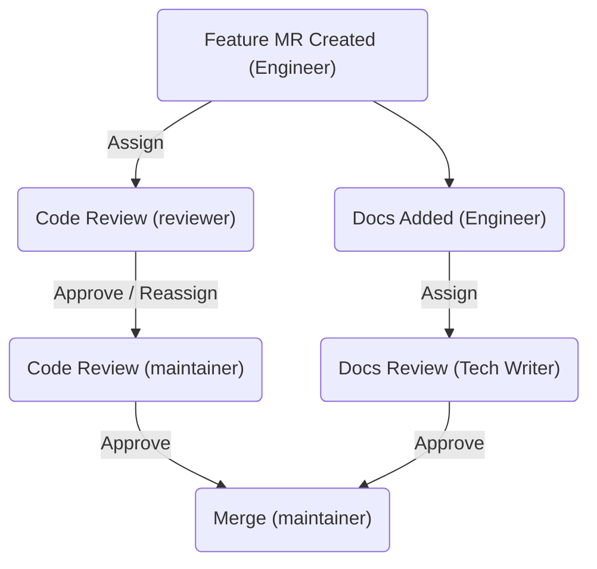

## On this page
{:.no_toc .hidden-md .hidden-lg}

- TOC
{:toc .hidden-md .hidden-lg}

Technical Writing team workflows work in conjunction with the:

- [Product development flow](/handbook/product-development-flow/).
- [Product designer workflow](/handbook/product/ux/product-designer).
- [Engineering workflow](/handbook/engineering/workflow/).

The process for creating and maintaining GitLab product documentation depends on whether the documentation is:

- [A new feature or feature enhancement](#documentation-for-a-product-change): Delivered for a specific milestone and associated with specific code changes.
  This documentation has the highest priority.

- [Changes outside a specific milestone](https://docs.gitlab.com/ee/development/documentation/workflow.html): Usually not associated with a specific code change, is of lower priority, and
  is open to all GitLab contributors.

Documentation [is required](https://docs.gitlab.com/ee/development/contributing/merge_request_workflow.html#definition-of-done)
for a milestone when:

- A new or enhanced feature is shipped that impacts the user or administrator
  experience.
- There are changes to the user interface or API.
- A process, workflow, or previously documented feature is changed.
- A feature is deprecated or removed.

**Note:** Documentation refactoring unrelated to a feature change is covered by
the [process for changes not related to a specific milestone](https://docs.gitlab.com/ee/development/documentation/workflow.html),
which allows for time-sensitive documentation updates to be prioritized.
{: .note}

Documentation isn't typically required when a *backend feature* is added or changed.

## Documentation for a product change

Documentation is required for any new or changed feature, and is:

- Created or updated as part of feature development, and is almost always in
  the same merge request as the feature code. Including documentation in the
  same merge request as the code eliminates the possibility that code and
  documentation get out-of-sync.
- Required with the delivery of a feature for a specific milestone as part of the
  GitLab [definition of done](https://docs.gitlab.com/ee/development/contributing/merge_request_workflow.html#definition-of-done).
- Often linked from the release post.

### Developer responsibilities

Developers are the primary authors of documentation for a feature or feature
enhancement. They are responsible for:

- Developing initial content required for a feature.
- Liaising with their Product Manager to understand what documentation must be
  delivered, and when.
- Requesting technical reviews from other developers within their group.
- Requesting documentation reviews from the Technical Writer
  [assigned to the DevOps stage group](../#assignments)
  that is delivering the new feature or feature enhancements.

The first merge request where a feature can be tested should include the
documentation, even if the feature is behind a feature flag.
For details, see [the guidelines][https://docs.gitlab.com/ee/development/documentation/feature_flags.html).

The author of this MR, either a frontend or backend developer, should write the documentation.

**Note:** Community Contributors can ask for additional help from GitLab team
members.
{: .note}

#### Authoring

Because the documentation is an essential part of the product, if a `~"type::feature"`
issue also contains the `~documentation` label, you must ship the new or
updated documentation with the code of the feature.

Technical Writers are happy to help, as requested and planned on an
issue-by-issue basis.

For feature issues requiring documentation, follow the process below unless
otherwise agreed with the Product Manager and Technical Writer for a given
issue:

- Include any new and edited documentation, either in:
  - The merge request introducing the code.
  - A separate merge request raised around the same time.
- Use the [documentation requirements](#documentation-requirements) developed
  by the Product Manager in the issue and discuss any further documentation
  plans or ideas as needed.

  If the new or changed documentation requires extensive collaboration or
  conversation, a separate, linked issue can be used for the planning process.

- Use the [Documentation guidelines](https://docs.gitlab.com/ee/development/documentation/index.html),
  and other resources linked from there, including:
  - Documentation [Structure and template](https://docs.gitlab.com/ee/development/documentation/structure.html) page.
  - [Style Guide](https://docs.gitlab.com/ee/development/documentation/styleguide/).
  - [Markdown Guide](https://docs.gitlab.com/ee/user/markdown.html).
- Contact the Technical Writer for the relevant
  [DevOps stage](../#assignments)
  in your issue or merge request, or within `#docs` on GitLab Slack, if you:
  - Need any help to choose the correct place for documentation.
  - Want to discuss a documentation idea or outline.
  - Want to request any other help.
- If you are working on documentation in a separate merge request, ensure the
  documentation is merged as close as possible to the code merge.
- If the feature has a feature flag, [follow the policy for documenting feature-flagged issues](https://docs.gitlab.com/ee/development/documentation/feature_flags.html).

#### Reviews and merging

Before merging, documentation changes committed by the developer must be
reviewed by:

- The code reviewer for the merge request. This is known as a technical review.
- Optionally, others involved in the work such as other developers or the
  Product Manager.
- The Technical Writer for the DevOps stage group, except in exceptional
  circumstances where a [post-merge review](https://docs.gitlab.com/ee/development/documentation/workflow.html#post-merge-reviews)
  can be requested.
- A maintainer of the project.

### Product Manager responsibilities

Product Managers are responsible for the
[documentation requirements](#documentation-requirements) for a feature or
feature enhancement. They can also:

- Connect with the Technical Writer for discussion and collaboration.
- Review documentation themselves.

For issues requiring any new or updated documentation, the Product Manager
must:

- Add the ~documentation label.
- Confirm or add the [documentation requirements](#documentation-requirements).
- Ensure the issue contains:
  - Any new or updated feature name.
  - Overview, description, and use cases when applicable (as required by the
    [documentation structure and template](https://docs.gitlab.com/ee/development/documentation/structure.html).

Everyone is encouraged to draft the documentation requirements in the issue.
However, a Product Manager will:

- When the issue is assigned a release milestone, review and update the
  Documentation details.
- By the kickoff, finalize the documentation details.

### Technical Writer responsibilities

Technical Writers are responsible for:

- Participating in issue discussions and reviewing MRs for the upcoming
  milestone.
- Reviewing documentation requirements in issues when called upon.
- Answering questions, and helping and providing advice throughout the
  authoring and editing process.
- Reviewing all significant new and updated documentation content, whether
  before merge or after it is merged, in accordance with [review principles](/handbook/product/ux/technical-writing/#review-principles).
- Assisting the developer and Product Manager with feature documentation
  delivery.
- Ensuring that issues and MRs are labeled appropriately, and that doc content:
  - Has the correct [metadata](https://docs.gitlab.com/ee/development/documentation/index.html#metadata).
  - Has an entry in the repo's CODEOWNERS file, if one exists (typically
    [CODEOWNERS](https://gitlab.com/gitlab-org/gitlab/-/blob/master/.gitlab/CODEOWNERS)
    in `gitlab-org/gitlab` repo). The entry can be a path if all its files are
    owned by the same group; otherwise include references to individual files.

#### Planning

The Technical Writer:

- Reviews their group's `~"type::feature"` issues that are part of the next milestone
  to get a sense of the scope of content likely to be authored.
- Recommends the `~documentation` label on issues from that list which don't
  have it but should, or inquires with the PM to determine if documentation is
  truly required.
- For `~direction` issues from that list, reads the full issue and reviews its
  Documentation requirements section. Addresses any recommendations or
  questions with the PMs and others collaborating on the issue in order to
  refine or expand the Documentation requirements.
- Updates the Technical Writing milestone plan. [Example](https://gitlab.com/gitlab-org/technical-writing/-/issues/521), created from the [issue template](https://gitlab.com/gitlab-org/technical-writing/-/blob/main/.gitlab/issue_templates/tw-milestone-plan.md).
  - Add a link to the board or filter that shows the planned documentation and UI text work for the upcoming milestone.
  - Confirm that the group PM or EM is aware of the planned work.

#### Collaboration

By default, the developer will work on documentation changes independently, but
the developer, Product Manager, or Technical Writer can propose a broader
collaboration for any given issue.

Additionally, Technical Writers are available for questions at any time.

#### Review

Technical Writers:

- Provide non-blocking reviews of all documentation changes, before or after
  the change is merged. Identified issues that would block or slow a change's
  release are to be handled in linked, follow-on MRs.
- Follow technical writing [review principles](/handbook/product/ux/technical-writing/#review-principles).

### Documentation requirements

Feature documentation requirements should be included as part of
the issue for planning that feature in the **Documentation** section within the
issue description. Issues created using the
[**Feature Proposal** template](https://gitlab.com/gitlab-org/gitlab/-/raw/master/.gitlab/issue_templates/Feature%20proposal%20-%20detailed.md)
have this section by default.

Anyone can add these details, but the Product Manager who assigns the issue to
a specific release milestone will ensure these details are present and
finalized by the time of that milestone's kickoff.

Developers, Technical Writers, and others may help further refine this plan at
any time on request.

The following details should be included:

- What concepts and procedures should the documentation guide and enable the
  user to understand or accomplish?
- To this end, what new page(s) are needed, if any? What pages or subsections
  need updates? Consider changes and additions to user, admin, and API
  documentation.
- For any guide or instruction set, should it help address a single use case,
  or be flexible to address a certain range of use cases?
- Do we need to update a previously recommended workflow? Should we link the
  new feature from various relevant locations? Consider all ways documentation
  should be affected.
- Are there any key terms or task descriptions that should be included so that
  the documentation is found in relevant searches?
- Include suggested titles of any pages or subsection headings, if applicable.
- List any documentation that should be cross-linked, if applicable.

### Including documentation with code

Currently, the Technical Writing team strongly encourages including
documentation in the same merge request as the code that it relates to, but
this isn't strictly mandatory. It's still common for documentation to be added
in an MR separate from the feature MR.

Engineering teams may elect to adopt a workflow where it is **mandatory** that
documentation is included in the code MR, as part of their
[definition of done](https://docs.gitlab.com/ee/development/contributing/merge_request_workflow.html#definition-of-done).
When a team adopts this workflow, that team's engineers must include their
documentation in the **same** MR as their feature code, at all times.

#### Downsides of separate documentation MRs

A workflow that has documentation separated into its own MR has many downsides.

If the documentation merges **before** the feature:

- GitLab.com users might try to use the feature before it's released, driving
  support tickets.
- If the feature is delayed, the documentation might not be pulled/reverted in
  time and could be accidentally included in the self-managed package for that
  release.

If the documentation merges **after** the feature:

- The feature might be included in the self-managed package, but without any
  documentation if the documentation MR misses the cutoff.
- A feature might show up in the GitLab.com user interface before any
  documentation exists for it. Users surprised by this feature will search for
  documentation and won't find it, possibly driving support tickets.

Having two separate MRs means:

- Two different people might be responsible for merging one feature, which
  isn't workable with an asynchronous work style. The feature might merge while
  the Technical Writer is asleep, creating a potentially lengthy delay between
  the two merges.
- If the documentation MR is assigned to the same maintainer as responsible for
  the feature code MR, they will have to review and juggle two MRs instead of
  dealing with just one.

Documentation quality might be lower, because:

- Having documentation in a separate MR will mean far fewer people will see and
  verify them, increasing the likelihood that issues will be missed.
- In a *split* workflow, engineers might only create the documentation MR after
  the feature MR is ready, or almost ready. This gives the Technical Writer
  little time to learn about the feature in order to do a good review. It also
  increases pressure on them to review and merge faster than desired, letting
  problems slip in due to haste.

#### Benefits of always including documentation with code

Including documentation with code (and doing it early in the development
process) has many benefits:

- There are no timing issues connected to releases:
  - If a feature slips to the next release, the documentation slips too.
  - If the feature *just* makes it into a release, the documentation *just*
    make it in too.
  - If a feature makes it to GitLab.com early, the documentation will be ready
    for our early adopters.
- Only a single person will be responsible for merging the feature (the code
  maintainer).
- The Technical Writer will have more time to gain an understanding of the
  feature and will be better able to verify the content of the documentation in
  the Review App or GDK. They will also be able to offer advice for improving
  the user interface text or offer additional use cases.
- The documentation will have increased visibility:
  - Everyone involved in the merge request can review the documentation. This
    could include product managers, multiple engineers with deep domain
    knowledge, the code reviewers, and the maintainer. They will be more likely
    to catch issues with examples, and background or concepts that the
    Technical Writer may not be aware of.
  - Increasing visibility of the documentation also has the side effect of
    improving *other* engineers' documentation. By reviewing each other's MRs,
    each engineer's own documentation skills will improve.
- Thinking about the documentation early can help engineers generate better
  examples, as they will need to think about what examples a user will want,
  and will need to ensure the code they write implements that example properly.

#### Documentation with code as a workflow

To have documentation included with code as a mandatory workflow, some
changes might need to happen to a team's current workflow:

- The engineers must strive to include the documentation early in the
  development process, to give ample time for review, not just from the
  Technical Writer, but also the code reviewer and maintainer.
- Reviewers and maintainers must also review the documentation during code
  reviews, to ensure the described processes match the expected use of the
  feature, and that examples
  are correct. They *don't* need to worry about style, grammar, and so on.
- The Technical Writer must be assigned the MR directly and not only pinged.
  Thanks to the ability to have
  [multiple assignees for any MR](https://docs.gitlab.com/ee/user/project/merge_requests/#assign-multiple-users),
  this can be done at any time, but must be before the code maintainer review.
  It's common to have both the documentation and code reviews happening at the
  same time, with the author, reviewer and Technical Writer discussing the
  documentation together.
- When the documentation is ready, the Technical Writer will click **Approve**
  and usually will no longer be involved in the MR. If the feature changes
  during code review and the documentation is updated, the Technical Writer
  must be reassigned the MR to verify the update.
- Maintainers are allowed to merge features with the documentation *as-is*,
  even if the Technical Writer hasn't given final approval yet. The
  **documentation reviews must not be blockers**. Therefore it's important to
  get the documentation included and assigned to the Technical Writers early.
  If the feature is merged before final documentation approval, the maintainer
  must create a [post-merge follow-up issue](https://docs.gitlab.com/ee/development/documentation/workflow.html#post-merge-reviews),
  and assign it to both the engineer and Technical Writer.

Maintainers are allowed to merge features with the documentation *as-is*, even
if the Technical Writer hasn't given final approval yet but the merge request
has all other required approvals.

You can visualize the parallel workflow for code and documentation reviews as:

For complex features split over multiple merge requests:

- If a merge request is implementing components for a future feature, but the
  components aren't accessible to users yet, then no documentation should be
  included.
- If a merge request will expose a feature to users in any way, such as an
  enabled user interface element, an API endpoint, or anything similar, then
  that MR **must** have documentation. Note that this may mean multiple
  documentation additions could happen in the buildup to the implementation of
  a single large feature, for example API documentation and feature usage
  documentation.
- If it's unclear which engineer should add the feature documentation into
  their MR, the engineering manager should decide during planning, and tie the
  documentation to the last MR that must be merged before a feature is
  considered released. This is often, but not always, a frontend MR.

## UI text

### Planning and authoring

A Product Designer should consult with the Technical Writer for their stage group when planning to add
or change substantial text within the UI, such as a phrase of explanatory microcopy or a link to documentation.

The Technical Writer can offer an initial review of any ideas, plans, or actual text, and can be asked to
draft text when provided with information on the context and goals of the text. Context may include
detail on the scenarios in which the text would appear (for example, to all users viewing the feature
or only under certain conditions), and the information to convey, which typically answers
one or more of the questions:

- What does this do?
- How do I use it?
- Why should I care?

### MR Reviews

Once the merge request is created, all changes and additions to text in the UI *must* be reviewed by
the Technical Writer in accordance with [review principles](/handbook/product/ux/technical-writing/#review-principles).

These may include: labels (buttons, menus, column headers, UI sections) or any phrases that may be
displayed within the UI, such as user-assistance microcopy or error messages.

Additional information about composing and reviewing UI text:

- "[Copy That: Helping your Users Succeed with Effective Product Copy](https://www.youtube.com/watch?v=M_Q1RO0ky2c)", a talk by Sarah Day.

## Release posts

The Technical Writer for each [stage group](/handbook/product/categories/#devops-stages)
is a reviewer of their group's [feature blocks](/handbook/marketing/blog/release-posts/#content-reviews) (also known as release post items) authored by the Product Manager.

For each release, a single Technical Writer is also assigned as the [Technical Writing Lead](/handbook/marketing/blog/release-posts/#tw-lead) to perform
the [Structural Check](/handbook/marketing/blog/release-posts/#structural-check) and other duties.

## Monthly documentation releases

When a new GitLab version is released, the Technical Writing team releases [version-specific published
documentation](https://gitlab.com/gitlab-org/gitlab-docs/-/blob/main/doc/releases.md).

## Documentation feedback and improvements

To make a documentation change that is not associated with a specific code change, the Technical Writing team encourages contributors to [start with an MR](/handbook/communication/) and follow the [documentation update procedures](https://docs.gitlab.com/ee/development/documentation/workflow.html).

If you do start with an issue rather than an MR, use the [Documentation template](https://gitlab.com/gitlab-org/gitlab/-/issues/new?issuable_template=Documentation). Labels should include:

- `documentation`
- `type::maintenance`
- `maintenance::refactor`
- `docs-only`
- `docs::fix` or `docs::improvement`
- `Stage name`
- `Group name`

Also include:

- Milestone: `Backlog` until the work is scheduled for a milestone.
- Assignee: `None` until the work is scheduled for a milestone. In the issue description or comments, mention (`@username`) the Technical Writer assigned to the group for awareness.
- Description: starts with `Docs:` or `Docs feedback:`

If an issue requires input from the development team before a Technical Writer can start work, it should follow the stage and group's issue lifecycle. For an example of an issue lifecyle, take a look at [Plan Stage Issues](/handbook/engineering/development/dev/plan/#issues).

## Topic types and team progress

The Technical Writing team is always working to improve the quality of the documentation.
Specifically, we are working to implement [topic types](https://docs.gitlab.com/ee/development/documentation/topic_types/).

We are currently tracking updates to the [**Use GitLab**](https://docs.gitlab.com/ee/user/)
section of the global navigation.

| Date         | # of pages done | # of pages total | Percent complete |
|--------------|-----------------|------------------|------------------|
| April 2022   | 161             | 420              | 38 %             |
| October 2022 | 245             | 468              | 52 %             |

## Hackathons

The Technical Writing team hosts a Docs Hackathon twice a year.
The Docs Hackathon is separate from the [GitLab Hackathon](https://about.gitlab.com/community/hackathon/).

### Create issues for a Hackathon

We often create documentation issues for a Hackathon. These issues are typically based on results found when you run Vale against the documentation.

1. Run Vale against the full docset. Go to the GitLab repo and run:
   `find doc -name '*.md' | sort | xargs vale --minAlertLevel suggestion --output line > ../results.txt`

1. Create issues. You have a few options:

   - Use a [script](https://gitlab.com/gitlab-org/gitlab-docs/-/blob/main/scripts/create_issues.js) to create one issue for each markdown file listed in the Vale results.
     This script uses the [`Doc cleanup` issue template](https://gitlab.com/gitlab-org/gitlab/-/blob/master/.gitlab/issue_templates/Doc_cleanup.md).
   - Create issues one at a time by using the `Doc cleanup` issue template.
   - Create issues in bulk by using the [Issues API](https://docs.gitlab.com/ee/api/issues.html#new-issue).

Ensure that the labels assigned to the issues match those in the `Doc cleanup` issue template.

### Assign an issue to a community contributor

To assign an issue to a community contributor:

1. Remove the `Seeking community contributions` label.
1. Assign the user by typing `/assign @username` in a comment, where `@username` is the contributor's handle.
1. Mention the user in a comment, telling them the issue is now assigned to them.

Try to limit each contributor to no more than three issues at a time. You can assign another issue as soon as they've opened an MR for one of the issues they're already assigned.

### Review Hackathon merge requests

When a community contributor opens a Hackathon merge request:

1. View the related issue. Ensure the user who authored the MR is the same user who asked to be assigned to the issue.
   - If the user is not listed in the issue, and another user has asked to work on the issue, do not merge the MR.
     Ask the MR author to find an issue that has not already been assigned or point them to [this page](https://about.gitlab.com/community/contribute/documentation/).

1. Work to merge the merge request.
1. When you merge, ensure you close the related issue.

## Disqus

The Technical Writing team monitors and responds to comments posted on [docs.gitlab.com](https://docs.gitlab.com/). For example, this [comment and response](https://docs.gitlab.com/ee/user/project/pages/index.html#comment-5730251968) addresses a question from a community member about GitLab Pages.

We use a [Disqus](https://docs.gitlab.com/ee/development/documentation/structure.html#disqus) integration for commenting and discussion on most pages on `docs.gitlab.com`. Disqus is also used as a commenting tool on [blog posts](https://about.gitlab.com/releases/2022/03/22/gitlab-14-9-released/) on `about.gitlab.com`. There is an open issue discussing [alternatives to Disqus](https://gitlab.com/gitlab-com/marketing/inbound-marketing/growth/-/issues/1135).

We disable the Disqus integration on index and landing pages that contain lists of links. For example, [Contributor and Development Docs](https://docs.gitlab.com/ee/development/) has the comments attribute set to `false`.

We use a [Zapier](https://about.gitlab.com/handbook/marketing/community-relations/workflows-tools/zapier/) integration to feed comments made on documentation pages into the `#docs-comments` Slack channel. The `#community-relations` group is the [tech stack](https://gitlab.com/gitlab-com/www-gitlab-com/-/blob/master/data/tech_stack.yml#L1177) owner of both Disqus and Zapier.

The volume of comments is low at around one or two per month.

Technical writers are responsible for checking the `#docs-comments` Slack channel regularly, and responding or routing comments to the [Technical Writer assigned to the group](https://about.gitlab.com/handbook/product/ux/technical-writing/#designated-technical-writers), based on the page [metadata](https://docs.gitlab.com/ee/development/documentation/#metadata).

### View or make a comment

1. Go to a page on `docs.gitlab.com`. Make sure it is not an index or landing page.
1. Scroll down to **Help & feedback**, and select **Show and post comments**.

### Respond to a comment

1. In the `#docs-comments` Slack channel, review and triage the comment.
1. Apply the green check mark emoticon to the comment in Slack to let other Technical Writers know that you have reviewed and triaged the comment.
1. Take action, tailored to the type feedback:
    - For actionable documentation fixes such as typos or rewording for clarity, open an MR. Respond to the commenter once the MR is merged, and confirm the action taken.
    - For questions or feedback on the product, respond to the commenter if you know the answer. Ask for help from the group Product Manager (PM) or Engineering Manager (EM) if you don’t know the answer. You, or the group PM or EM can respond to the commenter. For more complex questions or feedback, open an issue or MR, and link to it in the response.
1. Apply the `~docs-comments` label to MRs or issues that you create in response to comments.

## Labels

When working with issues or merge requests, the Technical Writing team uses
[labels](https://docs.gitlab.com/ee/user/project/labels.html) to describe those
issues' and merge requests' attributes (including the types of work being done).

The information about labels as described in this section supplements the
contents of the [Issues workflow](https://gitlab.com/gitlab-org/gitlab/blob/master/doc/development/contributing/issue_workflow.md)
page. To view a usage description of each of the labels in this section, see
[Labels](https://gitlab.com/groups/gitlab-org/-/labels?utf8=%E2%9C%93&subscribed=&search=docs%3A%3A)
in the GitLab interface.

### Usage

Any issue or merge request for which a Technical Writer provides a measurable amount of work on (including content creation and reviews) _must_ include the `Technical Writing` label.

After adding the `Technical Writing` label, we want to classify the type of effort we're contributing to the issue or merge request by adding an additional label from the following list:

- [`documentation`](https://gitlab.com/groups/gitlab-org/-/labels?utf8=%E2%9C%93&subscribed=&search=documentation)- Use this label if files in the `/doc` directory were added, changed, or removed.
- [`UI text`](https://gitlab.com/groups/gitlab-org/-/labels?utf8=%E2%9C%93&subscribed=&search=ui+text) - If an issue has this label:
  - If the issue describes a new feature, add the [`non-SUS`](https://gitlab.com/groups/gitlab-org/-/labels?subscribed=&search=non-sus) label and the `feature::addition` label.
  - If the issue is for an existing feature or has the `feature::enhancement` label, add a severity label (it should already have the `SUS` label applied).
- [`global nav item`](https://gitlab.com/groups/gitlab-org/-/labels?utf8=%E2%9C%93&subscribed=&search=global+nav+item)
- [`release post item`](https://gitlab.com/groups/gitlab-org/-/labels?utf8=%E2%9C%93&subscribed=&search=release+post+item)
- [`tw-style`](https://gitlab.com/groups/gitlab-org/-/labels?utf8=%E2%9C%93&subscribed=&search=tw-)
- [`tw-testing`](https://gitlab.com/groups/gitlab-org/-/labels?utf8=%E2%9C%93&subscribed=&search=tw-)
- [`development guidelines`](https://gitlab.com/gitlab-org/gitlab/-/labels?utf8=%E2%9C%93&subscribed=&search=development+guidelines) - See the [Developer documentation](https://docs.gitlab.com/ee/development/#development-guidelines-review) for information about updating pages in the `/developer` directory.
- [`docs-technical-debt`](https://gitlab.com/groups/gitlab-org/-/labels?utf8=%E2%9C%93&subscribed=&search=docs-technical-debt)
- `handbook`
- [`Technical Writing Leadership`](https://gitlab.com/gitlab-org/gitlab/-/labels?subscribed=&search=tech+writing+leadership)

Depending on the issue or merge request, you may include one or more of the preceding labels with the issue or merge request, depending on its contents. There may be occasions when _none_ of the preceding labels apply to the issue or merge request; in that case, having only the `Technical Writing` label is enough.

### Documentation-specific type labels

If an issue/merge request has both the `Technical Writing` and `documentation`
labels, Technical Writers should add one of the following
[scoped labels](https://gitlab.com/groups/gitlab-org/-/labels?utf8=✓&subscribed=&search=docs%3A%3A)
to the issue/merge request on which they work:

- `docs::feature`
- `docs::fix`
- `docs::improvement`
- `docs::non-content`

### Workflow labels

To better communicate work status, the Technical Writers use the
[following labels](https://gitlab.com/groups/gitlab-org/-/labels?utf8=✓&subscribed=&search=tw%3A%3A)
to describe issues' statuses:

- `tw::doing`
- `tw::finished`

Note that these are *team* workflow labels. The Technical Writer who is doing
writing work will usually be the person adding the `tw::doing` label, and the
Technical Writer doing the review will usually be changing it to the
`tw::finished` label (although external content submissions could have the
same Technical Writer using both the `tw::doing` and `tw::finished` labels as
part of their content review).

The labels are used as follows:

1. An issue or MR is marked with the `Technical Writing` label, as usual.
1. When a Technical Writer starts working on the issue/MR, they add the
   `tw::doing` label. In this case, *work* is everything that's required to
   finish the content, from creation through review. If a writer involved in
   the process stops working on the unfinished issue/MR, they remove the
   `tw::doing` label (at least at the point of one work week of inactivity).
   Whenever work is restarted, the `tw::doing` label is restored.
1. When work is complete on the issue/MR, a Technical Writer (normally the
   reviewer) adds the `tw::finished` label.
1. The issue/MR makes its way to Closed or Merged in the usual manner.

Note that the `tw::finished` label is for indicating when a Technical Writer
is done with an issue/MR for which we're not doing the merge or closing the
issue. If the Technical Writing team is doing the merging/closing, the issue/MR
status overrides the scoped `tw` label status, and there's no need to use the
`tw::finished` label.

If a Technical Writer is presented with an open issue or MR with a
`tw::finished` label that has more work required for it, the writer should
re-add the `tw::doing` scoped label to the issue/MR, and then continue with
the normal workflow process.
