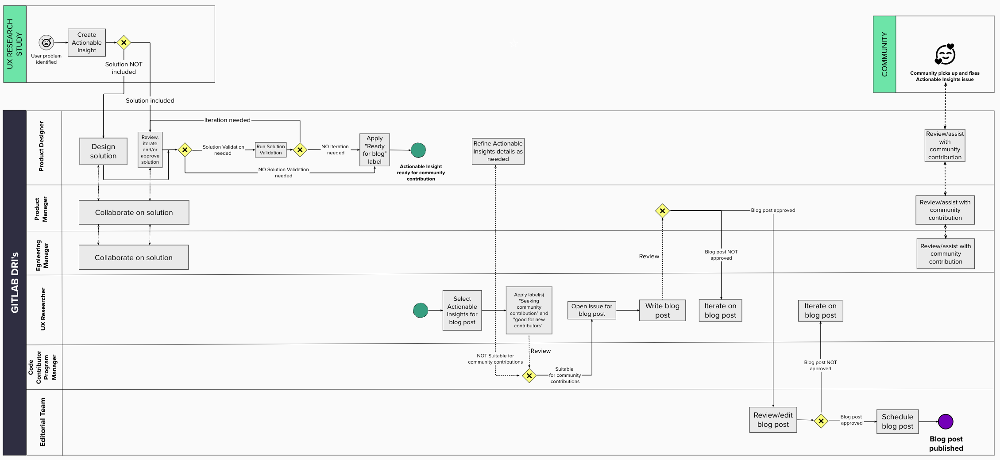

## On this page
{:.no_toc .hidden-md .hidden-lg}

- TOC
{:toc .hidden-md .hidden-lg}

UX Research is most valuable when insights are acted upon and result in implementation. As part of UX Research deliverables, [Actionable Insight issues](/handbook/product/ux/ux-research/research-insights/#actionable-insights) are created which allow product teams to pick up and fix the issues that UX research uncovers. What's great about GitLab is that [everyone can contribute](/company/mission/), not just our internal product teams. Engaging the wider GitLab community and asking for their support may help to get Actionable Insights addressed more quickly and with that improve the experience of using GitLab. One way to help surface those insights is by writing a blog post. 

The process below describes how UX Researchers can create blog posts calling for community contributions to implement solutions that address user problems identified in UX Research. 

## Who is involved and what are their responsibilities?

While UX Researchers are the DRI for creating the blog post, collaboration with the following team members is needed:
- Product Designers
- Product Managers
- Engineering Managers
- Editorial Team
- Code Contributor Program Manager

**Responsibilities**

The table below outlines key responsibilities. Refer to the [blog creation workflow](/handbook/product/ux/ux-research/community-contributions-for-actionable-insights/#what-does-the-blog-creation-workflow-look-like) for more details.

| Role | Responsibility |
| ------ | ------ |
| Product Designer | - Designs or reviews, and approves the solution to address the user problem outlined in the Actionable Insight issue (in collaboration with Product Managers and Engineering Managers)     - Conducts Solution Validation as needed     - Applies "Ready for Blog" label |
| UX Researcher | - [Writes blog post](/handbook/marketing/blog/) including links to Actionable Insights     - Applies label(s) “Seeking community contribution” and “good for new contributors” (if known)     - Opens [issue for blog post proposal](https://gitlab.com/gitlab-com/www-gitlab-com/-/issues/new?issuable_template=blog-post) |
| Product Manager | - Collaborates with Product Designer on solution to address identified user problem     - Reviews and approves blog post |
| Engineering Manager | - Collaborates with Product Designer on solution to address identified user problem |
| Code Contributor PM | - Reviews selected Actionable Insights and ensure they are suitable for community contributions     - Reviews blog post for proper language and focus for community contributions |
| Editorial Team | - Reviews, makes final edits and approves blog post     - Schedules and publishes blog post |

### What does the blog creation workflow look like?

View the workflow in [Mural](https://app.mural.co/invitation/mural/gitlab2474/1659097338577?sender=u5784f7c9d931cd5b88a66817&key=e69fdb2e-3216-4255-9f79-1b20bddcda82).

### What content should I include in my blog post?

It’s recommended to include the following information in a blog post:
- Research topic (What we did)
- Insights (What we learned)
- Solutions (What we want to change, and why)
- Link to Actionable Insights issues for community contributors to pick up

To motivate contributers and set them up for success, it may be helpful to include links to recently completed Actionable Insights by the community or linking to useful information about how to [Contribute to GitLab](/handbook/marketing/community-relations/code-contributor-program/). 

For inspiration, take a look at the [first published blog post](https://about.gitlab.com/blog/2022/07/25/5-problems-you-can-help-us-solve-right-now/) and the corresponding [issue for the blog post proposal](https://gitlab.com/gitlab-com/www-gitlab-com/-/issues/13599). 

