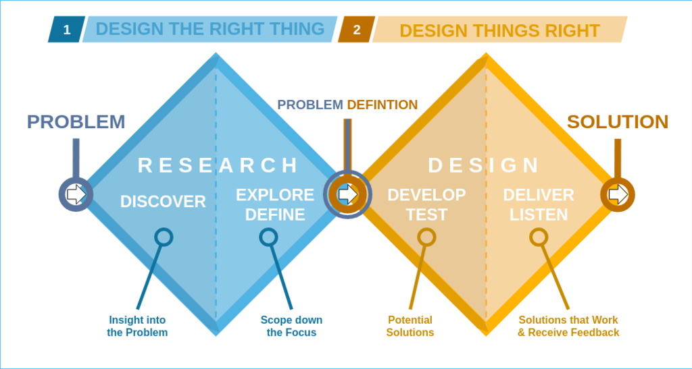

# On this page
{:.no_toc .hidden-md .hidden-lg}

- TOC
{:toc .hidden-md .hidden-lg}

## Early Solution Validation Research Process for Navigation 
This process is intended to enable rapid iteration for early solution validation research projects that focus on navigation. The goal is to provide a process for most early [solution validation](https://about.gitlab.com/handbook/product/ux/ux-research/solution-validation-and-methods/#what-is-solution-validation) research needs, provide easy-to-follow guidance for Product Designers, and enable early solution validation research to be planned quickly. In the double diamond framework, this is in the [develop/test](https://en.wikipedia.org/wiki/Double_Diamond_%28design_process_model%29) phase of the design lifecycle. The goal is to evaluate early navigation designs and concepts to build confidence in those ideas before fully investing in them. This guide does not cover later solution validation usability or benchmarking studies. 

 
The table below describes three methods that can be used with early solution validation research. The goal is to provide direction for a navigation design by collecting qualitative insight to understand the 'why,' rather than focusing on benchmarking or measuring the design. 

| Goal                                                                                                                                                            | Method                                    | Types of questions this can answer                                                                                                                                                                                                                                                                                                                 | Prototype fidelity needed                                                                                                                                                                                                                                                         | Sample size                                        |
|-----------------------------------------------------------------------------------------------------------------------------------------------------------------|-------------------------------------------|----------------------------------------------------------------------------------------------------------------------------------------------------------------------------------------------------------------------------------------------------------------------------------------------------------------------------------------------------|-----------------------------------------------------------------------------------------------------------------------------------------------------------------------------------------------------------------------------------------------------------------------------------|----------------------------------------------------|
| Learn where users would initially click to complete a task, and why.                                                                                            | [First click testing](/handbook/product/ux/ux-research/first-click-testing/)                       |  Do users know where to first click to get to a navigation element?     Does the proposed layout make sense, why or why not?     Does the hierarchy of your information architecture make sense, why or why not?     Do users know where they are in the application, why or why not?     Are UI elements standing out to users?                   | Static images, even a sketch if there is enough detail.                                                                                                                                                                                                                           | 30* see first click testing page for more details. |
| Learn if users can navigate to a relevant task/tasks beyond 1-2 clicks, assess basic usability, and learn how the design is perceived and why. (single design). | [RITE (qualitative usability testing)](/handbook/product/ux/ux-research/using-rite-to-test-navigation/)      |  Do users know where to go to complete a task, why or why not?    Can users complete tasks with your navigation design, why or why not?     Does the proposed navigation design layout make sense, why or why not?    Do users know where they are in the application, why or why not?     Are UI elements standing out to users, why or why not?  | Prototype with enough fidelity to test the basic interactions. For example, if you want to assess whether users can navigate to an area, you would need an interactive prototype that allows users to complete that task, and ideally be able to click a couple of “wrong” areas. | Start with 5   (per round of testing).             |
| Compare multiple early prototypes and learn if one performs better than the other with basic usability and why, and learn how users perceive each design.       | [Comparative qualitative usability testing](https://about.gitlab.com/handbook/product/ux/ux-research/comparative-testing-for-navigation/) |  Which navigation design performs better, and why (e.g., task completion)?      Which design enables users to complete their task/achieve most easily?     Which design do users prefer, and why?                                                                                                                                                  | Same as with RITE testing with one design. The prototypes should have enough interaction and detail to be able to compare the differences between the designs.                                                                                                                    | Start with 5.                                      |

### Who should we test with since navigation impacts all users?
For navigation studies recruiting should be standardized to be able to compare studies over time. The aim is to recruit a broad range of users that represent our general user base:
- A mix of technical and nontechnical users
- A mix of company size
- Experienced users that have been using GitLab for at least 3 months 

There may be studies that require a more narrow focus on specific areas that are relevant for a subset of our users. In this case, we would recruit those specific personas. 
- If is it a persona that is not as well understood with your team, it is recommended to collaborate with stakeholders that are knowledgeable about the specific persona to determine relevant tasks and ensure proper recruit based on job responsibilities/other attributes that may be relevant for that persona (such as company size, frequency of usage of GitLab, experience with GitLab (new vs experienced users, and length of time using GitLab for experienced users, etc).   
 

### What tasks should we use to test navigation?
For navigation studies, tasks should be standardized to be able to compare studies over time. This can be achieved by developing a core group of navigation tasks (in progress) that can apply broadly to most GitLab users. Considerations for what tasks were included in this core task list include:  
- Top tasks identified in previous research that apply to a broader range of users
- Tasks used in previous navigation research that apply to a broad range of users
- Commonly clicked areas in the current navigation experience
- Common tasks that apply to a broad range of users that are associated with known issues/pain points 
    

For studies that target a specific persona, it is recommended to collaborate with stakeholders that are knowledgeable about these personas to identify relevant tasks. 
- One suggestion is to consider the [differentiating tasks (internal link)](https://docs.google.com/document/d/1MpNTFpdNc-ysOD2Um0uy9ZRMw6hA4yZTARbDTctbo8M/edit) for each persona. However, these are written in a way that can be used for screeners, but not for testing. These would need to be framed and written as things they can do in GitLab for the purpose of testing.
    - For example, a Sasha task is “Translate product designs into code”
    - This may be reframed as something like “Where would you find a list of all code changes that have been assigned to you for review across every project you are participating in?.”

