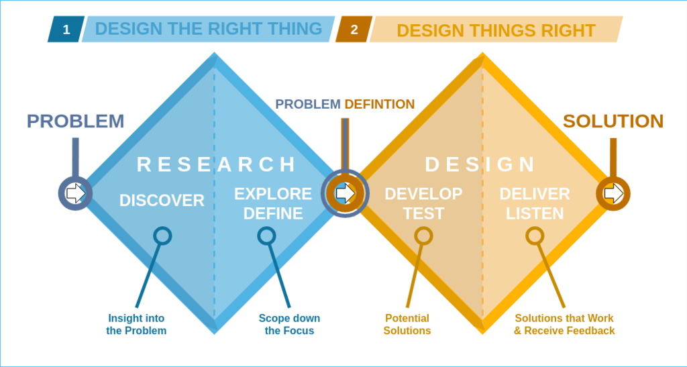

# On this page
{:.no_toc .hidden-md .hidden-lg}

- TOC
{:toc .hidden-md .hidden-lg}

## Evaluating navigation changes

Navigation is the structure that supports the rest of our experiences. Users rely on it to know where and how to do their most important tasks in our product. When we propose any changes to navigation, it's important that we proceed with high confidence. 

Depending on where teams are in their design process different methods and metrics need to be applied. The double diamond framework offers two distinct phases focused on designing things right: Develop/Test and Deliver/Listen. This page provides an overview of metrics to use when evaluating navigation at both of these phases as well as over time once the change has been implemented.

### Develop/Test
 
This phase is about exploring a broad set of navigation solutions and collecting user feedback to narrow down the solutions for further iteration. We also refer to this as early solution validation or early concept testing. During this phase you may need to answer questions such as: 
 
- Do users know where to first click to get to a navigation element?
- Does the proposed layout or information architecture make sense?
- What UI elements are standing out to users?
- Which design enables users to achieve their task more easily? 
- Which design do users prefer?
 
To learn more about suitable methods to address these questions, [continue reading here](/handbook/engineering/ux/ux-research-training/early-solution-validation-process-for-navigation/).
 
 
### Deliver/Listen
 
Once a new navigation solution has been identified from the previous phase, it's important to understand how this suggested improvement compares to the existing experience and how it performs over time. You may need to answer questions such as: 
 
- How does the new navigation compare against the existing navigation?
- Are there differences between different user groups (e.g., new vs mature GitLab users, different personas)?
- How does extended use of the navigation influence users' perceptions?
- How does the user’s perception and sentiment towards navigation changing over time?

We are in the process of adding handbook pages providing details about methods to address these questions, such as our quarterly navigation survey that is conducted to monitor user perception and sentiment towards navigation over time. 

## Our approach to evaluating navigation changes
Different stage groups may suggest changes to the Navigation experience and it’s important to understand how these suggestions impact the Navigation’s overall usability. 
 
A core set of metrics, that can be utilized by any stage group, is needed to measure improvement in a consistent way. The metrics below consist of standard usability metrics as well as design specific metrics. Design metrics reflect themes that emerged from SUS feedback and that guide the team’s work.

**Standard usability metrics**
- Effectiveness (= Task success)
- Ease of use (= Subjectively perceived task difficulty)
- Efficiency (= Subjectively perceived effort)

**Design metrics**
- Discoverability (= Discovering new features)
- Simplicity (= Minimize feeling overwhelmed)
- Orientation  (= Knowing where you are)
- Findability (= Finding the things that need attention, including picking up where I left off)

The core set of metrics are meant to be included as **a minimum set of metrics in any navigation research study IF** that’s suitable considering the method chosen for the study. E.g. A survey would not need to include the metric on effectiveness. In addition, it’s ok and encouraged to add additional metrics if that’s meaningful for the study's purpose (e.g. adding a [confidence metric for a first click testing](/handbook/product/ux/ux-research/first-click-testing/#methodology-details) or adding a metric about a user’s ability to navigate to a project as done for the [Navigation Northstar Beta Testing](https://gitlab.com/gitlab-org/ux-research/-/issues/2208#metrics). Teams should feel comfortable triangulating success using multiple metrics.
 
In the event that none of the metrics indicate improvement on a proposed solution, we encourage teams to use the collected data to make a holistic, subjective decision that is supported but not dictated by the metrics.

| Metric          | Definition                                                                                                                    | How we measure it                                                                                                                                                                                     |
|-----------------|-------------------------------------------------------------------------------------------------------------------------------|-------------------------------------------------------------------------------------------------------------------------------------------------------------------------------------------------------|
| Effectiveness   | A binary measure of a user's ability to find an item when given a task. It shows the success or completion rate of each task. | The pass rate can be determined by dividing the umber of participants that were able to complete the task by the total number of participants.                                                        |
| Ease of use     | A user’s subjectively perceived task difficulty                                                                               | “How easy or difficult is it to use the GitLab navigation?” - Extremely difficult - Somewhat difficult - Neither easy nor difficult - Somewhat easy - Extremely easy                                  |
| Efficiency      | A user’s subjectively perceived effort to accomplish something                                                                | "When completing your day-to-day tasks, how efficient or inefficient is the GitLab navigation?" - Extremely efficient - Efficient - Neutral - Inefficient - Extremely inefficient                     |
| Discoverability | A user’s ability to discover new GitLab features through the GitLab navigation                                                | “How easy or difficult is it to discover features that are new to me through the navigation? - Extremely difficult - Somewhat difficult - Neither easy nor difficult - Somewhat easy - Extremely easy |
| Simplicity      | A user’s perceived feeling of being overwhelmed                                                                               | “How would you describe the GitLab navigation?” - Very simple - Simple - Neutral - Overwhelming - Very overwhelming                                                                                   |
| Orientation     | A user’s ability to know where they are in GitLab                                                                             | “How easy or difficult is it to know where you are when navigating throughout GitLab?” - Extremely difficult - Somewhat difficult - Neither easy nor difficult - Somewhat easy - Extremely easy       |
| Findability     | A user’s ability to find what requires their attention, including being able to pick up where they left off.                  | “How easy or difficult is it to find the things that require my attention?” - Extremely difficult - Somewhat difficult - Neither easy nor difficult - Somewhat easy - Extremely easy                  |

