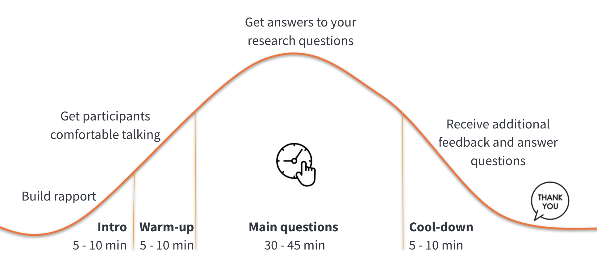

## On this page
{:.no_toc .hidden-md .hidden-lg}

- TOC
{:toc .hidden-md .hidden-lg}

User interviews are a great way to understand expectations, attitudes and behaviors of users better. While it’s often easy to talk to users, getting meaningful insights is not trivial. Below we provide tips to consider before, during and after an interview.

## Before the interview

**Set a clear goal and prepare a semi-structured interview guide**

A user interview is not just a conversation. You must have a clear objective for what kind of information you want to gather, including information that should NOT be collected or is out of scope. All of this gets outlined in a Google document called ["discussion guide template"](https://docs.google.com/document/d/1ERpTsQs7vcKKHLFZ5qoTukUFFA1sdazaFzknsX0Ju5Q/copy). 

Discussion guides can be set up in different ways, but to allow for a natural flow of information, you'll want to use a semi-structured format. In a semi-structured discussion guide, you have a fixed set of questions, but the order and depth of those questions can vary depending on the flow of the conversation.

**Find a partner for note taking**

Ideally, partner with another team member to support you with note taking, so that you have more space to focus on talking. Your partner can also think of additional questions and remind you of questions that you forgot. 

We have a [note-taking template](https://docs.google.com/spreadsheets/d/1hnIqg-fnCYW2XKHR8RBsO3cYLSMEZy2xUKmbiUluAY0/copy) that asks you to provide focus areas, which represent the important information you want to gather during the interview. Note takers don’t have to take notes on everything a user says; instead, help them understand ahead of time what's important to focus on.

**Put yourself in a good mood and relax**

Users are more likely to talk and let their guard down when they feel relaxed. You can support this by being relaxed and in a good mood yourself. Use the 5 - 10 minutes before the interview to disconnect from other work, take some deep breaths, move around, listen to your favorite song, dance, laugh… or do anything else that gets you excited about the opportunity to speak to a stranger and learn something new.

**Reduce distractions**

Disable notifications on your computer, put your phone on silent, and disable any other distractions that could take your attention away from users.

## During the interview

**Follow the conversational arc**

Every interview consists of distinct phases that are important to follow, because they help users to feel comfortable during the interview.

**Introduction:** Make sure users feel comfortable by introducing yourself, informing them about the purpose of the interview, and asking if they have any questions. It’s helpful to be welcoming and friendly, so smile and look at users as they join the session. Avoid fidgeting and crossing your arms. 

**Warm-up:** Sometimes users are a bit nervous at the beginning, because they don’t know exactly what they will be asked and how they can help you. To ease the nervousness, start with easy questions (such as their role, company, what a typical day looks like for them, or why they wanted a career in their current role). 

**Main questions:** This is the major chunk of your interview, so it’s important to keep track of time to make sure you can cover all of the important questions. It’s ok to deviate if something interesting comes up, as long as you can still manage to get answers to your main questions.

**Cool-down:** Leave time at the end to answer any questions users might have or give them time for any additional feedback. GitLab users, in particular, tend to have a couple of things they want to share with you about their experience, and you don’t want to miss that. Don’t forget to thank users for their time and feedback.

## Tips for interviewing

The following tips refer to the warm-up and main question section, as you spend most time on those during an interview.

**Listen actively**

Most of the interview should consist of the user talking. YOU should be the one LISTENING. If you hear yourself talking a lot, take that as a sign to bring your awareness back to the user and let them talk. Active listening encourages the user to continue talking, and you support this by showing them that you are following along through nodding, eye contact, and short affirmative statements ("OK," "I see," "mmhmm…"). 

Embrace silence that might come up, as it is an opportunity for the user to think more and reflect. Allow for these silent moments to happen instead of filling them with other questions or prompts. Continue to look at users attentively during the silence. 

**Stay open and neutral**

Resist the urge to respond when listening to users, even if it’s just a response in your head. The moment you begin forming a response, you are not listening attentively anymore. Even if they are criticizing your work strongly and you might take their feedback personally, resist the urge to explain, educate, or sell anything. Listen openly, and leave the interpretation for later.

**Establish trust through empathy**

Users need to trust the interviewer before they can be open and honest, especially for more sensitive topics. Building trust with a complete stranger can be difficult to do within a single 30 or 45 minute interview. Interviewers can build trust with a user by developing empathy. Interviewers can show they have empathy for the user through several different ways:

- Take users' problems seriously by engaging in active listening
- Consider your tone of voice when responding to a user about their personal story 
- Make sure your body language matches the type of conversation you are having with a user
- Ask follow up questions that flow naturally from the conversation
- Mirror back to them what they say and then confirm that the interpretation was correct 

**Ask great questions**

- Prioritize open ended questions, which are any question that can’t be answered with a Yes, No, or Maybe. Aim to have questions that start with What, When, Who, Where, Why or How (WWWWWH) to get more details. Instead of asking “Do you…?”  ask, “How do you…?” or “What do you…?” 
- Another type of Yes/No question you want to avoid is future-facing questions that require the user to predict future behavior. These questions usually start with "Would you..." (for example, “Would you buy this?” or “Would you use this?”). Answers to future-facing questions are rarely accurate. Instead, you want to understand the unmet user needs and how much the proposed feature supports them (or if it’s of value to the user and why). 
- Instead of asking what users usually do, ask for specific situations to gather more accurate data, such as the last time they experienced or did something. It’s also helpful to ask about extreme situations or critical incidents, which are situations that stand out very positively or very negatively. People tend to remember extreme situations better. 
- Don’t settle for the first answer, but ask follow-up questions (WWWWWH). Asking _Why?_ is a great way to dive deeper, especially if a particular case or problem is described. A popular way to get to the core is to ask _Why?_ multiple times. Usually by the 5th time, you will get to the cause of the problem.

**Avoid leading questions**

To make sure you don’t just hear what you want to hear from users, avoid questions that frame the user’s mind around a particular answer. One way to spot leading questions is to evaluate whether your question already provides an answer. For example, “How do you like this new feature?” implies that the user must like it or that there is something likable in the feature. You might think that users will just say that they didn’t like it, but it’s much harder for people to not conform and say "No." Instead, ask more openly, “How do you feel about this new feature?”

You can minimize risk by having a great discussion guide that doesn’t include any leading questions.

**Encourage show & tell**

There is a huge difference between what people say they do and what they actually do &mdash; especially if it’s something that they do regularly and have automated to some extent. As much as possible, ask users to show you how they do their tasks, because it provides much more nuance than they can verbalize. 
In addition, relying only on verbal feedback can lead you to project your own expectations. That means that as a user is describing something, you let YOUR previous experience influence how you interpret the words. Getting additional visual cues helps you to reduce bias.

**Observe non-verbal cues**

Keep an eye on facial expressions, and don’t hesitate to enquire about them (for example, why a user rolled their eyes or giggled about something). Body language can tell you if a person is bored and would benefit from some encouraging words, such as “This is so helpful” or “That’s interesting feedback.” Similarly, you can make adjustments if they are annoyed (in which case, you might skip the question and avoid similar ones for the rest of the interview) or excited/passionate (in which case, you might ask more follow-up questions to learn more). 

**Minimize note taking**

Instead of taking detailed notes, keep your focus on asking great questions and listening actively. If you try to do all of it, the interview is much harder to manage. Remember, you have the recording, maybe even a dedicated note-taker, and your brain (which can hold quite a bit of information, too).

Refer to the [Documenting research findings page](/handbook/product/ux/dovetail/) for more information on how to create insights and leverage Dovetail. 

## After the interview

**Decompress and take a break**

Interviewing takes energy from you. If you run multiple sessions in a day, make sure to leave enough time for breaks in between. 

**Brain dump your learnings**

Take some time after an interview to write down any thoughts and learnings you gathered from the conversation. It’s impressive how much information we can remember without taking notes; however, you will forget a lot if you wait until the end of the day or after the next interview.

## Interview Training

If you're interested in improving your interviewing skills, consider signing up for the [Interview Carousel](/handbook/product/ux/ux-research/interview-carousel/), a lightweight interview training program run by the UX Research team. 
