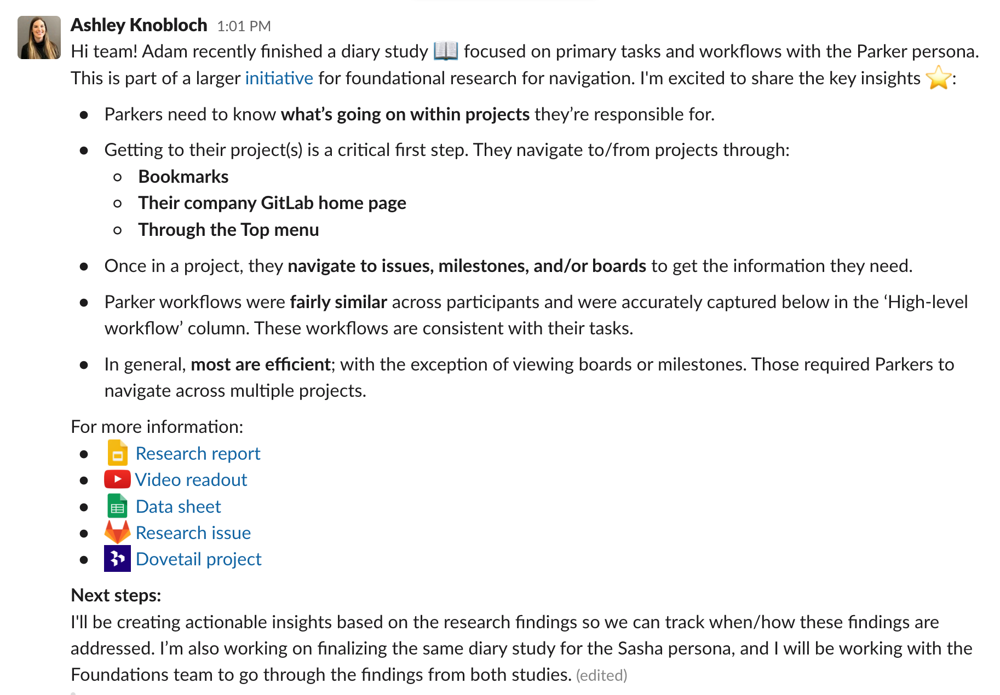

## On this page
{:.no_toc .hidden-md .hidden-lg}

- TOC
{:toc .hidden-md .hidden-lg}

## Team structure

The UX research team is comprised of [UX Research Operations Coordinators](/handbook/product/ux/ux-research-coordination/) and [UX Researchers](/handbook/product/ux/ux-research/)).

- UX Research Operations Coordinators own the participant recruitment process and all things related to research operations.
- UX Researchers work within their assigned stage groups, where they conduct UX research on their own and consult on research efforts being done by their teams.

### How UX Researchers are assigned

Each UX Researcher is assigned to multiple, related stage groups, so they can focus on a larger product area. They work closely with Product Managers and Product Designers to ensure research projects are focused and provide answers to design questions. You can find more information on these stage groups [here](/handbook/product/categories/#devops-stages).

The designated UX Researcher is the go-to person for their assigned [stage groups](/handbook/product/categories/). For collaboration in projects and subjects:

| Section: Stage Groups | Assigned DRI |
|---------|-------------------------------|
| **Enablement**: Distribution, Geo, Memory, Global Search, Database, Pods  **SaaS Platforms**: GitLab Dedicated, Delivery  **Ops**: Configure, Release, Respond, Observability | [Will Leidheiser] |
| **Growth**: Activation, Conversion, Expansion, Adoption  **Fulfillment**: Provision, Purchase, Utilization  **Analytics**: Product Intelligence | [Nicholas Hertz] |
| **Manage**: Authentication and Authorization, Organization, Import, Integrations, Foundations | [Ashley Knobloch] |
| **Plan**:Project Management, Product Planning, Certify, Optimize | [Danika Teverovsky]|
| **Secure**: Static Analysis, Dynamic Analysis, Composition Analysis, Dynamic Analysis: Fuzz Testing, Vulnerability Research   **Govern**: Security Policies, Threat Insights, Compliance | [Michael Oliver] |
| **Create**: Source Code, Editor, Code Review | [Ben Leduc-Mills] |
| **Ops**: Pipeline Execution, Pipeline Authoring, Runner, Pipeline Insights, Package | [Erika Feldman] |

[Will Leidheiser]: https://gitlab.com/wleidheiser
[Nicholas Hertz]: https://gitlab.com/NickHertz
[Michael Oliver]: https://gitlab.com/moliver28
[Anne Lasch]: https://gitlab.com/alasch
[Ben Leduc-Mills]: https://gitlab.com/leducmills
[Erika Feldman]: https://gitlab.com/enf
[Ashley Knobloch]: https://gitlab.com/aknobloch
[Danika Teverovsky]: https://gitlab.com/dteverovsky

## How UX Researchers work

1. We collaborate with Product Designers, Product Managers, and Engineers to collectively determine what areas to conduct research on. The UX Research department works within the [Product Development Flow](/handbook/product-development-flow/#overview--philosophy) as they partner with Product Management and Product Design.  Additional details can be found [here](/handbook/product/ux/ux-research/research-prioritization/) on how UX Reseachers prioritize research projects.

1. We follow a [priortization process](https://about.gitlab.com/handbook/product/ux/ux-research/research-prioritization/) that helps us distribute our time effectively across the research projects occurring within our stage groups.

1. Like other departments at GitLab, UX Researchers follow the [Product Development Timeline](/handbook/engineering/workflow/#product-development-timeline) and use milestones to schedule their work. Milestones change monthly ([find out the dates for upcoming milestones](https://gitlab.com/groups/gitlab-org/-/milestones)).

## How UX Researchers decide what to research
UX Researchers collaborate with Product Managers to determine the scope of research studies. Where possible, UX Researchers should try to attend planning meetings for their designated groups.
UX Researchers should proactively offer ways in which they can assist in the delivery of research. They should also suggest and discuss their own ideas for research studies with Product Managers.

## How UX Researchers spend their time
UX Researchers have the following guidance on how they should be spending their time:

* **[<10% Solution Validation](/handbook/product/ux/ux-research/solution-validation-and-methods/)** - This translates to less than 10% of a researcher's time being allocated to assisting Product Designers and Product Design Managers with Solution Validation research. Solution validation research at GitLab is led by Product Designers, with support from Product Design Managers. Occasionally, Product Design Managers may need to escalate queries about solution validation research to UX Researchers for advice and feedback.

      - If capacity allows, UX Researchers can help with conducting solution validation research.
Product Managers and Product Designers follow the steps in the [Validation phase 4](/handbook/product-development-flow/#validation-phase-4-solution-validation) when planning and executing solution validation research.

* **[~60% Problem Validation](/handbook/product/ux/ux-research/problem-validation-and-methods/)** - Researchers spend more than half of their time working with Product Managers conducting Problem Validation research, with the long-term goal of investing their time towards training and mentoring.

* **[~30% Foundational Research](/handbook/product/ux/ux-research/foundational-research/)** - Ideally, 1 big project per researcher, per quarter. These are projects are a type of problem validation where little to no information is known about the problem, often using a mixed methods research design. Examples:

Four noteworthy benefits to conducting Foundational research:
1. Researchers gain subject matter knowledge in that topic
1. Researchers have an opportunity to impact Product and influence strategy
1. Career growth opportunities
1. The business benefits by gaining more knowledge/data in an specific area

## How UX Researcher conduct peer reviews
UX Researchers will frequently drive research projects themselves in close collaboration with Product and/or Design.  When this occurs, UX Researchers will take part in a peer review process on the following research artifacts:

- Participant screeners
- Test plans
  - Materials contained in the test plan can include:
    - Scripts 
    - Surveys 
    - Card sort activity 
    - etc
- Final reports/output of the research  

There are many benefits to a peer review process:
- **Visibility** - UX Researchers will be more informed about the research being conducted outside of their direct area of coverage.
- **Learning** - UX Researchers can learn from each other by reviewing the approaches being taken and the justification behind those approaches.
- **Quality** - Research deliverables will be more standardized and of higher quality as a result of a peer review.
- **Onboarding** - New UX Research hires will benefit by seeing standardized examples and learning about the quality bar to replicate.
- **Diversity** - We value diverse views and perceptions on how the content is being interpreted.
- **Mentoring** - UX Researchers will have more opportunities to mentor each other in their craft.
- **Consistency** - Participant screeners, in particular, will have a more standardized approach to how we ask the same questions across the team.

The UX Research peer review process is designed to be asynchonous and inclusive to all UX Researchers.  The process is as follows:

1. **Share** - A UX Researcher has either a test plan and/or a final report that needs to be peer reviewed.  **They ensure it's shareable and editable.**
1. **Post** - Within the _#ux_research_team_lounge_ Slack channel, they post a link to the test plan or final report, along with a request to review.  They include a date and time that they need feedback by.
     - Example: _"Hi - can I please request a review of this test plan (link)?  Feedback is needed by Thursday.  Thank you!"_
     - Best practice: Reviewers should aim to provide reviewers at least 24 hours to review.
1. **Review** - The reviewer provides feedback directly in the document, issue, etc.
1. **Inform** - When the review is complete, the reviewer responds to the thread and mentions the UX Researcher.
     - Example: _"@ name - your testplan has been reviewed.  Let me know if you have any questions!"_
1. **Edit** - The UX Researcher looks at the feedback, follows up on any questions, and makes any adjustments necessary.
1. **Mark as done** - When complete, they put a green check mark emoji reaction on their original post, indicating that the peer review request has been completed and is closed.

UX Researchers are all required to take part in a peer review with their participant screeners, test plans, and final reports that they've created.  Additionally, it's strongly encouraged for UX Researchers to help their peers by reviewing anything submitted through the peer review process.

When reviewing suggestions from peers asynchronously, it's a best practice to provide a note or explanation when closing suggestions.  This is done to explain any rationale behind any decisions made around the suggestion and to add closure to the suggestion.

Ultimately, it's up to the owner of the document to decide which suggestions they'd like to apply.

## How UX Researchers socialize research findings
When we drive our own research projects, it means we're also responsible for socializing those insights.  The most effective way to do that is as follows:
- Create a brief into on what was done. (Example: _Hi team! I recently finished a tree test :deciduous_tree: on the left sidebar navigation focused in the Monitor, Infrastructure, Deployments, and Packages & Registries items with experienced GitLab users. I'm excited to share the key insights :star: :_)
- List 3-4 bullets with the key insights. These should not include any detail - just very short sentences on the high-level findings.
- Links to the: Research report, Video readout, Data sheet, Research issue, Dovetail project
- A 'Next steps' sections that includes bullets on what will be happening as a result of the research.  These should be links to issues that are actionable insights.
- The posting is shared out via Slack to _at least_ the three following channels: #ux, #ux_research, and #product.  It's advised to also share the posting in any relevant stage-group channels, too.

Below is an example of the formatting:

