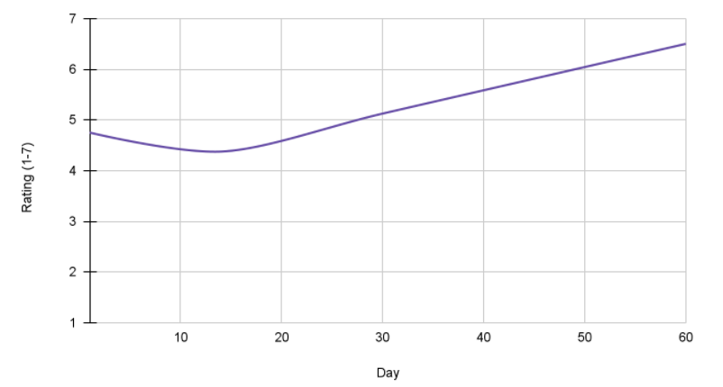

## On this page
{:.no_toc .hidden-md .hidden-lg}

- TOC
{:toc .hidden-md .hidden-lg}

A longitudinal study looks at how _something_ changes for the same group of people, over a period of time.  Data is collected at predefined time intervals to determine how the measures change over the designated period of time.  

### When to use?

Longitudinal studies are perfect to help teams answer research questions that are associated with an element of time.  Sometimes teams want to understand how perceptions, knowledge gain, etc, may change over time.

Some examples:

- _How will users react to a new navigation scheme, even after using it over a period of time?_
- _How does confidence and product knowledge change for new users as they’re starting to use GitLab during their first 60 days?_

### Which methods are used?

Longitudinal studies typically combine use of multiple methods. Determining which methods to use for longitudinal studies is based on the research question(s) that need to be answered.  Essentially, you will want to choose methods that will best answer your research questions.  Here are some examples of methods that can be used for a longitudinal study:

- [Interviews](/handbook/product/ux/ux-research/facilitating-user-interviews/) - It's a best practice to start every longitudinal study with interviews that help to establish a relationship with your participants. This is particularly important in longitudinal studies, since you will have multiple touchpoints with each participant throughout the study. Interviews also allow you to set expectations about the study's cadence and timeline, while allowing the participant to ask any clarifying questions about their role.  

- [Diary studies](/handbook/product/ux/ux-research/diary-studies/) - These are often incorporated into longitudinal studies, where participants are asked to document something they’ve done over a period of time.

- [Surveys](https://www.linkedin.com/learning/surveys-and-questionnaires-for-ux-projects/getting-good-feedback?u=2255073) - It can be helpful to run surveys throughout the course of your longitudinal study, mainly as a way to revisit the key measures and determine how those have changed over time. Note that these can be done through a survey tool, like [Qualtrics](https://about.gitlab.com/handbook/product/ux/qualtrics/), or verbally through interviews.

To reiterate the importance of interviews: they’re critical to understanding the ‘why’ behind the data that may appear in diary studies and the ratings that participants provide within surveys.  The ‘why’ can directly lead to clear actions, too.

Touchpoints, or formal contacts with participants, are a necessary part of a longitudinal study.  They’re used for a number of reasons:
- To check in on participants
- As an opportunity to assess the key measures
- To dive in deeper on the ratings and data that the participant has provided to date

### Measures

The measures used for longitudinal studies can vary greatly and depend entirely on the research question(s) being answered.  However, always consider the factor of time when planning key measures, so you can demonstrate fluctuations to things like attitude or confidence throughout the course of your study.  Examples:

- Confidence in using the product (1-7 Likert scale rating) - collected at Day 1 (control), Day 14, Day 30, Day 60
- Effectiveness in using the new navigation (1-7 Likert scale rating) - collected at Day 0 (control), Day 1, Day 14, and Day 30

The above examples use self-reported measures, but it’s certainly possible to leverage usage data, instead, by tracking measures like error counts over time.

A sample output could look something like the following chart, which demonstrates how the measure changes over the designated period of time for a single participant:

### Steps to conduct a longitudinal study

1. Ensure your research question(s) can best be answered through a longitudinal study.
1. Design an achievable longitudinal study by considering variables like: GitLab versions, permissions, personas, JTBD, GitLab and technical experience, etc.  Among the variables you consider, determine what are the key measures too.
1. Think through a data management plan, as longitudinal studies yield a significant amount of data. This includes how you will store, organize, and eventually analyze the data.
1. Determine the timeframe during which the study will take place, along with the necessary amount and cadence of planned touchpoints.
1. [Open a recruitment issue](/handbook/product/ux/ux-research/recruiting-participants/#open-a-recruitment-request-issue) that outlines the number of touchpoints and time commitment for each one.
1. Determine the gratuities for each touchpoint.
1. During initial 1:1 interviews, work with participants directly to schedule the upcoming touchpoints.
1. Work with the [UX Research Operations Coordinator](/handbook/product/ux/ux-research-coordination/) to make sure gratuities are delivered in an efficient and timely fashion.

### Challenges

Longitudinal studies have their own set of challenges that you should be aware of:

- They naturally **take time to conduct** &mdash; often months due to the time component involved.
- Since there are multiple touchpoints per participant, that translates to **additional effort** for the DRI conducting the research.
- Participant **attrition can be high** with longitudinal studies, so you may need to provide a higher incentive and/or recruit additional participants up front to account for participants you will lose along the way.
- Longitudinal studies can result in a **significant amount of data**.  DRIs can become overwhelmed, if a data management plan isn’t in place prior to starting.

### Tips and tricks

**Gratuities** - A gratuity for each touchpoint is useful in keeping participants active.  However, offering a reduced gratuity amount for the touchpoints preceding the final touchpoint is a strategy one can take - as long as the final gratuity is much larger. This makes up for the previous smaller gratuities and also acts as an incentive for participants to see the study all the way through. The table below shows an example of how to design a gratuity structure that has more of an incentive at the end of the study:

| Touchpoint | Time scheduled | Gratuity amount |
|------------|----------------|-----------------|
| 1          | 45 minutes     | $30 USD         |
| 2          | 15 minutes     | $20 USD         |
| 3          | 15 minutes     | $20 USD         |
| 4          | 60 minutes     | $200 USD        |

**Set clear expectations** - Make it crystal clear to participants how important it is for them to complete the full study by taking part in all touchpoints. Otherwise, they don’t qualify for future gratuities and they’re removed from the study. Explain the purpose of the study, while stressing how important their participation is to the success of the research. You’d be surprised how invested they'll be in the project, if you share some details with them. Providing users the touchpoint schedule with dates can be helpful too. 

**Data management plan** - Focus only on what’s important. Typically, that means what is needed to answer the research question(s).  It’s okay to include some other data that supports the main insights, but set limits for yourself. It’s also helpful to input/analyze data &mdash; either in real time (during the interview) or immediately after it. Creating templates can help with this. The key is to be highly organized and disciplined in what you choose to capture, when you capture it, and how you capture it.

**Use Google Docs** - If you’re using a [diary study](/handbook/product/ux/ux-research/diary-studies/) approach, use Google Docs to create a template for the study. Then, use the template to create one document for each participant. Share the document with the participant and give them edit rights, so you have full visibility into their entries. If you feel they need a nudge, or if you have a question about one of their entries, you can just @-mention them in their document. At the conclusion of the study, be sure to unshare all documents, so that participants can't make additional changes.

**Get the ‘why’** - Make sure to build in opportunities to understand the ‘why’ behind the data you’re gathering.  This is critical in telling a complete and impactful story. 

**Give yourself time** - Remember that you’ll need a lot more time to conduct a longitudinal study than a usability study. You’ll also have a lot more data to look though and think about. Make sure to allocate additional time for yourself, and clearly set expectations with your stakeholders.

**Finding quality participants** - Since a longitudinal study requires a longer time commitment, getting quality participants and feedback is essential. A strategy you can use when screening participants is to do an intro interview first before inviting them into the study. Use this interview to collect some meaningful information, while also assessing the quality of feedback the participant provides.

