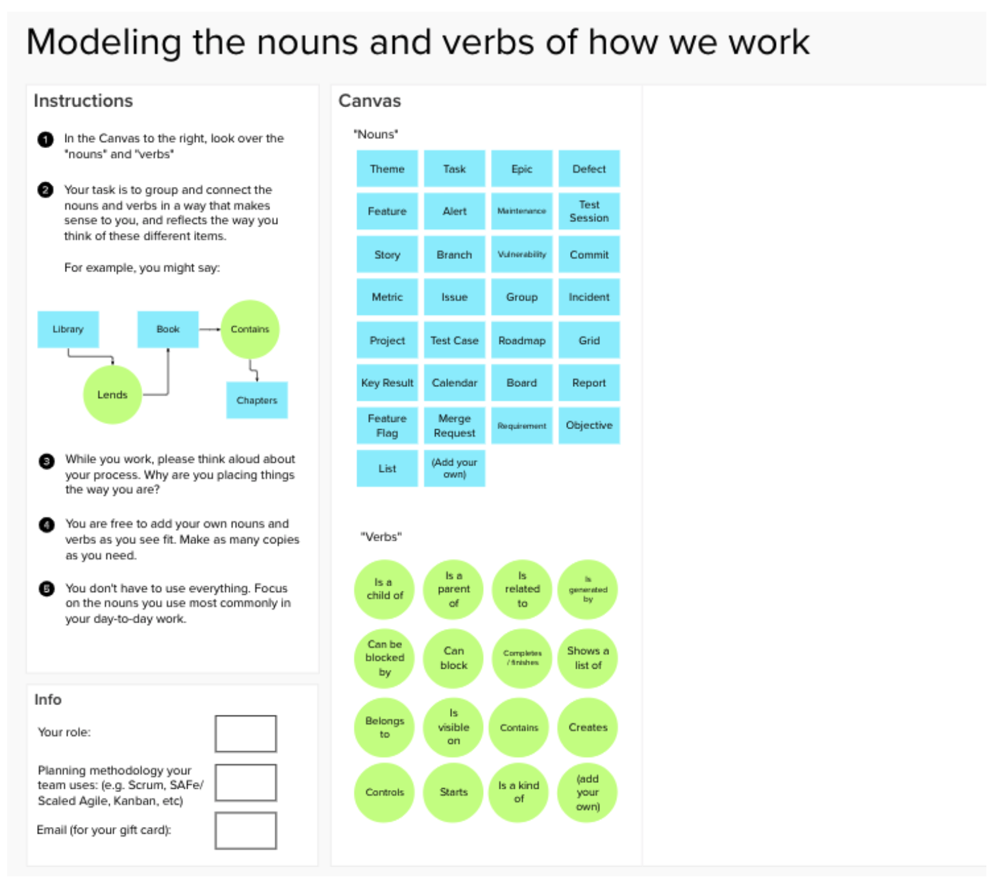
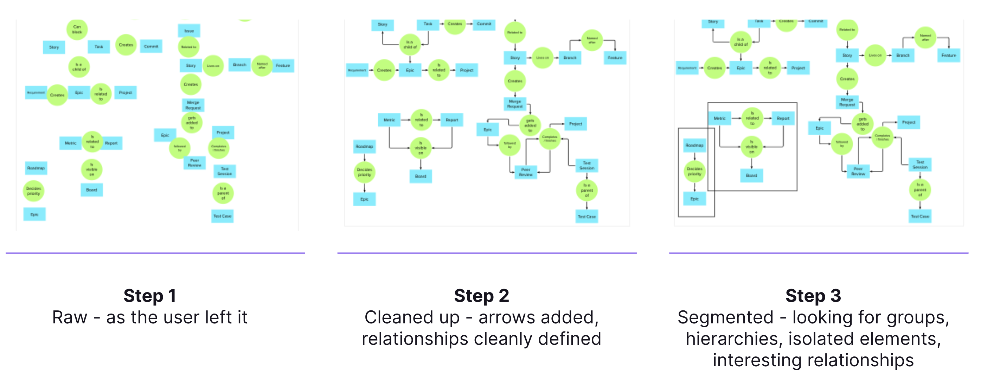
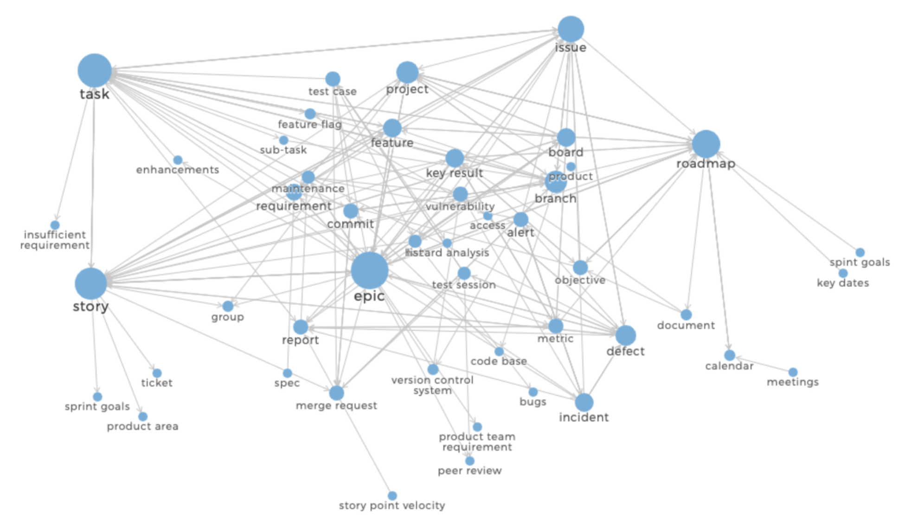

## On this page
{:.no_toc .hidden-md .hidden-lg}

- TOC
{:toc .hidden-md .hidden-lg}

A mental model is what a user *believes* to be true about how a system works. This definition has two implications worth pointing out: a user's mental model may in fact be misaligned with the Designer’s intent (or how the product is currently laid out), and that every individual may have a slightly different mental model given the same interface or product.

Nielsen/Norman Group [states:](https://www.nngroup.com/articles/mental-models/)

_“Mental models are one of the most important concepts in human–computer interaction (HCI)”_, and _“What users believe they know about a UI strongly impacts how they use it.”_

A mental modeling study aims to gather information on users’ beliefs about how your product operates. They are especially common when dealing with information architecture and navigation.

### When to do a mental modeling study

A mental modeling study can be done at any point in the product lifecycle, but it tends to be most impactful earlier on, when concepts are still in a more flexible state. A frequent use case is when designing or redesigning a product’s navigation, such as menus and sub-menus, etc. 

In actuality, mental modeling can be a useful exercise in clarifying any part of a product - or even the product as a whole.

## Types of mental modeling activities

There are a couple of different exercises that can be used to do mental modeling, and many variations from those main types. We will go over the two main types on this page: card sorting and cognitive mapping.

### Card sorting 

[Card sorting](https://www.nngroup.com/articles/card-sorting-how-many-users-to-test/) is a very common method in UX research for discovering how users might group a set of items, for instance in designing an information architecture. Card sorting reveals mental models by having the participant sort a deck of cards, each with a relevant term, into piles. This can be done in person with index cards, or virtually with a digital whiteboard tool (e.g., Mural, Miro, or Figma). 

You will end up with a set of piles containing the cards or terms a participant believes go together in some way. It is often helpful to have the participant give a name to each group, or to combine several groups under a new term they come up with - this is especially useful in determining multi-layered navigation models. 

Depending on the flexibility of the space you are trying to model, you can leave some cards blank and allow the user to add their own terms into the mix. This can be a great way of discovering gaps in your own mental model, but it can also introduce noise into the results.

### Cognitive mapping

Cognitive mapping, according to the Neilsen/Norman Group, is really an umbrella term for all visual representations of mental models. [This link](https://www.nngroup.com/articles/cognitive-mind-concept/) from them is a great resource to find out about the different flavors of maps (e.g., cognitive maps, mind maps, concept maps) and what each method is particularly useful for. 

At its core, cognitive mapping involves having a user create a visual representation of the system or area of interest you’re investigating. There are a few variables to consider when designing the mapping activity:

#### Structure

The context of your domain can help determine what kind of structure you use in your mapping exercise. For example, if you are focused on a strictly hierarchical space, such as exploring everything that might be under a menu item named ‘settings’, you may want to provide a visual representation that indicates levels of the menu structure. If it is something more abstract, perhaps a blank canvas is all you need.

#### Relationships

In card sorting, we only deal with ‘nouns’ – the objects or items we operate on. In mapping, we can also introduce ‘verbs’ – or the relationships between nouns. Verbs are typically represented by arrows (with labels) or are differentiated by shape from nouns (circles versus squares, for example). Gathering information about the relationships between objects can be extremely informative for studies aimed at understanding a more complex system, such as data flow through a system or organizational structure.

#### Vocabulary

You have the option of providing all the vocabulary to be used in the map, some of it, or none at all. Choosing the right set of words to provide will have a large impact on the outcome of your study. For our settings example, you may choose to have only that word. For a study on how people organize their refrigerators, some basic items or types might be provided. Other cases may demand a larger list of nouns and verbs, like understanding the relationships between different products as data travels through them.   

It’s important to reconcile these variables with the research goals you’re after. A well-designed mapping activity can yield a great deal of insight into the mental models of your user, and can have a large positive impact on product planning and implementation.

Below is the set up we used for a [recent mental modeling study](https://gitlab.com/gitlab-org/ux-research/-/issues/2076) using cognitive mapping. We wanted to gather the ways in which customers organized the different kinds of work items they dealt with every day. Because we had specific nouns and verbs in mind, we pre-populated areas of each, but allowed participants to add their own as they needed.

## Mental model analysis

Due to the variable nature of mental model studies (as discussed above), there isn’t one formula for analyzing the results of a mental modeling activity. However, there are some common techniques and things to look for when breaking down the results of your study.

### Card sorting analysis

Analysis for card sorting is fairly straightforward. You can look at the terms that appeared in the same piles as one another, and count them across participants. This will give you some numbers that indicate how ‘close’ the items are (called a similarity score). For instance, if term A and term B were always sorted into the same pile, they would have a 100% similarity score.

Additionally, if you collected names or terms for the groups of cards, you can compare those parent terms to each other (which group names surfaced more often, for instance), and compare which items fell underneath each group.

### Concept mapping analysis

Analyzing concept maps is less cut-and-dry. The techniques available to you will vary based on the structure of your map. Here we will go over two methods: segmentation and network graphing.

#### Segmentation

There are a few ways to do segmentation, but essentially segmentation is about looking at the shape of the maps and finding clusters of items or nouns that tend to be grouped together, and that form a weak link to the rest of the map (defined as having few connections coming into or going out from that group). 

When you see clusters like this that share common nouns and appear across many of the maps you review, it is an indication that a section of your map can be segmented in some way. It might be a particular workflow, a sub-process, or something else, but it is usually worth noting. For example, when examining concept maps of a product life cycle, you may find segments like ‘planning’, ‘execution’, or ‘validation’ that identify a part of the process.

Below is an example of the segmentation process, broken down into 3 steps. From left to right, we start with the raw map, clean it up, and then are able to see areas of the map that are isolated from the others (outlined in squares).

#### Network Graphing

For concept maps where both nouns and verbs (objects and relationships) are recorded, you can create a network graph. This is done by treating each noun as a node and each verb as an edge, and recording all the noun-verb-noun relationships. This involves going through your maps and tabulating all the unique relationships expressed. 

What you end up with is something like this:

 
This is from the same [mental model study](https://gitlab.com/gitlab-org/ux-research/-/issues/2076) done at GitLab on different Work Items. Each blue circle represents a node or noun, and the size of the circle corresponds to how many relationships it has with other nodes in the graph.

Once you have constructed your graph, there are some well-defined measures for interpreting the nodes within that graph:

- *Connections*: the number of connections a node has to other nodes.
- *Relevance*: the relevance of each node is based on its number of connections and relevance of the nodes it’s connected to (whose relevance is, in turn, based on their connections).
- *Betweenness*: how many times a node is located along the shortest path between two nodes.
- *Closeness*: how close a node is to the other nose in the network, or how many steps it takes from a node to reach the other nodes on average.
- *Coreness*: indicates the layer of the network a node belongs to. The layer with the highest index is the core of the network.

One can usually find a tool that will perform these calculations for you automatically, but the formulas are readily available through a simple internet search (onodo.org is a fairly accessible one.) Besides providing a visual understanding of your results, one of the benefits of performing these calculations is that you will come away with a deeper understanding of the prominent (and less prominent) objects across all the concept maps you collect, giving you the ‘core’ concepts or nouns related to your study.
