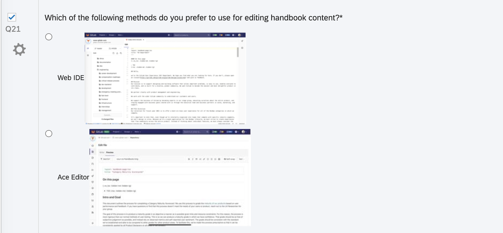

## On this page
{:.no_toc .hidden-md .hidden-lg}

- TOC
{:toc .hidden-md .hidden-lg}

Preference testing help you choose between design variations (icons, one page mockups, color palettes, design components, and more) by asking users to select their preferred option. You can have the participant select a preference based on the appearance of the design, how well it communicates information, or other qualities that evaluate your hypothesis. 

It is important to note that you should not use this method to test workflows, usability, or anything that requires interaction. It can be used in conjuction with an open-ended question to ask about **why** participants made their selections to understand the reasons behind preferences. A moderated format would work best for that; as the moderator can ask more follow-up questions.

### Tips for creating Preference Tests:
* Any visuals used must contain the full context for the design to be accurately assessed.
* Screenshots must be large enough to be clearly viewed and read easily.
* These tests are commonly used to measure aesthetic appeal, but participants can be instructed to judge designs based on their trustworthiness or how well they communicate a specific message or idea.

### How to run a preference test in Qualtrics:

**Step 1:** After logging into Qualtrics, click on "Create a new project" that appears in the bottom left of the side panel that is called "Welcome to XM". 

**Step 2:** Choose to create a blank survey project 

**Step 3:** Add your task scenario using the Text / Graphic question type
You can skip Steps 3 through 6 below by importing the "Preference Question Block" from the Questions folder in the [UX Research & Product Question Library](https://www.qualtrics.com/support/survey-platform/account-library/survey-library/#UsingABlockOrQuestionFromTheLibrary). 

**Step 3:** Add your preference questions using the 'Multiple Choice' question type
   * Make sure the 'Allow one answer' option is selected
   * Click on the response item and select the ['Insert Graphic'](https://www.qualtrics.com/support/survey-platform/survey-module/editing-questions/rich-content-editor/insert-a-graphic/) item from the dropdown
   * Upload the graphic from your computer by selecting the 'Upload a new Graphic' from your computer
   * Repeat for each response option

**Step 4:** Add a question that will help you understand user preferences
* Follow that question with a [Text Entry](https://www.qualtrics.com/support/survey-platform/survey-module/editing-questions/question-types-guide/standard-content/text-entry/) question to understand why participants chose that option.
   * Example questions:
     * Why did you prefer that design?
     * Why did you pick that option?
     * Why did that option seem like the most [adjective] one?

