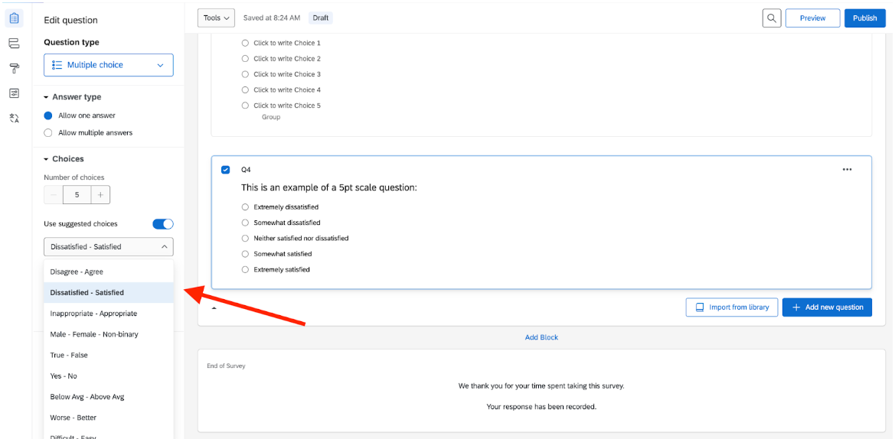

## On this page
{:.no_toc .hidden-md .hidden-lg}

- TOC
{:toc .hidden-md .hidden-lg}

Within the industry, there are many strong opinions on survey scales, which have pros and cons to each.  The UX research team offers the following guidelines:

- **Think about how you’ll use the data.** If your metric requires a high level of granularity to help identify positive or negative movement, a wider scale (example: 1-10) might be more useful than a smaller scale (example: 1-3). Pick a scale that works for your needs, and stay with it. Adjusting your scale mid-flight is something you want to avoid, because it’s rarely a clean change.
- **Stick to a consistent rating system.** If your survey contains rating questions, it’s ideal to use the same scale for each of your questions.  That way, it’s easy for respondents to adapt while avoiding potential mistakes.  The last thing you want is to ask a question with a 1-5 scale, then ask another question in the survey with a 5-1 scale.  Most likely, respondents will answer the second question incorrectly, with the previous scale in mind. 

     That being said, there are situations when you may want to [randomly reverse the scale order](https://www.qualtrics.com/support/survey-platform/survey-module/question-options/choice-randomization/) _for the same survey rating question_.  This is sometimes done if you’re using rating questions to obtain quantitative data.

- **Try to use industry standards.** There are reasons why survey questions use certain scales.  More than likely, they’ve been heavily researched and tested already. Spend some time researching them to find something that works best for your survey questions—for example, [SUS](https://measuringu.com/sus/), [NPS](https://www.netpromoter.com/know/), or [CSAT](https://www.qualtrics.com/experience-management/customer/what-is-csat/).  Similarly, if you are using a 5-point scale for satisfaction, there are predefined languages around the options—for example: _very dissatisfied, dissatisfied, neutral, satisfied, very satisfied_. Qualtrics has a helpful library of these options built in.

- **Balance your scale.** Ensure there are options on each end of the spectrum. For example, for a survey question on satisfaction, the scale ranges from very dissatisfied to very satisfied. The ends of your scale should be opposites, and the middle should be neutral. 
- **Avoid using scale options that can have varied interpretations.** Using emojis or language that can be misinterpreted could bias your results—for example, using an emoji scale. Emojis can have varied interpretations and thus lead to inconsistent responses, so it’s best to avoid using them in scale options. Similarly, be intentional about the language you use in the scale options, focusing on clear language that is not easily misinterpreted. When in doubt, pilot your survey as outlined above. 
- **Ensure scale options are distinguishable.** If scale options are too similar, respondents can have a hard time picking between them, and you will have variation in your data. In other words, you will lose some accuracy in the final scoring for the question. 
