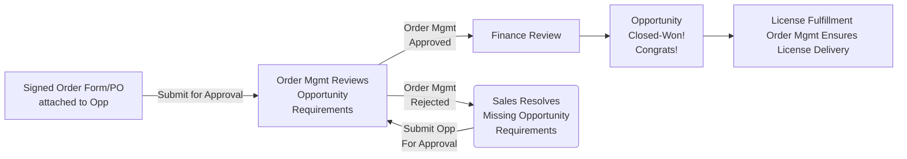

## On this page
{:.no_toc .hidden-md .hidden-lg}

- TOC
{:toc .hidden-md .hidden-lg}

{::options parse_block_html="true" /}

## Welcome to the Order Management Handbook

The Order Management page outlines the goals, tasks, and standard operating guidelines for each regional team. Here you will find more information about our KPIs, SLAs, and best practices for working with our team. 

For an in depth overview of Opportunity Approval Booking Requirements, please review the [Sales Order Processing page](/handbook/sales/field-operations/order-processing/).

### What We Do

The GitLab Order Management team owns the Opportunity Approval and Booking Process, oversees Initial License Delivery, and handles order and subscription reconciliations. This team is the DR for all questions related to Opportunity Booking requirements, questions regarding our bookings policy, and processes related to fulfilling an order. 

**Daily Tasks:**
- Approve in-region opportunities for booking (7-Closing stage)
- Resolve order issues to ensure deals are booked correctly and accurately
- Monitor license delivery status for newly closed opportunities
  - Where automation fails, work directly with Support Engineering to send licenses to customers
  - Catalog and detail systemic failures - work with Product to advocate for long-term resolution

**Weekly Tasks:**
- Review Renewal/Subscription Discrepancies
  - Reconcile duplicate renewal opportunities
  - Create missing renewal opportunities
  - Ensure ARR Basis is correct on renewal opportunities

**Monthly Tasks:**
- Bookings reconciliations as needed

**Ad-Hoc/Ongoing Tasks:**
- Partner with Deal Desk to improve/streamline quote to cash processes
- Partner with Billing Operations to improve/streamline Booking <> Billing processes
- Partner with Product + Support Engineering to improve/streamline License Fulfillment
- Partner with cross-functional teams to implement new routes to market

**Key Processes & Documentation**
- [Bookings Policy](/handbook/sales/field-operations/order-processing/#bookings-policy)
- [Opportunity Approval/Booking Requirements](/handbook/sales/field-operations/order-processing/#submit-an-opportunity-for-booking)
- [Initial License Fulfillment & Delivery](/handbook/sales/field-operations/sales-operations/order-management/#license-delivery-review-process)
- [Subscription Management](/handbook/sales/field-operations/sales-operations/order-management/#subscriptionrenewal-management-process)
- [Sales Order Processing Handbook](/handbook/sales/field-operations/order-processing/)

**Key Reports:**
- [DD + OM Cases / Average First Response](https://gitlab.my.salesforce.com/00O4M000004edoT)
- [Closed Won Opps Per Region](https://gitlab.my.salesforce.com/00O4M000004edoJ)
- [Closed Won Opps Per Team Member](https://gitlab.my.salesforce.com/00O4M000004edoO)
- [Opportunity Rejections](https://gitlab.my.salesforce.com/00O4M000004edos)

#### Out of Scope

Order Management is focused on Opportunity Approvals, License Fulfillment and Subscription Management. The following tasks are outside the role and responsibility of our team. Please reach out to Deal Desk for assistance with the following:

- Quote Creation
- RFPs / Vendor Forms 
- Discount / Payment Term Approval Guidance
- Quote Approval Guidance
- Opportunities below Stage-5 

Please review our [Job Family](https://about.gitlab.com/job-families/sales/order-management/) for more information regarding the scope of this team. 

### Who and Where We Are

#### Regional Support

The Order Management team is located around the world and will be available during standard business hours within most regions. We operate under a Regional Support Model, meaning, each region (EMEA/APAC/AMER) will receive support from a dedicated regional team of Order Management Specialists. 

During holidays, or when team members are on PTO, individuals located in a different region may step in to support and ensure appropriate coverage. This is reserved for End of Month/End of Quarter, or other times when the team is short-staffed.

Support will be provided based on the following business hours in the respective region. However, complex/non-standard opportunities that are submitted after 4:30PM local time may be reserved for the following business day. 

|     Region    | Standard Support Hours |
|:-------------:|------------------------|
| APAC          | 9:00AM to 6:00PM (PST - Philippine Standard Time)   |
| EMEA          | 8:00AM to 5:00PM (GMT)   |
| AMER / LATAM  | 7:00AM to 5:00PM (PT)    |

Our regional teams do not operate on a 24/7 support model. If your opportunity or request is submitted after 4:30PM local time, or outside of standard support hours, it may not be reviewed until the following business day. The only exceptions for this are End of Month/End of Quarter. Support hours and availability will be shared in advance of high volume periods through #field-fyi. 

#### Regional Structure

As of 2022-02-01, the Order Management team is structured as follows:

**AMER Team:**
- Manager, Deal Desk (AMER)
  - Order Management Specialist (AMER)
  - Order Management Specialist (AMER)

**EMEA/APAC TEAM:**
- Manager, Deal Desk (EMEA/APAC)
  - Order Management Specialist (APAC)
  - Order Management Specialist (EMEA)
  - Order Management Specialist (EMEA)

### Communicating with the Order Management Team

The Order Management team's primary communication is Salesforce chatter. When you chatter `@Sales-Support`, it will automatically create a case in the Deal Desk/Order Management queue. 
- Always use `@Sales-Support` for SFDC requests or post `#sales-support` in Slack for general questions.** This ensures our team is working as efficiently as possible and that you are covered in case the Order Management team member who replied first is unavailable. 
  - Please do not tag Order Management team members directly in chatter or make a request through Slack direct message. This ensures our team is working as efficiently as possible and that you are covered in case the DD team member who replied first is unavailable.
- If someone is working on a case, they will continue to support until the case is closed.  If an issue has been resolved, please chatter @Sales-Support to reopen a case.
- If you tag @Sales-Support on an existing Chatter post/comment by editing it, that action won`t generate a request to Order Management and we will not receive a notification. Please make sure to tag Sales Support on an original post or on a new comment to the original post.
- Order Management team members monitor the case queue throughout the day. 

### Key Performance Indicators

#### 1. Standard Opportunity Approval SLA 

Opportunities will be reviewed for all booking requirements within 12 business hours of being Submitted for Approval (Stage 7 - Closing). Your opportunity will be Approved or Rejected by Order Management within 12 business hours of submission. Please note, ultimate closure of a deal is facilitated by the Billing team. 

If there are missing booking requirements, or further confirmation is required from the Sales team, the Order Management specialist will tag you directly in Chatter to resolve any outstanding issues.

Please review our Sales Order Processing page for Opportunity Booking Requirements. 

#### 2. Regional Support Satisfaction 

All regions will receive a Quarterly Customer Satisfaction survey at the beginning of each new quarter. Our team aims for a 92% satisfaction rating for their supported region. This survey is a valuable tool to provide feedback on areas of improvement related to the Quote to Cash lifecyle.

Results from the survey will be used to evaluate team member performance and to identify areas for improvement.

**Measuring Regional Support Satisfaction:**
* A positive satisfaction rating is determined by measuring the ratio of positive responses to the question: "How would you describe the level of support you received from Deal Desk during Q1?"
* Available responses include:
  * Excellent
  * Good
  * Neutral
  * Poor
  * Very Poor
* Satisfaction rating is determined by the percentage of Excellent, Good, and Neutral responses, as compared to the total number of responses. The outcome in percentage form is the Regional Support Satisfaction rating. 

#### 3. Opportunity Approval Accuracy and Efficiency 

Our team aims for an Approval Accuracy of 95% or greater. Meaning, of all opportunities that we submit to Billing for final review / approval, 5% or less will be rejected for missing booking requirements. 

Order Management Specialists will be responsible for taking action on feedback received in Quarterly CSAT surveys, as well as improving processes related to common opportunity rejections, whether it be through documentation, training, or system improvements. The goal is to reduce time to approval, improve efficiency and maintain a high level of accuracy for all approvals. 

### Key Performance Indicators: Results

To review quarterly KPI results, see: [Deal Desk & Order Management KPI - Results](https://about.gitlab.com/handbook/sales/field-operations/sales-operations/Deal-Desk-Order-Mgmt-KPIs/)

### Opportunity Approval Process

Order Management reviews every Sales Assisted opportunity prior to booking. All opportunities must meet our standard opportunity booking requirements. An opportunity will be rejected if it is missing components necessary for booking. 

#### Opportunity Prioritization 

All opportunities in the approval queue are prioritized based on the following: 

1. Start Date 
2. Revenue Generation
3. Order of Submission 

The Order Management team will make every effort to ensure all opportunities submitted at Month End and Quarter End are reviewed and approved in the same month. Please do not tag for urgent review during End of Month or End of Quarter. 

#### Escalation Path for Opportunity Review

Approvals that are urgent, customer impacting, or critical to buisness may be prioritized upon request. If the opportunity has been submitted after Standard Support hours, you may escalated the opp for a different regional team to review in the #sales-support Slack channel. You may also tag regional Deal Desk Managers for review and assist in delegating the case. 

Opportunities raised for urgent review must be business critical. Opportunities that are routinely escalated out of individual convenience instead of legitimate urgency will be addressed with Sales Management. 

#### Opportunity Approval Workflow

### License Delivery Review Process

Beginning in FY23, the Order Management team will confirm license delivery on all newly Closed Won self-managed deals. 

#### Background:

The License Delivery Review Process is a new process created to ensure that all self-managed deals result in license fulfillment. The goals of this process are to (1) Improve customer satisfaction by ensuring licenses are delivered in a timely manner, (2) Improve Sales efficiency by reducing time spent by sellers to chase license delivery, and (3) Prevent revenue recognition issues caused by delayed license delivery to customers.

**In Scope:**

- The Order Management team will review each Closed Won, sales-assisted self-managed deal to ensure initial license delivery after opportunity closure. 
- If the Order Management team determines that the license was not delivered after initial opportunity closure, the team will open a ticket with Support Engineering to request manual delivery of the license to the customer.

**Out of Scope:**

- The Order Management team is not customer facing, and will not speak directly to the customer regarding order or license issues.
- The goal of this review is to ensure initial delivery is correct. The Order Management team will not handle requests relating to:
  - SaaS entitlements
  - Self-Managed licenses that fail when applied to the customer's instance
  - Self-Managed licenses that were delivered, but are not accepted by the GitLab instance
  - Self-Managed license split requests
  - Self-Managed license re-send requests
  - Self-Managed additional license send requests

For assistance with Out of Scope license requests, please [open an Issue](/handbook/support/internal-support/#regarding-licensing-and-subscriptions) with the Support Engineering Team.

#### Process Workflow:
1. Order Management team member approves opportunity
2. Billing team member approves opportunity, resulting in Closed Won stage.
3. Each day, Order Management team members review regional self-managed opportunity report. For each newly closed self-managed opportunity, Order Management reviews license inbox to determine whether license was delivered via automation.
4. If a license has been delivered, Order Management populates delivery date into "License Delivery Date" opportunity field.
5. If a license has not been delivered, Order Management opens a ticket with Support Engineering to request manual delivery of the license to the Sold To contact from the opportunity's primary quote.

(For full process documentation, visit the internal [License Delivery Review Wiki](https://gitlab.com/gitlab-com/sales-team/field-operations/deal-desk/-/wikis/Ongoing-Reconciliations/License-Delivery-Review))

### Subscription/Renewal Management Process

Beginning in FY23, the Order Management team will proactively review and correct bad renewal data. 

#### Background:

It is important to have clean, correct renewal data - both for forecasting purposes, ATR (Available to Renew, aka ARR Basis) analysis, and general data cleanliness.

Our goal is to maintain 1:1 ratio of Renewal Opportunity to Customer Subscription:
- Every Customer Subscription should link to one open or closed Renewal Opportunity
  - This would not be the case for: Legacy/bad data, automation failures, manual renewal opportunity creation, etc.
- Every Renewal Opportunity should be linked to a Customer Subscription object
  - This would not be the case for: Legacy/bad data, opportunities created prior to this automation's creation, manual renewal opportunity creation, etc.
- Every Renewal opportunity's ARR Basis should match the linked Customer Subscription's Current Subscription CARR (Unless there is a known exception - i.e. Contract Resets)
- Every Renewal opportunity's Start Date should match the linked Customer Subscription's Current Term End Date (Unless there is a known exception - i.e. Contract Resets)
Duplicate renewal opportunities should be marked as such and disconnected from any Customer Subscription.

#### Process Overview:

On an ongoing basis, the Order Management team will review discrepancy reports to correct bad data as described above. (For full process documentation, visit the internal [Subscription Management Wiki](https://gitlab.com/gitlab-com/sales-team/field-operations/deal-desk/-/wikis/Ongoing-Reconciliations/Subscription-Management))
