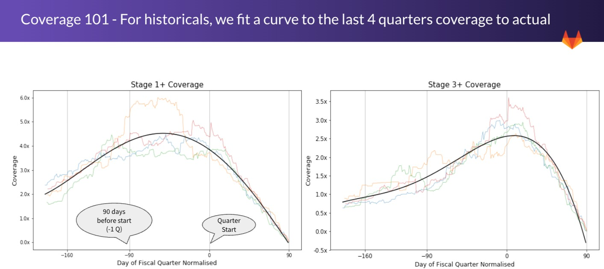

## On this page
{:.no_toc .hidden-md .hidden-lg}

- TOC
{:toc .hidden-md .hidden-lg}

## Pipeline X-Ray dashboard

### Goal

The X-Ray dashboard provides a forward looking perspective of current and future quarters pipeline. 

### Access

To comply with the [SAFE Framework](https://about.gitlab.com/handbook/legal/safe-framework/), please submit an [Access Request](https://about.gitlab.com/handbook/business-technology/team-member-enablement/onboarding-access-requests/access-requests/) to the Sisense SAFE Enviroment. 

Access to the X-Ray dashboard is automatically awarded to all members of the SAFE Sisense group. 

Please reach out to [@nfiguera](https://gitlab.com/nfiguera) if there are any open questions.

### Metrics

- Targets  (Net ARR & deal count)
- Closed Deals (Net ARR & deal count)
- Pacing (Booked / Target)
- Created & Closed 
- Open Pipe by Stage 1+, 3+, 4+
- Coverage by Stage 1+, 3+, 4+
- Pipeline Generation within Quarter (Net ARR & deal count)
- Historical values are based on fitted lines to the last 4 quarters

Most of this metrics are available for current quarter, current quarter + 1 and next quarter + 2.

An example of how to read the dashboard can be found in this introductory deck. 

### Business Cuts

- User Segment (aligns with CRO level)
- User Region 
- User Area (aligns with ASM level)
- Order Type (group into Growth / New)
- Sales Qualified Source

### Coverage calculation

Coverage is calculated at the specific cut level (e.g. Segment / Region) as `Open Pipe Stage X+ / Remainder to Target`.

**Remainder to Target** is calculated as  `Target - Booked Net ARR` for current quarter, and as `Total Booked at end of Quarter - Booked Net ARR` for historical quarters.

#### Nuances / Considerations
- Coverage to Remainder to Target is only calculated if the remainder is more than 10k USD
- **Historical Coverages** are calculated as `Open Pipeline with Stage X+ at day Y / Total Booked at end of Quarter`
- **Historical Win rates** are just the inverse of Historical Coverages as `Win Rate = 1 / Coverage`

### Historical coverages

To calculate the coverage metrics we use the [sfdc_opportunity_snapshot_history_xf](https://dbt.gitlabdata.com/#!/model/model.gitlab_snowflake.wk_sales_sfdc_opportunity_snapshot_history_xf) table which contains a copy of the opportunity object by day. 

For the last 4 fiscal quarters, we calculate the coverage metric of each day and fit a polynomial curve to them. 

The resulting coverages curves are used as a baseline against which to compare our QTD coverage (QTD is expected to be above that historical curve).

### Refresh rates

The dashboard is refreshed once a day between 8:00 and 9:00 AM PST time.

### Data models - Sales Workspace in Snowflake

A set of custom data models were created in the Snowflake `sales_workspace` to simplify reporting efforts on Sisense / gSheet. 

When posible the metrics logic is embeded in the source tables rather than in the report models and looking at the SQL code is the best way to be sure that the metrics are presenting what it is expected from them.

Here is a table of the created models with links to their respective DBT model documentation.

| Maintainer| Model Name |
| ----- | :----- |
| [report_pipeline_metrics_per_day_with_targets](https://dbt.gitlabdata.com/#!/model/model.gitlab_snowflake.wk_sales_report_pipeline_metrics_per_day_with_targets)  | Metrics Fiscal Quarter / Day, the model includes targets to simplify the calculation of coverages at different levels |
| [report_targets_totals_per_quarter](https://dbt.gitlabdata.com/#!/model/model.gitlab_snowflake.wk_sales_report_targets_totals_per_quarter)  | Totals / Target table pre-aggreagated. Targets are used for current and future quarter, and totals for previous quarters |
| [sfdc_opportunity_snapshot_history_xf](https://dbt.gitlabdata.com/#!/model/model.gitlab_snowflake.wk_sales_sfdc_opportunity_snapshot_history_xf)  | Legacy model with extra metrics definitions and helper fields  |
| [sfdc_opportunity_xf](https://dbt.gitlabdata.com/#!/model/model.gitlab_snowflake.wk_sales_sfdc_opportunity_xf)  | Legacy model with extra metrics definitions and helper fields |

