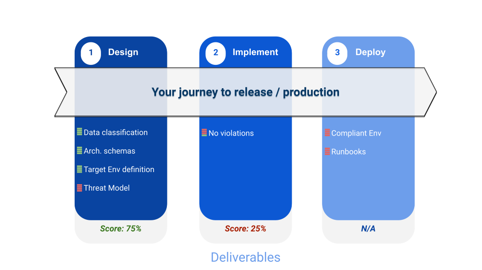

## On this page
{:.no_toc .hidden-md .hidden-lg}

- TOC
{:toc .hidden-md .hidden-lg}

## Gitlab Continuous Security Framework

_Disclaimer: This page is part of a
[POC](https://gitlab.com/groups/gitlab-com/gl-security/-/epics/169) and should not be used without
validation of your Manager. If you're a Manager and want your team to be part of the experiment,
please comment in this
[issue](https://gitlab.com/gitlab-com/gl-security/security-architecture/general/-/issues/12)._

Security is often being involved late in the life cycle of feature development. To prevent this,
security is bundled into the [Software Development Lifecycle](/stages-devops-lifecycle/), in every
stage of the workflow. Eventually, features are meant to reach production, but have to pass the
[production readiness review](/handbook/engineering/infrastructure/production/readiness/) gate
first. In order to facilitate this process, the framework supports the engineering team all along
the life cycle of the feature, to facilitate the creation of the required documentation and other
artifacts.

The framework relies heavily on the [data
classification](/handbook/security/data-classification-standard.html) of the feature in
scope. It is not necessary for features managing Green data, and more activities are required as the
level increases, up to Red data.

The framework targets mostly Engineering Managers and their team, but also Product Managers, to
track progress from the early phases of the [Product Development
Workflow](/handbook/product-development-flow/), to the release or deployment to production.

Once released or deployed, the SDLC loops and a new iteration can start. The framework continues to
support the team with insights and recommendations. More importantly, changes in the framework
should also affect previous projects, hence the "continuous" part of the name: our security
requirements and guidelines evolve with time and it's important to keep our features aligned.

## When to use this framework?

This framework is meant to be used for all significant engineering changes in services or features,
and more precisely for changes in:

1. The [GitLab Architecture](https://docs.gitlab.com/ee/development/architecture.html)
1. The [GitLab.com
   infrastructure](/handbook/engineering/infrastructure/production/architecture/)
1. The [classification](/handbook/security/data-classification-standard.html) of
   the data being managed (stored, transferred, or updated)

## Getting Started

The framework is organized in different stages, each of them having their own set of activities:

_(Source: https://docs.google.com/drawings/d/1eQZppzngBJ9Xssvt514GHbs7rKHuRiLRk8cYbQtD5bI/edit)_

Activities have a "deliverable", which the expected artifacts of the activity. They can be of
various forms, from markdown pages to the state of a dashboard.

_(Source: https://docs.google.com/drawings/d/1kj3KoU7UePUzoEdWCQFoppDEQgltUedmj6R-I0BqSZ8/edit)_

The framework is architected around 3 stages:

1. Design
1. Implementation
1. Operation

## Activities and deliverables

### Design stage

| Activity | Security Team | Green & Yellow Data | Orange Data | Red Data |
| -------- | ------------- | ------------------- | ----------- | -------- |
| [Data classification](#data-classification) | [Security Assurance] | N/A | N/A | N/A |
| [Architecture](architecture.html) | [Security Architects] | Optional| Recommended | Required |
| Define Target Environment | [InfraSec] | Optional | Required | Required |
| Threat Modeling | [AppSec] | Optional | Recommended | Required |

#### Data classification

Identify the kind of data transiting, transformed, or being stored by the system. If only one field
in a database is RED, the whole system must be considered RED entirely.
This step impacts all activities of the framework and must be re-evaluated regularly.

##### Deliverables

A value among: `Green`, `Yellow`, `Orange`, or `Red`.

##### Resources:

1. The [Data Classification
   Standard](/handbook/security/data-classification-standard.html) handbook page

#### Architecture

The goal of this activity is to provide (and improve over time) a documentation of the system to be
created or changed, along with architecture decisions. Architecture helps to balance customer demand
and delivery capacity to create a sustainable and coherent system. This system should strive to meet
its functional requirements as well as the relevant quality attributes.

This activity is supported by a set of principles and tools. The artifacts (Architecture description
and decisions) help to achieve the following activities. For example, a better understanding of the
system helps to get started with the Threat Modeling activity.

#### Define Target Environment

#### Threat Modeling

Create or update a corresponding [Threat Model](handbook/security/threat_modeling/).

#### OSS Ecosystem Testing

In case the proposed architectural change introduces new Open Source Software components to our
infrastructure or our product inform the Security Research Team
(`@gitlab-com/gl-security/security-research`) for potential inclusion of the dependency into the 
[OSS Ecosystem Testing](/handbook/security/threat-management/security-research/#gitlab-ecosystem-security-testing)
efforts.

## Additional resources and references

[Security Assurance]: /handbook/security/security-assurance/
[Security Architects]: /handbook/security/architecture/
[InfraSec]: /handbook/security/security-engineering-and-research/infrastructure-security/
[AppSec]: /handbook/security/security-engineering-and-research/application-security/

