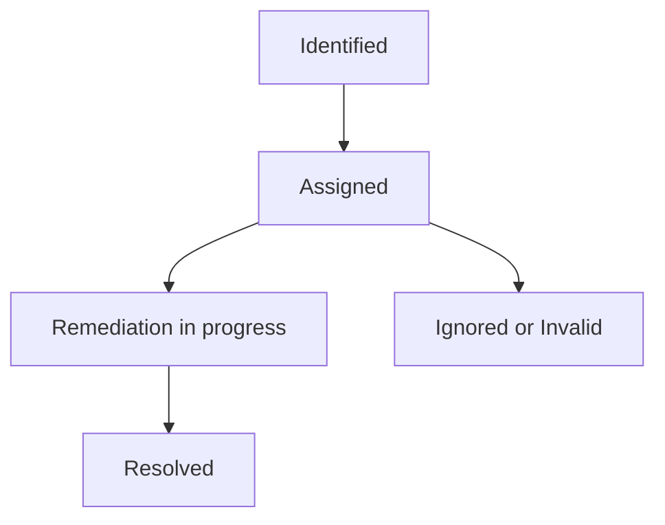

## On this page
{:.no_toc .hidden-md .hidden-lg}

- TOC
{:toc .hidden-md .hidden-lg}

{::options parse_block_html="true" /}

**This is a Controlled Document**
{: .panel-heading}

In line with GitLab's regulatory obligations, changes to [controlled documents](https://about.gitlab.com/handbook/security/controlled-document-procedure.html) must be approved or merged by a code owner. All contributions are welcome and encouraged. 

## Purpose

The Observation Management Program at GitLab is used to identify, track, remediate and provide a risk ratings of identified findings, exceptions or deficiencies for any Tier 3 information system risks that are identified as an output of compliance operations or other mechanisms by team members, such as self-identification of a system specific risk.

This procedure details the creation process for observations.

## Introduction to Observation Management at GitLab

<figure class="video_container">
  <iframe src="https://www.youtube.com/embed/6myESjII-Sk" frameborder="0" allowfullscreen="true"> </iframe>
</figure>

## Scope

Tier 3 risks or observations identified at the information system or business process levels

## Roles and Responsibilities

| Observation Source | Responsible Team |
| ---- | ------ |
| Security control testing activities (CCM) | [Security Compliance](https://about.gitlab.com/handbook/security/security-assurance/security-compliance/) |
| Third Party Risk Management (TPRM) activities | [Security Risk](https://about.gitlab.com/handbook/security/security-assurance/security-risk/) |
| Customer Assurance Activities (CAA) | [Field Security Team](https://about.gitlab.com/handbook/security/security-assurance/field-security/) |
| External audit activities | [Security Compliance](https://about.gitlab.com/handbook/security/security-assurance/security-compliance/) |
| Third party application scanning (BitSight) | [Field Security Team](https://about.gitlab.com/handbook/security/security-assurance/field-security/) |
| Gap Assessment Activities| [Security Compliance](https://about.gitlab.com/handbook/security/security-assurance/security-compliance/) |
| Ad-hoc observations | [Security Assurance](https://about.gitlab.com/handbook/security/security-assurance/) |

## Procedure

### Lifecycle Overview

### Identifying Observations

Observations can be identified through the following channels:
1. Security control testing activities (CCM)
1. Third Party Risk Management (TPRM) activities 
1. Customer Assurance activities (CAA)
1. External audit activities
1. Third party application scanning (BitSight)
1. Gap assessment activities
1. Ad-hoc issues

### Assigning Observations

The observation identifier is responsible for opening an observation in [ZenGRC](https://about.gitlab.com/handbook/security/security-assurance/zg-activities.html). The observation identifier fills out all necessary observation information, remediation recommendations and submits the observation to the Remediation Owner for validation. The Observation Manager is responsible for managing the observation through the observation lifecycle. This includes validating the observation with the Remediation Owner, tracking all remediation progress and updating the associated ZenGRC issue with current information and status updates. Each observation has both a GitLab Issue (for Remediation Owners) and a mirrored ZenGRC Issue (for Observation Managers). Each observation will be assigned a [risk rating](https://about.gitlab.com/handbook/security/security-assurance/observation-management-procedure.html#observation-risk-ratings), which should drive the priority of remediation.

**See the associated runbooks below for detailed instructions on how to open and assign a new observation based on observation type:**

* [Observation Intake and Management Runbook](https://gitlab.com/gitlab-com/gl-security/security-assurance/observation-management/-/blob/master/runbooks/1_Observation%20Intake%20and%20Management.md)

### Drafting Observation Description Guidance

The Observation description should include the who, what, when, where, why, and how related to the observation. As a review step, if you knew nothing about this observation could you understand the finding, how it was identified, and the effect it has on objectives? Consider leveraging the 4C's model:

1. Condition - current state
1. Criteria - desired state based on policy, requirement, control, regulation, etc.
1. Cause - root cause of the observation
1. Consequence - actual or potential effect on objectives/assets 

### Observation Risk Ratings

Tier 3 information system risk ratings are based off the [STORM risk rating methodology](/handbook/security/security-assurance/security-risk/storm-program/storm-methodology.html#risk-factors-and-risk-scoring).

> Risk Rating = Likelihood x Impact

<b>Determining Likelihood</b>

#### Step 1: Define likelihood based on the below criteria and likelihood table

At GitLab, observations will be rated based on the likelihood the observation has recurring and/or the frequency that the control has seen observations. The criteria used to assess this likelihood can be found in the Likelihood Table below. Note that there are two different definitions for each likelihood rating level:

- **Control Observation**: This criteria is utilized to rate observations identified as an output of control testing (e.g. where control testing performed internally by Security Compliance has failed). The assumption of the Likelihood Table is to consider observations individually rather than in aggregate (i.e if 2 similar observations occur against a single test of a sample of 25, the failure rate is 8% and would be scored a 3. The control does not need to be tested multiple times in the current year or prior 9 months with an observation each time to meet the requirement for a score of 3). 
- **Information System Risk (Tier 3)**: This criteria is utilized to score the likelihood of an information system being exploited (e.g. insufficient encryption mechanisms for the storage of data within `[System Name]` result in the unintentional exposure/leakage of this information to the public).

##### Likelihood Table

<table class="tg">
<thead>
  <tr>
    <th class="tg-vknm">Qualitative Score</th>
    <th class="tg-vknm" colspan="2">Description</th>
  </tr>
</thead>
<tbody>
  <tr>
    <td class="tg-obmi">1</td>
    <td class="tg-cly1" colspan="2"><b>Control Observation: </b>The observation noted is considered to be a one off occurrence for the control as a result of extenuating circumstances. It is unlikely to occur again once remediated.  <b>Information System Risk: </b>Theoretically impossible and/or requires significant technical expertise for the risk to be exploited.</td>
  </tr>
  <tr>
    <td class="tg-za92">2</td>
    <td class="tg-cly1" colspan="2"><b>Control Observation: </b>The observation was identified as a result of management's oversight on the control and may potentially occur again. This is the only observation associated with the control in the current fiscal year or prior 9 months, whichever is longer.  <b>Information System Risk: </b>Even with technical expertise, it is somewhat difficult to exploit the risk.</td>
  </tr>
  <tr>
    <td class="tg-qjco">3</td>
    <td class="tg-cly1" colspan="2"><b>Control Observation: </b>The control has had multiple observations in the current fiscal year or prior 9 months, whichever is longer.  <b>Information System Risk: </b>Minimal expertise is required to exploit the risk.</td>
  </tr>
  <tr>
    <td class="tg-yfns">4</td>
    <td class="tg-0lax" colspan="2"><b>Control Observation: </b>The control has observations that have persisted and continue to occur year to year AND/OR the observation noted is associated with the design of the control.  <b>Information System Risk: </b>The risk can be easily exploited and does not require any technical expertise.</td>
  </tr>
</tbody>
</table>

<b>Determining Impact</b>

#### Step 2: Define impact based on the below criteria and impact table

In addition to applying a qualitative scoring factor for likelihood, all observations need to be evaluated for the impact they would have on GitLab at the organization level and/or the compliance impact (if applicable). The criteria and qualitative scores for assessing the impact of an observation can be found in the Impact Scoring Table below. The **highest** rating in any field is the final impact score of the observation so as to approach observations in a more conservative manner (i.e if all fields are rated at a value of 2 except Remediation Effort which is scored a 3, the final impact score would be a 3).

**Important Note**: Team members who are leveraging the impact scoring criteria below may judgmentally select the impact factors most relevant to them. Internal Audit and Security Compliance utilize all columns when scoring observations identified as part of controls testing because there may be specific impacts to external compliance audit requirements as a result of these findings. Any information system risk identified outside of control testing may utilize the columns that are most relevant.

##### Impact Scoring Table

<table class="tg">
<thead>
  <tr>
    <th class="tg-vknm">Qualitative Score</th>
    <th class="tg-vknm">External Audit Impact</th>
    <th class="tg-vknm">Remediation Effort</th>
    <th class="tg-vknm">Financial Impact</th>
    <th class="tg-vknm">Legal &amp; Regulatory Impact</th>
    <th class="tg-vknm">Stakeholder/ ICOFR (Internal Controls Over Financial Reporting)&nbsp;&nbsp;Impact </th>
  </tr>
</thead>
<tbody>
  <tr>
    <td class="tg-obmi">1</td>
    <td class="tg-cly1">The observation would not lead to an adverse audit opinion.</td>
    <td class="tg-cly1">The observation was related to extenuating circumstances and requires simple reinforcement of policy/process, no additional management oversight required. </td>
    <td class="tg-cly1">Observation has potential financial impact which results in loss / misstatement of up to $25K.</td>
    <td class="tg-cly1">The observation would not lead to major action by a regulator. </td>
    <td class="tg-cly1">The observation has minimal impact on all stakeholders (internal and external)</td>
  </tr>
  <tr>
    <td class="tg-za92">2</td>
    <td class="tg-cly1">The observation would likely not lead to an adverse audit opinion because it is an isolated occurrence.</td>
    <td class="tg-cly1">The observation has remediation effort that requires oversight/support at the management level.</td>
    <td class="tg-cly1">Observation has potential financial impact which results in loss / misstatement between $25K to $250K.</td>
    <td class="tg-cly1">The observation could lead to minor regulatory action.</td>
    <td class="tg-cly1">The observation impacts internal stakeholders and or could lead to financial misstatements, if not addressed on time. </td>
  </tr>
  <tr>
    <td class="tg-qjco">3</td>
    <td class="tg-cly1">The observation is likely to result in an adverse audit opinion if a full sample for remediation testing cannot be provided. </td>
    <td class="tg-cly1">The observation has remediation effort that requires oversight/support at the director level.</td>
    <td class="tg-cly1">Observation has potential financial impact which results in loss / misstatement between $250K to $500K.</td>
    <td class="tg-cly1">The observation could lead to an investigation or regulatory action.</td>
    <td class="tg-cly1">The observation impacts internal and external stakeholders. It requires attention of Executives and Board. </td>
  </tr>
  <tr>
    <td class="tg-yfns">4</td>
    <td class="tg-cly1">The observation will result in an adverse audit opinion. </td>
    <td class="tg-cly1">The observation has remediation effort that requires oversight/support at the Executive level.</td>
    <td class="tg-cly1">Observation has potential financial impact which results in loss / misstatement above $ 500K</td>
    <td class="tg-cly1">The observation could directly result in major regulatory action against GitLab.</td>
    <td class="tg-cly1">The observation impacts internal and external stakeholders. It requires attention the of Executives and Board and could impact management assertion in 10Q / 10-K.</td>
  </tr>
</tbody>
</table>

<b>Determining Risk Rating</b>

#### Step 3: Determine risk rating based on likelihood and impact scores defined in steps 1 and 2

In order to arrive at a final observation risk rating, the likelihood and impact scores of an observation are multiplied together. The final score determined will determine whether or not the observation is a LOW, MODERATE, or HIGH risk observation using the Observation Risk Rating Table

##### Observation Risk Rating Table

<table class="tg">
<thead>
  <tr>
    <th class="tg-319z" colspan="5">Observation Risk Matrix</th>
  </tr>
</thead>
<tbody>
  <tr>
    <td class="tg-cly1"></td>
    <td class="tg-4bh4" colspan="4">Impact Score</td>
  </tr>
  <tr>
    <td class="tg-mgvv">Likelihood</td>
    <td class="tg-4bh4">1</td>
    <td class="tg-4bh4">2</td>
    <td class="tg-4bh4">3</td>
    <td class="tg-4bh4">4</td>
  </tr>
  <tr>
    <td class="tg-mgvv">1</td>
    <td class="tg-obmi">1</td>
    <td class="tg-obmi">2</td>
    <td class="tg-obmi">3</td>
    <td class="tg-qjco">4</td>
  </tr>
  <tr>
    <td class="tg-mgvv">2</td>
    <td class="tg-obmi">2</td>
    <td class="tg-qjco">4</td>
    <td class="tg-qjco">6</td>
    <td class="tg-qjco">8</td>
  </tr>
  <tr>
    <td class="tg-mgvv">3</td>
    <td class="tg-obmi">3</td>
    <td class="tg-qjco">6</td>
    <td class="tg-qjco">9</td>
    <td class="tg-yfns">12</td>
  </tr>
  <tr>
    <td class="tg-mgvv">4</td>
    <td class="tg-qjco">4</td>
    <td class="tg-qjco">8</td>
    <td class="tg-yfns">12</td>
    <td class="tg-yfns">16</td>
  </tr>
</tbody>
</table>

<table class="tg">
<thead>
  <tr>
    <th class="tg-319z" colspan="2">Observation Risk Thresholds</th>
  </tr>
</thead>
<tbody>
  <tr>
    <td class="tg-obmi">LOW</td>
    <td class="tg-nrix">1 - 3</td>
  </tr>
  <tr>
    <td class="tg-qjco">MODERATE</td>
    <td class="tg-nrix">4 - 9</td>
  </tr>
  <tr>
    <td class="tg-yfns">HIGH</td>
    <td class="tg-nrix">12 - 16</td>
  </tr>
</tbody>
</table>

Observation risk ratings play a key role in determining the Control Health and Effectiveness rating of a controls health. See the [Control Health and Effectiveness Rating (CHER) handbook page](https://about.gitlab.com/handbook/security/security-assurance/control-health-effectiveness-rating.html) for details on CHER and how to establish a CHER rating.

### Observation Risk Ratings

Tier 3 information system risk ratings are based off the [STORM risk rating methodology](/handbook/security/security-assurance/security-risk/storm-program/storm-methodology.html#risk-factors-and-risk-scoring).

> Risk Rating = Likelihood x Impact

An observation's risk rating is based on a judgemental assessment of both the Likelihood and Impact of the identified observation by the team member that identified and opened the observation. Judgemental elements considered may include:

* frequency of the same control observation
* if the observation will lead to a material weakness or external audit finding
* pervasiveness of the observation across multiple systems
* impact to internal and/or external stakeholders
* expertise to exploit the observation

See the [Observation Management Procedure Handbook page](https://about.gitlab.com/handbook/security/security-assurance/observation-management-procedure.html) for a full list of elements that determine both Likelihood and Impact scores

### Observation Risk Rating Adjustments

As observations are identified, assigned and then move into remediation, there may be cases in which observations do not appropriately map to current GCF controls or are deemed stale. These observations could qualify for an upgraded or downgraded risk level depending on a subset of resolution criteria. Procedures for this process can be found in the [Observation Risk Rating Adjustment Runbook](https://gitlab.com/gitlab-com/gl-security/security-assurance/observation-management/-/blob/master/runbooks/2_Remediation%20and%20Closeout.md#updating-risk-rating)

### Observation Remediation

For detailed procedures relating to observation remediation, refer to the [observation remediation procedure](https://about.gitlab.com/handbook/security/security-assurance/observation-remediation-procedure.html).

## Metrics and Reporting
Please refer to the internal handbook page - [Observation Management](https://internal-handbook.gitlab.io/handbook/security/security-assurance/observation-management-section/) for a breakdown of all observations by risk, status, Security Assurance program and department. Given the sensitivity of this information visibility is limited to internal use only. 

## Exceptions

Exceptions will be created for observations that breach a mutually agreed upon remediation date, breach in SLA or if the Remediation Owner confirms the observation will not be remediated.  

Exceptions to this procedure will be tracked as per the [Information Security Policy Exception Management Process](https://about.gitlab.com/handbook/security/#information-security-policy-exception-management-process).

## References

- Parent Policy: [Information Security Policy](/handbook/security/)
- [GCF Contol Lifecycle](/handbook/security/security-assurance/security-compliance/security-control-lifecycle.html#)
- [Observation remediation Procedure](https://about.gitlab.com/handbook/security/security-assurance/observation-remediation-procedure.html)
- [Observation Management Project](https://gitlab.com/gitlab-com/gl-security/security-assurance/observation-management)
- [Sarbanes-Oxley (SOX) Compliance](/handbook/internal-audit/sarbanes-oxley/)

## Contact & Feedback

If you have any questions or feedback about the observation management process please [contact the GitLab Security Assurance Team](https://about.gitlab.com/handbook/security/security-assurance/#contacting-the-team), or comment in this [feedback issue](https://gitlab.com/gitlab-com/gl-security/security-assurance/observation-management/-/issues/943). 

