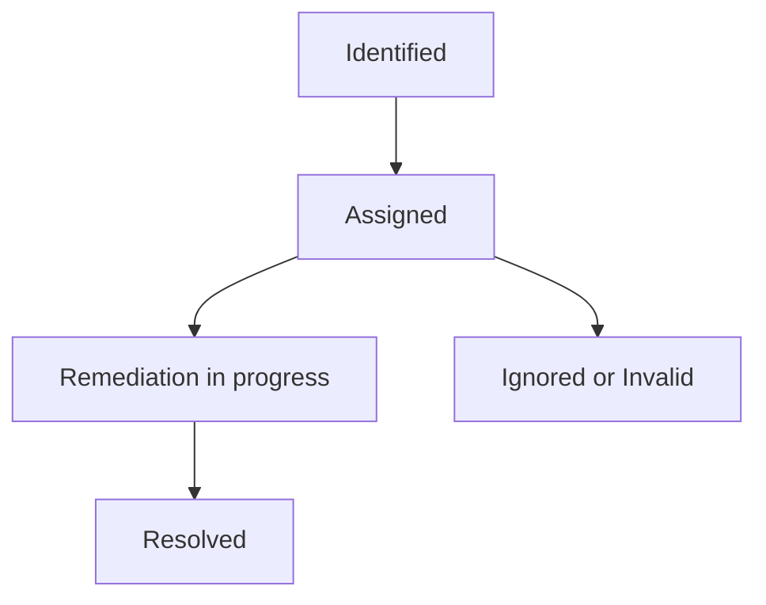

## On this page
{:.no_toc .hidden-md .hidden-lg}

- TOC
{:toc .hidden-md .hidden-lg}

{::options parse_block_html="true" /}

**This is a Controlled Document**
{: .panel-heading}

Inline with GitLab's regulatory obligations, changes to [controlled documents](https://about.gitlab.com/handbook/security/controlled-document-procedure.html) must be approved or merged by a code owner. All contributions are welcome and encouraged. 

## Purpose

The Observation Management Program at GitLab is used to identify, track, remediate and provide a risk ratings of identified findings, exceptions or deficiencies for any Tier 3 information system risks that are identified as an output of compliance operations or other mechanisms by team members, such as self-identification of a system specific risk.

This procedure details the remediation process for observations.

## Scope

[Tier 3](/handbook/security/security-assurance/security-risk/storm-program/index.html#scope) risks identified at the information system or business process levels

## Roles and Responsibilities

| Role | Responsibility|
| ---- | ------ |
| Security Compliance Team (Commercial and Dedicated) | Responsible for executing [Security control tests](https://about.gitlab.com/handbook/security/security-assurance/security-compliance/security-control-lifecycle.html#) to determine the test of design and test of operating effectiveness of Security and IT general controls. |
| Security Risk Team | Responsible for executing [Third Party Risk Management](https://about.gitlab.com/handbook/security/security-assurance/security-risk/third-party-risk-management.html) (TPRM) risk and security assessments to determine risk associated with third party applications and services. |
| Field Security Team | Responsible for executing [Customer Assurance Activities](https://about.gitlab.com/handbook/security/security-assurance/field-security/customer-security-assessment-process.html)(CAA) responsible for providing customer assurance with GitLab's security practices and operating procedures. |
| Observation Manager | Responsible for being the observation DRI through the observation lifecycle including verifying and fine tuning recommended remediation plans in order to meet legal and regulatory requirements. |
| Remediation Owner | Validates observation, confirms assignee, stop date (due date), finalizes remediation plan and conducts remediation activity based on defined [remediation SLA's](https://about.gitlab.com/handbook/security/security-assurance/observation-remediation-procedure.html#remediation-sla). |
| Observation Program DRI | Responsible for regular reviews of program health and stakeholder report delivery. |
| Managers to Executive Leadership | Responsible for escalation as necessary and resource allocation for remediation activity. |
| Security Assurance Management (Code Owners) | Responsible for approving significant changes and exceptions to this procedure. |

## Procedure

### Lifecycle Overview

### Observation Remediation 

Once all remediation activities have been completed, the Remediation Owner is responsible for tagging the Observation Manager in the observation issue. If there is no Observation Manager assigned, tag `@gitlab-com/gl-security/security-assurance/security-compliance-commercial-and-dedicated` in the observation issue.

It is the responsibility of the Observation Manager to track the milestones, work progress and validation of the remediation activity. The Observation Manager will then validate the remediation activity for completeness, re-test the observation (as applicable) and close the observation issue. If re-testing does not result in a fully effective conclusion, the observation description and remediation recommendations may be updated to reflect the new findings and required remediation tasks. 

For detailed requiremented the observation manager follows during the remediation process, refer to the [remediation and closeout runbook](https://gitlab.com/gitlab-com/gl-security/security-assurance/observation-management/-/blob/master/runbooks/2_Remediation%20and%20Closeout.md)

### Resolved

The observation is moved to `Resolved` after the [observation remediation step](https://about.gitlab.com/handbook/security/security-assurance/observation-remediation-procedure.html#observation-remediation) is completed. 

### Ignored/Invalid

It is the responsibility of the Observation Manager to determine if an open observation is not valid or no longer applicable. This could be applicable for a variety of reasons including:

* stale observations
* legacy GCF controls 
* process or application changes

If an observation is confirmed Ignored or Invalid, the associated risk rating of that observation can be changed. See the [Observation Risk Rating Adjustment](https://gitlab.com/gitlab-com/gl-security/security-assurance/observation-management/-/blob/master/runbooks/2_Remediation%20and%20Closeout.md#moving-to-ignoreinvaild-in-zengrc) runbook for further details.

### Root Cause Observation Epics

If multiple observation issues relate to the same root cause or are blocked by the same component of work, these issues will be connected together into an Epic in order to more clearly see how multiple observations issues are connected. 

 A list of observation Epics can be found [here](https://gitlab.com/groups/gitlab-com/gl-security/security-assurance/-/epics?state=opened&page=1&sort=start_date_desc&label_name[]=Observation+Epics).
 
### Non Remediation Owner Actions To Support Observation Closure

In cases where Internal Stakeholders (not the Remediation Owner) provide remediation documentation to support closure of the observation. Please tag the Observation Manager in the observation issue. This will trigger the validation of the remediation activity for completeness, re-test as appropriate and closure by the Observation Manager. 

### Remediation SLA

Observation remediation SLA's are determined by the risk rating of the individual observation. The following table shows the SLA for each risk rating:

| Risk Rating | Remediation SLA | Remediation Goal |
| :---: | :---: | :---: |
| High | 6 months, or as otherwise defined by the agreed upon remediation plan | 4 weeks |
| Moderate | 6-12 months, or as otherwise defined by the agreed upon remediation plan | 6 weeks |
| Low | > 12 months, or as otherwise defined by the agreed upon remediation plan | 8 weeks |

### Opportunities for Improvement (OFI)

Throughout the course of testing or general monitoring of the GitLab ecosystem, Opportunities for Improvement (OFI) may be identified and documented so that the overall control environment and GitLab's processes can be improved.
 
To capture an OFI, create an issue in the [Observation Management](https://gitlab.com/gitlab-com/gl-security/security-assurance/observation-management) project and add the RiskRating::OFI label.

OFI's do not have defined remediation SLA's as they are process improvements or suggestions only. The Remediation Goal to communicate the OFI to the appropriate stakeholder is 10 weeks.

#### What is the difference between an OFI and an Observation?

- Observations are tied to specific testing attributes, GCF controls and/or reflect areas where a third party compliance professional would be of the opinion that a relevant risk wouldn't be or hasn't been, mitigated.
- OFIs are not tied to specific testing attributes or GCF controls and are general areas of improvement that may streamline compliance or business activities.
- Observations will **always** impact control effectiveness ratings
- OFIs will **never** impact control effectiveness ratings

## Exceptions

Exceptions will be created for observations that breach a mutually agreed upon remediation date, breach in SLA or if the Remediation Owner confirms the observation will not be remediated.  

Exceptions to this procedure will be tracked as per the [Information Security Policy Exception Management Process](https://about.gitlab.com/handbook/security/#information-security-policy-exception-management-process).

## References

- Parent Policy: [Information Security Policy](/handbook/security/)
- [GCF Control Lifecycle](/handbook/security/security-assurance/security-compliance/security-control-lifecycle.html#)
- [Sarbanes-Oxley (SOX) Compliance](/handbook/internal-audit/sarbanes-oxley/)
- [Observation Management Procedure](https://about.gitlab.com/handbook/security/security-assurance/observation-management-procedure.html)
- [Observation Management Project](https://gitlab.com/gitlab-com/gl-security/security-assurance/observation-management)
- [Control Health and Effectiveness Rating Procedure](https://about.gitlab.com/handbook/security/security-assurance/control-health-effectiveness-rating.html)

## Contact & Feedback

If you have any questions or feedback about the observation management process please [contact the GitLab Security Assurance Team](https://about.gitlab.com/handbook/security/security-assurance/#contacting-the-team), or comment in this [feedback issue](https://gitlab.com/gitlab-com/gl-security/security-assurance/observation-management/-/issues/943). 
