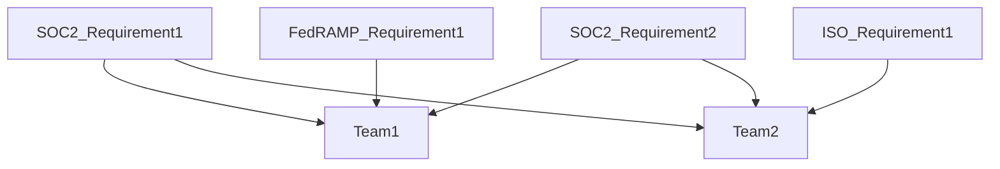
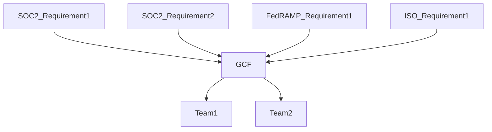

## On this page
{:.no_toc .hidden-md .hidden-lg}

- TOC
{:toc .hidden-md .hidden-lg}

# GitLab's Security Controls

Security controls are a way to state our company's position on a variety of security topics. It's not enough to simply say "We encrypt data" since our customers and teams will naturally want to know "what data do we encrypt?" and "how do we encrypt that data?". When all of our established security controls are operating effectively this creates a security program greater than the sum of its parts. It demonstrates to our stakeholders that GitLab has a mature and comprehensive security program that will provide assurance that data within GitLab is reasonably protected.

## GitLab Control Framework (GCF)

We have tried to take a comprehensive approach to our immediate and future security compliance needs. Older and larger companies tend to treat each security compliance requirement individually which results in independent security compliance teams going out to internal teams with multiple overlapping requests. For example, at such a company you might have one database engineer that is asked to provide evidence of how a particular database is encrypted based on SOC2 requirements, then again for ISO requirements, then again for FedRAMP requirements. This approach can be visualized as follows:

Given our [efficiency value](/handbook/values/#efficiency) here at GitLab we wanted to create a set of security controls that would address multiple underlying requirements with a single security control which would allow us to make fewer requests of our internal teams and efficiently collect all evidence we would need for a variety of audits at once. This approach can be visualized as follows:

As our security compliance goals and requirements have evolved so have our requirements and constraints related to our security control framework. Our GCF is currently based on the [Secure Control Framework by ComplianceForge](https://www.complianceforge.com/scf/), but our next GCF iteration will be based on NIST SP 800-53 since NIST SP 800-53 is the industry-recognized standard.

## Security Control Lifecycle

The lifecycle of our security controls can be found at [this handbook page](/handbook/security/security-assurance/security-compliance/security-control-lifecycle.html). As part of the security control lifecycle, all GCF security controls are reviewed and tested at a minimum on an annual basis or as required by regulation.

GCF security controls are assessed at the entity level or the system level depending upon the nature of the control. 

GCF security controls assessed at system level are based upon the system's [critical system tiering](https://about.gitlab.com/handbook/security/security-assurance/security-risk/storm-program/critical-systems.html). Dependent upon the system's tier, a subset of GCF controls are evaluated based upon overall risk and impact to the organization. This is broken out as follows:
 

|Tier |	GCF Control Scope |	ZenGRC Link|
|--|--|--|
|Tier 1 Product | All Key Security Controls| [Link](https://gitlab.zengrc.com/sor/listing/controls?p=eyJzb3IiOnsicGFnZVNpemUiOjIwMCwiY29sdW1ucyI6WyJ0aXRsZSIsInNsdWciLCJvd25lcnNHcm91cCIsImtleUNvbnRyb2wiLCJjYV9fMTE2IiwiY3JlYXRlZEF0IiwiZGVzY3JpcHRpb24iLCJzdGF0dXMiLCJjYV9fMTEyIiwibWFwcGluZ3MucHJvZ3JhbXMiLCJhc3Nlc3NtZW50cyJdLCJjb2x1bW5TaXplcyI6W3sibmFtZSI6InRlc3RQbGFuIiwic2l6ZSI6Mzc0fSx7Im5hbWUiOiJtYXBwaW5ncy5wcm9ncmFtcyIsInNpemUiOjM4MX1dLCJmaWx0ZXJzIjp7IkFORCI6W3siZiI6InN0YXR1cyIsIm8iOiI9IiwidiI6IkZpbmFsIn0seyJmIjoiY2FfXzExNiIsIm8iOiI9IiwidiI6IlN5c3RlbSJ9LHsiZiI6ImtleUNvbnRyb2wiLCJvIjoiPSIsInYiOiJLZXkifV19fX0%3D&page=1)|	
|Tier 1 Business | Highest Risk Security Controls | [Link](https://gitlab.zengrc.com/sor/info/Program/15/mapped/Control?listing.relevant_to=Program%3A15&listing.context=MAPPED&listing.fields=slug%2Ctitle%2Cdescription&listing.page_size=100)|	
|Tier 2 Core | Highest Risk Security Controls| [Link](https://gitlab.zengrc.com/sor/info/Program/15/mapped/Control?listing.relevant_to=Program%3A15&listing.context=MAPPED&listing.fields=slug%2Ctitle%2Cdescription&listing.page_size=100)|	
|Tier 2 Support | Highest Risk Security Controls| [Link](https://gitlab.zengrc.com/sor/info/Program/15/mapped/Control?listing.relevant_to=Program%3A15&listing.context=MAPPED&listing.fields=slug%2Ctitle%2Cdescription&listing.page_size=100)|
|Tier 3 / Non-critical|	Not Evaluated| N/A |	

## Control Ownership

Control Owner - Ensures that the design of the control and the control activities operate effectively and is responsible for remediation of any control activities that are required to bring that control into a state of audit-readiness.

Process Owner - Supports the operation of the control and carries out the process designed by the control owner. The process owner is most likely to be interviewed by an auditor to determine whether or not the process is operating as intended.

## Security Control Changes

The GitLab Security Compliance team is responsible for ensuring the consistency of the documentation of the security controls listed below. While normally we welcome any GitLab team member to make edits to handbook pages, please be aware that even small changes to the wording of any of these controls impacts how they satisfy the requirements for the security frameworks they map to. Because of this, we ask any changes that need to be made to this page and the underlying guidance pages to start with a message in the [#sec-assurance](https://slack.com/app_redirect?channel=sec-assurance) slack channel. The compliance team will then engage with you and make any appropriate changes to these handbook pages.

## GitLab IT General Controls (ITGCs) 

ITGCs are a subset of the GCF controls. Please refer to [GitLab SOX ITGC Compliance](https://internal-handbook.gitlab.io/handbook/finance/sox-internal-controls/) (internal only) for details. 

# List of SCF controls by family:
*We are continuing to update the controls with additional details*

<a href="https://about.gitlab.com/handbook/security/security-assurance/security-compliance/guidance/asset-management.html" target="_blank">Asset Management (AST) </a>

| Control | Title | Description |
|---------|-------------|---------------|
| AST-04 | Network Diagrams & Data Flow Diagrams (DFDs) | Maintain network architecture diagrams that:  - Contain sufficient detail to assess the security of the network's architecture;  - Reflect the current state of the network environment;   - Document all sensitive data flows. |
| AST-09 | Secure Disposal or Re-Use of Equipment | Securely dispose of, destroy or repurpose system components using organization-defined techniques and methods to prevent information being recovered from these components. |

<a href="https://about.gitlab.com/handbook/security/security-assurance/security-compliance/guidance/business-continuity-and-disaster-recovery.html" target="_blank">Business Continuity & Disaster Recovery (BCD) </a>

| Control | Title | Description |
|---------|-------------|---------------|
| BCD-01 | Business Continuity Management System (BCMS) | Facilitate contingency planning security controls to help ensure resilient assets and services. |
| BCD-02 | Identify Critical Assets | Identify, document and resume the critical systems, applications and services that support essential missions and business processes within Recovery Time Objectives (RTOs) with little or no loss of operational continuity of the defined time period of the contingency plan’s activation. |
| BCD-04 | Contingency Plan Testing & Exercises | Conduct tests and/or exercises to determine the contingency plan’s effectiveness and the organization’s readiness to execute the plan. |
| BCD-05 | Contingency Plan Root Cause Analysis (RCA) & Lessons Learned | Conduct Root Cause Analysis (RCA) and “lessons learned” activities every time the contingency plan is activated. |
| BCD-06 | Contingency Planning & Updates | Keep contingency plans current with business requirements and technology changes. |
| BCD-07 | Alternative Security Measures | Alternative or compensating controls to satisfy security requirements when the primary means of implementing the security requirements is unavailable or compromised. |
| BCD-11 | Data Backups | Create and routinely test recurring backups of data, software and system images verifying the reliability of the backup process to ensure the integrity and availability of the data. |
| BCD-12 | Information System Recovery & Reconstitution | Ensure the recovery and restoration of systems to a known state after a disruption, compromise or failure. |
| BCD-13 | Backup & Restoration Hardware Protection | Protect backup and restoration of hardware and software. |

<a href="https://about.gitlab.com/handbook/security/security-assurance/security-compliance/guidance/configuration-management.html" target="_blank">Configuration Management (CFG) </a>

| Control | Title | Description |
|---------|-------------|---------------|
| CFG-01 | Configuration Management Program | Facilitate the implementation of configuration management security controls. |
| CFG-02 | System Hardening Through Baseline Configurations | Develop, document, review, update and maintain secure baseline configurations at least annually as part of system component installations and upgrades for technology platforms that are consistent with industry-accepted system hardening standards and automating reports on baseline configurations of the systems. |

<a href="https://about.gitlab.com/handbook/security/security-assurance/security-compliance/guidance/change-management.html" target="_blank">Change Management (CHG) </a>

| Control | Title | Description |
|---------|-------------|---------------|
| CHG-01 | Change Management Program | Facilitate the implementation of change management security controls. |
| CHG-02 | Configuration Change Control | Govern the technical configuration change control processes by testing and documenting proposed changes in a non-production environment before changes are implemented in a production environment including a cybersecurity representative in the configuration change control review process. |
| CHG-04 | Access Restriction For Change | Enforce configuration restrictions in an effort to restrict the ability of users to conduct unauthorized changes. |
| CHG-06 | Security Functionality Verification | Verify the functionality of security controls when anomalies are discovered. |
| CHG-07 | Project Audit Events Review | Regular review of audit events to verify no inappropriate changes to key change management Segregation Of Duties (SOD) settings occured. |

<a href="https://about.gitlab.com/handbook/security/security-assurance/security-compliance/guidance/cloud-security.html" target="_blank">Cloud Security (CLD) </a>

| Control | Title | Description |
|---------|-------------|---------------|
| CLD-01 | Cloud Services | Facilitate the implementation of cloud management security controls to ensure cloud instances are secure and in-line with industry best practices. |

<a href="https://about.gitlab.com/handbook/security/security-assurance/security-compliance/guidance/compliance.html" target="_blank">Compliance (CPL) </a>

| Control | Title | Description |
|---------|-------------|---------------|
| CPL-01 | Statutory, Regulatory & Contractual Compliance | Facilitate the identification and implementation of relevant legislative statutory, regulatory and contractual security controls. |
| CPL-01.1 | Non-Compliance Oversight | GitLab Inc. has implemented mechanisms to document and review instances of non-compliance with statutory, regulatory and/or contractual obligations to develop appropriate risk mitigation actions.|
| CPL-02 | Security Controls Oversight | Responsible for security controls oversight. |
| CPL-03 | Security Assessments | Ensure team members regularly review controlled documents within their area of responsibility for accuracy and adherence to appropriate security policies, standards and other applicable requirements. |
| CPL-04 | Audit Activities | Plan and execute compliance audits that minimize the impact of audit activities on business operations. |

<a href="https://about.gitlab.com/handbook/security/security-assurance/security-compliance/guidance/cryptographic-protections.html" target="_blank">Cryptographic Protections (CRY) </a>

| Control | Title | Description |
|---------|-------------|---------------|
| CRY-01 | Use of Cryptographic Controls | Facilitate the implementation of cryptographic protections security controls using known public standards and trusted cryptographic technologies. |
| CRY-03 | Transmission Confidentiality | Cryptographic mechanisms to protect the confidentiality of data being transmitted. |
| CRY-05 | Encrypting Data At Rest | Cryptographic mechanisms to prevent unauthorized disclosure of information at rest. |
| CRY-09 | Cryptographic Key Management | Controls to protect the confidentiality, integrity and availability of keys by facilitating the production and management of symmetric cryptographic keys using Federal Information Processing Standards (FIPS)-compliant and asymmetric cryptographic keys using approved key management technology and processes that protect the user’s private key. |

<a href="https://about.gitlab.com/handbook/security/security-assurance/security-compliance/guidance/data-classification-and-handling.html" target="_blank">Data Classification & Handling (DCH) </a>

| Control | Title | Description |
|---------|-------------|---------------|
| DCH-01 | Data Protection | Facilitate logical and physical data protection controls and ensure data stewardship is assigned, documented and communicated and the quality of information remains complete and verifiable. |
| DCH-02 | Data & Asset Classification | Ensure a complete and accurate data and asset list are categorized and prioritized based on their classification, criticality and business value, in accordance with applicable statutory, regulatory and contractual requirements. |
| DCH-03 | Media Access | Mechanisms exist to control and restrict access to digital and non-digital media to authorized individuals only. |
| DCH-08 | Physical Media Disposal | Securely retain and dispose of physical media when it is no longer required, using formal procedures. |
| DCH-09 | Digital Media Sanitization | Sanitize media, both digital and non-digital, with the strength and integrity commensurate with the classification or sensitivity of the information prior to disposal, release out of organizational control or release for reuse. |
| DCH-10 | Media Use | Restrict the use of some types of digital media on systems or system components. |
| DCH-12 | Removable Media Security | Restrict removable media in accordance with data handling and acceptable usage parameters. |
| DCH-13 | Use of External Information Systems| Restrict the use of portable storage devices by external parties, systems and services used to securely store, process and transmit data. |
| DCH-14 | Information Sharing | Utilize a process assisting users in making information sharing decisions to ensure data is appropriately protected. |
| DCH-17 | Ad-Hoc Transfers | Secure ad-hoc exchanges of large digital files with internal or external parties. |
| DCH-21 | Information Disposal | Securely dispose of, destroy or erase information. |
| DCH-22 | Data Quality Operations | Check for the accuracy, relevance, timeliness, impact, completeness and de-identification of information across the information lifecycle. |

<a href="https://about.gitlab.com/handbook/security/security-assurance/security-compliance/guidance/endpoint-security.html" target="_blank">Endpoint Security (END) </a>

| Control | Title | Description |
|---------|-------------|---------------|
| END-04 | Malicious Code Protection (Anti-Malware) | Utilize anti-malware technologies to detect and eradicate malicious code. |
| END-06 | File Integrity Monitoring (FIM) | Utilize File Integrity Monitor (FIM) technology to detect and report unauthorized changes to system files and configurations. |
| END-07 | Host Intrusion Detection and Prevention Systems (HIDS / HIPS) | Utilize Host-based Intrusion Detection / Prevention Systems (HIDS / HIPS) on sensitive systems. |

<a href="https://about.gitlab.com/handbook/security/security-assurance/security-compliance/guidance/security-and-privacy-governance.html" target="_blank">Security & Privacy Governance (GOV) </a>

| Control | Title | Description |
|---------|-------------|---------------|
| GOV-01 | Security & Privacy Governance Program | Facilitate cybersecurity and privacy governance security controls. |
| GOV-01.1 | Steering Committee | GitLab Inc. has implemented mechanisms to coordinate cybersecurity, privacy and business alignment through a steering committee or advisory board, comprising of key cybersecurity, privacy and business executives, which meets formally and on a regular basis. |
| GOV-02 | Publishing Security & Privacy Documentation | Establish, maintain and disseminate cybersecurity and privacy policies, standards and procedures. |
| GOV-03 | Periodic Review & Update of Security & Privacy Program | Review the cybersecurity and privacy program, including policies, standards and procedures, at planned intervals or if significant changes occur to ensure their continuing suitability, adequacy and effectiveness. |
| GOV-04 | Assigned Security & Privacy Responsibilities | Assign a qualified individual with the mission and resources to centrally-manage, coordinate, develop, implement and maintain an enterprise-wide cybersecurity and privacy program. |
| GOV-05 | Measures of Performance | Implementing Key Performance Indicators (KPIs) assisting organizational management and Key Risk Indicators (KRIs) assisting senior management with developing, reporting and monitoring measures of performance and trend analysis of the cybersecurity and privacy program. |

<a href="https://about.gitlab.com/handbook/security/security-assurance/security-compliance/guidance/human-resources-security.html" target="_blank">Human Resources Security (HRS) </a>

| Control | Title | Description |
|---------|-------------|---------------|
| HRS-01 | Human Resources Security Management | Facilitate personnel security controls. |
| HRS-02 | Position Categorization | Manage personnel security risk by assigning a risk designation to all positions and establishing screening criteria for individuals filling those positions. |
| HRS-03 | Roles & Responsibilities | Define cybersecurity responsibilities for all personnel and ensure that all security-related positions are staffed by qualified individuals who have the necessary skill set. |
| HRS-04 | Personnel Screening | Manage personnel security risk and formally indoctrinate all the relevant types of information to which an individual would have access to by following organized-defined special protections of screening individuals prior to authorizing access to a system that stores, transmits or processes sensitive information. |
| HRS-05 | Terms of Employment | Requiring all employees and contractors to apply security and privacy principles in their daily work defined by acceptable and unacceptable rules of behavior for the use of technologies, including consequences for unacceptable behavior. |
| HRS-06 | Access Agreements | Require employees and third-party users to sign appropriate access agreements such as Non-Disclosure Agreements (NDAs) or similar confidentiality agreements that reflect the needs to protect data and operational details prior to being granted access. |
| HRS-07 | Personnel Sanctions | Sanction personnel failing to comply with established security policies, standards and procedures by conducting employee misconduct investigations when there is reasonable assurance that a policy has been violated. |
| HRS-09 | Personnel Termination | Govern the termination of individual employment by:   -cretrieving organization-owned assets upon termination,   - expediting the process of removing "high risk" individual’s access to systems and applications upon termination, as determined by management; and   - governing third-party personnel by notifying terminated individuals of applicable, legally binding post-employment requirements for the protection of organizational information. |
| HRS-10 | Third-Party Personnel Security | Govern third-party personnel by reviewing and monitoring third-party cybersecurity and privacy roles and responsibilities. |
| HRS-11 | Separation of Duties | Maintain Separation of Duties (SoD) to prevent potential malevolent activity without collusion. |
| HRS-13 | Identify Critical Skills & Gaps | Evaluate the critical cybersecurity and privacy skills needed to support the organization’s mission and identify gaps that exist. |

<a href="https://about.gitlab.com/handbook/security/security-assurance/security-compliance/guidance/identification-and-authentication.html" target="_blank">Identification & Authentication (IAC) </a>

| Control | Title | Description |
|---------|-------------|---------------|
| IAC-01 | Identity & Access Management (IAM) | Facilitate the identification and access management security controls. |
| IAC-03 | Identification & Authentication for Non-Organizational Users | Uniquely identify and authenticate third-party users and processes that provide services to the organization. |
| IAC-06 | Multi-Factor Authentication (MFA) | Automatically enforce Multi-Factor Authentication (MFA) for:   - Remote network access; and/or   - Non-console access to critical systems or systems that store, transmit and/or process sensitive data. |
| IAC-07a | User Provisioning | Utilize a formal user provisioning process for team members that governs the assignment of access rights. |
| IAC-07b | User De-Provisioning | Utilize a formal user de-provisioning process for terminated team members that governs the assignment of access rights. |
| IAC-07c | Change of Roles & Duties | Revoke user access rights following changes in personnel roles and duties, if no longer necessary or permitted. |
| IAC-08 | Role-Based Access Control (RBAC) | Enforce a Role-Based Access Control (RBAC) policy over users and resources that applies need-to-know and fine-grained access control for sensitive data access. |
| IAC-09 | Identifier Management (User Names) | Govern naming standards for usernames and systems to ensure proper user identification management for non-consumer users and administrators. |
| IAC-10 | Authenticator Management (Passwords) | Securely manage passwords for users and devices ensuring vendor-supplied defaults are changed as part of the installation process. |
| IAC-15 | Account Management | Proactively govern account management of individual, group, system, application, guest and temporary accounts. |
| IAC-16 | Privileged Account Management (PAM) | Restrict and control privileged access rights for users and services. |
| IAC-17 | Periodic Review | Periodically review the privileges assigned to users to validate the need for such privileges; and reassign or remove privileges, if necessary, to correctly reflect organizational mission and business needs. |
| IAC-20 | Access Enforcement | Eenforce logical access permissions through the principle of "least privilege." |
| IAC-21 | Least Privilege | Utilize the concept of least privilege, allowing only authorized access to processes necessary to accomplish assigned tasks in accordance with organizational business functions. |
| IAC-22 | Account Lockout | Enforce a limit for consecutive invalid login attempts by a user during an organization-defined time period and automatically locks the account when the maximum number of unsuccessful attempts is exceeded. |
| Baseline-01 | Baseline and Role Based Entitlements | Annual review of Baseline and Role-based Entitlements to ensure alignment with job responsibilities. |

<a href="https://about.gitlab.com/handbook/security/security-assurance/security-compliance/guidance/information-assurance.html" target="_blank">Information Assurance (IAO) </a>

| Control | Title | Description |
|---------|-------------|---------------|
| IAO-01 | Information Assurance (IA) Operations | Facilitate the implementation of cybersecurity and privacy assessment and authorization security controls. |
| IAO-02 | Assessments | Formally assess and ensure assessors or assessment teams have the appropriate independence to conduct cybersecurity and privacy security control assessments in systems, applications and services through Information Assurance Program (IAP) activities to determine the extent to which the security controls are implemented correctly, operating as intended and producing the desired outcome with respect to meeting expected requirements for:   - Statutory, regulatory and contractual compliance obligations;   - Monitoring capabilities;   - Mobile devices;   - Databases;   - Application security;   - Embedded technologies (e.g., IoT, OT, etc.);   - Vulnerability management;   - Malicious code;   - Insider threats; and   - Performance/load testing. |
| IAO-04 | Threat Analysis & Flaw Remediation During Development | Require system developers and integrators to create and execute a Security Test and Evaluation (ST&E) plan to identify and remediate flaws during development. |
| IAO-05 | Plan of Action & Milestones (POA&M) | Generate a Plan of Action and Milestones (POA&M), or similar risk register, to document planned remedial actions to correct weaknesses or deficiencies noted during the assessment of the security controls and to reduce or eliminate known vulnerabilities. |
| IAO-06 | Technical Verification | Perform Information Assurance Program (IAP) activities to evaluate the design, implementation and effectiveness of technical security and privacy controls. |

<a href="https://about.gitlab.com/handbook/security/security-assurance/security-compliance/guidance/incident-response.html" target="_blank">Incident Response (IRO) </a>

| Control | Title | Description |
|---------|-------------|---------------|
| IRO-01 | Incident Response Operations | Implement and govern processes and documentation to facilitate an organization-wide response capability for security and privacy-related incidents. |
| IRO-02 | Incident Handling | Cover the preparation, automated detection or intake of incident reporting, analysis, containment, eradication and recovery. |
| IRO-04 | Incident Response Plan (IRP) | Maintain and make available a current and viable Incident Response Plan (IRP) to all stakeholders to address Personal Data (PD) incidents according to applicable laws, regulations and contractual obligations. |
| IRO-07 | Integrated Security Incident Response Team (ISIRT) | Establish an integrated team of cybersecurity, IT and business function representatives that are capable of addressing cybersecurity and privacy incident response operations. | 
| IRO-09 | Situational Awareness For Incidents | Document, monitor and report the status of cybersecurity and privacy incidents to internal stakeholders all the way through the resolution of the incident. |
| IRO-10 | Incident Stakeholder Reporting | Report sensitive data incidents and provide security and privacy incident information in a timely manner to applicable:   - Internal stakeholders;   - Affected clients & third-parties;   - Regulatory authorities; and   to the provider of the product or service and other organizations involved in the supply chain for systems or system components related to the incident. |
| IRO-14 | Regulatory & Law Enforcement Contacts | Maintain incident response contacts with applicable regulatory and law enforcement agencies. |

<a href="https://about.gitlab.com/handbook/security/security-assurance/security-compliance/guidance/mobile-device-management.html" target="_blank">Mobile Device Management (MDM) </a>

| Control | Title | Description |
|---------|-------------|---------------|
| MDM-01 | Centralized Management of Mobile Devices | Develop, govern & update procedures to facilitate the implementation of mobile device management controls. |
| MDM-03 | Full Device & Container-Based Encryption | Implement cryptographic mechanisms to protect the confidentiality and integrity of information on mobile devices through full-device or container encryption. |

<a href="https://about.gitlab.com/handbook/security/security-assurance/security-compliance/guidance/continuous-monitoring.html" target="_blank">Continuous Monitoring (MON) </a>

| Control | Title | Description |
|---------|-------------|---------------|
| MON-01 | Continuous Monitoring | Enterprise-wide monitoring controls such as Intrusion Detection / Prevention Systems (IDS / IPS) technologies on critical systems, key network segments and network choke points.   GitLab utilizes Host-based Intrusion Detection / Prevention Systems (HIDS/HIPS) to continuously monitor inbound and outbound communications traffic for unusual or unauthorized activities and actively responds to alerts from physical, cybersecurity, privacy and supply chain activities, blocking unwanted activities to achieve and maintain situational awareness.   GitLab utilizes Wireless Intrusion Detection / Protection Systems (WIDS / WIPS) to identify rogue wireless devices and detect attack attempts via wireless networks.   GitLab sends logs to a Security Incident Event Manager (SIEM) or similar automated tool to review event logs on an ongoing basis and escalate incidents in accordance with established timelines and procedures. |
| MON-02 | Centralized Collection of Security Event Logs | Utilize a Security Incident Event Manager (SIEM) or similar automated tool, to support the centralized collection of security-related event logs to maintain situational awareness. |
| MON-03 | Content of Audit Records | Configure systems to produce audit records that contain sufficient information to, at a minimum:   - Establish what type of event occurred;   - When (date and time) the event occurred;   - Where the event occurred;   - The source of the event;   - The outcome (success or failure) of the event; and   - The identity of any user/subject associated with the event. |  
| MON-10 | Audit Record Retention | Retain audit records for a time period consistent with records retention requirements to provide support for after-the-fact investigations of security incidents and to meet statutory, regulatory and contractual retention requirements. |

<a href="https://about.gitlab.com/handbook/security/security-assurance/security-compliance/guidance/network-security.html" target="_blank">Network Security (NET) </a>

| Control | Title | Description |
|---------|-------------|---------------|
| NET-01 | Network Security Management | Develop, govern & update procedures to facilitate the implementation of network security controls. |
| NET-03 | Boundary Protection | Limit network access points by monitoring and controlling communications at the external network boundary and at key internal boundaries within the network. |
| NET-04 | Data Flow Enforcement – Access Control Lists (ACLs) | Design, implement and review firewall and router configurations to restrict connections between untrusted networks and internal systems and deny network traffic by default and allow network traffic by exception (e.g., deny all, permit by exception). |
| NET-06 | Network Segmentation | Logically or physically segment information flows to accomplish network segmentation to other components of the system and implementing security management subnets to isolate security tools. |
| NET-08 | Network Intrusion Detection / Prevention Systems (NIDS / NIPS) | Employ Network Intrusion Detection / Prevention Systems (NIDS/NIPS) to detect and/or prevent intrusions into the network. |
| NET-12 | Safeguarding Data over Open Networks | Implement cryptographic mechanisms for strong cryptography and security protocols to safeguard sensitive data during transmission over open, public networks and to protect external and internal wireless links from signal parameter attacks through monitoring for unauthorized wireless connections, including scanning for unauthorized wireless access points and taking appropriate action, if an unauthorized connection is discovered. |
| NET-13 | Electronic Messaging | Protect information involved in electronic messaging communications. |
| NET-14 | Remote Access | Define, control and review remote access methods. |

<a href="https://about.gitlab.com/handbook/security/security-assurance/security-compliance/guidance/security-operations.html" target="_blank">Security Operations (OPS) </a>

| Control | Title | Description |
|---------|-------------|---------------|
| OPS-01 | Operations Security | Implement operational security controls to identify and document Standardized Operating Procedures (SOP), or similar documentation, to enable the proper execution of day-to-day / assigned tasks. |
| OPS-02 | Security Concept Of Operations (CONOPS) | Develop a security Concept of Operations (CONOPS), or a similarly-defined plan for achieving cybersecurity objectives, that documents management, operational and technical measures implemented to apply defense-in-depth techniques that is communicated to all appropriate stakeholders. |
| OPS-03 | Service Delivery (Business Process Support) | Define supporting business processes and implement appropriate governance and service management to ensure appropriate planning, delivery and support of the organization's technology capabilities supporting business functions, workforce, and/or customers based on industry-recognized standards to achieve the specific goals of the process area. |

<a href="https://about.gitlab.com/handbook/security/security-assurance/security-compliance/guidance/physical-and-environmental-security.html" target="_blank">Physical & Environmental Security (PES) </a>

| Control | Title | Description |
|---------|-------------|---------------|
| PES-01 | Physical & Environmental Protections | Facilitate the operation of physical and environmental protection controls. |
| PES-02 | Physical Access Authorizations | Implement physical access controls to maintain a current list of personnel with authorized access to organizational facilities based on the position or role of the individual, (except for those areas within the facility officially designated as publicly accessible). |
| PES-03 | Physical Access Control | Implement physical access controls to enforce physical access authorizations for all physical access points (including designated entry/exit points) to facilities (excluding those areas within the facility officially designated as publicly accessible). |

<a href="https://about.gitlab.com/handbook/security/security-assurance/security-compliance/guidance/privacy.html" target="_blank">Privacy (PRI) </a>

| Control | Title | Description |
|---------|-------------|---------------|
| PRI-05 | Use, Retention & Disposal |   - Retain Personal Data (PD), including metadata, for an organization-defined time period to fulfill the purpose(s) identified in the notice or as required by law;   - Dispose of, destroys, erases, and/or anonymizes the PI, regardless of the method of storage; and   - Use organization-defined techniques or methods to ensure secure deletion or destruction of PD (including originals, copies and archived records). |
| PRI-14 | Privacy Records & Reporting | Maintain privacy-related records and develop, disseminate and update reports to internal senior management, as well as external oversight bodies, as appropriate, to demonstrate accountability with specific statutory and regulatory privacy program mandates. |

<a href="https://about.gitlab.com/handbook/security/security-assurance/security-compliance/guidance/project-and-resource-management.html" target="_blank">Project & Resource Management (PRM) </a>

| Control | Title | Description |
|---------|-------------|---------------|
| PRM-01 | Security Portfolio Management | Security and privacy-related resource planning controls that define a viable plan for achieving cybersecurity & privacy objectives. |
| PRM-02 | Security & Privacy Resource Management | Address all capital planning and investment requests, including the resources needed to implement the security & privacy programs and documents all exceptions to this requirement. |
| PRM-03 | Allocation of Resources | Identify and allocate resources for management, operational, technical and privacy requirements within business process planning for projects / initiatives. |
| PRM-04 | Security & Privacy In Project Management | Assess security and privacy controls in system project development to determine the extent to which the controls are implemented correctly, operating as intended and producing the desired outcome with respect to meeting the requirements. |
| PRM-05 | Security & Privacy Requirements Definition | Identify critical system components and functions by performing a criticality analysis for critical systems, system components or services at pre-defined decision points in the Secure Development Life Cycle (SDLC). |
| PRM-06 | Business Process Definition | Define business processes with consideration for cybersecurity and privacy that determines:   - The resulting risk to organizational operations, assets, individuals and other organizations; and   - Information protection needs arising from the defined business processes and revises the processes as necessary, until an achievable set of protection needs is obtained. |
| PRM-07 | Secure Development Life Cycle (SDLC) Management | Ensure changes to systems within the Secure Development Life Cycle (SDLC) are controlled through formal change control procedures. |

<a href="https://about.gitlab.com/handbook/security/security-assurance/security-compliance/guidance/risk-management.html" target="_blank">Risk Management (RSK) </a>

| Control | Title | Description |
|---------|-------------|---------------|
| RSK-01 | Risk Management Program | Implement risk management controls. |
| RSK-02 | Risk-Based Security Categorization | Categorizes systems and data in accordance with applicable local, state and Federal laws that:   - Document the security categorization results (including supporting rationale) in the security plan for systems; and   - Ensure the security categorization decision is reviewed and approved by the asset owner. | 
| RSK-03 | Risk Identification | Identify and document risks, both internal and external. | 
| RSK-04 | Risk Assessment | Conduct an annual assessment of risk and maintain a risk register that monitors the reporting of risks including the likelihood and magnitude of harm, from unauthorized access, use, disclosure, disruption, modification or destruction of the organization's systems and data. | 
| RSK-05 | Risk Ranking | Identify and assign a risk ranking to newly discovered security vulnerabilities that is based on industry-recognized practices. | 
| RSK-06 | Risk Remediation | Remediate risks to an acceptable level and respond to findings from security and privacy assessments, incidents and audits to ensure proper remediation has been performed. |
| RSK-07 | Risk Assessment Update | Routinely update risk assessments and react accordingly upon identifying new security vulnerabilities, including using outside sources for security vulnerability information. |
| RSK-08 | Business Impact Analysis (BIA) | Conduct a Business Impact Analysis (BIA). | 
| RSK-09 | Supply Chain Risk Management Plan | Develop a plan for Supply Chain Risk Management (SCRM) and periodically assess supply chain risks associated with the development, acquisition, maintenance and disposal of systems, system components and services, including documenting selected mitigating actions and monitoring performance against those plans. | 
| RSK-10 | Data Protection Impact Assessment (DPIA) | Conduct a Data Protection Impact Assessment (DPIA) on systems, applications and services to evaluate privacy implications. |

<a href="https://about.gitlab.com/handbook/security/security-assurance/security-compliance/guidance/security-awareness-and-training.html" target="_blank">Security Awareness & Training (SAT) </a>

| Control | Title | Description |
|---------|-------------|---------------|
| SAT-01 | Security & Privacy-Minded Workforce | Security workforce development and awareness controls. |

<a href="https://about.gitlab.com/handbook/security/security-assurance/security-compliance/guidance/secure-engineering-and-architecture.html" target="_blank">Secure Engineering & Architecture (SEA) </a>

| Control | Title | Description |
|---------|-------------|---------------|
| SEA-01 | Secure Engineering Principles | Centrally-manage organization-wide management and implementation of industry-recognized cybersecurity and privacy practices and other related processes in the specification, design, development, implementation and modification of systems and services. |
| SEA-02 | Alignment With Enterprise Architecture | Develop an enterprise architecture, aligned with industry-recognized leading practices, with consideration for cybersecurity and privacy principles that addresses risk to organizational operations, assets, individuals, and other organizations. |

<a href="https://about.gitlab.com/handbook/security/security-assurance/security-compliance/guidance/technology-development-and-acquisition.html" target="_blank">Technology Development & Acquisition (TDA) </a>

| Control | Title | Description |
|---------|-------------|---------------|
| TDA-01 | Technology Development & Acquisition | Tailored development and acquisition strategies, contract tools and procurement methods to meet unique business needs. |
| TDA-02 | Security Requirements | Technical and functional specifications, explicitly or by reference, in system acquisitions based on an assessment of risk. |
| TDA-15 | Developer Threat Analysis & Flaw Remediation | Require system developers and integrators to create a Security Test and Evaluation (ST&E) plan and implement the plan under the witness of an independent party. |

<a href="https://about.gitlab.com/handbook/security/security-assurance/security-compliance/guidance/threat-management.html" target="_blank">Threat Management (THR) </a>

| Control | Title | Description |
|---------|-------------|---------------|
| THR-01 | Threat Intelligence Program | Includes a cross-organization information-sharing capability that can influence the development of the system and security architectures, selection of security solutions, monitoring, threat hunting, response and recovery activities. |
| THR-02 | Indicators of Exposure (IOE) | Develop Indicators of Exposure (IOE) to understand the potential attack vectors that could be used to attack the organization. |
| THR-04 | Insider Threat Program | Includes a cross-discipline insider threat incident handling team. |

<a href="https://about.gitlab.com/handbook/security/security-assurance/security-compliance/guidance/third-party-management.html" target="_blank">Third-Party Management (TPM) </a>

| Control | Title | Description |
|---------|-------------|---------------|
| TPM-01 | Third-Party Management | Management of third-party security controls. |
| TPM-02 | Third-Party Criticality Assessments | Identify, prioritize and assess suppliers and partners of critical systems, components and services using a supply chain risk assessment process relative to their importance in supporting the delivery of high-value services. |
| TPM-03 | Supply Chain Protection | Evaluating security risks and addressing identified weaknesses or deficiencies in the security associated with the services and product supply chain, limiting harm from potential adversaries who identify and target the organization’s supply chain by utilizing tailored acquisition strategies, contract tools and procurement methods for the purchase of unique systems, system components or services. |
| TPM-07 | Monitoring for Third-Party Information Disclosure | Monitor for evidence of unauthorized exfiltration or disclosure of organizational information. |
| TPM-09 | Third-Party Deficiency Remediation | Address weaknesses or deficiencies in supply chain elements identified during independent or organizational assessments of such elements. |
| TPM-10 | Managing Changes To Third-Party Services | Control changes to services by suppliers, taking into account the criticality of business information, systems and processes that are in scope by the third-party. |

<a href="https://about.gitlab.com/handbook/security/security-assurance/security-compliance/guidance/vulnerability-and-patch-management.html" target="_blank">Vulnerability & Patch Management (VPM) </a>

| Control | Title | Description |
|---------|-------------|---------------|
| VPM-02 | Vulnerability Remediation Process | Ensure that vulnerabilities are properly identified, tracked and remediated. |
| VPM-04 | Continuous Vulnerability Remediation Activities | Address new threats and vulnerabilities on an ongoing basis and ensure assets are protected against known attacks. |
| VPM-05 | Software Patching | Conduct software patching for all deployed operating systems, applications and firmware. |
| VPM-06 | Vulnerability Scanning | Detect vulnerabilities and configuration errors by recurring vulnerability scanning of systems and web applications. |
| VPM-07 | Penetration Testing | Conduct penetration testing on systems and web applications. |

# List of NIST 800-53 controls by family (currently only specific to Dedicated):
_Detailed sub-controls are included in the various control family pages_

<a href="https://about.gitlab.com/handbook/security/security-assurance/security-compliance/" target="_blank">Access Control (AC) </a>
 This control family contains controls that cover access to systems, networks, and devices. Controls provide guidance on the implementation of access policies, account management, and topics like user privileges; aiming to lower the risk of unapproved access to a range of systems, devices, or networks. 
 
| Control | Title | Description |
|---------|-------------|---------------|
| AC-1 | Policy and Procedures | Addresses the establishment of policy and procedures for the effective implementation of selected security controls and control enhancements in the AC family. |
| AC-2 | Account Management | Identification of authorized system users and the specification of access privileges. |
| AC-3 | Access Enforcement | Enforce approved authorizations for logical access to information and system resources in accordance with applicable access control policies. |
| AC-4 | Information Flow Enforcement | Enforce approved authorizations for controlling the flow of information within the system and between connected systems. |
| AC-5 | Separation of Duties | Separation of duties addresses the potential for abuse of authorized privileges and helps to reduce the risk of malevolent activity without collusion. |
| AC-6 | Least Privilege | Employ least privilege for specific duties and information systems allowing only authorized accesses for users (or processes acting on behalf of users) which are necessary to accomplish assigned tasks in accordance with organizational missions and business functions. |
| AC-7 | Unsuccessful Login Attempts | The need to limit unsuccessful logon attempts and take subsequent action when the maximum number of attempts is exceeded. |
| AC-11 | Device Lock | Temporary actions taken when users stop work and move away from the immediate vicinity of information systems but do not want to log out because of the temporary nature of their absences. |
| AC-17 | Remote Access | Access to organizational information systems by users (or processes acting on behalf of users) communicating through external networks (e.g., the Internet). |
| AC-18 | Wireless Access | Use authentication protocols that provide authenticator protection and mutual authentication. |
| AC-19 | Access Control for Mobile | Protection and control of mobile devices requires users to take physical action to protect and control such devices when outside of controlled areas. |
| AC-20 | Use of External Systems | Identify external systems that are used by but not part of organizational systems and for which the organization has no direct control over the implementation of required controls or the assessment of control effectiveness. |
| AC-21 | Information Sharing | Information that may be restricted in some manner based on some formal or administrative determination. |
 

<a href="https://about.gitlab.com/handbook/security/security-assurance/security-compliance/" target="_blank">Awareness & Training (AT) </a>
 This control family helps to ensure users of information systems are adequately trained to identify threats. A particular focus is improving awareness of different operational risks and threats to privacy or system security. Requirements around the creation of training policy, records, and feedback helps to fine-tune the organization’s approach to cybersecurity training.

| Control | Title | Description |
|---------|-------------|---------------|
| AT-1 | Policy and Procedures | Establishment of policy and procedures for the effective implementation of selected security controls and control enhancements in the AT family. |
| AT-2 | Literacy Training and Awareness | Provide security awareness training that includes a basic understanding of the need for information security and user actions to maintain security and to respond to suspected security incidents. |
| AT-3 | Role-based Training | Training based on the assigned roles and responsibilities of individuals as well as the security and privacy requirements of organizations and the systems to which personnel have authorized access, including technical training specifically tailored for assigned duties. |

<a href="https://about.gitlab.com/handbook/security/security-assurance/security-compliance/" target="_blank">Audit and Accountability (AU) </a>
 This control family provides guidance on procedures for event logging and auditing. Controls cover the baseline content of audit records, the capacity of log storage, and the process for monitoring and reviewing logs. Log audits are an important part of identifying the cause of breaches or system issues, and are a tool for accountability.
 
| Control | Title | Description |
|---------|-------------|---------------|
| AU-1 | Policy and Procedures | Establishment of audit and accountability policy and procedures that address the controls in the AU family implemented within systems and organizations. | 
| AU-3 | Content of Audit Records | Audit record content that may be necessary to support the auditing function of event outcomes including indicators of event success or failure and event-specific results, such as system security and privacy posture after the even occurred. |
| AU-4 | Audit Log Storage Capacity | Allocating audit log storage capacity to accommodate organization-defined audit log retention requirements. |
| AU-6 | Audit Record Review, Analysis, and Reporting | Review and analysis system audit records for indications of organization-defined inappropriate or unusual activity and the potential impact. |
| AU-8 | Time Stamps | Generating time stamps for audit records. |
| AU-9 | Protection of Audit Information | Protection of audit information on technical protection and limiting the ability to access and execute audit logging tools to authorized individuals. |
| AU-11 | Audit Record Retention | Retaining audit records for organization-defined time period consistent with records retention policy to provide support for after-the-fact investigations of incidents and to meet regulatory and organizational information retention requirements. |
| AU-12 | Audit Record Generation | Audit record generation for the event types the system is capable of auditing. |
| AU-14 | Session Audit | Session auditing implemented to reveal information about individuals that may give rise to privacy risk as well as how to mitigate those risks. |

<a href="https://about.gitlab.com/handbook/security/security-assurance/security-compliance/" target="_blank">Assessment, Authorization, and Monitoring (CA) </a>
 This control family focuses on the continuous monitoring and improvement of security and privacy controls. It covers the creation of an assessment plan and the delegation of the team to carry out control assessment. Controls also cover the creation of a plan of action and milestones (POAM), an integral document for identifying and fixing vulnerabilities or weaknesses.
 
| Control | Title | Description |
|---------|-------------|---------------|
| CA-1 | Policy and Procedures | Establishment of assessment, authorization, and monitoring policy and procedures that address the controls in the CA family implemented within systems and organizations. | 
| CA-2 | Control Assessments | Selection of assessors with the required skills and technical expertise to develop effective assessment plans to determine the accuracy and completeness of whether the controls are implemented correctly, operating as intended, and producing the desired outcome with respect to meeting requirements. | 
| CA-3 | Information Exchange | System information exchange requirements between two or more systems. | 
| CA-5 | Plan of Action and Milestones | Plano f action and milestones to track planned remedial actions. | 
| CA-6 | Authorization | Authorizing officials responsible and accountable for security and privacy risks associated with the operation and use of organizational systems. | 
| CA-7 | Continuous Monitoring | Continuous monitoring facilitating ongoing awareness of the system security and privacy posture to support organizational risk management decisions. | 
| CA-8 | Penetration Testing | Specialized testing to identify vulnerabilities that could be exploited by adversaries. | 
| CA-9 | Internal System Connections | Connections between organizational systems and separate constituent system components. | 

<a href="https://about.gitlab.com/handbook/security/security-assurance/security-compliance/" target="_blank">Configuration Management (CM) </a>
 This control family focuses on the configuration of software and devices on the network. Controls cover the creation of a configuration policy, the creation of a baseline configuration of the system, and the management of unauthorized configuration or devices. Configuration controls lower the risk of unauthorized hardware or software being installed on the system, or vulnerabilities caused by changes to settings.
 
| Control | Title | Description |
|---------|-------------|---------------|
| CM-1 | Policy and Procedures | Establishment of configuration management policy and procedures that address the controls in the CM family implemented within systems and organizations. | 
| CM-2 | Baseline Configuration | Documented, formally reviewed, and agreed-upon specifications for systems or configuration items within those systems. | 
| CM-3 | Configuration Change Control | Systematic proposal, justification, implementation, testing, review, and disposition of system changes, including system upgrades and modifications. | 
| CM-4 | Impact Analyses | Analysis of changes to determine potential security and privacy impacts prior to change implementation. | 
| CM-5 | Access Restrictions for Change | Physical and logical access restrictions associated with changes to the system only by qualified and authorized individuals for purposes of initiating changes. | 
| CM-6 | Configuration Settings | Parameters that can be changed in the hardware, software, or firmware components that affect the security and privacy posture or functionality of the system. | 
| CM-7 | Least Functionality | To identify and prevent the use of prohibited functions, protocols, ports, and services. | 
| CM-8 | System Component Inventory | Inventory for effective accountability of system components. | 
| CM-9 | Configuration Management Plan | Established to satisfy the requirements in configuration management policies while being tailored to individual systems defining processes and procedures for how configuration management is used to support system development life cycle activities. | 
| CM-10 | Software Usage Restrictions | Software license tracking in accordance with contract agreements and copyright laws. | 
| CM-11 | User-installed Software | Established policies governing the permitted and prohibited actions regarding software installation by users. | 

<a href="https://about.gitlab.com/handbook/security/security-assurance/security-compliance/" target="_blank">Contingency Planning (CP) </a>
 This control family prepares organizations for system failures and breaches. Controls cover the planning for alternative processing or storage sites and the creation of system backups to help mitigate system downtime. Other controls focus on contingency planning, including training and plan testing. This family of controls is important for mitigating the damage from a system outage or network breach, establishing clear plans to restore normal operation.
 
| Control | Title | Description |
|---------|-------------|---------------|
| CP-1 | Policy and Procedures | Establishment of contingency planning policy and procedures that address the controls in the CP family implemented within systems and organizations. | 
| CP-2 | Contingency Plan | Achieving continuity of operations for organizational mission and business functions to address system restoration and implementation of alternative mission or business processes when systems are compromised or breached. | 
| CP-3 | Contingency Training | Assignment of roles and responsibilities of organizational personnel to ensure that the appropriate content and level of detail is included in such training. | 
| CP-4 | Contingency Plan Testing | To determine the effectiveness of the plans and identify potential weaknesses. | 
| CP-6 | Alternate Storage Site | The maintainence of duplicate copies of information and data and processing capability if the primary storage site is not available. | 
| CP-7 | Alternate Processing Site | Geographically distinct processing sites providing processing capability if the primary processing site is not available. | 
| CP-9 | System Backup | Mechanisms employeed to protect the integrity of system-level and user-level information. | 
| CP-10 | System Recovery and Reconstitution | The execution of contingency plan activities for recovery and reconstitution of the system to a known state within an organziation-defined time period consist with recovery time and recovery point objectives after a disruption, compromise, or failure. | 
| CP-11 | Alternate Communications Protocols | Establishing alternate communication protocols resilience in organizational systems. | 

<a href="https://about.gitlab.com/handbook/security/security-assurance/security-compliance/" target="_blank">Identification and Authentication (IA) </a>
 This control family controls the reliable identification of users and devices. Different controls focus on different elements of safe user or device authentication. Controls strengthen user management policies, lowering the risk of unauthorized access to the system.
 
| Control | Title | Description |
|---------|-------------|---------------|
| IA-1 | Policy and Procedures | Establishment of identification and authentication policy and procedures that address the controls in the IA family implemented within systems and organizations. | 
| IA-2 | Identification and Authentication (organizational Users) | To uniquely identify and authenticate organizational users and associate that unique identification with processes acting on behalf of those users. | 
| IA-3 | Device Identification and Authentication | To uniquely identify and authenticate organization-defined devices and/or types of devices before establishing a local, remote and/or network connection. | 
| IA-4 | Identifier Management | Receiving authorization from organization-defined personnel or roles to assign an identifier preventing reuse of identifiers for an organization-defined time period. | 
| IA-5 | Authenticator Management | To manage system authenticators. | 
| IA-6 | Authentication Feedback | Obscure feedback of authentication information during the authentication process to protect the information from possible exploitation and use by unauthorized individuals. | 
| IA-7 | Cryptographic Module Authentication | Implement mechanisms for authentication to a cryptographic module that meet the requirements of applicable laws, executive orders, directives, policies, regulations, standards, and guidelines for such authentication. | 
| IA-8 | Identification and Authentication (non-organizational Users) | To uniquely identify and authenticate non-organizational users or processes acting on behalf of non-organizational users. | 

<a href="https://about.gitlab.com/handbook/security/security-assurance/security-compliance/" target="_blank">Incident Response (IR) </a>
 This control family controls all aspects of responding to a serious incident. This includes training and planning for potential incidents, as well as plans for actively monitoring and responding to incidents as they occur. Enhanced controls cover specific types of incidents that distinct organizations might face. Incidents may include data breaches, breakdowns in the supply chain, public relations damage, or malicious code in the system.
 
| Control | Title | Description |
|---------|-------------|---------------|
| IR-1 | Policy and Procedures | Establishment of incident response policy and procedures that address the controls in the IR family implemented within systems and organizations. | 
| IR-2 | Incident Response Training | Training associated with the assigned roles and responsibilities of organizational personnel to ensure that the appropriate content and level of detail are included in such training. | 
| IR-3 | Incident Response Testing | The testing of incident response capabilities to determine their effectiveness and identify potential weaknesses or deficiencies. | 
| IR-4 | Incident Handling | To implement incident handling capability for incidents that is consistent with the incident response plan and includes preparation, detection and analysis, containment, eradication, and recovery. | 
| IR-5 | Incident Monitoring | To track and document incidents. | 
| IR-6 | Incident Reporting | The requirement for personnel to report suspected incidents. | 
| IR-8 | Incident Response Plan | To develop and implement a coordinated approach for incident response capability. | 
 

<a href="https://about.gitlab.com/handbook/security/security-assurance/security-compliance/" target="_blank">Maintenance (MA) </a>
 This control family deals with all elements of system maintenance, including software updates, logging, and inspection tools. It covers the need for timely maintenance to lower the risk of operational outages, and outlines policy and the management of maintenance personnel.
 
| Control | Title | Description |
|---------|-------------|---------------|
| MA-1 | Policy and Procedures | Establishment of maintenance policy and procedures that address the controls in the MA family implemented within systems and organizations. | 
| MA-2 | Controlled Maintenance | To schedule, document, and review records of maintenance, repair, and replacement on system components in accordance with manufacturer or vendor specifications and/or organizational requirements. |
| MA-4 | Nonlocal Maintenance | To approve and monitor nonlocal maintenance and diagnostic activities. |
| MA-6 | Timely Maintenance | To obtain maintenance support and/or spare parts for organization-defined system components within an organization-defined time period of failure. |
 

<a href="https://about.gitlab.com/handbook/security/security-assurance/security-compliance/" target="_blank">Media Protection (MP) </a>
 This control family covers the use, storage and safe destruction of media and files helping to lower the risk of information breaches and leaks.
 
| Control | Title | Description |
|---------|-------------|---------------|
| MP-1 | Policy and Procedures | Establishment of media protection policy and procedures that address the controls in the MP family implemented within systems and organizations. | 
| MP-2 | Media Access | Restrict access to organization-defined types of digital and/or non-digital media to an organization-defined personnel or roles. | 
| MP-3 | Media Marking | To mark system media indicating the distribution limitations, handling caveats, and applicable security markings (if any) of the information; and exempt organization-defined types of system media from marking if the media remain within organization-defined controlled areas. | 
| MP-4 | Media Storage | To physically control and securely store organization-defined types of digital and/or non-digital media within organization-defined controlled areas; and protect system media types until the media are destroyed or sanitized using approved equipment, techniques, and procedures. | 
| MP-5 | Media Transport | To protect and control organization-defined types of system media during transport outside of controlled areas using organization-defined controls. | 
| MP-6 | Media Sanitization | To sanitize all digital and non-digital system media subject to disposal or reuse, whether or not the media is considered removable. | 
| MP-7 | Media Use | To restrict or prohibit the use of organization-defined types of system media on organization-defined systems or system components and prohibit the use of portable storage devices in organizational systems when such devices have no identifiable owner. | 

<a href="https://about.gitlab.com/handbook/security/security-assurance/security-compliance/" target="_blank">Physical and Environmental Protection (PE) </a>
 This control family covers physical access to devices and facilities, and the mitigation of threats to facilities. Controls cover policies for physical access to system controls, including monitoring access and visitors, as well as the monitoring of devices and assets. Other controls cover responses to physical threats, such as emergency lighting or power and the relocation to alternative facilities.
 
| Control | Title | Description |
|---------|-------------|---------------|
| PE-1 | Policy and Procedures | Establishment of physical and environmental protection policy and procedures that address the controls in the PE family implemented within systems and organizations. | 
| PE-2 | Physical Access Authorizations | Authorizing physical access to employees and visitors. | 
| PE-3 | Physical Access Control | Enforcing physical access authorizations at organization-defined entry and exit points to the facility where the system resides by for employees and visitors. | 
| PE-4 | Access Control for Transmission | Security control applied to system distribution and transmission lines to prevent accidental damage, disruption, and physical tampering. |
| PE-5 | Access Control for Output Devices | Controlling physical access to output devices allowing access to authorized individuals only. | 
| PE-9 | Power Equipment and Cabling | To protect power equipment and power cabling for the system from damage and destruction. | 
| PE-10 | Emergency Shutoff | The capability of shutting off power to organization-defined system or individual system components in emergency situations. |
| PE-11 | Emergency Power | To provide an uninterruptible power supply in the event of a primary power source loss. | 
| PE-12 | Emergency Lighting | To employ and maintain automatic emergency lighting for the system that activates in the event of a power outage or disruption and that covers emergency exits and evacuation routes within the facility. | 
| PE-13 | Fire Protection | To employ and maintain fire detection and suppression systems that are supported by an independent energy source. | 
| PE-14 | Environmental Controls | To maintain and monitor environmental control levels within the facility where the system resides. | 
| PE-15 | Water Damage Protection | To protect the system from damage resulting from water leakage by providing master shutoff or isolation valves that are accessible, working properly, and known to key personnel. | 
| PE-16 | Delivery and Removal | To enforce authorizations for entry and exit of system components that may require restricting access to delivery areas and isolating the areas from the system and media libraries. | 
| PE-18 | Location of System Components | To position system components within the facility to minimize potential damage and to minimize the opportunity for unauthorized access. | 
| PE-20 | Asset Monitoring and Tracking | To track and monitor the location and movement of organization-defined assets. | 
| PE-22 | Component Marking | To mark organization-defined system hardware components indicating the impact level or classification level of the information permitted to be processed, stored, or transmitted by the hardware component. | 
| PE-23 | Facility Location | To plan the location or site of the facility where the system resides considering physical and environmental hazards. | 
 

<a href="https://about.gitlab.com/handbook/security/security-assurance/security-compliance/" target="_blank">Planning (PL) </a>
 This control family covers privacy and system security plans (SSPs), including system architecture, management processes, and the setting of baseline system settings.
 
| Control | Title | Description |
|---------|-------------|---------------|
| PL-1 | Policy and Procedures | Establishment of planning policy and procedures that address the controls in the PL family implemented within systems and organizations. | 
| PL-2 | System Security and Privacy Plans | Scoped to the system and system components within the defined authorization boundary and contain an overview of the security and privacy requirements for the system and the controls selected to satisfy the requirements. | 
| PL-4 | Rules of Behavior | To establish and provide to individuals requiring access to the system, the rules that describe their responsibilities and expected behavior for information and system usage, security, and privacy. | 
| PL-7 | Concept of Operations | Describes how the organization intends to operate the system from the perspective of information security and privacy. | 
| PL-8 | Security and Privacy Architectures | To be consistent with the organization-wide security and privacy architectures, which are integral to and developed as part of the enterprise architecture. | 
| PL-10 | Baseline Selection | Predefined sets of controls specifically assembled to address the protection needs of a group, organization, or community of interest. | 
 

<a href="https://about.gitlab.com/handbook/security/security-assurance/security-compliance/" target="_blank">Program Management (PM) </a>
 This control family covers all elements of the management of an information system, including a variety of processes, programs, and plans. This includes an information security program plan, risk management strategy, and critical infrastructure plan.
 
| Control | Title | Description |
|---------|-------------|---------------|
| PM-1 | Information Security Program Plan | Establishment of a formal document that provides an overview of the security requirements for an organization-wide information security program and describes the program management controls and common controls in place or planned for meeting those requirements. | 
| PM-2 | Information Security Program Leadership Role | To appoint a senior agency information security officer with the mission and resources to coordinate, develop, implement, and maintain an organization-wide information security program. | 
| PM-3 | Information Security and Privacy Resources | To include the resources needed to implement the information security and privacy programs in capital planning and investment requests and document all exceptions to this requirement. | 
| PM-4 | Plan of Action and Milestones Process | Developed with an organization-wide perspective, prioritizing risk response actions and ensuring consistency with the goals and objectives of the organizations. | 
| PM-5 | System Inventory | To develop and update organization-defined frequency an inventory of organizational systems. | 
| PM-6 | Measures of Performance | To develop, monitor, and report on the results of information security and privacy measures of performance. | 
| PM-8 | Critical Infrastructure Plan | To address information security and privacy issues in the development, documentation, and updating of a critical infrastructure and key resources protection plan. | 
| PM-9 | Risk Management Strategy | To establish an expression of the security and privacy risk tolerance for the organization, security and privacy risk mitigation strategies, acceptable risk assessment methodologies, a process for evaluating security and privacy risk across the organization with respect to the organization’s risk tolerance, and approaches for monitoring risk over time. | 
| PM-10 | Authorization Process | To manage the security and privacy state of organizational systems and the environments in which those systems operate through authorization processes. | 
| PM-11 | Mission and Business Process Definition | To define organizational mission and business processes with consideration for information security and privacy and the resulting risk to organizational operations, organizational assets, individuals, other organizations, and the Nation. | 
| PM-13 | Security and Privacy Workforce | Establishment of a security and privacy workforce development and improvement program. | 
| PM-14 | Testing, Training, and Monitoring | A process for organization-wide security and privacy testing, training, and monitoring helps ensure that organizations provide oversight for testing, training, and monitoring activities and that those activities are coordinated. | 
| PM-15 | Security and Privacy Groups and Associations | To establish ongoing contact with security and privacy groups and associations in an environment of rapidly changing technologies and threats. | 
| PM-18 | Privacy Program Plan | To develop and disseminate a formal document that provides an overview of an organization’s privacy program. | 
| PM-20 | Dissemination of Privacy Program Information | To maintain a central resource webpage on the organization’s principal public website that serves as a central source of information about the organization’s privacy program. | 
| PM-21 | Accounting of Disclosures | To develop and maintain an accurate accounting of disclosures of personally identifiable information. | 
| PM-22 | Personally Identifiable Information Quality Management | Steps that organizations take to confirm the accuracy and relevance of personally identifiable information throughout the information life cycle. | 
| PM-25 | Minimization of Personally Identifiable Information Used in Testing, Training, and Research | Develop, document and implement policies and procedures to address the use of personally identifiable information for internal testing, training, and research. | 
| PM-26 | Complaint Management | To implement a process for receiving and responding to complaints, concerns, or questions from individuals about the organizational security and privacy practices. | 
| PM-28 | Risk Framing | To identify the assumptions, constraints, risk tolerance, priorities, and trade-offs when conducted at the organization level and in consultation with stakeholders throughout the organization including mission, business, and system owners. | 
| PM-29 | Risk Management Program Leadership Roles | Senior accountable official for risk management leads the risk executive (function) in organization-wide risk management activities. | 
| PM-30 | Supply Chain Risk Management Strategy | To develop an organization-wide strategy for managing supply chain risks associated with the development, acquisition, maintenance, and disposal of systems, system components, and system services. | 
| PM-31 | Continuous Monitoring Strategy | To facilitate ongoing awareness of the security and privacy posture across the organization to support organizational risk management decisions. | 
 

<a href="https://about.gitlab.com/handbook/security/security-assurance/security-compliance/" target="_blank">Personnel Security (PS) </a>
 This control family covers different policies and procedures around the management of personnel. This includes the process for terminating personnel contracts and the relative risk of each position to information security. 
 
| Control | Title | Description |
|---------|-------------|---------------|
| PS-1 | Policy and Procedures | Establishment of personnel security policy and procedures that address the controls in the PS family implemented within systems and organizations. | 
| PS-2 | Position Risk Designation | To establish the foundation of an effective and consistent suitability and personnel security program. | 
| PS-3 | Personnel Screening | To screen individuals prior to authorizing access to the systems. | 
| PS-4 | Personnel Termination | Termination of individual employment. | 
| PS-5 | Personnel Transfer | Permanent reassignments or transfers of individuals or of such extended duration as to make the actions warranted. | 
| PS-6 | Access Agreements | Signed access agreements with acknowledgement that individuals have read, understand, and agree to abide by the constraints associated with organizational systems to which access is authorized. | 
| PS-7 | External Personnel Security | To establish personnel security requirements, including security roles and responsibilities for external providers. | 
| PS-8 | Personnel Sanctions | To employ a formal sanctions process for individuals failing to comply with established information security and privacy policies and procedures. | 
| PS-9 | Position Descriptions | To establish specification of security and privacy roles in individual organizational position descriptions to facilitate clarity in understanding the security or privacy responsibilities associated with the roles and the role-based security and privacy training requirements for the roles. | 

<a href="https://about.gitlab.com/handbook/security/security-assurance/security-compliance/" target="_blank">Personally Identifiable Information (PII) Processing and Transparency (PT) </a>
 This control family helps to safeguard sensitive data, focusing on consent and privacy. Organizations can lower the risk of data breaches by properly managing personally identifiable information. 
 
| Control | Title | Description |
|---------|-------------|---------------|
| PT-1 | Policy and Procedures | Establishment of personally identifiable information processing and transparency policy and procedures that address the controls in the PT family implemented within systems and organizations. | 
| PT-3 | Personally Identifiable Information Processing Purposes | To identify and document the purpose for processing providing organizations with a basis for understanding why personally identifiable information may be processed. | 
| PT-9 | Physical Copies | To restrict, control, and track the creation and destruction of physical documents containing personally identifiable information. | 
 

<a href="https://about.gitlab.com/handbook/security/security-assurance/security-compliance/" target="_blank">Risk Assessment (RA) </a>
 This control family focuses on the assessment of system vulnerabilities and relevant risk. Controls cover the development of risk response procedures, and the use of vulnerability monitoring tools and processes.
 
| Control | Title | Description |
|---------|-------------|---------------|
| RA-1 | Policy and Procedures | Establishment of risk assessment policy and procedures that address the controls in the RA family implemented within systems and organizations. | 
| RA-2 | Security Categorization | To describe the potential adverse impacts or negative consequences to organizational operations, organizational assets, and individuals if organizational information and systems are compromised through a loss of confidentiality, integrity, or availability. | 
| RA-3 | Risk Assessment | To consider threats, vulnerabilities, likelihood, and impact to organizational operations and assets, individuals, other organizations, and the Nation. | 
| RA-5 | Vulnerability Monitoring and Scanning | To mnitor and scan for vulnerabilities in the system and hosted applications when new vulnerabilities potentially affecting the system are identified and reported. | 
| RA-7 | Risk Response | To respond to findings from security and privacy assessments, monitoring, and audits in accordance with organizational risk tolerance. | 
| RA-8 | Privacy Impact Assessments | An analysis of how personally identifiable information is handled to ensure that handling conforms to applicable privacy requirements, determine the privacy risks associated with an information system or activity, and evaluate ways to mitigate privacy risks. | 
| RA-9 | Criticality Analysis | To identify critical system components and functions by performing a criticality analysis. | 
 

<a href="https://about.gitlab.com/handbook/security/security-assurance/security-compliance/" target="_blank">System and Services Acquisition (SA) </a>
 This control family includes the allocation of resources and the creation of system development life cycles. Controls help organizations create a safe acquisition process for new systems and devices, safeguarding the integrity of the wider system and data. Controls also cover the development and testing process for new systems, including developer training and security processes.
 
| Control | Title | Description |
|---------|-------------|---------------|
| SA-1 | Policy and Procedures | Establishment of system and services acquisition policy and procedures that address the controls in the SA family implemented within systems and organizations. | 
| SA-1 | Information Security Program Plan | Establishment of system and services acquisition policy and procedures that address the controls in the SA family implemented within systems and organizations. |
| SA-1 | Information Security Program Plan | Establishment of system and services acquisition policy and procedures that address the controls in the SA family implemented within systems and organizations. |
| SA-1 | Information Security Program Plan | Establishment of system and services acquisition policy and procedures that address the controls in the SA family implemented within systems and organizations. |
| SA-1 | Information Security Program Plan | Establishment of system and services acquisition policy and procedures that address the controls in the SA family implemented within systems and organizations. |
| SA-1 | Information Security Program Plan | Establishment of system and services acquisition policy and procedures that address the controls in the SA family implemented within systems and organizations. |
| SA-1 | Information Security Program Plan | Establishment of system and services acquisition policy and procedures that address the controls in the SA family implemented within systems and organizations. |
| SA-1 | Information Security Program Plan | Establishment of system and services acquisition policy and procedures that address the controls in the SA family implemented within systems and organizations. |
| SA-1 | Information Security Program Plan | Establishment of system and services acquisition policy and procedures that address the controls in the SA family implemented within systems and organizations. |
| SA-1 | Information Security Program Plan | Establishment of system and services acquisition policy and procedures that address the controls in the SA family implemented within systems and organizations. |
| SA-1 | Information Security Program Plan | Establishment of system and services acquisition policy and procedures that address the controls in the SA family implemented within systems and organizations. |
 

<a href="https://about.gitlab.com/handbook/security/security-assurance/security-compliance/" target="_blank">System and Communications Protection (SC) </a>
 This control family covers the protection of system boundaries and the safe management of collaborative devices. Controls provide in-depth guidance on set-up and ongoing management of systems, including access, partitions, and usage restrictions.
 
| Control | Title | Description |
|---------|-------------|---------------|
| SC-1 | Policy and Procedures | Establishment of system and communications protection policy and procedures that address the controls in the SC family implemented within systems and organizations. | 
| SC-5 | Denial-of-service Protection | To protect against or limit the effects of denial-of-service events. | 
| SC-7 | Boundary Protection | To monitor and control communications at the external managed interfaces to the system and at key internal managed interfaces within the system. | 
| SC-8 | Transmission Confidentiality and Integrity | To protect the confidentiality and integrity of transmitted information. | 
| SC-10 | Network Disconnect | To terminate the network connection associated with a communications session at the end of the session or after the organization-defined time period of inactivity. | 
| SC-11 | Trusted Path | To provide an isolated trusted communications path for communications between the user and the trusted components of the system. | 
| SC-12 | Cryptographic Key Establishment and Management | To establish and manage cryptographic keys when cryptography is employed within the system. | 
| SC-13 | Cryptographic Protection | To determine the  cryptographic uses and implement the cryptography required for each specified cryptographic use. | 
| SC-17 | Public Key Infrastructure Certificates | To issue public key certificates with visibility external to organizational systems and certificates related to the internal operations of systems for which trust is assumed and not derived. | 
| SC-28 | Protection of Information at Rest | To protect the confidentiality and/or integrity of information at rest. | 
| SC-38 | Operations Security | To employ a systematic process of operations security controls to protect key organizational information throughout the system development life cycle. | 
| SC-39 | Process Isolation | To maintain a separate execution domain for each executing system process. | 
| SC-42 | Sensor Capability and Data | To prohibit the use of devices possessing environmental sensing capabilities in organization-defined facilities, areas, or systems. | 
| SC-45 | System Time Synchronization | To synchronize system clocks within and between systems and system components. | 

<a href="https://about.gitlab.com/handbook/security/security-assurance/security-compliance/" target="_blank">System and Information Integrity (SI) </a>
 This control family focuses on maintaining the integrity of the information system. Controls cover topics like protection from malicious code and spam, and procedures for ongoing system-wide monitoring.
 
| Control | Title | Description |
|---------|-------------|---------------|
| SI-1 | Policy and Procedures | Establishment of system and information integrity policy and procedures that address the controls in the SI family implemented within systems and organizations. | 
| SI-2 | Flaw Remediation | To identify, report, and correct system flaws. | 
| SI-3 | Malicious Code Protection | To implement malicious code protection mechanisms at system entry and exit points to detect and eradicate malicious code. | 
| SI-4 | System Monitoring | Internal and external monitoring of systems to detect attacks and indicators of potential attacks. | 
| SI-5 | Security Alerts, Advisories, and Directives | To receive system security alerts, advisories, and directives from organization-defined external organizations] on an ongoing basis. | 
| SI-8 | Spam Protection | To employ spam protection mechanisms at system entry and exit points to detect and act on unsolicited messages. |
| SI-12 | Information Management and Retention | To manage and retain information within the system and information output from the system to cover the full life cycle of information, in some cases extending beyond system disposal in accordance with applicable laws, executive orders, directives, regulations, policies, standards, guidelines and operational requirements. | 
| SI-13 | Predictable Failure Prevention | To determine mean time to failure (MTTF) to address potential failures of system components that provide security capabilities. | 
| SI-18 | Personally Identifiable Information Quality Operations | To confirm the accuracy and relevance of personally identifiable information throughout the information life cycle. | 
 

<a href="https://about.gitlab.com/handbook/security/security-assurance/security-compliance/" target="_blank">Supply Chain Risk Management (SR) </a>
 This control family covers policies and procedures to counter risks in the supply chain. This includes processes to assess and manage suppliers, and the inspection of supply chain systems and components.
 
| Control | Title | Description |
|---------|-------------|---------------|
| SR-1 | Policy and Procedures | Establishment of supply chain risk management policy and procedures that address the controls in the SR family implemented within systems and organizations. | 
| SR-2 | Supply Chain Risk Management Plan | To develop a plan for managing supply chain risks associated with the dependence on products, systems, and services from external providers, as well as the nature of the relationships with those providers that present an increasing level of risk to an organization. | 
| SR-3 | Supply Chain Controls and Processes | To establish a process or processes to identify and address weaknesses or deficiencies in the supply chain elements and processes of organization-defined system or system component in coordination with organization-defined supply chain personnel. | 
| SR-4 | Provenance | To document, monitor, and maintain valid provenance of the systems, system components, and associated data. | 
| SR-5 | Acquisition Strategies, Tools, and Methods | To employ acquisition strategies, contract tools, and procurement methods to protect against, identify, and mitigate supply chain risks of organization-defined acquisition strategies, contract tools, and procurement methods. | 
| SR-6 | Supplier Assessments and Reviews | To assess and review the supply chain-related risks associated with suppliers or contractors and the system, system component, or system service they provide. | 
| SR-7 | Supply Chain Operations Security | To employ Operations Security (OPSEC) controls to protect supply chain-related information for the system, system component, or system service. | 
| SR-8 | Notification Agreements | To establish agreements and procedures with entities involved in the supply chain for the system, system component, or system service. | 
| SR-9 | Tamper Resistance and Detection | To implement a tamper protection program for the system, system component, or system service. | 
| SR-12 | Component Disposal | To dispose of organization-defined data, documentation, tools, or system components. | 
 

## References

    <a href="https://about.gitlab.com/handbook/security/security-assurance/security-compliance/" class="btn btn-purple-inv" style="width:100%;height:100%;margin:1px;display:flex;justify-content:center;align-items:center;">Return to the Security Compliance Team Homepage</a>

 
