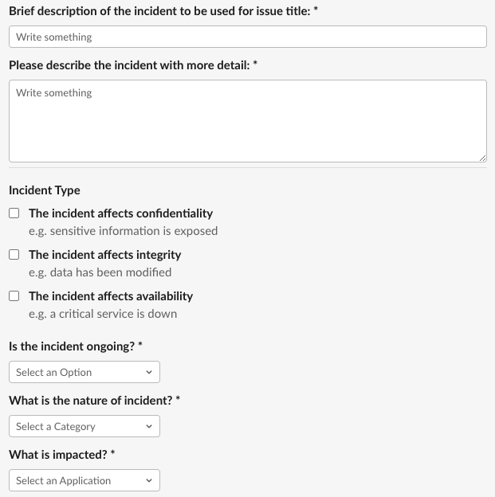
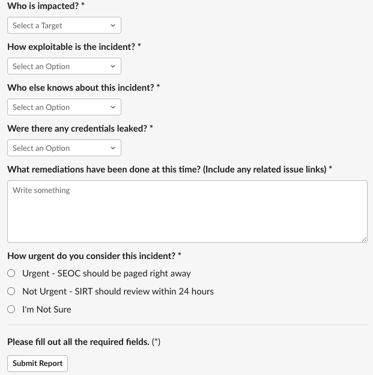

## On this page
{:.no_toc .hidden-md .hidden-lg}

- TOC
{:toc .hidden-md .hidden-lg}

- - -

## Overview

The [Security Incident Response Team (SIRT)](/handbook/security/security-operations/sirt) is on-call [24/7/365](/handbook/on-call/#security-team-on-call-rotation) to assist with any security incidents. This handbook provides guidance to help identify the scope and severity of a potential security incident, followed by instructions on how to engage the Security Engineer On-Call (SEOC) if needed.

Information about SIRT responsibilities and incident ownership is available in the [SIRT On-Call Guide](/handbook/security/secops-oncall.html).

## Incident Severity

Before engaging the SEOC, please review the following severity levels to ensure that the incident has been assigned the appropriate level of response.

| Severity  SLA | Description | Examples | Action |
| ------------ | ----------- | -------- | ------ |
| High  15 min | Critical issues that may affect the confidentiality, integrity, or availability of GitLab services or data | 1. GitLab.com is down for all customers  2. Confidentiality or Privacy is breached  3. Unauthorized access  4. Data loss  5. Leaked credentials | See [Engage the SEOC](#engage-the-security-engineer-on-call) |
| Medium  4 hours | Issues that have limited impact on GitLab services or data | 1. Some staff members or customers are affected  2. Limited damage  3. No public safety-related threat | See [Engage the SEOC](#engage-the-security-engineer-on-call) |
| Low  24 hours or next business day | Issues that have minimal to no impact on GitLab services or data | 1. Third party vendor vulnerability  2. Phishing  3. Customer inquiries  4. Troubleshooting device security  5. Security training questions | For phishing related issues, see [Phishing](#phishing)  For other non-urgent issues, see [Low Severity Issues](#low-severity-issues) |

Note: Additional information on Recovery Time Objective (RTO) and Recovery Point Objective (RPO)is available on the [BPC Handbook page](/handbook/business-technology/gitlab-business-continuity-plan/)

The following items are out of scope for SIRT and should be escalated to the respective teams mentioned below:

- **Vulnerability reports and HackerOne**: please escalate to [Application Security](/handbook/security/#vulnerability-reports-and-hackerone)
- **Abuse reports and DMCA notices**: please escalate to [Trust & Safety](/handbook/security/security-operations/trustandsafety)
- **General Customer Inquiries**: please escalate to [Field Security](/handbook/security/security-assurance/field-security/)
- **Self-Managed Instances**: please escalate to [TBD]

## Low Severity Issues

For general Q&A, GitLab Security is available in the `#security` channel in GitLab Slack.

For low severity, non-urgent issues, [SIRT](/handbook/security/security-operations/sirt) can be reached by mentioning `@sirt-members` in Slack or by opening an issue with `/security` in Slack.

Please be advised the SLA for Slack mentions is **6 hours** on business days.

## Phishing

If you suspect you've received a phishing email and have not engaged with the sender, please see: [What to do if you suspect an email is a phishing attack](/handbook/security/#what-to-do-if-you-suspect-an-email-is-a-phishing-attack).

If you have engaged a phisher by replying to an email, clicking on a link, have sent and received text messages, or have purchased goods requested by the phisher, please [engage the SEOC](#engage-the-security-engineer-on-call).

## Engage the Security Engineer On-Call

If you have identified a security incident or you need immediate assistance from the SIRT:

- **Slack**: use the `/security` slash command

The Slack command triggers SIRT's Escalation Workflow and requests you file an incident using a form. This form asks questions about the incident that help the SIRT automatically determine *severity* and *priority*. Depending on which labels get assigned, the SEOC will be paged. 

Below is the full form:

 

For more information on how the form is processed and labels are assigned, consult SIRT's [incident classification](/handbook/security/security-operations/sirt/severity-matrix.html) methodology.

The workflow uses your answers to create a new issue and track the reported incident. Please provide as many details as possible when answering the open questions to aid the SEOC in their investigation of the incident.

If the security incident prevents you from accessing Slack:

- **Email**: send an email with a brief description of the issue to `page-security@gitlab.com`

The SEOC will engage in the relevant issue within the appropriate [SLA](/handbook/on-call/#security-team-on-call-rotation). If the SLA is breached, the [Security Manager On-Call (SMOC)](/handbook/on-call/#security-managers) will be paged. Paging the SEOC via email also creates a new issue to track the incident being reported. You may provide a detailed explanation of the incident directly in the issue.

If paged, the SEOC will typically respond within **15 minutes** and may have questions which require synchronous communication from the incident reporter. It is important when paging the SEOC that the incident reporter be prepared and available for this synchronous communication in the initial stage of the incident response.
