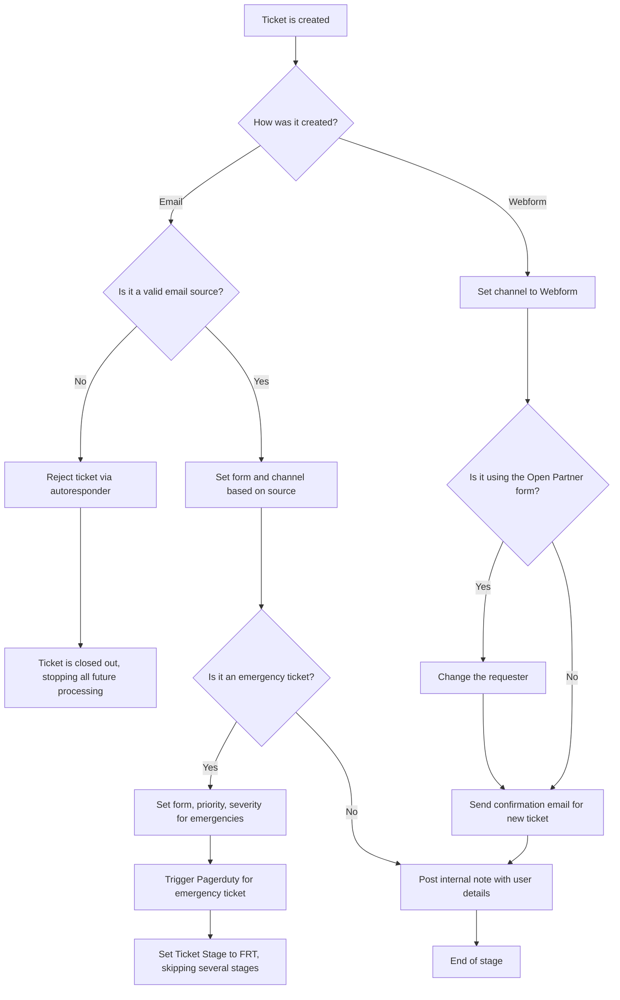
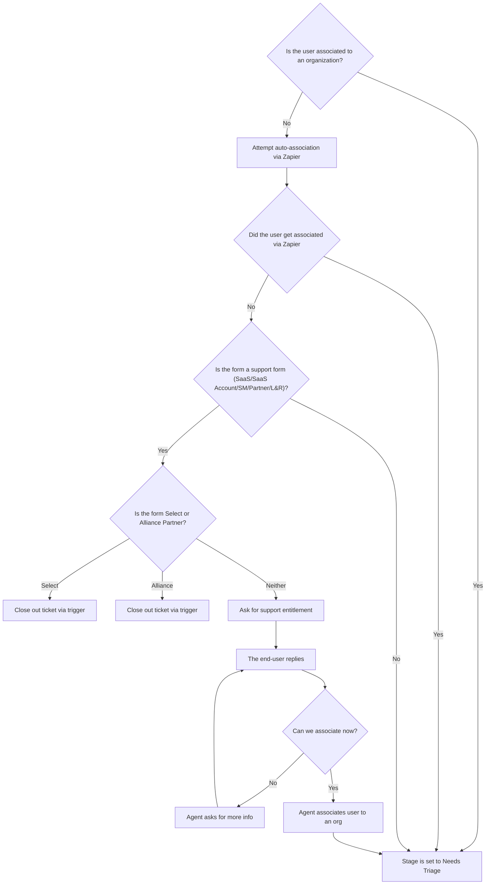
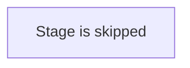
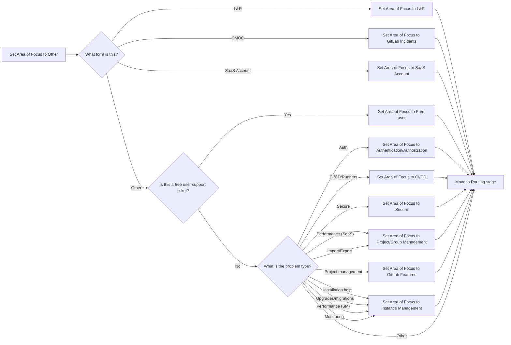
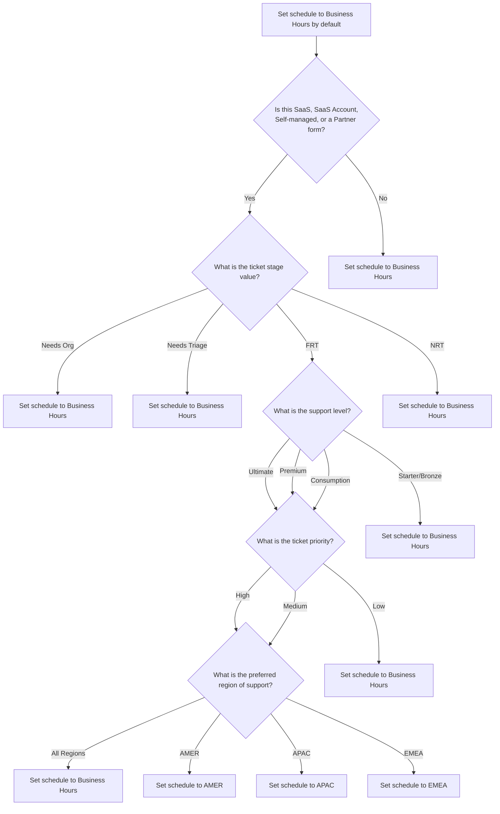

## On this page
{:.no_toc .hidden-md .hidden-lg}

- TOC
{:toc .hidden-md .hidden-lg}

## Overview

Ticket routing is arguably one of the most important components of how Zendesk
works. From Zendesk's
[own documentation](https://support.zendesk.com/hc/en-us/articles/360047781134-Routing-options-for-incoming-tickets-):

> One of the best ways to increase agent efficiency and streamline your support
> tasks is to use Zendesk routing options to manage your ticket workflows.
> Routing options provide a power set of tools to make sure your tickets get to
> the right agent as quickly as possible.

With it being so important, understanding the ins and outs of how tickets route
from creation to being worked is vital to truly understanding how GitLab uses
Zendesk as a whole.

## Stages

As this can get complex, Support Ops breaks down the routing into stages. These
stages are not meant to say one flows into the next into the next. Instead, they
help to break down the complexity into more digestable chunks. Some of these can
happen at the same time, while others depend on previous stages to complete
before they can run.

## Creation Stage

This is where tickets all start. This is what happens immeditaly once tickets
are created.

## Needs Org Stage

This stage focuses around associating an end-user to an organization.

In this diagram, the zapier process goes as follows:

* Trigger sends information to Zapier
* Zapier searches SFDC for the contact

* If found, zapier sends back info to the ticket to update the user and add the
  tag `zapier_test_success`.
* If not found, zapier sends back info to the ticket to add the tag
  `zapier_test_failed`.

## Triage Stage

This stage is currently a placeholder. The plan is to have this stage cover
missing metadata, however for the time being, this stage is skipped.

## Categorization Stage

This stage covers setting the Area of Focus on tickets.

## Routing Stage

This stage handles the big routing steps, namely priority and schedule. These
two fields will determine the initial SLA on a ticket. A big not here is this
stage is not _linear_. The steps for priority are listed first, but that
doesn't mean a hinderance there would block the schedule steps. The flowchart
refers purely to their position in Zendesk.

## Remaining stages

There are a few stages remaining, but they have more to do with the lifespan of
a ticket than its actual routing. For more information, see the
[Triggers](zendesk_global_triggers.html).
