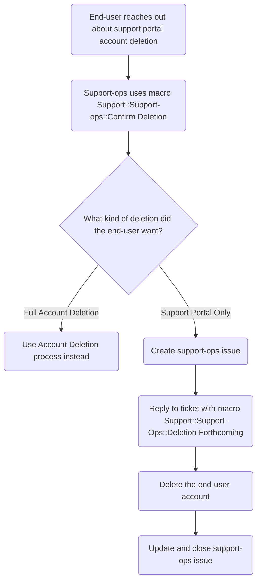
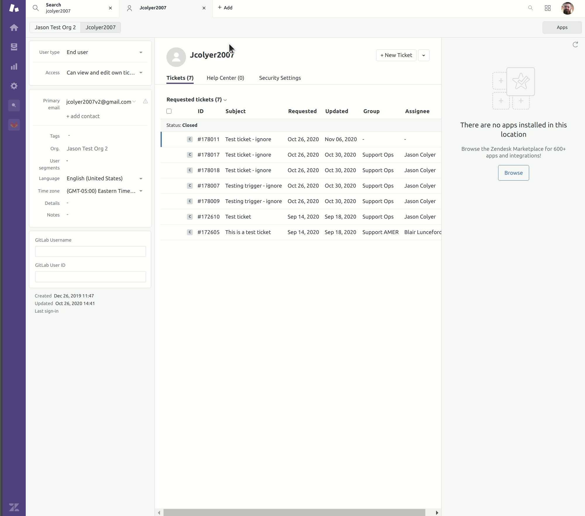

## On this page
{:.no_toc .hidden-md .hidden-lg}

- TOC
{:toc .hidden-md .hidden-lg}

## Overview

There are cases where an end-user wants their support portal account removed,
but not everything GitLab-related removed.

## Process

To be sure the end-user is wanting only their support portal account removed,
we should first ask if that is the case or if they are wanting a full deletion.
This can be done using the
[`Support::Support-ops::Confirm Deletion`](https://gitlab.com/gitlab-com/support/support-ops/zendesk-global/macros/-/blob/master/macros/active/Support/Support-Ops/Confirm%20Deletion.yaml)
macro.

If the user wants full account deletion, you would instead want to use the 
[Account Deletion - Zendesk](https://about.gitlab.com/handbook/support/workflows/personal_data_access_account_deletion.html#zendesk)
workflow.

If the user wants only the support account deleted, an issue should be made to
support-ops via the
[End-user Account Deletion template](https://gitlab.com/gitlab-com/support/support-ops/support-ops-project/-/issues/new?issuable_template=End-user%20Account%20Deletion).
After doing so, note the issue in the original ticket.

From there, Support-ops will do the following:

* Reply to the ticket using macro
  [`Support::Support-Ops::Deletion Forthcoming`](https://gitlab.com/gitlab-com/support/support-ops/zendesk-global/macros/-/blob/master/macros/active/Support/Support-Ops/Deletion%20Forthcoming.yaml)
* Delete the support account of the end-user
* Update and close the previously made issue

## Flowchart

## Deleting the end-user account

To delete an user account, you must first ensure the account has only no
non-closed tickets present. If there are non-closed tickets present, you will
first need to delete them. After doing so, you make then delete the account in
question. This is done by clicking the arrow next to the "New Ticket" button.
From the dropdown that appears, select "Delete user". A modal will popup asking
you to confirm the deletion. After confirmation, the user is deleted.

