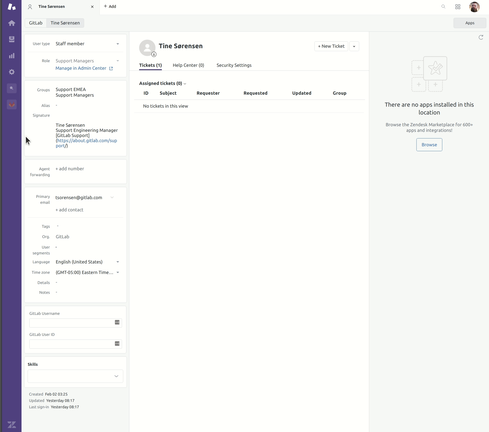
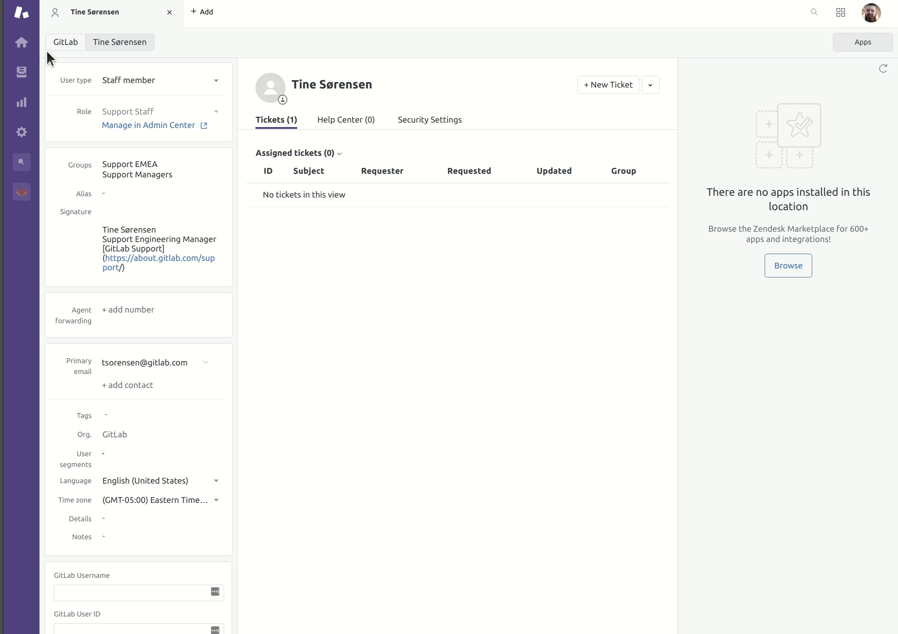

## On this page
{:.no_toc .hidden-md .hidden-lg}

- TOC
{:toc .hidden-md .hidden-lg}

## Overview

As maintainers of Zendesk, it is important to understand how to properly edit
agents in Zendesk.

## What can be changed?

Currently, the following items can be changed for an agent:

* Name
* Role
* Groups
* Tags
* Notes
* Signatures
* Profile image

Under no circumstances should the email ever be changed. This is tied to Okta
and can cause serious issues if it were to be changed. Any legitimate requests
for this should be forwarded to a Support Operations manager.

**NOTE**: Just because you can change something on an agent's profile doesn't
mean you should. Please ensure an
[Access Request issue](https://gitlab.com/gitlab-com/team-member-epics/access-requests/-/issues/new)
exists for any changes you are making to an agent's profile (not managed via
CI/CD).

## Changing the role

**Note**: Any request to have the role changed from Light Agent to any other
role _must_ be performed by a Support Operations Manager.

To change an agent's role, an
[Access Request issue](https://gitlab.com/gitlab-com/team-member-epics/access-requests/-/issues/new)
is required. Once you have ensured that exists and has been approved by the
agent's manager, you may proceed.

To change the role, first go to the agent's user page. From there, click the
link that reads "Manage in Admin Center" (it is underneath the role area on a
user page). This will open the admin center, where you can then click a
dropdown containing all roles in the Zendesk instance. Select the role you are
changing to, then click the blue "Save" button at the bottom of the page. The
role will not automatically reflect on the user page, so you will need to
refresh the page to see the changes have gone through.

Once the role is changed, update the corresponding
[Access Request issue](https://gitlab.com/gitlab-com/team-member-epics/access-requests/-/issues/new).

## Changing groups

Changes to agent groups depends on the circumstances. There are basically two
different scenarios you can encounter:

* Change requests for support agents on the Global Zendesk instance
* All other change requests

### Change requests for support agents on the Global Zendesk instance

This is handled via CI/CD that is run once per day (midnight UTC) using the
[agents](https://gitlab.com/gitlab-com/support/support-ops/zendesk-global/agents)
project. As such, all changes for groups should be done by updating the
support-team.yaml file in the
[support/team](https://gitlab.com/gitlab-com/support/team) project.

## All other change requests

To change an agent's groups, an
[Access Request issue](https://gitlab.com/gitlab-com/team-member-epics/access-requests/-/issues/new)
is required. Once you have ensured that exists and has been approved by the
agent's manager, you may proceed.

To change the groups, first go to the agent's user page. From there, click the
text next to the Groups label. This will open a modal that shows all the
available groups in the Zendesk instance. Clicking on them will select or
deselect them. After doing so, click the "Close" button (or anywhere outside of
the modal). You should see this update reflect immediately on the agent's user
page.

**NOTE**: Make sure the default group is what makes the most sense for the
agent. As an example, a Light Agent would have a default group of `General`,
whereas an AMER Support Engineer's default group would be `Support AMER`.

