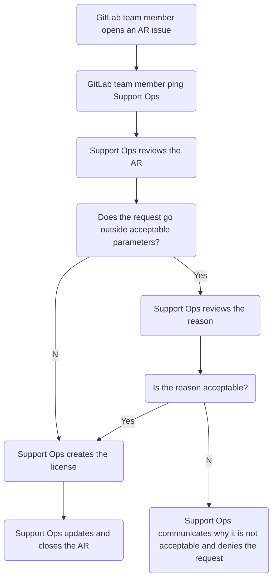

## On this page
{:.no_toc .hidden-md .hidden-lg}

- TOC
{:toc .hidden-md .hidden-lg}

## Overview

## Process

1. The GitLab team member files an access request (AR) using the
   [GitLab Team Member License request template](https://gitlab.com/gitlab-com/team-member-epics/access-requests/-/issues/new?issuable_template=GitLab_Team_Member_License_request).
1. GitLab team member pings Support Ops.
1. Support Operations reviews the AR to ensure it meets the acceptable
   parameters.
   1. If it does not, review the reason it goes outside the acceptable
      parameters. If this is valid, proceed. If not, communicate via the issue
      that the reason is not sufficient.
1. Support Operations logs into the
   [CustomersDot app](https://customers.gitlab.com/admin/license/new) and
   generates the license using the parameters in the AR.
1. Support Operations updates the AR and closes it out.

## Flowchart

### Acceptable parameters

* The expiration date is 1 year from license creation date
* The company name is `GitLab - Team Member License`
* The user count is 100

Anything deviating from the above will require a reason and approve from a
Support Operations Manager.

### Creating a license

1. Login to the [license app](https://customers.gitlab.com/admin/).
1. Click the green `New license` button on the right hand side.
1. Fill out the fields using the below table:

   | Field | Value | Exceptions possible? |
   |---|---|:-:|
   | Name | GitLab team member's full name | No |
   | Company | `GitLab - Team Member License` | No |
   | Email | GitLab team member's company email | No |
   | Zuora subscription ID | leave this blank | No |
   | Zuora subscription name | leave this blank | No |
   | Users count | 100 | Yes, with support ops managers approval |
   | Previous users count | 0 or value from the AR | No |
   | Trueup count | 0 or value from the AR | No |
   | Plan code | value from the AR | No |
   | Trial | leave unchecked | No |
   | Start date | today's date | No |
   | End date | 1 year from today | Yes, with support ops managers approval |
   | Notes | the AR link | No |

1. Click the blue `Save` button. 
1. From there, locate the license on the
   [CustomersDot license list page](https://customers.gitlab.com/admin/license)
   and copy the entire `License key` section.
1. Update the Access Request letting them know you generated them the license
   key and they have received an email from renewals@gitlab.com.
1. Close out the issue.

### Applying the license

For info on applying licenses, please see
[https://docs.gitlab.com/ee/user/admin_area/license.html#activate-gitlab-ee-with-a-license-file](https://docs.gitlab.com/ee/user/admin_area/license.html#activate-gitlab-ee-with-a-license-file)
