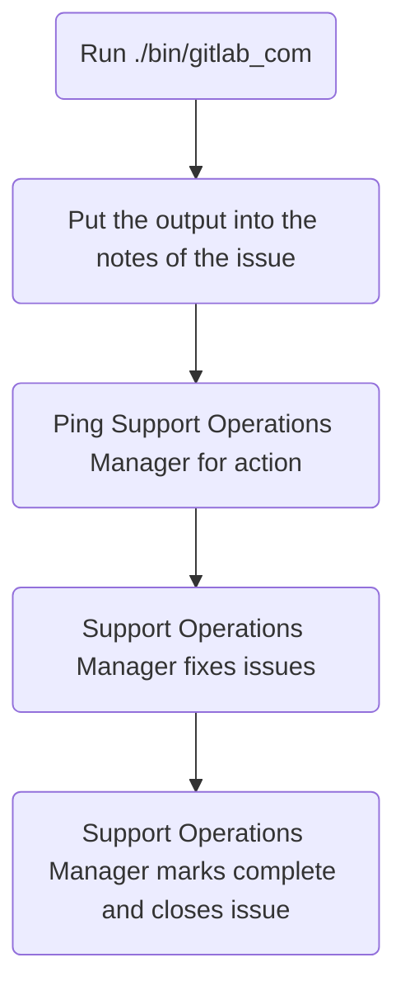

## On this page
{:.no_toc .hidden-md .hidden-lg}

- TOC
{:toc .hidden-md .hidden-lg}

## Overview

GitLab.com audits are to be completed every 6 months:

* Once in the first quarter of the fiscal year
* Once in the third quarter of the fiscal year

## Process

To get started, you will first want to make an issue using the
[GitLab.com issue template](https://gitlab.com/gitlab-com/support/support-ops/audits/-/issues/new?issuable_template=GitLab.com)
in the
[audits project](https://gitlab.com/gitlab-com/support/support-ops/audits).

This audit is focused solely on the group permissions of the support team, as
defined in the various roles' baseline entitlements. To start, you will want to
run the
[gitlab_com audit script](https://gitlab.com/gitlab-com/support/support-ops/audits/-/blob/master/bin/gitlab_com)
(see [below](#running-the-script) for help with running the script). It will
take a bit of time, but the script reduces a large portion of the manual work
required for the process. Once the script completes, it will output a large
amount of information. This should be copied and pasted into the `## Notes`
section of the issue you created via the
[GitLab.com issue template](https://gitlab.com/gitlab-com/support/support-ops/audits/-/issues/new?issuable_template=GitLab.com).

From there, you need to reach out to a Support Operations Manager to fix the
issues reported. They will then fix the permissions, add notes on what was
changed, and close out the issue.

### Flowchart



### Running the script

The requirements to run the script are:

* Ruby (version 3.0.1)
* A GitLab.com admin level personal access token

To run the script, you will want to do the following commands:

```bash
git clone git@gitlab.com:gitlab-com/support/support-ops/audits.git
cd audits
gem install bundler
bundle install
./bin/gitlab_com
```

**NOTE**: This uses environment variables to run. As such, you'd want to set
the following environment variables:

* `GL_ADMIN_TOKEN` - The GitLab.com access token to use
