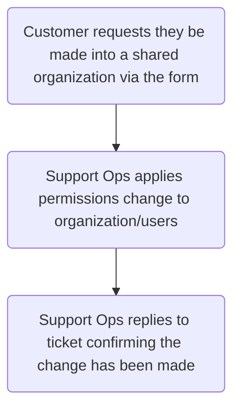
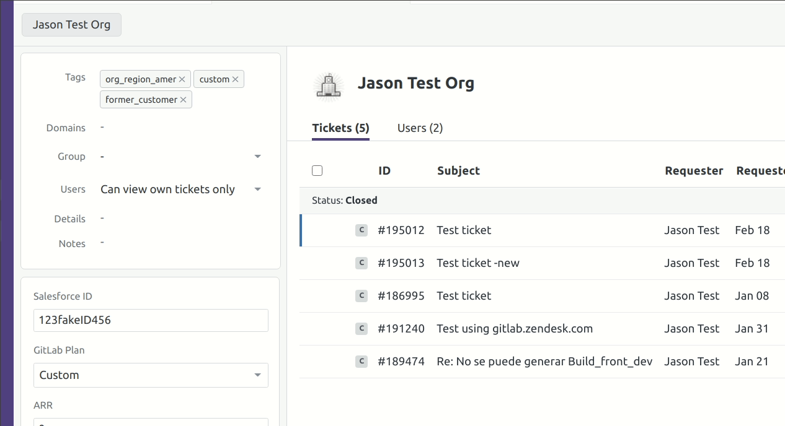

## On this page
{:.no_toc .hidden-md .hidden-lg}

- TOC
{:toc .hidden-md .hidden-lg}

## Overview

A shared organization is one in which the end-users in said organization have
heightened permissions in regards to tickets created in the organization. The
options available to this are:

* All users can view all tickets but not add comments
* All users can view all tickets and add comments to all tickets

In addition, end-users can also have a heightened permission set that allows
them to view all tickets in their organization. For more information on that,
see [Editing end-users](/handbook/support/support-ops/workflows/editing_end_users.html).

## Process

1. An end-user submits a ticket using the
   [Support Ops form](https://support.gitlab.com/hc/en-us/requests/new?ticket_form_id=360001801419),
   selecting `Shared organization requests` in the `Problem type` field.
1. A ticket is created for Support Operations to work.
1. Support Ops reviews the ticket, asking any followup questions necessary.
1. Support Ops will apply the changes as requested and update the ticket.

## Flowchart

## Changing the organization permissions

To change the organization permissions, you will first go to the organization
page. From there, click the text next to the `User` field. This will produce a
dropdown. You can then select the option you want.

When selecting "Can view all org tickets", a new line will appear with another
dropdown option. You can use this to further modifiy the permissions.

## Security risks

Heightened permissions always increase security risks. This is why GitLab
follows the
[principle of least privilege](/handbook/security/access-management-policy.html#principle-of-least-privilege)
in everything we do. While the risk is normally minimized by our current
processes and procedures, shared organizations do have a slightly higher risk
than normal. This is why Support-ops always confirms the end-user understands
and accepts this added risk.
