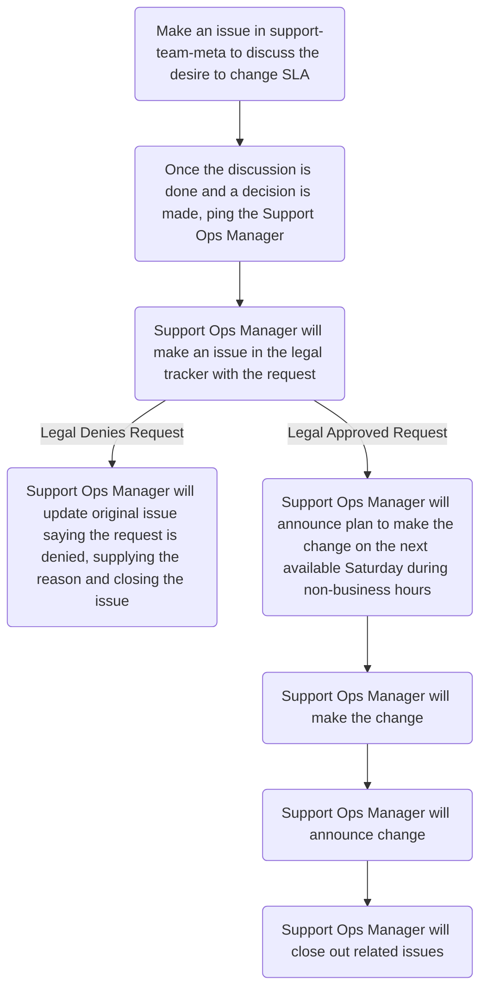

## On this page
{:.no_toc .hidden-md .hidden-lg}

- TOC
{:toc .hidden-md .hidden-lg}

## Overview

Due to the sensitive nature of changing SLAs, this exact process must be
followed for _every_ SLA change.

## Process

1. An issue should be created in
   [support-team-meta](https://gitlab.com/gitlab-com/support/support-team-meta/)
   using the
   [Requested Change Template](https://gitlab.com/gitlab-com/support/support-team-meta/-/issues/new?issuable_template=Requested%20Change).
1. The support team discusses the desire to change, citing reason and potential
   impact.
1. The Support Ops Manager, @jcolyer, is pinged in the issue once the
   discussion is over and a decision has been reached, with approval from at
   least ONE Senior Support Manager.
1. The Support Ops Manager will make an issue in the
   [legal tracker](https://gitlab.com/gitlab-com/legal-and-compliance/-/issues)
   requesting the change.
1. Once legal has approved, the Support Ops Manager will announce the plan to
   make the SLA change to the support team via both slack (#support_team-chat)
   and the SWIR. It should be scheduled for the next Saturday, during
   non-business hours.
   * If legal does not approve, the Support Ops Manager will update the
     original issue and close it out.
1. The Support Ops Manager will implement the change. Following the
   implementation, the Support Ops Manager will announce the change has been
   made via both slack (#support_team-chat) and the SWIR.
1. The Support Ops Manager will update relevant documentation with the change.
1. The Support Ops Manager will update the original issue and close it out.

## Flowchart

