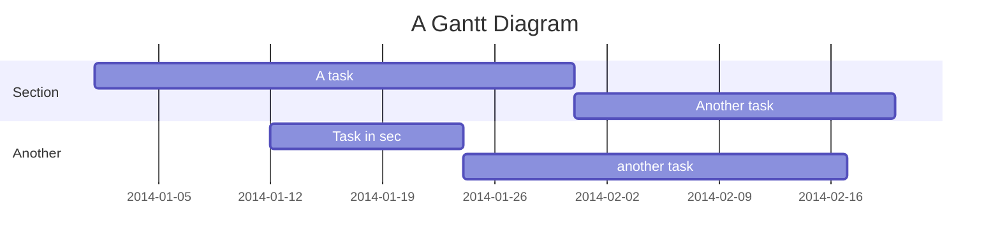
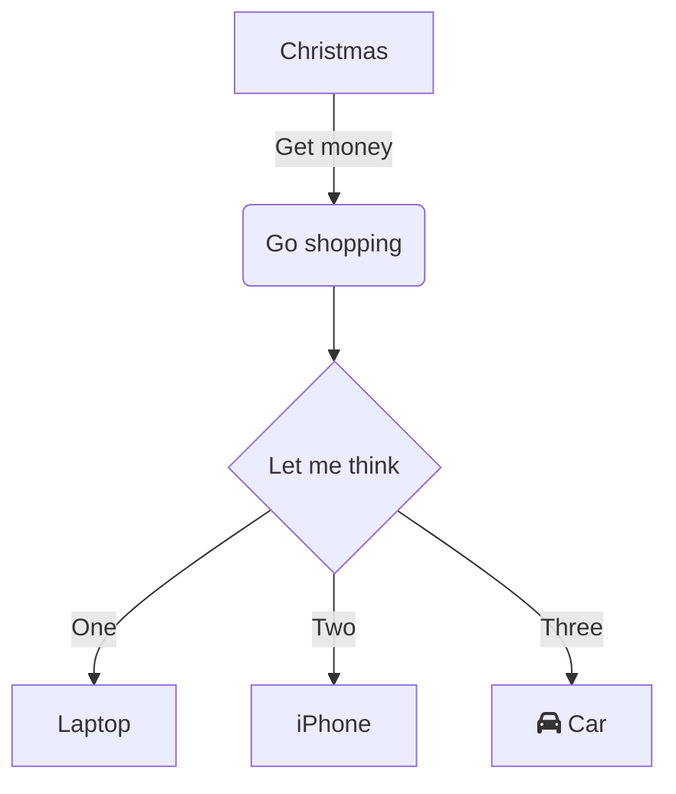
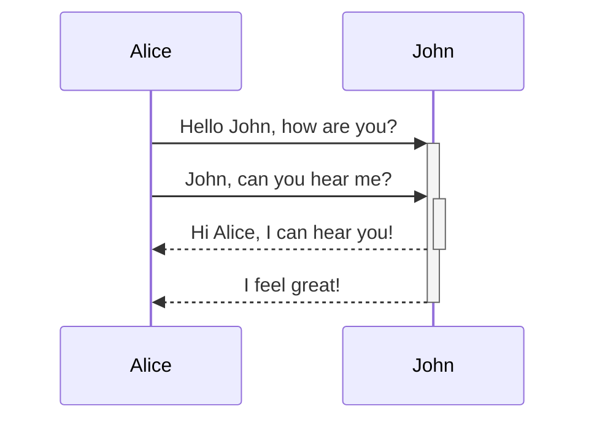

## On this page
{:.no_toc .hidden-md .hidden-lg}

- TOC
{:toc .hidden-md .hidden-lg}

{::options parse_block_html="true" /}

## Mermaid diagrams
For the main Mermaid documentation please refer to the [Tools and Tips page](/handbook/tools-and-tips/#using-mermaid).

This page is intended to help out with some advanced layout options for Mermaid diagrams such as creating diagrams that are wider than the handbook main content area.

### Gantt

<details>
<summary markdown="span">Code</summary>

    ```mermaid
    gantt
        title A Gantt Diagram
        dateFormat  YYYY-MM-DD
        section Section
        A task           :a1, 2014-01-01, 30d
        Another task     :after a1  , 20d
        section Another
        Task in sec      :2014-01-12  , 12d
        another task      : 24d
    ```

</details>




### Flowchart (centered)

<details>
<summary markdown="span">Code</summary>

    <div class="center">

    ```mermaid
    graph TD
        A[Christmas] -->|Get money| B(Go shopping)
        B --> C{Let me think}
        C -->|One| D[Laptop]
        C -->|Two| E[iPhone]
        C -->|Three| F[fa:fa-car Car]
    ```
    </div>
</details>

<div class="center">


</div>

### Sequence Diagram (right aligned)

<details>
<summary markdown="span">Code</summary>
    
    <div class="right">

    ```mermaid
    sequenceDiagram
        Alice->>+John: Hello John, how are you?
        Alice->>+John: John, can you hear me?
        John-->>-Alice: Hi Alice, I can hear you!
        John-->>-Alice: I feel great!
    ```
    </div>
</details>

<div class="right">


</div>

### Gantt (wide scrollable)
<details>
<summary markdown="span">Code</summary>

    <div class="x-scrollable">
    <div style="width: 1800px;">

    ```mermaid
    gantt
        title A Gantt Diagram
        dateFormat  YYYY-MM-DD
        section Section
        A task           :a1, 2014-01-01, 30d
        Another task     :after a1  , 20d
        section Another
        Task in sec      :2014-01-12  , 12d
        another task      : 24d
    ```
    </div>
    </div>
</details>

<div class="x-scrollable">
<div style="width: 1800px;">


</div>
</div>