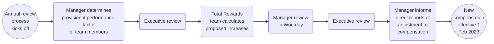

## On this page

## Introduction

On this page, we explain how we carry out the Annual Compensation Review (ACR) cycle. For more information on the process and input review for the Compensation Review Process, please see the following [handbook page](/handbook/total-rewards/compensation/compensation-review-cycle/review-cycle-inputs/). 

If you have any feedback or questions about the compensation review cycle, please contact [People Connect](/handbook/people-group/#how-to-reach-the-right-member-of-the-people-group).

## Annual Compensation Review 

Increases for Compensation Review Cycles are based on: 
1. Assessing market changes in the [compensation calculator](/handbook/total-rewards/compensation/compensation-calculator/) inputs  
2. Talent Assessments outlining performance in the role. 

If there is an increase in Location Factor and/or Benchmark, team members affected will have the new location factors applied to their compensation range, but would not receive an automatic percent increase to their base salary. For example, if the location factor in a region increases by 10% the team member will not receive an automatic 10% adjustment.  The team member will be brought into range after any changes to benchmark, location factor, and exchange rate take place and then their performance increase will be layered on top of this market adjustment. 

#### Process overview

### Eligibility

Eligible team members for Annual Compensation Review have a hire date on or before: 
* October 31st for a cash compensation increase. 
* September 5th for an equity refresh. Team members are eligible for a refresh grant if they have been at the company for six months ahead of the grant date cutoff. The grant date is slated to be March 15th and the cutoff is March 5th. 

Team members hired after October 31st will be reviewed to ensure their cash compensation does not fall below the minimum of the updated compensation range. Team members may be below the compensation range due to updates to the range for the upcoming year that would include changes to benchmark, location factor, and/or exchange rate, if applicable. If this does occur, the team member will be adjusted to the minimum of the range during the Annual Compensation Review cycle.

### Annual Compensation Review Timeline

##### November:
1. Members of the Total Rewards team, People Business Partners, and People Tech will sync on a weekly basis to coordinate on Annual Compensation Review and the Talent Assessment cycle.
1. Benchmarks and Location Factors
   * The Total Rewards team will review all benchmarks and location factors associated with the Compensation Calculator and propose revised inputs to the Total Rewards leader for approval/implementation.
1. Talent Assessment
   * People Business Partners will confirm with the Total Rewards team once calibration has completed for their groups Talent Assessments so the Total Rewards team can conduct pay equality audits.
   * Remember that this is also a good time to update your team’s position description if it does not reflect the role.

##### December:
1. Once all talent assessments have been reviewed and approved, the executive leaders of each group will review the breakdown with the Total Rewards team along with the People Business Partner for their group.
     * In this breakdown, leaders will be able to analyze all individual performance factors, growth potential factors, and key talent. Total Rewards will provide the distribution of performance/growth potential factors overall and by department, as well as an [underrepresented group audit](/handbook/total-rewards/compensation/compensation-review-cycle/review-cycle-inputs/#underrepresented-group-audit). Total Rewards will outline any concerns based on the aggregated data for the leader and people business partner to review.
1. The Total Rewards Team will schedule a sync with the Talent Acquisition team to review proposed iterations.
1. Using the revised inputs above, the Total Rewards team will calculate a minimum market increase for each team member to stay at the minimum of the FY24 range using the exchange rate as of 2022-12-01.
1. Anyone on a formal Performance Improvement Plan (PIP) that is ongoing through December 15 will be excluded from the Annual Compensation Review. December 15th is the due date for emailing Total Rewards with PBP in CC about team members on a formal performance plan.
1. Anyone who is departing from GitLab, with an end date on or before February 1, will be excluded from the Annual review cycle. The People Business Partner will make sure to loop in Total Rewards on any terminations.

##### January:
1. January 11th - January 20th @ 12pm PT/8pm UTC: [Manager Review](/handbook/total-rewards/compensation/compensation-review-cycle/#manager-review) in Workday for Cash Compensation Increases
    * Each division leader is responsible for making sure their group stays within budget. The company has a [4% budget](/handbook/total-rewards/compensation/compensation-review-cycle/#compensation-program-budget) for all performance or merit increases. Extra funds have been allocated for market adjustments for team members who are below range.
    * Managers and indirect managers will review their team members and propose an increase based on several factors:
        * Performance Factor
        * Growth Potential Factor
        * Key Talent
        * Market adjustment
        * Last compensation change
        * Benchmark % change
        * Location factor % change
        * _Note that the market adjustment  increase to range provided in the review grid is not a cap, but instead a minimum value to ensure alignment to the new ranges. The market adjustment is required to allocate to all team members and extra budget has been allocated to managers to account for this cost. Performance increases are allocated on top of the market adjustment._
    * PBPs will enter promotions and promotional increases that have been approved following the promotion calibration process. Promotional RSU grants will be automatically calculated and awarded subject to approval at the next grant approval date
    * Depending on budget constraints, the performance increases for the individual team members may be adjusted up or down by management and reviewed by Total Rewards.
    * Managers will determine increases to cash compensation as appropriate based on talent assessment outcomes, and market adjustments. In February - March, Director+ team members will review equity and determine equity awards to ensure team members are incentivized through their total rewards package in the next fiscal year.
    *  Compensation and job information changes will be frozen at this time for the duration of the review cycle.
1. Managers are advised to directly align proposed increases for team members with their manager (Senior Manager/Director) over 1-1s before submitting.
    * Hereafter divisional leaders (or department leaders as applicable) can review and discuss tentative budgetary impact for the division (or department as applicable).
1. January 13th: People Business Partner check on the progress/Budget impact.
1. January 20th: Aim to have all Managers/Senior Managers/Directors reviewed their slates. Justifications must be included in the notes section for all increase exceptions (for example: any above 10% performance increase,etc.) for planning to be complete. These justifications will be reviewed and approved by Department and Division leaders. Please connect with your manager or [People Business Partner](/handbook/people-group/#people-business-partner-alignment-to-division) to determine if you department or division has additional due dates embedded by level. 
1. January 24th - Total Rewards Review & Pay Equality Analysis
1. January 20th - January 23rd: Department Heads/People Business Partners review budget impact and deficiencies, before moving to E-Group.
1. January 25th - January 26th: For E-Group to review and approve final compensation changes.
1. January 30th: Total Rewards will present all compensation changes to the Compensation Group for final approval.

##### February:
1. February 1st: Communication Window Opens: A "Cash Compensation Statement" that outlines compensation changes related to On Target Earnings (Base + Variable  pay) for FY24 will be generated in Workday. In March, a “Total Compensation Statement” with cash compensation and equity value information, including new refresh and promotional grants, will be generated for managers to use in communicating compensation changes in FY24.
    * February 1- 7th: Managers communicate compensation increases to contractors by February 7th in order for contractors to submit invoice.
    * February 1- 9th: Managers communicate compensation increases to all remaining team members.
1. February 1st - February 4th: Total Rewards will audit all of the updates to Workday and provide Payroll with a report of all increases effective February 1
1. February 16th: Compensation and job title visibility will be returned to team members in Workday.

In February, Director+ leaders will plan Phase 2 of the Annual Compensation Review cycle by planning Equity.  Exact dates for this Phase will be communicated in January.

## Talent Assessment and Annual Compensation Review 

Performance and growth potential factors are assessed as part of the [Talent Assessments](/handbook/people-group/talent-assessment/#the-performancegrowth-matrix).  The factors (developing - performing - exceeding) will be used as an input to calibrate on compensation increases, reinforcing GitLab’s pay for performance Compensation Philosophy.

### Performance Factor

Recommendations from Total Rewards for discretionary cash compensation increases based on performance factor:
* Developing in role = 0-2% increase
* Performing in role = up to 4% increase
* Exceeding in role = up to 8% increase

These recommendations should be considered the single source of truth if different from what is shown in the Workday planning grid.

**Actual cash compensation increases may vary (up or down) from these percentages.** These guidelines are meant to help ensure company-wide consistency. Actual increases may vary based on:

* Changes to local market rates
   * Note: For FY24 ACR, market adjustments are budgeted separately. This means that the performance factor increase guidelines above should be added on top of the recommended market adjustments from Total Rewards.
* Where a team member falls in their compensation range
* Previous increases
* Budget constraints

Do not expect that the final discretionary increases will fall into these ranges, as performance is only one factor out of many that goes into compensation adjustments.

When determining an increase, managers should account for increases in the current fiscal year,
due to recent factors such as:
* Promotion
* Transfer
* Recent hire who is already aligned to market/performance rates
* Anything else that has already increased salary during the current fiscal year

After a manager determines the performance increase (in percentages), that manager should be able to clearly communicate to the team member how it was derived.

Performance increases are not capped at 8%. If a manager would like to suggest an increase higher than the guidelines, they will want to add a justification for each indirect manager to review and approve. Justification is only required if the performance increase % is above guidelines, market adjustments do not factor into this.

If a manager has a team member on their team who is red circled (paid over the top end of the compensation range), in order for the person to receive an increase, the manager will need to submit a compensation exception request with their People Business Partner to Total Rewards which will then be reviewed and approved by the Compensation Group. The Total Rewards team will notify the People Business Partners of the team members red-circled once the new ranges are set for proactive review.

### Growth Potential Factor 

While Performance Factors are used to calibrate on cash compensation increases, reinforcing GitLab’s pay for performance Compensation Philosophy, managers are encouraged to use the Growth Potential Factor (developing - growing - exceeding) as an input to calibrate on the equity refresh. The refresh is a long term incentive which can reinforce the long term growth potential of the team member.

In calibrating the equity refresh, we recommend managers to take the following into account:
* [Growth Potential factor](/handbook/people-group/talent-assessment/#what-is-growth)
* Unvested Equity Holdings
* Value Vesting the next fiscal year 

Cash and equity are two levers available to managers to determine an appropriate Total Compensation for team members. Note that equity planning will be conducted separately from cash compensation planning for FY24. To ensure a connection between growth potential factor and compensation outcomes, Directors and above team members will be provided with talent assessment results during planning. More information on the [Equity Refresh Cycle](/handbook/total-rewards/compensation/compensation-review-cycle/#equity-refresh-review-cycle) can be found below.

### Key Talent 

For team members designated as [key talent](/handbook/people-group/talent-assessment/#key-talent), managers are encouraged to review team members' total compensation (cash + equity) and recommend increases to ensure team members are incentivized through the next fiscal year in the total compensation package.

### Communicating Talent Assessments

Communications on talent assessments is set to take place 2023-01-03 through  2023-01-31, ahead of communications for annual compensation review increases.  Please review the handbook page on [communicating talent assessments](/handbook/people-group/talent-assessment/#communication) ahead of having talent assessment conversations with your reports.

## Determining Cash Compensation Increases

When you review your team member’s job and compensation information in the Workday tool, you will see the recommended range for performance increase % as well as the minimum market adjustment required to bring a team member into range for FY24. There will also be general details in the smart panel about how the benchmark and location factor changed year-over-year. The minimum market adjustment is allocated separately from the performance increase. We recommend the following steps and best practices:

1. Market adjustments have been separately budgeted and are required to be allocated to team members in order to bring them into band. Due to this, additional budget has been added for managers with team members receiving a market adjustment. As a manager you can review the Compensation band in the [Compensation calculator](/handbook/total-rewards/compensation/compensation-calculator/).
1. Performance increases should be determined separately from the market adjustment using the performance factor increase guidelines as well as holistically considering other factors such as:
    * Managers should take into account any changes in compensation during FY23 when analyzing the FY24 compensation including decisions made during relocations and prior compensation changes for promotions/transfers.
    * Managers should review how team members fall within their band after the proposed increase to ensure pay equality amongst peers. (This is also audited by Total Rewards as part of the cycle).

### For Promotions
When determining compensation increases for promotions, the same general guidelines apply. We want to take a look holistically at the compensation change. It is important to not formulaically allocate an annual compensation review increase in addition to the promotion increase. In collaboration with leadership, PBPs will look at the new range (which will be seen in Workday once the promotion is applied) and then make a recommendation based on the holistic view considering the [promotion compensation increase guidance](/handbook/people-group/promotions-transfers/#recommend-a-compensation-increase), placement in the band compared to peers who were promoted, and annual compensation review increase recommendations. PBPs will be responsible for entering the agreed upon increase recommendation in the tool.

## Manager Review

As part of the FY24 [Annual Compensation Review](/handbook/total-rewards/compensation/compensation-review-cycle/#annual-compensation-review-timeline), managers and indirect managers will review, approve, and enter salary increases and promotions from 2023-01-11 to 2023-01-20 to ensure that we are paying each team member to market and prioritizing increases based on performance while staying aligned to budget. Then, equity refresh awards will be planned by Directors and above in February (dates TBA) and communicated in March following Board approval.

It is very important that GitLab team members understand their performance and how it impacts their salary.

While some GitLab team members may not receive an increase due to already being at the right [competitive rate](/handbook/total-rewards/compensation/#competitive-rate) for their Level, Role, and Location, there are other circumstances where an increase should be avoided. If there are any reasons as to why the team member should not receive the proposed increase to be aligned with market rates in our calculator, please email Total Rewards with the reasoning and cc your People Business Partner. This could be due to a current performance issue, pending termination, etc. If you would like to delay the increase, please outline a proposed plan of action and deadline. Team members who are currently struggling to perform at their current level should have that communicated clearly and the manager should consider delaying the increase until performance reaches a satisfactory level.

For any feedback around the manager review portion of Annual Compensation Review or the cycle via Workday, please add to the [feedback issue](https://gitlab.com/gitlab-com/people-group/total-rewards/-/issues/1025).

### Annual Compensation Review in Workday

[Workday](https://www.myworkday.com/gitlab/d/home.htmld) is GitLab's compensation platform where managers can login, review, change, and submit their proposed increases during the Annual Compensation Review cycle.

#### Logging into Workday 

1. Navigate to [Workday](https://www.myworkday.com/gitlab/d/home.htmld). We recommend logging in through [Okta](https://gitlab.okta.com/app/UserHome).
* 
1. On 2023-01-11, you will receive a task in your inbox related to Annual Compensation Review. Note that this task will not be visible until this launch date.
1. In your inbox, select the **FY24 Annual Compensation Review** task.
* 

##### IMPORTANT: Instructions for Managers Outside of the US

The compensation review tool was built for planning to be done in USD as the reference currency, but outside of the US, Workday will default your currency to local currency.

In order to experience the compensation review tool as intended, please use the following instructions to update your reference currency. You may change it back after you have completed planning.

1. Once you have logged into Workday, click the person icon in the upper right to open the drop down menu.
   *    
1. In the drop down menu, select 'My Account'.
   *    
1. Then select 'Change Preferences'.
   *    
1. Scroll down until you see 'Reference Currency'.
   *    
1. Remove your local currency and add USD. 
   *  
1. Select 'OK', then log out and back in for the changes to take effect. You can now continuing following the instructions above to access the compensation review task and complete your planning. 

#### For People Managers

1. After logging in, you will land on the Organization Summary page. This will include an overview of your merit and promotion budgets (promotion budget shown at VP only) and spend, along with a summary of the organizations that report to you.
   * 
1. Proceed to the planning grid for your team members. The 5 leftmost columns include team member information that will remain static as you plan across 3 grid views that you can navigate to at the top: Summary, Performance, and Promotion.
   * 
   * Team Member Information: Under each team member name is the org they belong to and manager they report to, followed by their current job title. The FY23 Performance Factor, FY23 Growth Potential Factor, and FY23 Key Talent columns show results from the [talent assessment](/handbook/people-group/talent-assessment/) completed in November-December. The Warnings column will include any flags that need to be resolved during the planning process before submitting.
   * If you are a frontline manager (you do not have people managers who report to you), the planning grid with your direct reports automatically displays when you land on the Organizational Summary page.
   * If you are a manager with indirect reports (you have people managers who report or roll up to you), you will not immediately have a view of a planning grid. To make merit recommendations for your direct reports, select the pencil icon under Propose to proceed to the planning grid. Alternatively, you may select **Actions > Propose Compensation for My Organizations**.
   * 
      * To make recommendations for indirect reports (employees who roll up to you but do not directly report to you), you will have to click on **Sub Orgs**. 
      * 
1. **Summary grid:** This grid view provides an overview of total pay, performance and market increase percentage and amount, promotion increase percentage and amount, as well as proposed total pay with promotion increase. We recommend reviewing this summary grid at the end once completing the performance and promotion grids to view your proposals in one place.
   * 
1. **Performance grid:** Navigate to this grid to propose non-promotional cash compensation increases for team members related to performance and market adjustments. All increases are in terms of OTE (On Target Earnings) and will be split into base salary and variable compensation, if applicable, once the cycle concludes. If a team member has no variable component, this will reflect their base salary.
   * 
   * Note that you will only enter information into the _Performance and Market Increase %_ or _Performance and Market Increase Amount_ columns. Once you enter information into one, the other will automatically calculate the equivalent percentage or amount.
   * Managers are advised to include the designated market adjustment (if greater than zero) and combine it with a performance increase as part of their total proposal. Example: You are a manager proposing a 2% performance increase for your team member, and the market adjustment increase % for your team member’s role is 4%. You would enter 6% into the _Performance and Market Increase %_ column.
   * To help managers assess increases, Total Rewards has added the following data points and features:
     * **Job Details:** Job Profile, Hire Date, Job Grade, Pay Range
     * **Performance Increase Target Range:** Recommended base percentage increase based on talent assessment outcomes and company-wide recommendations
     * **Market Adjustment to Range:** Minimum increase amount to ensure the team is in range based on range updates such as for exchange rates, location factors, and/or benchmark increases.
     * **Notes:** There is a comment box for you to include notes on each team member’s record. This can be used to document reasons or extra context for the compensation change proposal.
     * **Smart Panel** (blue box to the right of the grid that updates based on selected team member):
       * **Current Business Title**
       * **Base or OTE:** Whether a role is paid base salary only or has a variable pay component (commission or bonus).
       * **Benchmark % Change:** The percentage change of the SF benchmark from FY23 to FY24
       * **Location % Change:** The location factor percentage change from FY23 to FY24
       * **Current Compa-Ratio** and **Proposed Compa-Ratio** to show where the team member falls in the range before and after your recommendation
       * **Country**
1. **Promotion grid:** If the team member is being recommended for a promotion during this cycle, PBPs will enter the promotion amount in this grid following the Calibration process.
   * 
   * The range for their new role will be updated once you select “Yes” in the Promote column and enter the desired job profile in the _Proposed Job Profile_ column, and there will be the opportunity to add extra context in the _Promotion Notes_ column.
   * Please ensure you work with your People Business Partner.
   * Note: PBPs can only enter a promotion increase percentage/amount if “Yes” is entered in the _Promote_ column and a job profile is entered in the _Proposed Job Profile_ column.
1. After entering all your recommendations, select _Continue_. This will take you to the Organization Summary page. Once you have confirmed that all of your organizations have submitted their recommendations, select _Submit_.
   * Note: If you have subordinate organizations, you will be unable to complete this step until all subordinate organizations have inputted and submitted their recommendations.

#### Budget In Workday 

All planning managers will be allocated a Merit budget which will consist of budget for performance increases as well as market adjustments, if applicable. Budget roll down to managers was allocated by taking the total market adjustments needed for team members and adding in the expected increases for their team's performance rating distribution.

If you are a manager with other managers reporting to you, you will see your overall budget including any budget that rolls up into you in the Organization Summary screen. The overall budget will also reflect if you go into any of the planning grids for managers that report to you. When you edit your own planning grid, it will show you the budget for just your direct reports.

Promotion budgets will be held at the VP+ level and will reflect $0 below this level. At the VP level, this will reflect the overall budget for all direct and indirect reports and will not update to show the budget for just direct reports.

#### Communicating Cash Compensation Increases

All increases for Annual Compensation Review will be finalized by Feb 1st in Workday where new salaries will be updated in team member profiles and the cash compensation statement will be generated. Visibility in Workday will be limited until Febuary 16th in order to allow managers sufficient time to communicate. Managers will have access to the cash compensation statement on the team member's record once generated. 

Managers should communicate increases to contractors by February 7th and to all team members by February 15th. 

Further guidelines on communications can be found on the [Compensation Review Conversations handbook page](/handbook/leadership/compensation-review-conversations/).

#### Cash Compensation Statement

Each team member who receives a base salary increase due to promotion, market adjustment, or performance/merit  during the Annual Compensation Review cycle will receive a Cash Compensation Statement detailing their updated total pay (base + variable if applicable). This letter will be available for managers to review on Workday no later than February 4th, and team members can access their cash compensation statement beginning February 16. 

## Equity Refresh Review Cycle

### Determining RSU Refresh Grants
This will be updated in February.

### Director and Above Review in Workday

1. Navigate to your Workday inbox and click on the task titled **FY24 Annual Equity Review (due 2023-02-XX)**
1. After logging in, you will land on the Organization Summary page which includes an overview and status of your equity budget and spend for team members who report to or roll up to you.
   * 
1. Similar to cash compensation planning, you will enter your equity recommendations into a grid. The grid contains the same 5 leftmost columns. However, there is only one grid view and there is a smart panel on the right that updates based on the selected team member. Additional information is included to add context and help you with your equity refresh grant allocations:
   * Unvested Equity as of 2023-02-01
   * Value Vesting from 2023-02-01 to 2024-01-31
   * Last Equity Refresh Grant
   * Last Promotion Grant Effective Date
   * Last Promotion Grant Amount
1. Enter your refresh grant amounts in the **Proposed Refresh Grant Amount (USD**) column.
1. After entering all your recommendations, select _Continue_ and _Submit_.

### Budget In Workday 

This will be updated in February.

### Communicating Equity Refresh Grant

This will be updated in February.

#### Total Compensation Statement

This will be updated in February.

## Compensation Program Budget

The promotion and annual compensation review budget is separate and calculated based on the following conditions:

### Promotion Budget
  * Promotion budget is calculated assuming that 15% of the team is promoted with an average of a 10% increase to OTE for the population as of Oct 31st of the prior fiscal year. More details on the philosophy behind this calculation can be found[here](/handbook/people-group/promotions-transfers/#promotion-compensation-guidelines).
  * Divisions will be allocated an annualized budget on a quarterly basis, aligned with our[quarterly promotion cadence](/handbook/people-group/promotions-transfers/#promotions-process--timeline).
  * If promotion budget is not used for any given quarter, **it will not rollover to future quarters**. 
  * In the case where more than or less than the given budget is projected for any given quarter, please follow the following process to review the possibility of identifying tradeoffs for unused or surplus promotion budget.
    1. Work with your [People Business Partner](/handbook/people-group/#people-business-partner-alignment-to-division) to share promotion projections with Total Rewards for an initial analysis. 
    2. Work with your Finance Business Partner to identify potential tradeoffs. Finance requires a minimum of two weeks notice ahead of the commencement of the next quarter to review this possibility. For example, as Q2 begins May 1, the final date to confirm a repurpose budget rollover request would be April 15. _Note: This is not a guarantee, but something leaders can explore with their Finance Business Partner._
  * The Total Rewards team maintains a 5% hold back of the total budget in order to perform pay equality audits.

### Annual Compensation Review Budget
  * The Annual Compensation Review budget assumes a 4% increase of those who were not promoted. Therefore 4% of 85% of the population's OTE.
  * The annual compensation review budget is held by each e-group leader. The leader can allocate budget however appropriate within their division, but cannot move funds to another division.
  * The budget for [grade 12](/handbook/total-rewards/compensation/compensation-calculator/#gitlab-job-grades) and above is managed by the Compensation Group internally to GitLab.
  * The Total Rewards team maintains a 2% hold back of the total budget in order to perform pay equality adjustments.

### Relocation Budget
* Relocations are not considered in the budget. Theoretically throughout the year, there would be a net zero from those moving to higher-cost and lower-cost regions.

### Calculating Budget Actuals
1. Promotion Budget
   * The Total Rewards team will calculate what the budget is for each Division to be managed by the executive of the group.
   * Take total OTE (TTC) as of October 31st of the current fiscal year x 15% x 10%. To get to each quarterly budget divide the annual amount by four so promotions budgets are the same throughout the year. We want to ensure predictability in financial models, so while the budget is set at the beginning of each fiscal year, we will also analyze spend per quarter.
   * Any additional increases over budget must be approved by the CPO and CFO and may be taken from the following quarter's pool.
   * Budgets are tracked as part of the applicable quarterly promotion cycle.
1. Annual Compensation Review Budget
   * Per Division take the total OTE (TTC) of the group as of October 31st x 85%. Review removing any overspend or allocate additional budget per division from the promotion budget.
   * Verify totals with FP&A.

